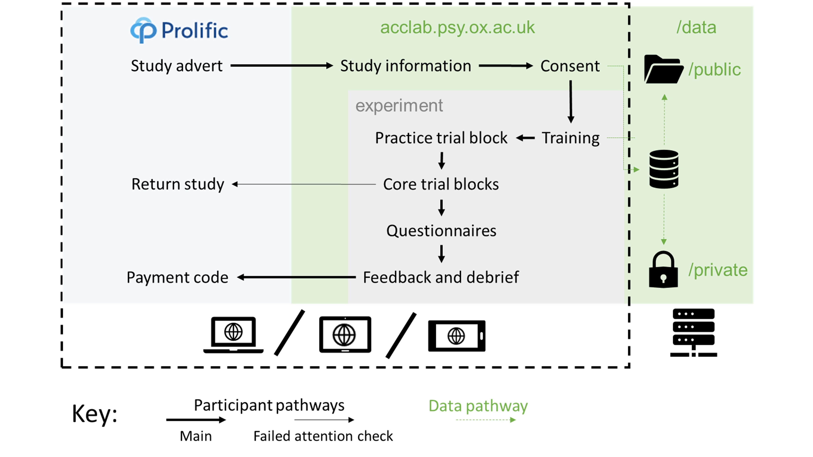
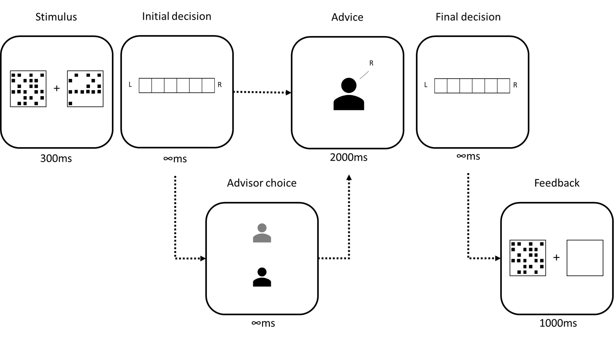
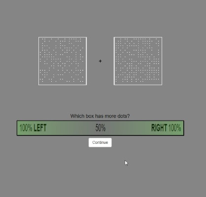
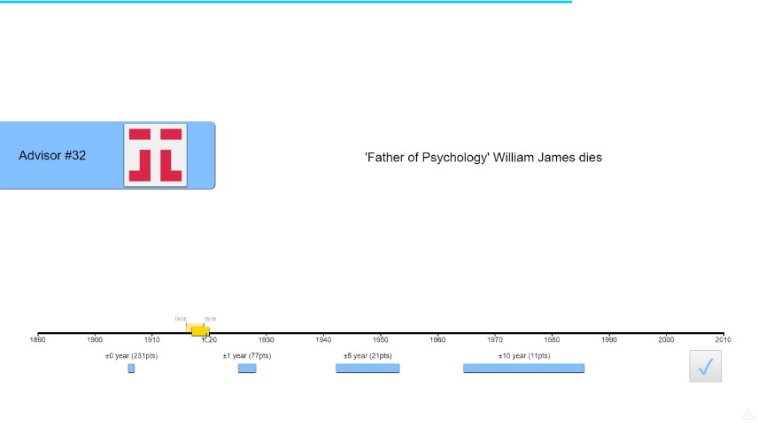
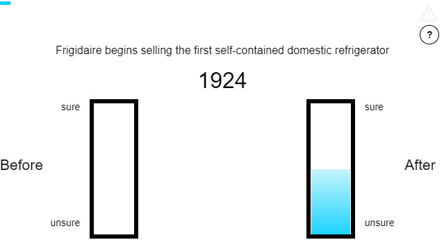
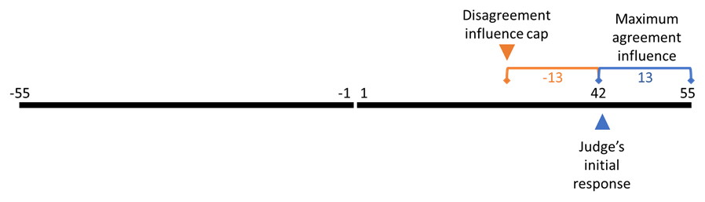

---
output:
  bookdown::pdf_document2:
    template: templates/brief_template.tex
  bookdown::word_document2: default
  bookdown::html_document2: default
documentclass: book
---

```{r setup 01-01, echo = F, include = F}
source('scripts_and_filters/general_setup.R')
```

# Behavioural experiment method {#chapter-behavioural-experiment-method}

<!-- The behavioural experiments all have similar methodology, so it makes sense to dedicate a chapter to detailing it and then summarise and explain deviances/specifics when reporting each individual experiment.  -->

The behavioural experiments reported in this thesis share a common structure. This structure is detailed here to reduce repetition elsewhere in the thesis. Individual experiments have truncated methods sections in which the specific deviations from the general method are noted. 

## General method {#gm}

The experiments take place using a judge-advisor system. Participants give an **initial estimate** for a decision-making task, receive **advice**, and then provide a **final decision**. The advice is always computer-generated, although the specifics of the generating procedure vary between experiments. 

### Participants {#m-participants}

#### Recruitment

Human participants were recruited from the online experiment participation platform Prolific (https://prolific.co). Participants were prevented from taking the study if they had participated in one of the other studies in the thesis, or if they had an overall approval rating on Prolific of less than 95/100.

#### Payment
 
Participants were paid approximately GBP10-15/hour pro rata. Experiments took the average participant between 10 and 30 minutes to complete.

Some participants encountered technical problems, prompting them to contact me via the Prolific platform. These participants were thanked, and additional information about the problem sought if necessary. These participants were paid on an ad hoc basis depending upon the time taken before the errors emerged and the detail of the error reports.

Later studies introduced attention checks which terminated the study as a consequence for failure. It is not clear whether this technique constitutes best practice on Prolific because automatic termination means participants may return the study rather than having their participation explicitly rejected (and thus affecting their Prolific participation rating). Participants who returned the studies were not paid. Participants who attempted to complete the study with an invalid code after having their participation terminated for failing attention checks were also not paid, and their completion attempt was rejected on the Prolific platform. 

There is an ongoing ethical debate concerning non-payment of participants who fail attention checks in online studies. The studies in this thesis used a mixture of paying for and not paying for participation attempts with failed attention checks. In online studies, where low-effort participation is a serious and enduring concern, platforms such as Prolific make clear to participants and researchers that payment is only expected for responses which are given with satisfactory effort. Participants are thus fully aware of and consenting to the process of screening results for adequate effort prior to payment. It is important to note the difference between low effort responses, for which payment may ethically be withheld, and atypical responses, which may represent genuine engagement with the task. It is unethical, in my view, to withhold payment from participants for atypical responses within an experiment (including low or high response times, accuracy, etc).^[Data may be excluded from _analysis_ for these reasons, but the participants should still be paid.] Participants should only be denied payment for failing to provide adequate responses to explicit attention checks.

#### Demographics

Demographic information on participants, such as age and gender, was not collected. While there is a robust case for collecting these data and conducting sex-disaggregated analyses [@criadoperezInvisibleWomenExposing2019], initial concerns over General Data Protection Regulation resulted in a cautious approach to the collection of data concerning protected characteristics of participants. !TODO[move to discussion]Gender differences, whether due to socialisation, biological factors, or their interactions, may well alter advice-taking and expressed confidence in decisions. I suspect, although I can offer no evidence, that gender differences in the results presented in this thesis will at most show overlapping distributions. I do not think it highly plausible that different strategies are wholly the preserve of any particular gender, or that egocentric discounting is markedly stronger in any particular gender.

Participants were at least 18 years of age, confirmed by the requirements for possessing an account on the Prolific platform and by explicit confirmation when giving informed consent.

### Ethics {#m-ethics}

Ethical approval for the studies in the thesis was granted by the University of Oxford Medical Sciences Interdivisional Research Ethics Committee (References: R55382/RE001; R55382/RE002).

### Procedure {#m-procedure}

Participants visited the Uniform Resource Locator for the study by following a link from Prolific using their own device (Figure \@ref(fig:m-participant-experience)). Early studies only supported computers, but later studies included support for tablets and smartphones. After viewing an information sheet describing the study and giving their consent to participate, participants began the study proper. The study introduced the software to the participant interactively, demonstrating the decision-making task and how responses could be made. Next, participants were given a block of practice trials to familiarise them with the decision-making task. Participants were then introduced to advice, and given a block of practice trials in which they received advice. The core experimental blocks followed the practice with advice. Finally, debrief questions were presented and feedback provided concerning the participant's performance, including a stable link to the feedback and a payment code. The participant entered the payment code into the Prolific platform and their participantion was at an end.

```{r m-participant-experience, fig.align='center', fig.caption="Participant pathway through the studies.  Participants used their own devices to complete the study, which was presented on a website written in HTML, CSS, and JavaScript. The data were saved on the server using PHP.", out.width="100%"}

```

On each trial, participants were faced with a decision-making task for which they offered an initial estimate. They then received advice (on some trials they were able to choose which of two advisors would provide this advice). They then made a final decision. On feedback trials, they received feedback on their final decision. The schematic for this trial structure is shown for the Dots Task in Figure \@ref(fig:m-trial).

```{r m-trial, fig.align='center', fig.caption="Trial structure of the Dots Task.  In the initial estimate phase, participants saw two boxes of dots presented simultaneously for 300ms. Participants then reported whether there were more dots on in the left or the right box, and how confident they were in this decision. Participants then received advice, sometimes being offered the choice of which advisor would provide the advice. The advice was displayed for 2000ms before participants could submit a final decision, again reporting which box they believe contained more dots and their confidence in their decision.  On feedback trials, feedback was presented by redisplaying the correct box while showing the other box as empty.", out.width="100%"}

```

!TODO[Check feedback duration and style in image caption]

#### Perceptual decision (Dots Task) {#m-p-dots}

Stimuli in the Dots Task consisted of two boxes arranged to the left and right of a fixation cross (Figure \@ref(fig:m-dots)). These boxes were briefly and simultaneously filled with an array of non-overlapping dots, and the participant was instructed to indentify the box with the most dots. The number of dots was exactly determined by the difficulty of the trial: the box with the !TODO[check this description] least dots had 200 - the difficulty, while the box with the most had 200 + the difficulty. The dots did not move during the presentation of the stimulus. There was thus an objectively correct answer to the question which, given enough time, could be precisely determined from the stimulus.

```{r m-dots, fig.align='center', fig.caption="Dots Task stimulus.", out.width="100%"}

```

The Dots Task stimuli can be customised to make the discrimination easier or more difficult. This means that the stimuli can be adjusted to maintain a specific accuracy for each individual participant, allowing confidence to be examined in the absence of confounds with the probability of being correct. Stimuli were continually adjusted throughout the experiment to maintain an initial estimate accuracy of around 72% using a 2-down-1-up staircase procedure. There were a substantial number !TODO[how many?] of trials in the practice block so that participants could eliminate practice effects and thus experience a more stable objective difficulty during the core trial blocks. 

After each block participants were told what percentage of the final decisions they had provided were correct and allowed to take a short, self-paced break.

#### Estimation (Dates Task)

##### Rationale

##### Continuous {#m-p-dates-c}


```{r m-dates, fig.align='center', fig.caption="Dates Task with continuous responses.", out.width="100%"}

```

##### Binary {#m-p-dates-b}


```{r m-dates-binary, fig.align='center', fig.caption="Dates Task with binary responses.", out.width="100%"}

```

### Advisor advice profiles {#m-profiles}

The advisers are virtual agents whose probability of agreeing with the participant’s decision varies as a function of the participant’s confidence and correctness in the initial decision phase. Table \@ref(tab:m-advisor-profiles) illustrates how this relationship functions, and shows that the overall correctness and agreement rates of the advisers is equivalent overall. Importantly, on largest minority of trials, the middle 40%, the advisers are exactly equivalent, meaning these trials can be compared directly without confounds arising from agreement rate and initial confidence.

```{r m-advisor-profiles-r} 
library(tidyverse)
library(kableExtra)
tmp <- tribble(
  ~` `, ~`  `, ~`Bias Sharing`, ~`Anti Bias`,
  "Participant correct", "High (top 30%)", 80, 60,
  "Participant correct", "Medium (middle 40%)", 70, 70,
  "Participant correct", "Low (bottom 30%)", 60, 80,
  "Participant incorrect", "Any", 30, 30,
  "Total agreement", "Participant correct", 70, 70,
  "Total agreement", "Participant incorrect", 30, 30
)

kable(tmp, caption = "Table \\label{tab:m-advisor-profiles}: Experiment 1 advisor advice profiles") %>%
  kable_styling() %>%
  column_spec(1, bold = T) %>%
  row_spec(0, bold = F) %>%
  collapse_rows(columns = 1, valign = "top") %>%
  add_header_above(c(" ", 
                     "Initial decision confidence", 
                     "Probability of agreement (%)" = 2))

```

### Analysis {#m-analysis}

#### Dependent variables

##### Advisor choice

##### Weight on Advice

#### Statistics

##### Bayesian statistics

##### Frequentist statistics

##### Software

Data analysis was performed using R [@rcoreteamLanguageEnvironmentStatistical2018]. For a full list of packages and software environment information, see !TODO[figure out where to include this stuff. Appendix? Also link to a containerized version of this.]

Bayes Factors (BF) are presented alongside p values and test statistics. A BF < 0.33 indicates decisive evidence in favour of the null hypothesis over the alternative hypothesis (with lower values being increasingly clear), BF > 3 indicates decisive evidence of the alternative over the null (with higher values being increasingly clear), and 0.33 <= BF <= 3 indicates there is insufficient evidence to reach a conclusion.

### Capped influence {#m-analysis-influence}

Influence, the dependant variable in some analyses, is calculated as the extent to which the judge’s initial decision is revised in the direction of the advisor’s advice. The initial ($C_1$) and final ($C_2$) decisions are made on a scale stretching from -55 to +55 with zero excluded, where values <0 indicate a ‘left’ decision and values >0 indicate a ‘right’ decision, and greater magnitudes indicate increased confidence. Influence ($I$) is given for agreement trials by the shift towards the advice:

\begin{align}
I|\text{agree} = f(C_1) 
\begin{cases}
  C_2 - C_1 & C_1 > 0 \\
  -C_2 + C_1 & C_1 < 0
\end{cases}
(\#eq:m-influence-agree)
\end{align}

And by the inverse of this for disagreement trials:

\begin{align}
I|\text{disagree} = -I|\text{agree}
(\#eq:m-influence-disagree)
\end{align}

The confidence scale excludes 0, and thus the final decision can always be more extreme when moving against the direction of the initial answer than when moving further in the direction of the initial answer. A capped measure of influence was used to minimise biases arising from the natural asymmetry of the scale. This measure was calculated by truncating absolute influence values which were greater than the maximum influence which could have obtained had the final decision been a maximal response in the direction of the initial answer (Figure \@ref(fig:m-capping)).

```{r m-capping, fig.align='center', fig.caption="Capping influence to avoid scale bias.  In this example the judge’s initial response is 42, meaning that their final decision could be up to 13 points more confident or up to 97 points less confident. Any final decision which is more than 13 points less confident is therefore capped at 13 points less confident.", out.width="100%"}

```

The capped influence measure $I_\text{capped}$ is obtained by:

\begin{align}
I_\text{capped} = f(C_1) 
\begin{cases}
  \text{min}(I, 2C_1 - 55) & C_1 > 0 \\
  \text{max}(I, 2C_1 + 55) & C_1 < 0
\end{cases}
(\#eq:ex1-influence-capping)
\end{align}

The explicit measure of trust is obtained using questionnaires. The questionnaires are delivered at 4 time points, and consist of 4 questions per advisor which are answered on a 1-100 scale.


## Open science approach {#open-science}

### Open science {#os-introduction}

_Nullius in verba_ ("take nobody's word for it") is written in stone above the entrance to the Royal Society's library. This fundamental principle of science, that it proceeds on evidence rather than assertion, has frequently been forgotten in practice. Concerns about sloppy, self-deluding, or outright fradulent science have existed since at least the time of Bacon. The modern open science movement in psychology dates from the early 2010s. Simmons et al. demonstrated how easily false positive results could emerge from unconstrained researcher degrees of freedom in analysis [@simmonsFalsePositivePsychologyUndisclosed2011], Nosek and colleagues published a roadmap for improving the structure and function of academic research and publishing [@nosekScientificUtopiaOpening2012; @nosekScientificUtopiaII2012], and the Open Science Collaboration began [@collaborationEstimatingReproducibilityPsychological2015]. In the years following, a deluge of papers, movements, and practical changes have emerged. The meaning of open science varies within each sub-discipline, and this section outlines how the experiments comprising this thesis have been conducted in a reproducible and transparent manner.

### Badges {#os-badges}

Following the Center for Open Science (https://cos.io), this thesis uses a series of badges to indicate adherence to particular aspects of open science. Three badges, _preregistration_, _open materials_, and _open data_, are adopted directly from the Centre and used according to the Centre's rules (https://osf.io/tvyxz/wiki/1.%20View%20the%20Badges/). Studies which qualify for a badge will have the badge displayed immediately below their title. Each badge will contain a link to online resources which provide the content for which the badge is awarded.

#### \OpenScience{prereg} Preregistration {#os-prereg}

Preregistration of a study means that information about the study has been solidified prior to the analysis of the data. This means that hypotheses cannot be changed to represent unanticipated or overly-specific findings as a priori predicted [@kerrHARKingHypothesizingResults1998]. In practice in this thesis, preregistration means describing in detail the design and analysis plan for an experiment and depositing the description with a reputable organisation prior to data being collected. The links which accompany the preregistration badge will point to the preregistration document. These measures help to prevent presenting a highly selected and biased interpretation of the data as the result of a natural analytical process.

The preregistration badge also appears within results sections to designate those statistical investigations which were included in the preregistration. Some analyses are exploratory. These exploratory analyses are not included in the preregistration, because they are inspired by the data themselves. They are reported after the preregistered analyses, or are clearly designated as exploratory in the text.

#### \OpenScience{materials} Open materials {#os-materials}

A foundational principle of science is that findings can be reproduced by other people. Open materials facilitate reproduction by making it easier to rerun an experiment. Open materials also increase the likelihood that errors can be identified. In the case of the behavioural experiments reported here, the open materials include computer code necessary to run the experiment. The links accompanying the open materials badge points to this code.

#### \OpenScience{data} Open data {#os-data}

Theories are the output of science as a whole, but data are the output of any individual study. Sharing data directly allows other scientists to check and extend the data analysis conducted, to reuse the data in meta-analyses, and to repurpose the data for other investigations. This increases the robustness of the results, and increases the efficiency of science as a whole. The links accompanying the open data badge point to online storage where the data can be obtained for a study, along with appropriate metadata.

### Thesis workflow

This thesis is written in RMarkdown, with the data fetched and analysed at the time the document is produced using the publically available pipeline - the entire document can be reproduced locally using the source code in an appropriate environment. A Docker environment copying the environment used to produce this document is available at !TODO[the containerisation thing]
