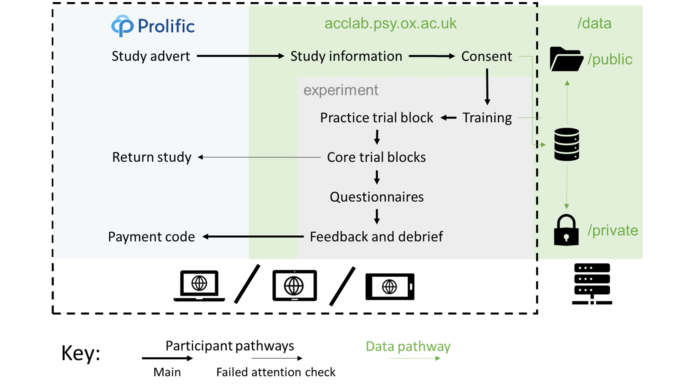
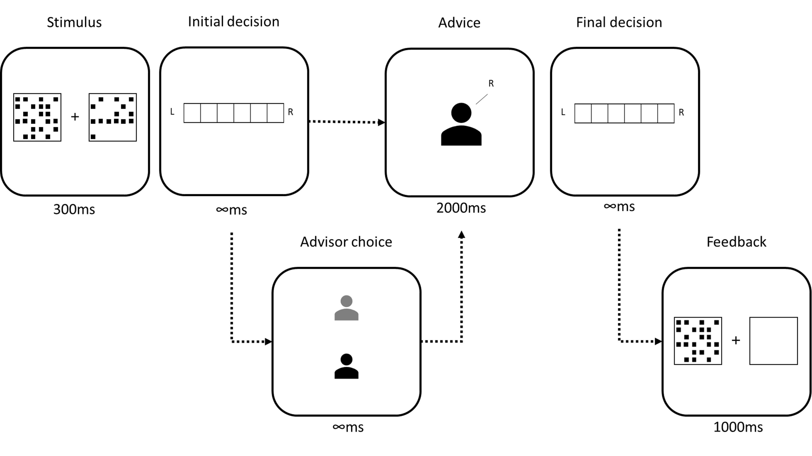
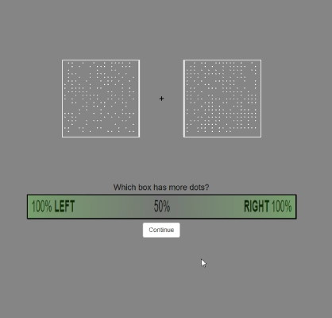
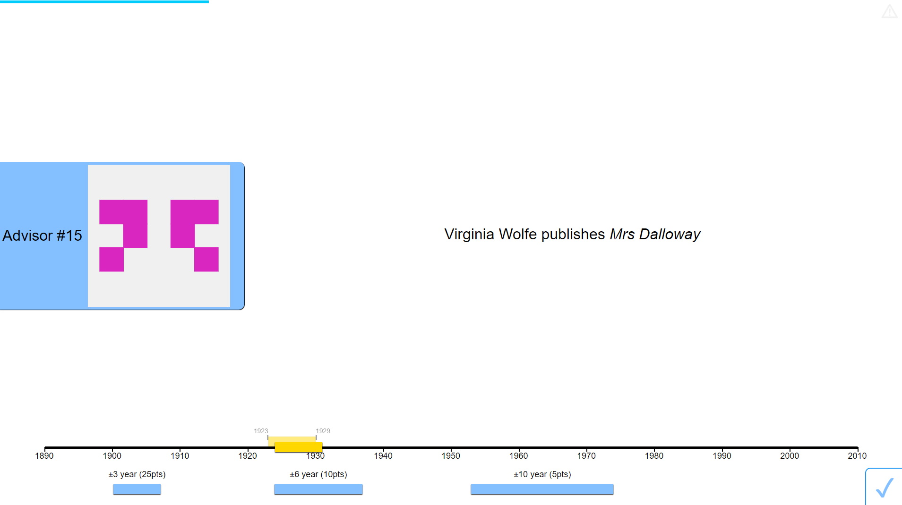
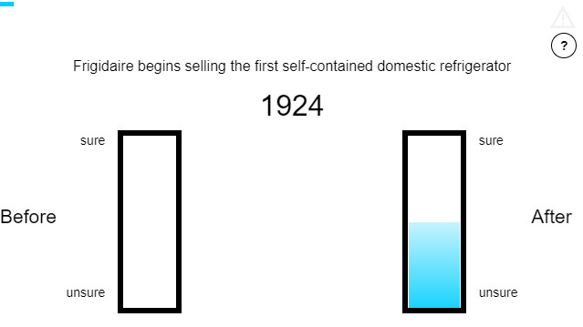
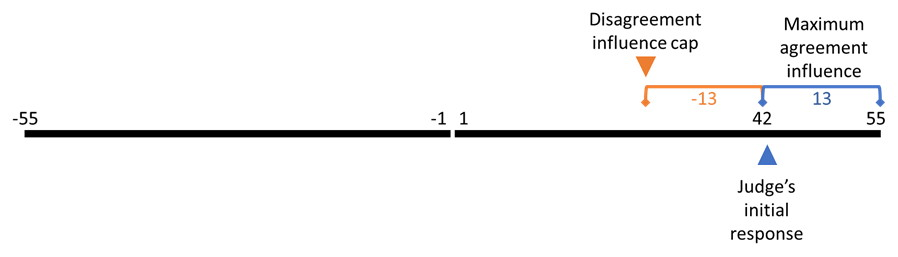

---
output:
  bookdown::pdf_document2:
    template: templates/brief_template.tex
  bookdown::word_document2: default
  bookdown::html_document2: default
documentclass: book
bibliography: 
  - bibliography/references.bib
---

```{r setup 01-01, echo = F, include = F}
source('scripts_and_filters/general_setup.R')
```

# General method {#chapter-behavioural-experiment-method}
\adjustmtc 

<!-- The behavioural experiments all have similar methodology, so it makes sense to dedicate a chapter to detailing it and then summarise and explain deviances/specifics when reporting each individual experiment.
-->

The behavioural experiments reported in this thesis share a common structure.
This structure is detailed here to reduce repetition elsewhere in the thesis.
Individual experiments have truncated methods sections in which the specific deviations from the general method are noted.

## Behavioural experiments {#gm}

The experiments take place using a judge-advisor system.
Participants give an **initial estimate** for a decision-making task, receive **advice**, and then provide a **final decision**.
The advice is always computer-generated, although the specifics of the generating procedure vary between experiments.

### Participants {#m-participants}

#### Recruitment

Human participants were recruited from the online experiment participation platform Prolific (https://prolific.co).
Participants were prevented from taking the study if they had participated in one of the other studies in the thesis, or if they had an overall approval rating on Prolific of less than 95/100.

#### Payment
 
Participants were paid approximately GBP10-15/hour pro rata.
Experiments took the average participant between 10 and 30 minutes to complete.

Later studies introduced attention checks which terminated the study as a consequence for failure.
It is not clear whether this technique constitutes best practice on Prolific because automatic termination means participants may return the study rather than having their participation explicitly rejected (and thus affecting their Prolific participation rating).
Participants who failed these attention checks were not paid.
There is an ongoing ethical debate concerning non-payment of participants who fail attention checks in online studies.
In online studies, where low-effort participation is a serious and enduring concern, platforms such as Prolific make clear to participants and researchers that payment is only expected for responses which are given with satisfactory effort.
Participants are thus fully aware of and consenting to the process of screening results for adequate effort prior to payment.

#### Demographics

Demographic information on participants, such as age and gender, was not collected.
While there is a robust case for collecting these data and conducting sex-disaggregated analyses [@criadoperezInvisibleWomenExposing2019], initial concerns over General Data Protection Regulation resulted in a cautious approach to the collection of data concerning protected characteristics of participants.
\mccorrect{!TODO[move to discussion]}Gender differences, whether due to socialisation, biological factors, or their interactions, may well alter advice-taking and expressed confidence in decisions.
I suspect, although I can offer no evidence, that gender differences in the results presented in this thesis will at most show overlapping distributions.
I do not think it highly plausible that different strategies are wholly the preserve of any particular gender, or that egocentric discounting is markedly stronger in any particular gender.

Participants were at least 18 years of age, confirmed by the requirements for possessing an account on the Prolific platform and by explicit confirmation when giving informed consent.

### Ethics {#m-ethics}

Ethical approval for the studies in the thesis was granted by the University of Oxford Medical Sciences Interdivisional Research Ethics Committee (References: R55382/RE001; R55382/RE002).

### Procedure {#m-procedure}

Participants visited the Uniform Resource Locator (URL) for the study by following a link from Prolific using their own device (Figure \@ref(fig:m-participant-experience)).
Early studies only supported computers, but later studies included support for tablets and smartphones.
After viewing an information sheet describing the study and giving their consent to participate, participants began the study proper.
For studies with conditions, participants were assigned to a condition using an algorithm that produced shuffled sequences of conditions.
The study introduced the software to the participant interactively, demonstrating the decision-making task and how responses could be made.
Next, participants were given a block of practice trials to familiarise them with the decision-making task.
Participants were then introduced to advice, and given a block of practice trials in which they received advice.
The core experimental blocks followed the practice with advice.
Finally, debrief questions were presented and feedback provided concerning the participant's performance, including a stable link to the feedback and a payment code.
The participant entered the payment code into the Prolific platform and their participation was at an end.

```{r m-participant-experience, fig.align='center', fig.caption="Participant pathway through the studies.  Participants used their own devices to complete the study, which was presented on a website written in HTML, CSS, and JavaScript. The data were saved on the server using PHP.", out.width="100%"}

```

On each trial, participants were faced with a decision-making task for which they offered an initial estimate.
They then received advice (on some trials they were able to choose which of two advisors would provide this advice).
They then made a final decision.
On feedback trials, they received feedback on their final decision.
The schematic for this trial structure is shown for the Dots Task in Figure \@ref(fig:m-trial).

```{r m-trial, fig.align='center', fig.caption="Trial structure of the Dots Task.  In the initial estimate phase, participants saw two boxes of dots presented simultaneously for 300ms. Participants then reported whether there were more dots on in the left or the right box, and how confident they were in this decision. Participants then received advice, sometimes being offered the choice of which advisor would provide the advice. The advice was displayed for 2000ms before participants could submit a final decision, again reporting which box they believe contained more dots and their confidence in their decision. On feedback trials, feedback was presented by redisplaying the correct box while showing the other box as empty.", out.width="100%"}

```

\mccorrect{!TODO[Check feedback duration and style in image caption]}

#### Perceptual decision (Dots task) {#m-p-dots}

The Dots task is a two-alternative forced choice task that has been used in various forms for many experiments in our lab \mccorrect{QUESTION: Nick, can you give me some of your key citations for this, please? It's surprisingly hard to find this kind of thing by searching because of the plethora of RDM studies, etc.} and beyond [e.g. @rouaultFormingGlobalEstimates2019].
This task has several key features that make it appealing for studying decision-making and advice.
Firstly, stimuli are only presented very briefly, meaning that many trials can be performed in a relatively short experimental session.
Secondly, the difficulty of the task can be titrated to bring all participants to a desired level of accuracy, and this process can be done continuallly and unobtrusively throughout the experiment.
Thirdly, there is a good level of variation in the difficulty of individual tasks due to the specifics of the random patterns generated, meaning that the task produces an array of confidence judgements while controlling overall performance.
Fourthly, the variation in subjective experience of the difficulty of objectively similar trials means that advice is plausible: someone else really could have seen the presentation more clearly than the participant.
Lastly, the task is neutrally-valenced and unlikely to provoke strong associations in participants that might alter their processing of information.

Stimuli in the Dots task consisted of two boxes arranged to the left and right of a fixation cross (Figure \@ref(fig:m-dots)).
These boxes were briefly (300ms) and simultaneously filled with an array of non-overlapping dots, and the participant was instructed to identify the box with the most dots.
The participant submitted their response by selecting a point on a horizontal bar: points to the left of the midpoint indicated the participant thought the lefthand box had more dots, and points to the right that they thought the righthand box had more dots. 
The further away from the midpoint the participant selected on the bar, the more confidence they indicated in their response.

The number of dots was exactly determined by the difficulty of the trial: the box with the \mccorrect{!TODO[check this description]} least dots had 200 - the difficulty, while the box with the most had 200 + the difficulty.
The dots did not move during the presentation of the stimulus.
There was thus an objectively correct answer to the question which, given enough time, could be precisely determined from the stimulus.

```{r m-dots, fig.align='center', fig.caption="Dots Task stimulus.", out.width="100%"}

```

The Dots Task stimuli can be customised to make the discrimination easier or more difficult.
This means that the stimuli can be adjusted to maintain a specific accuracy for each individual participant, allowing confidence to be examined in the absence of confounds with the probability of being correct.
Stimuli were continually adjusted throughout the experiment to maintain an initial estimate accuracy of around 71% using a 2-down-1-up staircase procedure.
There were a substantial number of trials in the practice block so that participants could eliminate practice effects and thus experience a more stable objective difficulty during the core trial blocks.
The specific number of practice trials differed between experiments as we sought to balance minimising the participant time requirement with the need to minimise practice effects in the core experimental blocks.

After the practice there were blocks where participants received advice on their initial estimates and made a final decision using the same response process as their initial estimate.
Advice was presented with a representation of an advisor with a text bubble stretching out to the side the advisor endorsed, containing the text "I think it was on the RIGHT" or LEFT as appropriate.
The advisors were represented in various manners in various versions of the task, but predominantly in a format with a central box containing a generic blank portrait icon and text at the bottom with "Advisor ##" where ## was a number between 10 and 60.

On some trials participants could choose between potential advisors.
In these cases, the potential advisors were positioned vertically in the centre of the screen and the participant clicked on the advisor from whom they wished to receive advice.
There was never a time limit for selecting an advisor.

Throughout the experiment a progress bar provided a graphical indication of the number of trials remaining in the experiment.
After each block participants were told what percentage of the final decisions they had provided were correct and allowed to take a short, self-paced break.

At the end of the experiment participants were presented with a questionnaire asking them to rate their advisors' likeability, ability, and benevolence [@mayerIntegrativeModelOrganizational1995], and offering them the opportunity to provide free-text comments on the advisors and the experiment in general.
These questionnaire responses are not analysed because they were generally uninformative.
Some free text responses may be redacted in the open data to prevent participants being identifiable.

##### Specific limitations of the Dots task

The Dots task uses a perceptual decision with a high number of trials.
There is a longstanding debate concerning whether social learning processes are unique or merely the operation of general learning processes on social cues [@lockwoodComputationalModellingSocial2020], and this structure makes this task especially unsuitable for addressing this issue.
It plausible that participants respond to the advice in this task primarily through simple reinforcement learning rather than through specific social processes even if those processes do exist.
We can therefore draw only tentative conclusions that we are capturing fluctuations in trust in advisors during this task, as opposed to capturing fluctuations in the association between advice and stimuli.

Whether or not the Dots task taps into social processes, both the task itself and the experimental structure are very different from most advice-taking and advisor evaluation in the real world. 
Perceptual decisions are rarely the subject of advice, and thus the central task is an unusual one for joint decision-making.
The amount of exposure to advisors also greatly exceeds that which would be obtained over a far longer period of time in most real world situations.
This much greater level of exposure risks investing effects with artificial importance: while it is a strength of experimental designs to magnify the effects they aim to study we must not let such magnification blind us to the real relevance of these effects within the complex and dynamic context of real life.

To accommodate some of the limitations of this task, we aimed to replicate results from the Dots task in another task that afforded less precise control but that perhaps captures more everyday decision-making and advice.

#### Estimation (Dates task)

The Dates task is a real-world general knowledge trivia task that requires participants to estimate the dates of 20th century events.
Participants were presented with historical events that occurred in a specific year in the 20th century. 
Participants were then asked to either: a) drag a marker onto a timeline to indicate a range of years within which they thought the event occurred (continuous version); or b) state whether the event occurred before or after a specific date (binary version).
Once they had made this initial estimate, they were presented with advice from an advisor and then asked to make a final decision.
The advice took the same form as the initial estimate, a range of years in the first case and an indication of whether 'before' or 'after' was the correct answer in the second.

During practice trials (either with or without advice), participants received feedback on their answers.
Some participants were placed in a Feedback condition where they received feedback on all trials except those where they were asked to choose an advisor to provide advice.

After completing all the trials, participants were presented with a feedback form for each advisor, requiring them to rate the advisor on their level of knowledge, helpfulness, and likability, chosen to reflect the three aspects of trust identified by @mayerIntegrativeModelOrganizational1995 (ability, integrity, and benevolence).
Participants could also provide free-text responses containing further comments on the advisors.
Participants then completed a general debrief form that told them: "There was a difference between the advisors. What do you think it was?" 
They also had the opportunity to add free text questions or comments about the experiment. 
The latter responses are not included in the shared data.

Finally, participants were given a screen that allowed them to inspect their performance and send links to the study to others (only participants directly invited on the Prolific platform were included for analysis and in the shared data).
This final screen also contained the payment code participants should enter on Prolific.

##### Rationale

There were several reasons behind the development of the Dates task.
Firstly, we believed the theory that advisors are evaluated on the basis of agreement when objective information concerning accuracy is not available [@pescetelliRoleDecisionConfidence2021] to be a general property of advice-taking and not constrained to the domain of perceptual decision-making.
We therefore wanted to replicate the effects see by @pescetelliRoleDecisionConfidence2021 in a different task domain.

Secondly, we wanted to replicate the effects in a task domain that was more similar to the kinds of decisions that people might seek advice about. 
While people do occasionally consult one another concerning perceptual decisions ("is that a bird or a plane?"), such consultation is rare, especially in comparison to the ubiquity of perceptual decision-making. 
We thus selected a more deliberative task.

Thirdly, much of the judge-advisor system and advice-taking literature has used tasks based on estimation [@sniezekImprovingJudgementPrepaid2004; @ginoEffectsTaskDifficulty2007; @seeDetrimentalEffectsPower2011; @sollJudgmentalAggregationStrategies2011; @ginoAnxietyAdviceAbility2012; @libermanNaiveRealismCapturing2012; @minsonCostCollaborationWhy2012; @tostPowerCompetitivenessAdvice2012; @yanivExploitingWisdomOthers2012; @bonnerGroupJudgmentAdviceTaking2014; @schultzeEffectsDistanceInitial2015; @hutterSeekingAdviceSampling2016; @schultzeInabilityIgnoreUseless2017; @troucheVigilantConservatismEvaluating2018; @wangWhyDoesAdvice2018], and often specifically estimation of dates [@yanivAdviceTakingDecision2000; @yanivUsingAdviceMultiple2007; @ginoWeListenAdvice2008].
We felt that being able to replicate the effects seen by @pescetelliRoleDecisionConfidence2021 in a task domain commonly used for evaluating advice-taking behaviour would be especially useful.

Lastly, we wanted to design a task in a way that would be engaging for participants. 
This decision did not point us towards date estimation specifically in the way the previous decisions did, but we did feel that it would be possible to make an engaging task along those lines.
Subsequent to designing the task we discovered two tabletop games with similar designs, both of which are simple to learn and engaging to play ([TimeLine](https://boardgamegeek.com/boardgame/128664/timeline), 2012; [CONFIDENT?](https://boardgamegeek.com/boardgame/251726/confident), 2018).
In keeping with this approach, we decided to make the task as compact as possible, for which estimation questions are useful, as demonstrated by the typical number of questions in the estimation tasks in the literature.

##### Continuous {#m-p-dates-c}

In the continuous version of the Dates task, participants were shown a timeline below the event description (Figure \@ref(fig:m-dates)).
Below the timeline were the markers that they used to indicate their responses. 
In earlier versions of this task, multiple markers were available, each with a point value that decreased with the width of the marker. 
Markers widths were chosen to span odd numbers of years, meaning that they could mark an even number of years in an inclusive manner (e.g. in the example shown, a 3-year marker marks the years 1916-1918 inclusively).
Once participants had placed their marker they clicked the tick button in the bottom-right to confirm their choice.

Decisions in the continuous version of the Dates task did not have an explicit confidence rating.
The participant's choice of a narrower or wider marker was taken as an implicit indication of their confidence.
In order to score points, the participant's marker had to contain the correct year on the timeline, and thus the more confident a participant was about the answer the more likely they would be able to score points using a smaller marker, and consequently the higher their average return from using a smaller marker.

Advice in the continuous version of the task was presented using a one-second animation wherein the advisor's avatar slid along the timeline to the middle of the advisory estimate. 
Attached to the avatar was the advisor's marker, and this indicated a range of years into that the advisor signalled included the year of the event.
Once the advisor's advice had reached its target location, the advisor's advice remained visible throughout the remainder of the trial, and the participant could enter a final decision.

To enter a final decision the participant could either simply click their existing marker, confirming their initial estimate as their final decision, move the marker along the timeline, or, where multiple markers were available, drag a different marker onto the timeline.
Once again, to confirm their response they clicked the tick button in the bottom-right.

Advice in the continuous version of the task was still conceptualised along dimensions of accuracy and agreement.
While it is possible to operationalise these as binary properties, with accurate advice including all advice where the advisor's marker covered the correct year and agreeing advice including all advice where the advisor's maker intersected with the participant's initial estimate marker, we decided that this approach was prohibitively difficult to implement, especially where initial estimate markers were very wide. 
Instead, accuracy and agreement were taken as continuous properties, measured from the centre of the advisor's marker to the correct year (for accuracy) or the centre of the participant's initial estimate marker (agreement).

Advisors in these experiments typically placed their advice markers by identifying a target year, either the correct year (where the advisor was defined in terms of its objective accuracy) or the centre of the participant's initial estimate marker (where the advisor was defined in terms of its propensity to agree vs. disagree with a participant's answer), and then placing the centre of their advice marker on a year sampled from a normal distribution around that target year.
On occasion, advisors would offer 'off-brand' advice, designed to neither be close to the participant's initial estimate nor the correct year, to allow for comparisons of influence across advisors that were not confounded with differences in the advice provided.  

When a choice of advisors was offered, the two advisors were shown next to one another vertically on the lefthand side of the screen, and the participant clicked on the advisor from whom they wished to receive advice.
There was never a time limit for making this choice.

On trials that contained feedback, the correct year was identified by the placement of a gold star placed over the timeline with a line pointing to the correct point on the timeline. 
The correct year was also displayed in text. 
This allowed participants to see both their own marker placement and the advisor's advice marker placement (if it was a trial with advice), and to compare both easily to the correct answer.
The feedback screen lasted 2 seconds before the next trial began.

Catch trials in the continuous Dates task consisted of an instruction to use the smallest marker to include a specific year, written out in words (e.g. 1942 would be "nineteen fourty-two").
Participants who failed in this attention check task immediately failed the experiment, and were not allowed to continue.

```{r m-dates, fig.align='center', fig.caption="Dates Task with continuous responses.", out.width="100%"}

```

##### Binary {#m-p-dates-b}

In the binary version of the Dates task, participants were shown an event and given an 'anchor' year.
Their task was to correctly identify whether the event occurred before or after the date shown (Figure \@ref(fig:m-dates-binary)).

Below the event and anchor display were the answer bars used to make responses. 
Participants selected a point on the bar of their choice (the lefthand bar indicating they believed the event was before the anchor year, and the righthand bar indicating they believed the event occurred after the anchor year).
The higher the point they selected on the bar, the more confident their response. 
A blue bar appeared while they were choosing the height of their response, and the bar remained through the trial as a reference.

On trials with advice, an advisor's avatar would appear in the middle between the two bars with an arrow pointing to the bar that the advisor endorsed. 
On some versions of the paradigm, the advisor would provide an estimate with a measure of confidence. 
In these cases, the advisor's avatar appeared close to the bar they endorsed, and then slid up or down the bar to indicate how confident they were in the advice.

Once the advisor's avatar had indicated the advised response, participants again selected a height within a bar to enter their final decision. 
On trials with feedback, a gold star would appear next to the correct bar, along with the actual year of the event.
The feedback lasted 2s.

As in the Dots task§\@ref(m-p-dots), advice was conceptualised along the binary dimensions of accuracy (whether the indicated bar was the correct one) and agreement (whether the indicated bar was the one selected in the participant's initial estimate).
In some experiments advisors gave estimates with an indication of confidence.
The confidence for these ratings was calibrated with regard to objective accuracy and varied with the difficulty of the question (i.e., with the discrepancy between the anchor year and correct year of the event). 
Specifically, the advice was generated by drawing a random year from a normal distribution centred around the correct year. 
The advice was given according to whether this year fell before or after the anchor year, with confidence scaled as a function of the distance between those years.
This method is a somewhat rationalist version of how participants themselves may generate confidence judgements in this task.

When a choice of advisors was offered, advisor avatars were placed vertically in the centre of the screen, between the two bars, and participants clicked on the avatar of the advisor from whom they wished to hear advice.
There was never a time limit for this choice.

Attention check trials in the binary Dates task prompted the participant to enter a specific response with a specific confidence. 
For example, the prompt that usually contained an event might instruct the participant to "enter 'Before' with high confidence".
As with the continuous version, entering an incorrect response would result in immediate termination of the experiment.

```{r m-dates-binary, fig.align='center', fig.caption="Dates Task with binary responses.", out.width="100%"}

```

##### Selection of events for the Dates task

The events selected for inclusion were determined through an iterative process of trial and error. 
Initially, a selection of events between 1850 and 1950 were compiled primarily from Wikipedia's timelines of the 1800s [@Timeline19thCentury2021] and 1900s [@Timeline20thCentury2021].
Events were chosen that were felt by me to be somewhat guessable, and to have occurred on a specific year. 
A small website was created to allow people to enter a range of years within which they believed an event occurred, and these events were piloted by recruiting participants from Prolific.
During piloting, each respondent saw each event in turn, and entered the year they believed the event to have occurred, along with years they were 90% sure the event occurred _after_ and 90% sure the event occurred _before_.
The data from the piloting indicated that people generally performed extremely poorly on the task, with a few exceptions for particularly famous dates.
Performance was especially dire for events from the nineteenth century. 

A new date range of 1900-2000 was chosen, and further events were added by revisiting the Wikipedia timeline for the 1900s [@Timeline20thCentury2021], as well as the Oxford Reference timeline of the 1900s [@20thCentury2012].
The new list of questions performed better during piloting.
Questions where respondents' answers were particularly accurate or inaccurate were removed, leaving a final list of around 80 events.

##### Specific limitations of the Dates task

There are several specific limitations of the Dates task.
Firstly, and most importantly, we were unable to control participants' accuracy in the way we were able to control their accuracy in the Dots task.
The advisor advice profiles' advice was determined through varying the probability of agreement contingent on the accuracy of the participant's initial estimate.
Being unable to fix the overall accuracy of participants' initial estimates meant that the overall accuracy and agreement rates of the advisor advice profiles could differ quite substantially across participants and also between advisors for the same participant.

The inability to control overall accuracy rates is in part a consequence of the second limitation: the difficulty of any given question was idiosyncratic. 
The questions concerned dates of real historical events, and some of these may have had particular relevance to individual participants, or were perhaps encountered by those participants recently or memorably, allowing precise, accurate, and high-confidence responses to what would be for the average participant very difficult questions.
The average performance of all participants on any given question is not necessarily a good guide to the individual experience of any given participant.

Lastly, participants found the task difficult overall. 
People tend to be more willing to take advice concerning difficult tasks [@ginoEffectsTaskDifficulty2007], perhaps as a way of diluting responsibility for the decision [@harveyTakingAdviceAccepting1997].
This meant that there was potential for some ceiling effects whereby advisors were not differentiated because all advisors were seen as useful, even if this was because of their potential for sharing blame rather than the informational content of their advice.

#### General limitations

There are several limitations common to both task designs.
The most obvious limitation is that the advisors are not organically-interacting humans.
There are other ecological validity limitations in the presentation of advice, the structure of the experiment, the absence of other cues, and the types of tasks used.

The use of artificial advisors means that advice can be carefully specified, and the experiments can be run easily, cheaply, and quickly.
Transparently artificial advisors may, however, limit the generalisability of the experimental results in two ways.
Firstly, if different integration processes exist for social and non-social information, it is plausible that, for at least some participants, the advice information is perceived as non-social information.
While social and non-social information processing would not invalidate any findings (because such a factor would be unlikely to be systematically related to manipulations of interest), they may harm the ability of experimental results to inform us about the processes by which social information is integrated.
Secondly, artificial advisors may not trigger a number of human-centred processes such as equality bias [@mahmoodiEqualityBiasImpairs2015], meaning that effects revealed in these experiments may be much more difficult to observe in real human advice exchanges.

The advice presented to participants in the experiments is specific and impersonal.
During real-life advice-taking, advice is often provided within a discussion, with estimates accompanied by reasons and points responded interactively.
Although studies have indicated that advice-taking behaviour remains similar where discussion is allowed [@libermanNaiveRealismCapturing2012; @minsonTwoTangoEffects2011], these experiments placed discussion within the context of advice exchanges over a decision made by both dyad members individually, and not with distinct roles for the advisor and judge as used in these experiments.
The relationship between the judge and the advisor is also less rich than real-life relationships where numerous other factors may alter or overwhelm any advice-taking and advisor evaluation processes revealed by these experiments. 

Further ecological validity limitations arise from the structure of the experiment.
The task presents a series of trials sequentially, with a rapid procession through each.
This structure is intended to condense a real-world relationship with an advisor, built up over repeated interactions over time, into as narrow a time window as possible. 
It is possible that this temporal compression does not fundamentally alter the processes of advisor evaluation and trust formation, but we have little positive evidence to support this supposition.

Lastly, both the Dots task and the Dates task had an objectively correct answer on every question.
A substantial portion of everyday real-world advice-seeking behaviour concerns questions on which there is no readily-determinable objectively correct answer, such as where might be a good holiday destination, or whether one should pursue postgraduate education.
These more subjective questions have received some attention by @vanswolForecastingAnotherEnjoyment2011, but are seldom studied in the advice-taking cognitive psychology literature.

\mccorrect{TODO: explain No gender breakdown (simplicity/privacy vs data gap)}
    
## Analysis {#m-analysis}

### Dependent variables {#m-analysis-dv}

#### Pick rate

Pick rate provides a measure of source selection behaviour. 
In most experiments there are some trials that offer participants a choice of which advisor they would like to hear from. 
There are always two choices, and a choice must always be made. 
The two choices are consistent within the experiment.
Pick rate is the proportion of choice trials in which a specified advisor was chosen.

A participant's pick rate is an aggregate over a number of trials, and expresses the observed probability of picking the specified advisor.
The mentally represented preference for that advisor is not measured directly (if such a thing even exists), and cannot be determined from the observed pick rate without knowing the mapping function for each individual participant.
Mapping functions (such as the logistic sigmoid function) produce stochastic choice behaviour from a preference marked on a continuous scale.
The relationship between preference and pick rate is non-linear and idiosyncratic, but it is likely monotonic for all participants: the stronger the preference the higher the pick rate.

#### Weight on Advice {#m-analysis-dv-woa}

Weight on Advice, and its compliment Advice Taking, are commonly used to quantify the relative contributions of advice and initial estimates in making final decisions.
It is obtained by dividing the amount an initial estimate was updated by the amount the advisor recommended adjusting the initial estimate.
It thus expresses the amount the estimate changed as a proportion of the advised change.

Formally, Weight on Advice is given by $(e^F - e^I)/(a - e^I)$ where $e^I$ and $e^F$ are the initial estimate and final decision, respectively, and $a$ is the advice.  

Where the final answer moves away from advice (i.e. the final decision is further from the advice than the initial estimate), the value of Weight on Advice is negative, and where the adjustment towards advice exceeds the advice itself (i.e. the advice falls between the final decision and the initial estimate) the value of Weight on Advice is greater than 1. 
These values are typically truncated to 0 and 1, respectively.

In cases where the advice is exactly equal to the initial estimate, the denominator is equal to zero and the value for Weight on Advice is thus undefined. 
Trials in which the advice is exactly equal to the initial estimate are consequently discarded when calculating Weight on Advice.

#### Influence

Participants on the binary tasks (Dots and Binary Dates task) make two responses with a direction and confidence.
The amount that the confidence shifts between the initial estimate and final decision in the direction of the advice is termed the _influence_ of the advice.
In most cases, participants increase their confidence when advisors offer agreeing advice and decrease their confidence when advisors offer disagreeing advice. 
Both of these cases constitute positive influence of the advice.

Influence is calculated as the extent to which the judge’s initial estimate is revised in the direction of the advisor’s advice.
The initial ($C_1$) and final ($C_2$) decisions are made on a scale stretching from -55 to +55 with zero excluded, where values <0 indicate a ‘left’ decision and values >0 indicate a ‘right’ decision, and greater magnitudes indicate increased confidence.
Influence ($I$) is given for agreement trials by the shift towards the advice:

\begin{align}
I|\text{agree} = f(C_1) 
\begin{cases}
  C_2 - C_1 & C_1 > 0 \\
  -C_2 + C_1 & C_1 < 0
\end{cases}
(\#eq:m-influence-agree)
\end{align}

And by the inverse of this for disagreement trials:

\begin{align}
I|\text{disagree} = -I|\text{agree}
(\#eq:m-influence-disagree)
\end{align}

##### Capped influence {#m-analysis-dv-influence}

The confidence scale excludes 0, and thus the final decision can always be more extreme when moving against the direction of the initial answer than when moving further in the direction of the initial answer.
A capped measure of influence was used to minimise biases arising from the natural asymmetry of the scale.
This measure was calculated by truncating absolute influence values which were greater than the maximum influence which could have obtained had the final decision been a maximal response in the direction of the initial answer (Figure \@ref(fig:m-capping)).

```{r m-capping, fig.align='center', fig.caption="Capping influence to avoid scale bias.  In this example the judge’s initial response is 42, meaning that their final decision could be up to 13 points more confident or up to 97 points less confident. Any final decision which is more than 13 points less confident is therefore capped at 13 points less confident.", out.width="100%"}

```

The capped influence measure $I_\text{capped}$ is obtained by:

\begin{align}
I_\text{capped} = \text{min}(I, |S_\text{max} - C_1|)
(\#eq:ex1-influence-capping)
\end{align}

Where $C_1$ and $C_2$ are the initial estimate and final decision, respectively, $I$ stands for influence, and $S_\text{max}$ indicates the maximum value of the scale.
Thus, to follow the example in Figure \@ref(fig:m-capping), the initial estimate was 42, and if disagreeing advice led to a final decision of 2 the raw influence measure would be 40.
This would then be compared to the absolute value of the scale width minus the initial estimate (55 - 42 = 13) and the minimum of the two would be the capped influence value, in this case 13.

There are benefits to and limitations of this approach.
A benefit is that it places agreement and disagreement on the same potential scale.
A limitation is that the truncation happens most extremely where initial estimates are made with very high confidence (because there is almost no increase that could have happened following agreement, so the cap is very low on the influence of disagreeing advice).
Conceptually, these changes where a participant adjusts a view previously held with near certainty may in fact be the most interesting of all.

An alternative approach to capping, not used here, is to scale the observed adjustment by the potential space for adjustment. 
This approach often has the effect of overinflating influence of agreement, and can make very subtle differences in the use of the top end of the scale highly important.
If, for example, a participant using a 50-point rating scale selected 48 for their initial estimate and received agreeing advice, a final decision of 49 would constitute an influence rating of 50% and a final decision of 50 an influence rating of 100%. 
It is not at all clear that participants differentiate the positions on the scales with this decree of precision, and so we considered this approach to capping influence inappropriate.

### Inferential statistics

Statistical analyses are conducted using a both Frequentist and Bayesian statistics.

#### Frequentist statistics

In this thesis a range of frequentist statistical tests are used, most frequently t-tests and analyses of variance (ANOVA).
The $\alpha$ is always set at .05 unless otherwise stated.
Null hypotheses are always the expected distribution if the effect being tested is nil.
Where the level of influence exerted by two different advisors is studied, for example, the null hypothesis would be that there were no systematic differences in influence exerted by those advisors.

#### Bayesian statistics

Bayesian statistics measure relative likelihood between statistical models given observed data and prior beliefs. 
In order to draw categorical inferences, thresholds are placed on this continuous outcome.
Here these thresholds are 1/3 < BF < 3, meaning that a BF of less than 1/3 constitutes evidence in favour of the simpler model while a BF greater than 3 constitutes evidence in favour of the more complex model.
These values are those suggested by \mccorrect{!TODO[CITE whoever has that neat little table. Jeffreys?]} as representing \mccorrect{!TODO[which word does the paper use?]} evidence in a given direction.
Where the BF lies between these thresholds it is labelled as 'uninformative'.
An uninformative result supports neither the simpler nor the more complex model, and indicates that the data are insufficient to distinguish the hypotheses.

The Bayesian tests used here rely on the priors specified by the BayesFactor R package \mccorrect{!TODO[CITE BayesFactor]}.
These priors govern the expected distributions of observed differences between samples where there is or is not a genuine effect creating systematic differences.
The use of the same, weakly-informative priors for all tests means the approach used here is an 'objective Bayesian' approach.
This objective Bayesian approach can be contrasted with a 'subjective Bayesian' approach in which the goal is to specify the exact amount of belief one should have in one hypothesis over another.
Neither the objective nor subjective approach is clearly superior. 
The subjective approach is used here because it is simpler.
There is some risk that results will be a poor fit to reality because the priors are inappropriate, but this risk is fairly low and somewhat mitigated by the additional inclusion of frequentist statistics.

#### Integrating statistical results

In most cases, Bayesian and frequentist statistics produce the same conclusion \mccorrect{!TODO[pretty sure there's a paper which states/demonstrates this]}.
Where this is not the case, results should be interpreted very cautiously: a significant frequentist test with an uninformative or null-favouring Bayesian test can indicate that the result may be a false-positive, while clear Bayesian support for the alternate hypothesis in the absence of a significant frequentist test can indicate that the priors in the Bayesian test are inappropriate. 

Where null conclusions are to be drawn, i.e. the null hypothesis is to be retained, only Bayesian statistics can be considered informative. 
In these cases Bayesian statistics will be interpreted, with the caveat that the safeguard of using two independent approaches to draw statistical conclusions has lapsed.

#### Software

Data analysis was performed using R [@rcoreteamLanguageEnvironmentStatistical2018].
For a full list of packages and software environment information, see \mccorrect{!TODO[figure out where to include this stuff.
Appendix?
Also link to a containerized version of this.]}

### Unanalysed data

Early versions of several experiments had bugs in the experiment code made the results unreliable.
The data collected during these runs are available alongside the data collected in the final versions of experiments.
These participants were paid on an ad hoc basis depending upon the time taken before the errors emerged and the detail of the error reports they submitted on the Prolific participant recruitment platform.
For details on what went wrong with the experiments in which bugs were found, see the description column of the data files in the `esmData::` R package.
While not useful for the hypotheses of the experiments for which the data were collected, some excluded data can be used for other purposes such as analysing responses to advice.

\mccorrect{TODO: Put in appendix or (NICK) cut.}

#### Experiment 0
This branch of experiments was the core of the Dates task. 
As such, most experimentation and piloting happened on this branch, meaning that there were many versions of the study where data were collected for which analysis is not included here. 

#### Experiment 1A
The earliest versions contained a bug where advisors instructed to agree with a participant instead provided advice identifying the correct answer.
Other versions had a bug in the staircasing code used to titrate the difficulty of the task was converging on too high a value (74% initial estimate accuracy as opposed to 71%).
Once the staircasing bug was fixed, two more experiments were run, one with 60 practice trials in which participants did not quite reach the desired accuracy before the beginning of the main experiment, and one with 120 practice trials which constitutes the data analysed below.

#### Experiments 1B and 2B
Early versions included a bug which prevented feedback from being shown during the familiarisation phase even to participants in the Feedback condition.
These participants could theoretically be included in the No feedback condition regardless of their condition label in the data, but this is not done here.

#### Experiment 3A

Pilot data were collected to ensure the study functioned properly, and so the data are not analysed with regard to the hypotheses. 
The v1 Mixed design was conducted and run as a proper experiment in which participants learned about both advisors simultaneously (preregistered at https://osf.io/5z2fp), but there were no effects in the data. 

#### Experiment 3B

The first version included a bug in which the advisor choice options were not recorded, making it difficult or impossible to work out which trials included a choice of advisor. 
Data for these participants could be included in a study that was agnostic about advisor choice.

#### Experiment 4A

The first version had a bug which meant that the advisors were identical in the familiarisation phase.
Both the first and second versions had a bug in which advisors who were supposed to agree with the participant's initial estimate gave the correct answer rather than agreeing.
These participants' data could be included in an analysis which used a participant's actual experience of advice to predict their advice-taking and source selection behaviour, provided appropriate care was taken to reconstruct the advice data from the raw values instead of relying on the reported summaries.

#### Experiment 5

Several versions of this study were run in the course of developing the manipulation.
The initial version had a bug that prevented the groups from being visually distinct. 
Later versions introduced a clearer manipulation, equivalent rather than genuinely misleading advice for the Sometimes misleading advisor, and rating of advice deceptiveness, respectively.

#### Experiment 6

Two short pilot versions of this experiment were run, and participants' data were not analysed due to bugs in the experiment code.

## Open science approach {#open-science}

### Open science {#os-introduction}

_Nullius in verba_ ("take nobody's word for it") is written in stone above the entrance to the Royal Society's library.
This fundamental principle of science, that it proceeds on evidence rather than assertion, has frequently been forgotten in practice.
Concerns about sloppy, self-deluding, or outright fraudulent science have existed since at least the time of Bacon.
The modern open science movement in psychology dates from the early 2010s.
Simmons et al.
demonstrated how easily false positive results could emerge from unconstrained researcher degrees of freedom in analysis [@simmonsFalsePositivePsychologyUndisclosed2011], Nosek and colleagues published a roadmap for improving the structure and function of academic research and publishing [@nosekScientificUtopiaOpening2012; @nosekScientificUtopiaII2012], and the Open Science Collaboration began [@collaborationEstimatingReproducibilityPsychological2015].
In the years following, a deluge of papers, movements, and practical changes have emerged.
The meaning of open science varies within each sub-discipline, and this section outlines how the experiments comprising this thesis have been conducted in a reproducible and transparent manner.

### Badges {#os-badges}

Following the Center for Open Science (https://cos.io), this thesis uses a series of badges to indicate adherence to particular aspects of open science.
Three badges, _preregistration_, _open materials_, and _open data_, are adopted directly from the Centre and used according to the [Centre's rules](https://osf.io/tvyxz/wiki/1.%20View%20the%20Badges/).
Studies which qualify for a badge will have the badge displayed immediately below their title.
Each badge will contain a link to online resources which provide the content for which the badge is awarded.

#### \OpenScience{prereg} Preregistration {#os-prereg}

Preregistration of a study means that information about the study has been solidified prior to the analysis of the data.
This means that hypotheses cannot be changed to represent unanticipated or overly-specific findings as a priori predicted [@kerrHARKingHypothesizingResults1998].
In practice in this thesis, preregistration means describing in detail the design and analysis plan for an experiment and depositing the description with a reputable organisation prior to data being collected.
The links which accompany the preregistration badge will point to the preregistration document.
These measures help to prevent presenting a highly selected and biased interpretation of the data as the result of a natural analytical process.

The preregistration badge also appears within results sections to designate those statistical investigations which were included in the preregistration.
Some analyses are exploratory.
These exploratory analyses are not included in the preregistration, because they are inspired by the data themselves.
They are reported after the preregistered analyses, or are clearly designated as exploratory in the text.

#### \OpenScience{materials} Open materials {#os-materials}

A foundational principle of science is that findings can be reproduced by other people.
Open materials facilitate reproduction by making it easier to rerun an experiment.
Open materials also increase the likelihood that errors can be identified.
In the case of the behavioural experiments reported here, the open materials include computer code necessary to run the experiment.
The links accompanying the open materials badge points to this code.

#### \OpenScience{data} Open data {#os-data}

Theories are the output of science as a whole, but data are the output of any individual study.
Sharing data directly allows other scientists to check and extend the data analysis conducted, to reuse the data in meta-analyses, and to repurpose the data for other investigations.
This increases the robustness of the results, and increases the efficiency of science as a whole.
The links accompanying the open data badge point to online storage where the data can be obtained for a study, along with appropriate metadata.

### Thesis workflow

This thesis is written in RMarkdown, with the data fetched and analysed at the time the document is produced using the publicly available pipeline - the entire document can be reproduced locally using the source code in an appropriate environment.
Some parts of the thesis use computational modelling or model fitting. 
These parts use cached datasets, also available online, in order to reduce the time required to create the thesis from its source files from hours to minutes using a high-end desktop personal computer.
The caching behaviour can be prevented for those wishing to evaluate the validity of the modelling components by setting the value of the R option `ESM.recalculate` to higher values (documented in the `index.Rmd` file).
A Docker environment copying the environment used to produce this document is available at \mccorrect{MAYBE: do the containerisation thing if there's time}
