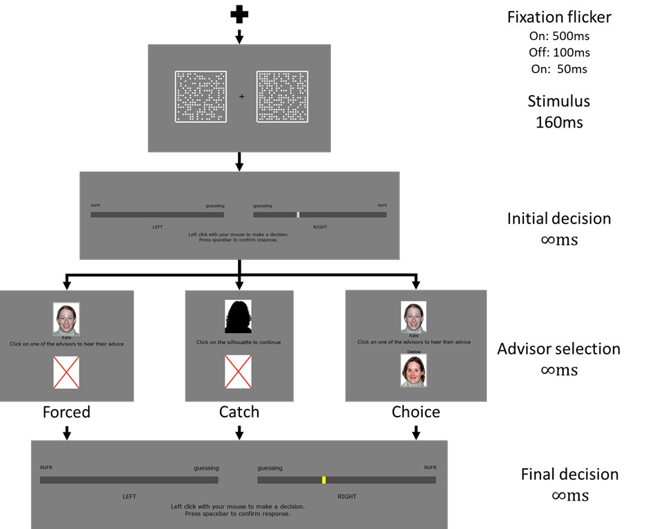

---
#########################################
# options for knitting a single chapter #
#########################################
output:
  bookdown::html_document2: default
  bookdown::word_document2: default
  bookdown::pdf_document2:
    template: templates/brief_template.tex
documentclass: book
---

# Psychology of source selection {#chapter-advisor-choice}
\minitoc

<!-- Presentation of the experiments (may want different subsections for each experiment and an extra one for the general discussion). -->

## Experiment 1: Metacognitive-contingent advisors (Lab)

Pescetelli et al. [-@pescetelliRoleDecisionConfidence2018] showed that, in the absence of objective feedback, advice was more influential coming from an advisor who agrees with a participant when that participant is confident (_Bias Sharing_) than coming from an advisor who agrees with a particpant when that participant is unconfident (_Anti Bias_). This provides evidence of a metacognitive sensitivity in the tracking of advice and the updating of advisor utility. Here we investigate whether these effects show up in the domain of advisor selection.

The literature on information exposure and evaluation indicates that people evaluate more favourably information which agrees with their currently-held opinion !TODO[REF], and preferentially seek out information sources which are likely to provide information which agrees with their currently-held opinion [@garrettEchoChambersOnline2009; @searsSelectiveExposureInformation1967]. If this holds true in the context of the judge-advisor system, advice from _Bias Sharing_ advisors ought to be evaluated more favourably (influence should increase) and should be sought more frequently. Given the evidence in favour of the first of these propositions, we here investigate the latter: given a choice, will judges prefer to receive advice from a _Bias Sharing_ advisor over receiving advice from an advisor who does not share the judge’s bias?

Pescetelli et al. [-@pescetelliRoleDecisionConfidence2018] used a judge-advisor system to demonstrate that judges are influenced to a greater extent by advisors who share their biases. Participants played the role of judge in a judge-advisor system, while the advisors were virtual agents whose advice-giving was dependent upon the confidence and correctness of the judges' initial decisions. The advisors were balanced for overall agreement with the judge and objective correctness of advice. We place participants in a similar paradigm in which they are given a choice between advisors, and hypothesise that they will more frequently seek advice from the _Bias Sharing_ advisor than from the _Anti Bias_ advisor.


### Open science

#### Preregistration

The study was preregistered using AsPredicted.org. The preregistration document can be found at [https://aspredicted.org/ze3tn.pdf](https://aspredicted.org/ze3tn.pdf). 

#### Open materials

Experimental materials, including scripts required to run the experiments in MATLAB and scripts required to analyse the data in R, are available from the [GitHub repository](https://github.com/mjaquiery/nofeedback_trust). 

The experimental design was adapted from Pescetelli et al. [-@pescetelliUseMetacognitiveSignals2017], and the major work in the design, as well as the experimental scripts, is due to Niccolo. The full list of changes to the final design can be seen in the commits to the project repository, which began as a fork of [Niccolo's work](https://github.com/chri4354/nofeedback_trust).

#### Open data

Anonymised study data can be found at !TODO[Use a sensible archive format for this study data, archive on OSF, and produce data dictionary]. A preloaded version of the data formatted appropriately for the R scripts is included in the [GitHub repository](https://github.com/mjaquiery/nofeedback_trust).

### Method

```{r load exp1 data, echo = F, include = F}

# Run the analysis script for experiment 1 from the symlinked repository.
exDirs <- c("repos/nofeedback_trust/AdvisorChoice/analysis/")
wd <- setwd(exDirs[1])
source("AdvisorChoice.R")
setwd(wd)

```


#### Participants

`r nrow(participants)` participants ($M_{age}$ = `r round(mean(participants$age))` ±$SD$ `r round(sd(participants$age), 1)`, `r sum(tolower(participants$gender) == 'm')` male, `r sum(tolower(participants$gender) == 'f')` female, `r sum(tolower(participants$gender) != 'm' & tolower(participants$gender) != 'f')` other) recruited from the University of Oxford participant recruitment platforms took part in the experiment. An additional 2 participants attended experimental sessions but their data were not analysed. Participants were compensated for their time with either course credit for a psychology degree, or 10GBP. 

#### Ethics

Ethical approval for the study was granted by the University of Oxford Medical Sciences Interdivisional Research Ethics Committee (Ref: R55382/RE001).

#### Procedure

The experiment consisted of a judge-advisor system with a perceptual decision task (Figure 1). Participants played the role of the judge, and the advisors were played by virtual agents whose answers depended upon the confidence with which the judge reported the initial decision. In the majority of trials (92%), participants were offered advice from virtual advisors. In one third of these trials (‘choice trials’), participants chose which advisor to receive advice from by clicking on their respective portraits appearing at the top and bottom of the screen. On the remaining two thirds of trials (‘forced trials’), participants were forced to take advice from one of the two advisors (equiprobably).  On these trials, the forced advisor’s portrait appeared at the top or bottom of the screen, with a red cross appearing in the other location, which was not selectable. On the remaining 8% of trials, participants received no advice and were given no opportunity to revise their initial decision. These ‘catch trials’ were included to encourage participants to attend to the initial decisions.

```{r, fig.align='center', fig.cap="Experiment 1 procedure: participants made initial judgements about which of two boxes of dots was more densely populated, chose an advisor from whom to get advice, and made a final judgement integrating their inital judgement and the advice. Judgements were made by inidcating both the side containing most dots and a confidence in that judgement.", out.width="80%", echo=F}

```


### Result

### Discussion

## Experiment 2: Metacognitive-contingent advisors
 
### Method

### Result

### Discussion

## Experiment 3: Advisor accuracy

### Method

### Result

### Discussion

## Experiment 4: Advisor agreement

### Method

### Result

### Discussion

## Experiment 5: Accuracy vs agreement (Date estimation)

### Method

### Result

### Discussion

## General discussion