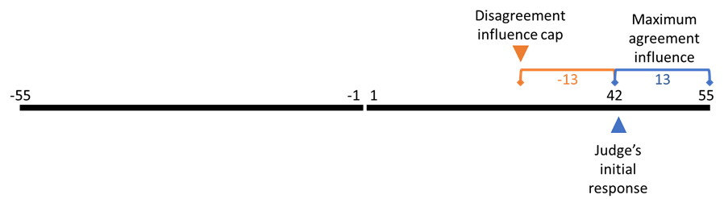

---
output:
  bookdown::pdf_document2:
    template: templates/brief_template.tex
    keep_tex: false
  bookdown::word_document2: default
  bookdown::html_document2: default
documentclass: book
editor_options: 
  chunk_output_type: inline
  
bibliography: 
  - references.bib
  - bibliography/references.bib
bibliography-heading-in-pdf: Works Cited
params:
  corrections: true 
---

```{r setup 01-03, echo = F, include = F}
source('scripts_and_filters/general_setup.R')

library(BayesFactor)
library(magrittr)
library(see)
library(ggridges)
library(ggpmisc)
library(ggtext)
library(broom)
```

# Psychology of source selection {#chapter-advisor-choice}
\adjustmtc 

<!-- 
My research on advisor selection.
-->

The model of advisor evaluation described earlier (§\@ref(advisor-evaluation-without-feedback)) requires empirical support.
The model of advisor evaluation with feedback is well supported by data which indicate that, given objective feedback, people can use the feedback to learn about the trustworthiness of advisors.
The extent to which advice is taken (§\@ref(m-analysis-dv-woa)) is commonly used as a measure of a participant's trust in an advisor, on the argument that the participant seeks to maximise task performance and task performance is maximised by taking more advice from more trustworthy advisors.
\mccorrect{!TODO[Mini lit review - advisor accuracy training with feedback (Yaniv?), Niccolo and Nick's feedback stuff]}.
Overall, this means that people prefer more accurate advice over less accurate advice.

When objective feedback is unavailable, people can still demonstrate a greater dependence upon advice from more as opposed to less accurate advisors.
\mccorrect{!TODO[Mini lit review, Niccolo's stuff, maybe prior stuff - check Niccolo's thesis for references]}.
This is a consequence of agreement: where the base probability of being correct is greater than chance, the independent estimates of people who are more accurate will agree more often (leading to 100% agreement on the correct answer for two independent decision-makers of perfect accuracy).
In the absence of feedback, therefore, agreement can be used as a proxy for accuracy, as formalised in the model.

The role of agreement is demonstrated clearly in experiments where the objective accuracy of advisors is balanced, but the agreement rates of the advisors is varied.
\mccorrect{!TODO[cite Niccolo CITE]}.
Pescetelli and Yeung demonstrated that advice is more influential from advisors who tend to agree with a participant more frequently when objective feedback is not provided.
This is despite the fact that advice is more influential when it disagrees with the participant's initial estimate.
^[This is partly due to the nature of the judge-advisor system: there is always room for disagreement to be more extreme than agreement, because agreement is lower-bounded by the participant's initial estimate.] 
These data suggest that people may be using agreement as a proxy for accuracy, although they may simply prefer agreement over disagreement when there is no accuracy cost to be paid.
I report the results of an experiment in which an agreeing advisor was compared with an accurate advisor under conditions of feedback or no feedback.
Results indicated that, as predicted by the models, participants preferred the accurate advisor when feedback was provided and the agreeing advisor when feedback was withheld.

Pescetelli and Yeung developed a more sophisticated model of advisor evaluation in which the increase in trust gained when an advisor agreed with the decision-maker was contingent upon the confidence of the decision-maker's initial estimate (§\@ref(confidence-weighted-agreement)).
Intuitively, if I am highly certain that I am correct on a given question, an advisor who disagrees with me is likely to be incorrect, whereas one who agrees with me is likely to be correct.
Provided confidence is indicative of the objective probability of being correct, as confidence in the initial decision increases it more closely approximates objective feedback for the purposes of evaluating advice.
\mccorrect{!TODO[detailed account of Niccolo's evidence for the confidence-weighted model]}.
I report the results of experiments designed to extend Pescetelli and Yeung's results to the domain of advisor influence, using two different decision-making tasks.


<!-- Presentation of the experiments (may want different subsections for each experiment and an extra one for the general discussion).
-->


## Accuracy
\mccorrect{!TODO[check Niccolo covered this]} {#ac-acc}

Pescetelli and Yeung \mccorrect{!TODO[cite new paper]} demonstrated that more accurate advisors are more influential (regardless of the presence of feedback) in a lab-based perceptual decision-making task.
We attempted to extend this finding to the domain of advisor selection in two online tasks: a 'Dots Task' requiring similar perceptual decision-making to the task used by Pescetelli and Yeung, and an estimation-based 'Dates Task'.

The ability to distinguish between accurate advisors in these experiments is important because they relate directly to the phenomenon we are attempting to explain: rational advice-seeking behaviour in the absence of feedback.

### Dots Task {#ac-acc-dots}

```{r include = F}

select_experiment(
  project = 'dotstask',
  function(x) filter(x, study == 'Accuracy', version == '120 practice trials')
)

.dropEnv <- new.env()
tada('dotstask', package = 'esmData', envir = .dropEnv)
.dropEnv$dotstask <- .dropEnv$dotstask %>% 
  filter(study == 'Accuracy', version != '120 practice trials')

.dropEnv$DROP_P <- sum(.dropEnv$dotstask %>% 
                         filter(table == 'AdvisedTrial') %>% 
                         pull(N))

trials <- annotate_responses(trials)

```

#### Open scholarship practices

\indent\indent\OpenScience{prereg} `r unique(dotstask$preregistration)`

\OpenScience{data} \mccorrect{!TODO[OSFify data for these studies]}

\OpenScience{materials} https://github.com/oxacclab/ExploringSocialMetacognition/blob/9932543c62b00bd96ef7ddb3439e6c2d5bdb99ce/AdvisorChoice/index.html

##### Unanalysed data

Several early versions of this experiment were run where bugs in the experiment code made the results unreliable.
The earliest versions contained a bug where advisors instructed to agree with a participant instead provided advice identifying the correct answer.
Other versions had a bug in the staircasing code used to titrate the difficulty of the task was converging on too high a value (74% initial decision accuracy as opposed to 71%).
Once the staircasing bug was fixed, two more experiments were run, one with 60 practice trials in which participants did not quite reach the desired accuracy before the beginning of the main experiment, and one with 120 practice trials which constitutes the data analysed below.
Overall, `r .dropEnv$DROP_P` participants' data was collected in these excluded versions and not included in analysis.
While not useful for the hypothesis of this experiment, the excluded data can be used for analysing responses to advice, provided care is taken with the very early versions to ensure advice is interpreted correctly.

#### Method {#ac-acc-dots-m}

\mccorrect{!TODO[clarify any methodological differences from the main methods chapter]}

##### Advice profiles

The two advisor profiles (Table \@ref(tab:ac-acc-dots-m-profiles)) used in the experiment were High accuracy and Low accuracy.
The High accuracy advisor was correct 80% of the time while the Low accuracy advisor was correct 20% of the time.
The advisor profiles were not balanced for overall agreement rates.

```{r ac-acc-dots-m-profiles-r} 

pCor <- .71
agr <- matrix(c(.8, .2, .6, .4), 2, 2)

agr.table <- tribble(
  ~`Advisor`, ~`Participant correct`, ~`Participant incorrect`, ~`Overall`, ~`Overall accuracy`,
  "High accuracy", agr[1, 1], agr[2, 1], sum(agr[,1] * c(pCor, 1 - pCor)), sum(agr[1,1] * pCor, (1 - agr[2,1]) * (1 - pCor)),
  "Low accuracy", agr[1, 2], agr[2, 2], sum(agr[,2] * c(pCor, 1 - pCor)), sum(agr[1,2] * pCor, (1 - agr[2,2]) * (1 - pCor))
) %>% 
  prop2str()

kable(agr.table, caption = "\\label{tab:ac-acc-dots-m-profiles}Advisor advice profiles for Dots task Accuracy experiment") %>%
  kable_styling() %>%
  column_spec(1, bold = T) %>%
  row_spec(0, bold = F) %>%
  collapse_rows(columns = 1, valign = "top") %>%
  add_header_above(c(" ", 
                     "Probability of agreement" = 3,
                     " "))

```

#### Results {#ac-acc-dots-r}

##### Exclusions

```{r}
nMaxOutliers <- 2
zThresh <- 3
accuracyRange <- c(.6, .85)
minTrialsPerCategory <- 12
preRegParticipants <- 50

tmp <- trials %>% 
  nest(d = -pid) %>%
  mutate(d = map_dbl(d, ~ mean(.$initialAnswerCorrect)))

exclusions <- tibble(pid = unique(trials$pid)) %>%
  mutate(
    `Accuracy too low` = pid %in% filter(tmp, d < accuracyRange[1])$pid,
    `Accuracy too high` = pid %in% filter(tmp, d > accuracyRange[2])$pid
  )

tmp <- trials %>% 
  filter(!practice) %>%
  nest(d = c(-pid, -confidenceCategory)) %>%
  mutate(n = map_int(d, nrow)) %>%
  select(-d) %>%
  pivot_wider(names_from = confidenceCategory, 
              names_prefix = "cc", 
              values_from = n) %>%
  mutate(
    anyNA = is.na(cc0) | is.na(cc1) | is.na(cc2),
    lowest = pmin(cc0, cc1, cc2, na.rm = T)
  )

exclusions <- exclusions %>% 
  mutate(
    `Missing confidence categories` = pid %in% filter(tmp, anyNA)$pid,
    `Skewed confidence categories` = pid %in% filter(tmp, lowest < minTrialsPerCategory)$pid
  )
  
do_exclusions(exclusions)

tmp <- trials %>% nest(d = -pid) %>% rowid_to_column() %>% filter(rowid > preRegParticipants)

exclusions <- exclusions %>% mutate(`Too many participants` = pid %in% tmp$pid)

do_exclusions(exclusions, backup = F)


exclusions$`Total excluded` <- exclusions %>% select(-pid) %>% apply(1, any)
n <- ncol(exclusions)
exclusions %>% 
  summarise(across(where(is.logical), sum)) %>%
  mutate(`Total remaining` = length(unique(trials$pid))) %>% 
  pivot_longer(everything(), names_to = "Reason", values_to = "Participants excluded") %>%
  kable(caption = "\\label{tab:ac-acc-dots-exclusions}Participant exclusions for Dots task Accuracy experiment") %>%
  row_spec((n - 1):n, bold = T)

```

Participants' data could be excluded from analysis where they have an average accuracy below `r accuracyRange[1]` or above `r accuracyRange[2]`, do not have trials in all confidence categories, have fewer than `r minTrialsPerCategory` trials in each confidence category, or have completed the experiment after the preregistered amount of data has already been collected. 
Overall, `r sum(pull(exclusions, "Total excluded"))` participants were excluded, with the details shown in Table \@ref(tab:ac-acc-dots-exclusions).

##### Task performance

```{r}

familiarization <- trials %>%
  filter(typeName == "force", adviceType %in% c(5,6)) %>%
  mutate(Advisor = advisor_profile_name(adviceType),
         Advisor = factor(Advisor)) %>%
  order_factors()

```

Before exploring the interaction between the participants' responses and the advisors' advice, and the participants' advisor selection behaviour, it is useful to verify that participants interacted with the task in a sensible way, and that the task manipulations worked as expected.
In this section, task performance is explored during the Familiarization phase of the experiment where participants received advice from a pre-specified advisor on each trial. 
There were an equal number of these trials for each participant for each advisor.

###### Response times

Participants made two decisions during each trial. 
Neither of these decisions had a maximum response time. 
Each participant's response times for both initial and final decisions can be seen in Figure \@ref(fig:ac-acc-dots-r-response-times).

```{r ac-acc-dots-r-response-times, fig.caption="Response times for the Dots task with in/accurate advisors.  Each point shows a response relative to the start of the trial. Each row indicates a single participant's trials. The ridges show the distribution of the underlying points, with initial estimates and final decisions shown in different colours. The grey numbers on the right show the number of trials whose response times were more than 3 standard deviations away from the mean of all final response times (rounded to the next 10s)."}

tmp <- familiarization %>% 
  transmute(
    pid = factor(pid),
    `Initial estimate` = timeInitialResponse - timeInitialStart,
    `Final decision` = timeFinalResponse - timeInitialStart
  ) %>%
  pivot_longer(c(`Initial estimate`, `Final decision`),
               names_to = "Event", 
               values_to = "Time") %>%
  filter(!is.na(Event) & !is.na(Time)) %>%
  rename(Participant = pid)

max_rt <- tmp %>% 
  filter(Event == 'Final decision') %>%
  mutate(zTime = scale(Time)) %>%
  filter(zTime > 3) %>%
  filter(zTime == min(zTime)) %>% 
  pull(Time) %>% 
  .[1]
# round to 10s
max_rt <- ceiling(max_rt / 10000) * 10000
  

# Replace out-of-scale values with a count of dropped values
dropped <- tmp %>%
  group_by(Participant) %>%
  filter(Time > max_rt) %>%
  transmute(n = n())

tmp <- tmp %>% 
  filter(Time <= max_rt) %>% 
  mutate(
    Participant = fct_reorder(Participant, Time, .desc = T),
    Event = factor(Event)
  ) %>%
  order_factors()

ggplot(tmp, aes(y = Participant, x = Time, fill = Event, colour = Event)) +
  geom_density_ridges(alpha = .25, colour = NA) +
  geom_point(alpha = .25, size = .25) +
  geom_text(aes(label = paste0('+', dropped$n), y = Participant),
            inherit.aes = F, x = max_rt, colour = 'grey', hjust = 1, 
            data = dropped) +
  scale_x_continuous(limits = c(0, max_rt), expand = c(0, 0)) +
  labs(x = 'Time since trial start') +
  theme(
    axis.text.y = element_blank(),
    axis.ticks.y = element_blank(),
    legend.position = 'top',
    plot.margin = 
  ) +
  coord_fixed(max_rt/length(unique(tmp$Participant)))

```

All participants had similar patterns: initial and final responses were approximately normally distributed, with final responses having a higher variance (because they include the variance for the initial response).
Most participants show some trials on which initial or final responses took substantially longer than usual.

\mccorrect{!TODO[Perhaps this plot would be better showing individual participants' distributions and box-plots/3SD markers, especially if we want to exclude trials on the basis of taking too long (we don't currently). Perhaps tying final response time to final response start would be better, too, because then initial and final decisions can be more sensibly compared.]}

###### Accuracy

Accuracy of initial decisions was controlled by a staircasing procedure which aimed to pin accuracy to 71%.
The accuracy of final decisions was free to vary according to the ability of the participant to take advantage of the advice on offer.
As Figure \@ref(fig:ac-acc-dots-r-accuracy) shows, participants' accuracy scores for initial decisions were close to the target values (partly because participants whose accuracy scores diverged considerably were excluded).
Participants tended to improve the accuracy of their responses following advice from High accuracy advisors, while the evidence was unclear as to whether there was any difference in response accuracy with Low accuracy advice.
The distribution of initial estimate accuracy for trials with the Low accuracy advisor is slightly unusual, with a bimodal structure and a median somewhat higher than the target value. 
There is no obvious reason why this should be the case.

```{r ac-acc-dots-r-accuracy, fig.caption="Response accuracy for the Dots task with in/accurate advisors.  Faint lines show individual participant means, for which the violin and box plots show the distributions. The half-width horizontal dashed lines show the level of accuracy which the staircasing procedure targeted, while the full width dashed line indicates chance performance. Dotted violin outlines show the distribution of actual advisor accuracy."}

dw <- .2

tmp <- familiarization %>% 
  group_by(Advisor, pid) %>%
  summarise(
    `Initial estimate` = mean(initialAnswerCorrect),
    `Final decision` = mean(finalAnswerCorrect),
    .groups = 'drop'
  ) %>%
  pivot_longer(cols = c(`Initial estimate`, `Final decision`), 
               names_to = 'Response', values_to = 'Accuracy') %>%
  mutate(Advisor = factor(paste0(Advisor, '\n')),
         Response = factor(Response))

adv <- familiarization %>%
  group_by(Advisor, pid) %>%
  summarise(
    Response = 'Advice',
    Accuracy = mean(adviceCorrect),
    .groups = 'drop'
  ) %>%
  mutate(Advisor = factor(paste0(Advisor, '\n'))) %>%
  order_factors()

stair <- tribble(
  ~Response, ~Accuracy,
  'Initial estimate', .71
) %>%
  crossing(tibble(Advisor = unique(tmp$Advisor))) %>%
  filter(!is.na(Advisor))

# Should this be a paired t-test?
bf <- tmp %>% 
  nest(d = -Advisor) %>%
  mutate(d = map(d, as.data.frame),
    bf = map(d, ~ ttestBF(x = .$Accuracy[.$Response == 'Initial estimate'],
                          y = .$Accuracy[.$Response == 'Final decision'], 
                          data = ., paired = T)),
         bf = map_chr(bf, ~ .@bayesFactor %>% .$bf %>% exp() %>% bf2str())) %>%
  select(-d)

tmp %>%
  mutate(advisor = str_replace(Advisor, '\\n', ''),
         advisor = factor(advisor)) %>%
  order_factors() %>%
  ggplot(aes(x = Response, y = Accuracy, colour = advisor)) +
  scale_y_continuous(limits = c(NA, 1), expand = c(0, 0)) +
  scale_x_discrete() +
  scale_colour_discrete(name = 'Advisor', aesthetics = c('fill', 'colour')) +
  coord_cartesian(clip = F) +
  geom_hline(yintercept = .5, linetype = 'dashed') +
  geom_segment(aes(y = Accuracy, yend = Accuracy, x = 0, xend = 1.5), 
               linetype = 'dashed', colour = 'black', data = stair) +
  geom_line(aes(group = pid), alpha = .25) +
  geom_split_violin(aes(x = nudge(Response, dw), 
                        group = Response, fill = advisor), 
                    width = .9, colour = NA) +
  geom_split_violin(aes(x = 2 + dw), 
                    group = 2, fill = NA, colour = 'black', linetype = 'dotted', 
                    data = adv) +
  geom_boxplot(aes(x = nudge(Response, dw), group = Response),
               outlier.shape = NA, size = 1, width = dw/2, colour = 'black') +
  geom_segment(x = 1 - dw, xend = 2 + dw, y = 1, yend = 1, colour = 'black') +
  geom_label(x = 1.5, y = 1, aes(label = paste0('BF = ', bf)), colour = 'black', 
             data = bf) +
  facet_wrap(~Advisor) +
  broken_axis_bottom

```

###### Confidence

Generally, we expect participants to be more confident on trials on which they are correct compared to trials on which they are incorrect.
Participants were systematically more confident on correct as compared to incorrect trials for both initial estimates and final decisions.

```{r ac-acc-dots-r-confidence, fig.caption="Confidence for the Dots task with in/accurate advisors.  Faint lines show individual participant means, for which the violin and box plots show the distributions."}

dw <- .2

tmp <- familiarization %>% 
  mutate(`Initial answer accuracy` = 
           if_else(initialAnswerCorrect, 'Correct', 'Incorrect')) %>%
  group_by(`Initial answer accuracy`, pid) %>%
  summarise(
    `Initial estimate` = mean(initialConfidenceScore),
    `Final decision` = mean(finalConfidenceScore),
    .groups = 'drop'
  ) %>%
  pivot_longer(cols = c(`Initial estimate`, `Final decision`), 
               names_to = 'Response', values_to = 'Confidence') %>%
  mutate(response = factor(paste0(Response, '\n')),
         Response = factor(Response),
         `Initial answer accuracy` = factor(`Initial answer accuracy`))

bf <- tmp %>% 
  nest(d = -response) %>%
  mutate(d = map(d, as.data.frame),
         bf = map(d, ~ ttestBF(
           x = .$Confidence[.$`Initial answer accuracy` == 'Correct'],
           y = .$Confidence[.$`Initial answer accuracy` == 'Incorrect'], 
           data = ., paired = T)
         ),
         bf = map_chr(bf, ~ .@bayesFactor %>% .$bf %>% exp() %>% bf2str())) %>%
  select(-d)

tmp %>%
  order_factors() %>%
  ggplot(aes(x = `Initial answer accuracy`, y = Confidence, colour = Response)) +
  scale_y_continuous(limits = c(0, 1), expand = c(0, 0)) +
  scale_x_discrete() +
  coord_cartesian(clip = F) +
  geom_line(aes(group = pid), alpha = .25) +
  geom_split_violin(aes(x = nudge(`Initial answer accuracy`, dw), 
                        group = `Initial answer accuracy`, 
                        fill = Response), 
                    width = .9, colour = NA) +
  geom_boxplot(aes(x = nudge(`Initial answer accuracy`, dw), 
                   group = `Initial answer accuracy`),
               outlier.shape = NA, size = 1, width = dw/2, colour = 'black') +
  geom_segment(x = 1 - dw, xend = 2 + dw, y = 1, yend = 1, 
               colour = 'black') +
  geom_label(aes(label = paste0('BF = ', bf)), 
             x = 1.5, y = 1, colour = 'black', data = bf) +
  facet_wrap(~response)

```

###### Metacognitive ability

Where performance on the underlying task is held constant, as here, metacognitive sensitivity can be measured in a bias-free way by plotting Receiver Operating Characteristic (ROC) curves for metacognitive responses [@flemingHowMeasureMetacognition2014].
[^The constant underlying task performance is only true for initial estimates in the paradigm used here, and thus the ROC curves for final decisions should be interpreted with caution because they cannot be proven to be unaffected by metacognitive bias.]
ROC curves are obtained by calculating at each of a number of different points on a confidence scale, the probability that the confidence is at least that high for correct versus incorrect answers. 
The area under the ROC curve gives a measure of the ability of confidence ratings to distinguish correct and incorrect responses.
An area under the ROC curve of .5 indicates chance performance, and a value of 1 indicates perfect discrimination.

As shown by Figure \@ref(fig:ac-acc-dots-r-roc), almost all participants showed above-chance metacognitive sensitivity for initial estimates and final decisions.
Participants generally showed higher metacognitive sensitivity for final decisions, although this may be an artefact of a change in metacognitive bias.
Participants' metacognitive sensitivity was not particularly high \mccorrect{!TODO[What are typical values we might expect in the dots task and similar tasks? Is there a useful mapping between meta-d' and Type II ROC to compare with e.g. Roualt's stuff?]}.
There was no evidence of participants' metacognitive sensitivity being correlated with their task performance (Figure \@ref(fig:ac-acc-dots-r-roc-cor)). 
This is expected when task performance is tightly controlled, because under these conditions variation in task performance reflects variation in ability within a participant rather than between participants. 

```{r ac-acc-dots-r-roc, fig.caption="ROC curves for the Dots task with in/accurate advisors.  Faint lines show individual participant data, while points and solid lines show mean data for all participants. Each participant's data are split into initial estimates and final decisions. For correct and incorrect responses seperately, the probability of a confidence rating being above a response threshold is calculated, with the threshold set to every possible confidence value in turn. This produces a point for each participant in each response for each possible confidence value indicating the probability of confidence being at least that high given the answer was correct, and the equivalent probability given the answer was incorrect. These points are used to create the faint lines, and averaged to produce the solid lines. The dashed line shows chance performance where the increasing confidence threshold leads to no increase in discrimination between correct and incorrect answers."}

nQuantiles <- 50 # confidence range

tmp <- familiarization %>% 
  pivot_longer(cols = c(starts_with('initial'), starts_with('final')),
               names_to = c('Response', '.value'),
               names_pattern = '(initial|final)(.*)') %>%
  # calculate p(confidence > q) for in/correct answers at each quantile q
  nest(d = c(-pid, -Response, -AnswerCorrect)) %>%
  mutate(
    d = map(d, ~ p_conf(., seq(0, 1, length.out = nQuantiles)))
  ) %>%
  unnest(cols = d) %>% 
  unnest(cols = d)

tmp <- tmp %>% 
  mutate(
    Response = factor(if_else(Response == 'initial', 
                              'Initial estimate', 'Final decision')),
    Confidence = factor(Confidence),
    Confidence = fct_relabel(Confidence, ~prop2str(as.numeric(.)))
  ) %>%
  pivot_wider(names_from = AnswerCorrect, 
              names_prefix = 'Correct', 
              values_from = pConf) 

auroc <- tmp %>% 
  nest(d = c(-pid, -Response)) %>%
  mutate(
    d = map(d, ~arrange(., CorrectFALSE, rev(CorrectTRUE))),
    d = map(d, ~mutate(., area = CorrectTRUE * 
                         (CorrectFALSE - lag(CorrectFALSE)))),
    area = map_dbl(d, ~ sum(.$area, na.rm = T))
  ) %>%
  select(-d) 

auroc.gg <- auroc %>%
  nest(d = -Response) %>%
  mutate(
    d = map(d, ~ mutate(., mean = mean(area))),
    gg = map(
      d, 
      ~ ggplot(., aes(y = area)) +
        geom_hline(yintercept = .5, linetype = 'dashed') +
        geom_density(fill = 'black') +
        geom_hline(aes(yintercept = mean), data = unique(select(., mean))) +
        geom_label(aes(y = mean, x = nrow(.), 
                       label = paste0('Mean = ', prop2str(mean))), 
                   hjust = 1, data = unique(select(., mean))) +
        scale_y_continuous(limits = c(0, 1), expand = c(0, 0), 
                           breaks = c(0, .5, 1)) +
        scale_x_continuous(limits = c(0, nrow(.)), expand = c(0, 0),
                           position = 'top') +
        labs(x = "", y = "AUC") +
        theme(axis.ticks.x = element_blank(),
              axis.line.x = element_blank(),
              panel.grid.major.x = element_line(),
              plot.margin = unit(rep(0, 4), 'lines'))
    )
  )

tmp.avg <- tmp %>%
  group_by(Confidence, Response) %>%
  summarise(across(where(is.numeric), mean), .groups = 'drop')

tmp.avg %>%
  order_factors() %>%
  ggplot(aes(x = CorrectFALSE, y = CorrectTRUE)) +
  geom_abline(slope = 1, intercept = 0, linetype = 'dashed') +
  geom_line(aes(group = pid), alpha = .2, colour = 'grey', data = tmp) +
  geom_line() +
  geom_point() +
  geom_plot(aes(label = gg), x = 1, y = .025, vp.width = 2/3, data = auroc.gg) +
  scale_x_continuous(limits = c(0, 1), expand = c(0, .01)) +
  scale_y_continuous(limits = c(0, 1), expand = c(0, .01)) +
  coord_fixed() +
  facet_wrap(~Response) +
  theme(panel.spacing.x = unit(2, 'lines'),
        plot.margin = unit(c(0, 0, 4, 0), 'lines')) +
  labs(x = 'p( Confidence > threshold | Incorrect )', 
       y = 'p( Confidence > threshold | Correct )')

```

```{r ac-acc-dots-r-roc-cor, fig.caption="AUROC-accuracy correlation for the Dots task with in/accurate advisors.  Points show individual participant data for their area under the receiver operator characteristic (ROC) curve and their accuracy on initial estimates and final decisions. The blue lines and equation text show best-fit regression, and the shaded area gives its standard error. The equations give the regression equation plotted in blue, with bold coefficients being significant at p = .05."}

# Correlations between Type II AUROC and accuracy
acc <- left_join(
  auroc,
  familiarization %>% 
    group_by(pid) %>% 
    summarise(initialAccuracy = mean(initialAnswerCorrect),
              finalAccuracy = mean(finalAnswerCorrect),
              .groups = 'drop') %>%
    pivot_longer(-pid) %>%
    transmute(
      pid,
      Response = factor(
        if_else(name == 'initialAccuracy', 
                'Initial estimate', 'Final decision')
      ),
      accuracy = value
    ),
  by = c('pid', 'Response')
)

r = acc %>% 
  nest(d = -Response) %>%
  mutate(
    d = map(d, ~ lm(area ~ accuracy, data = .)),
    d = map(d, tidy),
    d = map(d, ~ pivot_wider(., names_from = term, values_from = -term)),
    d = map_chr(d, ~paste0('y = ', 
                           if_else(.$`p.value_(Intercept)` < .05, '**', ''), 
                           round(.$`estimate_(Intercept)`, 2),
                           if_else(.$`p.value_(Intercept)` < .05, '**', ''), 
                           ' + ',
                           if_else(.$p.value_accuracy < .05, '**', ''),
                           round(.$estimate_accuracy, 2),
                           if_else(.$p.value_accuracy < .05, '**', ''), 
                           'x'))
  )

acc %>%
  order_factors() %>%
  ggplot(aes(x = accuracy, y = area)) +
  geom_abline(slope = 1, intercept = 0, linetype = 'dashed') +
  geom_smooth(method = 'lm', formula = y ~ x) +
  geom_point(alpha = .2) +
  geom_richtext(x = .51, y = .99, hjust = 0, vjust = 1, fill = NA,
                aes(label = d), 
                data = r) +
  scale_x_continuous(limits = c(.5, 1), expand = c(0,0)) +
  scale_y_continuous(limits = c(.5, 1), expand = c(0,0)) +
  coord_fixed() +
  facet_wrap(~Response) +
  labs(x = 'Accuracy', y = 'Area under ROC curve') +
  broken_axis_bottom +
  theme(panel.spacing.x = unit(2, 'lines'),
        plot.margin = unit(c(0, 0, 4, 0), 'lines'))

```

###### Confidence change {#ac-dots-r-confidence-change}

The extent and manner of confidence changes is an important indicator of the extent to which participants treat advice as informative (Figure \@ref(fig:ac-acc-dots-r-confidence-change)).
As expected from participants who are paying attention to the task and attempting to maximize the calibration and accuracy of their final decisions, when participants receive agreeing advice they tend to increase their confidence in their initial response. 
Likewise, where participants receive disagreeing advice, they tend to reduce their confidence in their answer. 
Somewhat surprisingly, when participants change their decision (a relatively uncommon event) they quite often make their final decision with a confidence equivalent to their initial estimate, producing a distinctive off-diagonal pattern along the $y = -x$ line.

```{r ac-acc-dots-r-confidence-change, fig.caption="Confidence change on the Dots task with in/accurate advisors.  Each point shows the initial and final confidence on a single trial. Final confidence is coded relative to initial confidence so that increasing confidence in the opposite decision (i.e. confidence on trials where the participant changed their mind) is increasingly negative. Points above the dashed y = x line represent increased confidence, while those below it give decreased confidence. Points close to the y = x line indicate relatively little change, while points further away indicate relatively greater change. The shaded grey area shows the zone outside which influence is capped (by moving vertically towards the grey zone boundary) when using the capped influence measure. Agreement and disagreement trials are plotted seperately, with trials coloured according to whether the initial decision was correct."}

# These polygon points define a triangle marking the limits for the capped influence
df.poly <- data.frame(    
  x = c(Inf, 0, 0),
  y = c(Inf, Inf, -Inf)
)

familiarization %>%
  mutate(
    Agree = factor(if_else(advisorAgrees, 'Agree', 'Disagree')),
    `Initial decision correct` = factor(if_else(initialCorrect, 
                                                'Correct', 'Incorrect')),
    `Initial confidence` = abs(initialConfidenceScore),
    `Final confidence` = if_else(initialAnswer == finalAnswer, 
                                 abs(finalConfidenceScore), 
                                 abs(finalConfidenceScore) * -1)
  ) %>%
  order_factors() %>%
  ggplot(aes(x = `Initial confidence`, y = `Final confidence`)) +
  geom_polygon(data = df.poly, aes(x,y), fill = 'grey', alpha = 0.2) +
  geom_point(alpha = 0.1, aes(colour = `Initial decision correct`)) +
  geom_abline(slope = 1, intercept = 0, linetype = 'dashed', size = 1, color = 'black') +
  scale_x_continuous(limits = c(0,1), expand = c(0,.01)) +
  scale_y_continuous(limits = c(-1,1), expand = c(0,.01)) +
  theme(panel.spacing = unit(2, 'lines'), 
        legend.position = 'bottom',
        plot.margin = unit(c(0, 0, 1, 0), 'lines')) +
  coord_fixed() +
  facet_grid(~Agree)

```

On disagreement trials there is a tendency for some participants to change their minds while preserving their confidence. 
According to an intuitive model of confidence updating following advice, advice to the contrary of one's opinion should reduce confidence in one's initial estimate, and, if this confidence reduction is sufficiently strong, reverse the categorical decision.
This model suggests that a given piece of advice moves an estimate a given distance along a continuous response dimension, and thus that the more confidently made the initial estimate is, the less confidently made the final decision will be (and the less likely a change of mind will occur at all).
This model would predict a pattern of responses on change-of-mind trials which follows a $y = x - 1$ line where the intercept indicates a change of mind.
Instead, responses appear to lie more clearly on a $y = -x$ line, where higher initial confidence predicts _higher_ final confidence.

The off-diagonal ($y = -x$) line is a puzzle, but it is likely an effect of aggregating data from multiple individuals rather than a general tendency to answer by jumping from one confidence bar to another and preserving confidence while altering the categorical decision.
This is shown in Figure \@ref(fig:ac-acc-dots-r-confidence-change-p).
Participants exhibit a range of relationships between their initial and final confidences when they change their minds.
Some participants have lower final confidence the higher their initial confidence (positive Beta value for the slope), most have show a fairly flat relationship (very few are significantly different from zero), and a few demonstrate the positive relationship between initial and final confidence that produces the off-diagonal pattern.
Of those participants who do show the off-diagonal pattern, only a few show it relatively clearly, and even these participants generally confine their responses to small parts of the scale. 
The overall pattern of a clear off-diagonal is thus made up of the responses of a few participants who show hints of that pattern and a good many participants whose responses cluster on that off-diagonal while internally having a flat or negative relationship between initial and final responses.

The flat response patterns, which make up the majority of participants' graphs, indicate giving very similar final confidence scores after a change of mind regardless of the initial confidence. 
This is an intuitive strategy if the category boundary between left and right responses is seen as important.
Participants may have some level of confidence in one categorical answer, and may be persuaded to abandon that answer following advice, but may not have any meaningful variation in their confidence following that change of mind.
This makes more sense when we note that the majority of these participants with flat response patterns have final confidence scores very close to zero, i.e. their final decisions are made very tentatively following their change of mind.

```{r ac-acc-dots-r-confidence-change-p, fig.caption="Change-of-mind confidence updating on the Dots task.  Each facet shows data from a single participant for trials where they changed their mind on the categorical decision between the initial estimate and the final decision. Participants who never changed their mind are not included. Each point shows the initial and final confidence on a single trial. All final confidence scores are negative because they are coded relative to initial confidence; increasing confidence in the final decision is increasingly negative.  Lines show the best fit for a linear prediction of final from initial confidence, with solid lines indicating that the slope is significantly different from zero at alpha = .05. Points are coloured according to the value of the slope parameter. The grey line is the y = x - 1 line that shows the expected fit line according to the intuitive model of confidence updating.", fig.width = 7, fig.height = 7}

# Take trials where decision switches
crossers <- familiarization %>% 
  filter(initialAnswer != finalAnswer) %>%
  mutate(initialConfidenceScore = abs(initialConfidenceScore),
         finalConfidenceScore = -abs(finalConfidenceScore)) %>%
  # How good a predictor is initial confidence of final confidence by participant?
  nest(d = -pid) %>%
  filter(map_int(d, nrow) > 2) %>%
  mutate(
    m = map(d, ~ lm(finalConfidenceScore ~ initialConfidenceScore, data = .)),
    m = map(m, broom::tidy),
    m = map(m, ~ pivot_wider(., names_from = term, values_from = -term) %>%
              transmute(intercept = `estimate_(Intercept)`, 
                        slope = estimate_initialConfidenceScore, 
                        `p<.05` = p.value_initialConfidenceScore < .05))
  ) %>%
  unnest(cols = m) %>%
  arrange(desc(slope)) %>%
  mutate(p = paste0('p', pid),
         p = factor(p),
         p = fct_reorder(p, desc(slope)),
         `p<.05` = if_else(`p<.05`, 'p < .05', 'p >= .05'),
         Beta = cut(slope, 
                      breaks = c(-Inf, -1/3, 0, 1/3, Inf),
                      labels = c('< -1/3', '-1/3:0', '0:1/3', '> 1/3')))

crossers %>%
  unnest(cols = d) %>%
  ggplot(aes(initialConfidenceScore, finalConfidenceScore, colour = Beta)) +
  geom_abline(slope = 1, intercept = -1, colour = 'grey', size = 1) +
  geom_abline(aes(slope = slope, intercept = intercept, linetype = `p<.05`), 
              data = crossers) +
  geom_point(alpha = 1/3) +
  facet_wrap(~p) +
  coord_fixed() +
  scale_y_continuous(breaks = c(0, -.5, -1), expand = c(0,.05)) +
  scale_x_continuous(breaks = c(0, .5, 1), expand = c(0,.05)) +
  scale_linetype_manual(name = '', values = c('solid', 'dashed')) +
  theme(panel.spacing = unit(1, 'lines'), 
        legend.position = 'bottom',
        plot.margin = unit(c(0, 0, 1, 0), 'lines')) +
  labs(x = 'Initial confidence', y = 'Final confidence')

```

##### Experience with advisors

The advice is generated probabilistically from the rules described previously in Table \@ref(tab:ac-acc-dots-m-profiles).
It is thus important to get a sense of the actual advice experienced by the participants.

###### Advisor accuracy

As shown in Figure \@ref(fig:ac-acc-dots-r-advice-acc), all but one participants experienced the High accuracy advisor as providing more accurate advice than the Low accuracy advisor, as intended in the experiment design.
This indicates that the manipulation was effective for almost all participants individually, as well as for the sample on average.

```{r ac-acc-dots-r-advice-acc, fig.caption="Advisor accuracy for Dots task with in/accurate advisors.  Coloured lines show the average accuracy of the advisors as experienced by an individual participant. The colour of the line indicates whether the more accurate advisor was more accurate as per the experiment design. Box plots and violins show the distribution of the participant means, while the dashed lines indicate the accuracy level for the advisors specified in their design."}

dw <- .2

tmp <- familiarization %>% 
  group_by(pid, Advisor) %>%
  summarise(Accuracy = mean(adviceCorrect), .groups = 'drop') %>%
  # Calculate anomalous experiences
  pivot_wider(names_from = Advisor, values_from = Accuracy) %>%
  mutate(`Participant experience` = if_else(`Low accuracy` > `High accuracy`,
                                            'Anomalous', 'As planned'),
         `Participant experience` = factor(
           `Participant experience`, 
           levels = c('As planned', 'Anomalous')
         )) %>%
  pivot_longer(cols = c(`High accuracy`, `Low accuracy`), 
               names_to = 'Advisor', values_to = 'Accuracy') %>%
  mutate(Advisor = factor(Advisor)) %>%
  order_factors()

# Note: agr.table defined in the Advice profile section
tmp.adv <- agr.table %>% 
  mutate(
    Accuracy = as.numeric(`Overall accuracy`),
    Advisor = 
    factor(Advisor, levels = levels(tmp$Advisor))
  )

tmp %>%
  ggplot(aes(x = Advisor, y = Accuracy, colour = `Participant experience`)) +
  scale_y_continuous(limits = c(0, 1), expand = c(0, 0)) +
  scale_x_discrete() +
  scale_colour_discrete(drop = F) +
  scale_alpha_manual(values = c(.5, .25), drop = F) +
  geom_line(aes(group = pid, alpha = `Participant experience`)) +
  geom_split_violin(aes(x = nudge(Advisor, dw), group = Advisor), 
                    width = .9, colour = NA, fill = 'grey') +
  geom_segment(aes(x = nudge(Advisor, .25 * dw), xend = nudge(Advisor, 1.75 * dw),
                   y = Accuracy, yend = Accuracy),
               linetype = 'dashed', colour = 'black', data = tmp.adv) +
  geom_boxplot(aes(x = nudge(Advisor, dw), group = Advisor),
               outlier.shape = NA, size = 1, width = dw/2, colour = 'black')

```

###### Advisor agreement

Figure \@ref(fig:ac-acc-dots-r-advice-agr) shows the agreement rates experienced by each participant. 
Most participants experienced a higher agreement rate from the High accuracy advisor than from the Low accuracy advisor, but this was not unanimous.
According to our theory, in the absence of feedback, as in this experiment, agreement rate should predict advisor choice better than advisor accuracy, and the heterogeneity between agreement rates and accuracy should allow this to be tested.

\mccorrect{Should this break down agreement by initial in/correct as per the experiment design?}

```{r ac-acc-dots-r-advice-agr, fig.caption="Advisor agreement for Dots task with in/accurate advisors.  Faint lines show the average agreement rate of the advisors as experienced by an individual participant. Box plots and violins show the distribution of the participant means, while the dashed lines indicate the agreement level for the advisors specified in their design."}

dw <- .2

tmp <- familiarization %>% 
  mutate(Advisor = advisor_profile_name(adviceType)) %>%
  filter(!is.na(Advisor)) %>%
  group_by(pid, Advisor) %>%
  summarise(`Agreement rate` = mean(advisorAgrees), .groups = 'drop') %>%
  mutate(Advisor = factor(Advisor))

# Note: agr.table defined in the Advice profile section
tmp.adv <- agr.table %>% 
  mutate(
    `Agreement rate` = as.numeric(`Overall`),
    Advisor = 
    factor(Advisor, levels = levels(tmp$Advisor))
  )

tmp %>%
  order_factors() %>%
  ggplot(aes(x = Advisor, y = `Agreement rate`)) +
  scale_y_continuous(limits = c(0, 1), expand = c(0, 0)) +
  scale_x_discrete() +
  geom_line(aes(group = pid), alpha = .25) +
  geom_split_violin(aes(x = nudge(Advisor, dw), group = Advisor), 
                    width = .9, colour = NA, fill = 'grey') +
  geom_segment(aes(x = nudge(Advisor, .25 * dw), xend = nudge(Advisor, 1.75 * dw),
                   y = `Agreement rate`, yend = `Agreement rate`),
               linetype = 'dashed', colour = 'black', data = tmp.adv) +
  geom_boxplot(aes(x = nudge(Advisor, dw), group = Advisor),
               outlier.shape = NA, size = 1, width = dw/2, colour = 'black')

```

##### Advisor influence

During the Familiarization stage of the experiment, participants were assigned advisors by fiat. 
Although participants were primarily learning about the advisors at this time, we can nonetheless look at differences in the influence of the advisors without the confound of advisor choice.
As shown in Figure \@ref(fig:ac-acc-dots-r-influence-graph), the level of influence was equivalent between advisors, with most participants being almost exactly equally influenced by both advisors.
\mccorrect{Do we want to perhaps look at the last half of the trials on these blocks for influence, so we can make the argument that they've had a chance to get to know the advisors a little? How long are the blocks?}

```{r ac-acc-dots-r-influence-graph, fig.caption="Dot task advisor influence for in/accurate advisors.  Participants' weight on the advice for advisors in the Familiarization stage of the experiment. The shaded area and boxplots indicate the distribution of the individual participants' mean influence of advice. Individual means for each participant are shown with lines in the centre of the graph. The theoretical range for influence values is [-2, 2].", fig.width = 4, fig.height = 6}

tmp <- familiarization %>% 
  group_by(pid, adviceType) %>%
  select(c(matches('(adviceInfluence)'), group_vars(.))) %>%
  summarise_all(mean) %>%
  mutate(adviceTypeName = case_when(adviceType == 5 ~ 'High accuracy',
                                    adviceType == 6 ~ 'Low accuracy',
                                    T ~ NA_character_),
         `Feedback condition` = 'No feedback') %>%
  mutate(across(-matches('Influence'), factor)) %>% 
  order_factors()

bf <- tmp %>% 
  select(group_vars(.), adviceTypeName, adviceInfluence) %>%
  pivot_wider(names_from = adviceTypeName, values_from = adviceInfluence) %$%
  ttestBF(`High accuracy`, `Low accuracy`, paired = T) %>%
  .@bayesFactor %>%
  .$bf %>%
  exp() %>%
  bf2str()

dw <- .1

ggplot(tmp, aes(x = adviceTypeName, y = adviceInfluence, 
                colour = `Feedback condition`, fill = `Feedback condition`)) +
  geom_hline(yintercept = 0, colour = 'lightgrey', size = 1) +
  geom_line(aes(group = pid), alpha = .25) +
  geom_split_violin(aes(x = nudge(adviceTypeName, dw),
                        group = adviceTypeName), width = .9,
               colour = NA) +
  geom_boxplot(outlier.shape = NA, size = 1, width = dw/2,
               aes(x = nudge(adviceTypeName, dw), 
                   group = adviceTypeName),
               colour = 'black') +
  geom_segment(x = 1, xend = 2, y = 1, yend = 1, colour = 'black') +
  geom_label(y = 1, x = 1.5, colour = 'black', fill = 'white', 
             aes(label = paste0('BF = ', bf))) +
  scale_y_continuous(limits = c(-.5, 1), 
                     breaks = seq(-.5, 1, length.out = 6),
                     expand = c(0, 0)) +
  coord_cartesian(clip = F) +
  facet_grid(~paste0(`Feedback condition`, '\n')) +
  labs(x = 'Advisor advice profile', y = 'Influence of advice') +
  broken_axis_bottom

```

##### \OpenScience{prereg} Hypothesis test {#ac-acc-dots-r-h}

```{r ac-acc-dots-r-graph, fig.caption="Dot task advisor choice for in/accurate advisors.  Participants' pick rate for the advisors in the Choice phase of the experiment. The violin area shows a density plot of the individual participants' pick rates, shown by dots. The chance pick rate is shown by a dashed line.", fig.width=4, fig.height=6}

tmp <- trials %>% 
  filter(hasChoice) %>%
  group_by(pid) %>%
  summarise(pChooseHigh = sum(adviceType == 5) / sum(adviceType %in% c(5,6)),
            .groups = 'drop') %>%
  mutate(`Feedback condition` = 'No feedback')

bf <- ttestBF(pull(tmp, pChooseHigh), mu = .5)

ggplot(tmp, aes(x = '', y = pChooseHigh)) +
  geom_hline(yintercept = .5, linetype = 'dashed') +
  geom_violindot(size_dots = .4) +
  geom_violinhalf(aes(fill = `Feedback condition`, colour = `Feedback condition`)) +
  annotate(geom = 'label', label = paste0('BF vs chance\n', bf2str(exp(bf@bayesFactor$bf))),
           x = 1, y = 1.05) +
  scale_y_continuous(limits = c(0, 1.1), breaks = seq(0, 1, length.out = 5)) +
  labs(y = 'p(Choose High accuracy advisor)', x = '') +
  theme(axis.ticks.x = element_blank(), axis.line.x = element_blank())

.T <- tmp %>%
  pull(pChooseHigh) %>%
  md.ttest(y = .5)

```

As shown in Figure \@ref(fig:ac-acc-dots-r-graph), participants selected the High accuracy advisor at a rate greater than would be expected if their choosing were random (`r .T`).
The modal choice remained at chance level (.5), but almost all participants manifesting a preference preferred the High accuracy advisor.

### Dates Task {#ac-acc-dates}

```{r include = F}

rm(list = ls()); source('scripts_and_filters/general_setup.R')

# Load the study data
select_experiment(
  project = 'datequiz',
  function(x) filter(x, study == 'accuracyDates', manipulationOK)
)


.dropEnv <- new.env()
tada('datequiz', package = 'esmData', envir = .dropEnv)
.dropEnv$datequiz <- .dropEnv$datequiz %>% 
  filter(study == 'accuracyDates', !manipulationOK)

.dropEnv$DROP_V <- paste0(unique(.dropEnv$datequiz$version), collapse = ', ')
.dropEnv$DROP_P <- sum(.dropEnv$datequiz %>% 
                         filter(table == 'AdvisedTrial') %>% 
                         pull(N))

AdvisedTrial <- annotate_responses(AdvisedTrial)

```

#### Open scholarship practices

\indent\indent\OpenScience{prereg} `r unique(datequiz$preregistration)`

\OpenScience{data} \mccorrect{!TODO[OSFify data for these studies]}

\OpenScience{materials} https://github.com/oxacclab/ExploringSocialMetacognition/blob/master/ACBin/acc.html

##### Unanalysed data

Early versions of this experiment (`r paste0(.dropEnv$DROP_V, collapse = ', ')`) included a bug which prevented feedback from being shown during the familiarisation phase even to participants in the Feedback condition.
The `r .dropEnv$DROP_P` participants whose data was collected in these versions is not included in analysis.
These participants could theoretically be included in the No feedback condition regardless of their condition label in the data, but this is not done here.


#### Method {#ac-acc-dates-m}

This study used the binary version of the Dates Task (§\@ref(m-p-dates-b)).

##### Advice profiles

The High accuracy and Low accuracy advisor profiles issued binary advice (endorsing either the 'before' or 'after' column) probabilistically based on whether or not the participant had selected the correct column in their initial estimate. 
The High accuracy advisor was agreed with the participant's initial estimate on 80% of the trials where the participant was correct, but only 20% of the trials on which the participant was incorrect, meaning that the High accuracy advisor was correct 80% of the time. 
Using an analogous setup, the Low accuracy advisor was correct 59% of the time.
The advisor profiles were not balanced for overall agreement rates because the agreement rate experienced by a participant depends upon the accuracy of that participant's initial estimates.

```{r ac-acc-dates-m-profiles-r} 

agr <- matrix(c(.8, .2, .59, .41), 2, 2)

agr.table <- tribble(
  ~`Advisor`, ~`Participant correct`, ~`Participant incorrect`, ~`Overall accuracy`,
  "High accuracy", agr[1, 1], agr[2, 1], agr[1, 1],
  "Low accuracy", agr[1, 2], agr[2, 2], agr[1, 2]
) %>% 
  prop2str()

kable(agr.table, caption = "\\label{tab:ac-acc-dates-m-profiles}Advisor advice profiles for Dates task Accuracy experiment") %>%
  kable_styling() %>%
  column_spec(1, bold = T) %>%
  row_spec(0, bold = F) %>%
  collapse_rows(columns = 1, valign = "top") %>%
  add_header_above(c(" ", 
                     "Probability of agreement (%)" = 2,
                     " "))

```

#### Results {#ac-acc-dates-r}

##### Exclusions

```{r}
maxTrialRT <- 60000   # trials take < 1 minute
minTrials <- 11       # at least 11 trials completed
minChangeRate <- .1   # some advice taken on 10%+ of trials
minKeyTrials <- 10    # exactly 10 key trials

AdvisedTrial <- AdvisedTrial %>% filter(timeEnd <= maxTrialRT)

exclusions <- AdvisedTrial %>% 
  nest(d = -pid) %>%
  mutate(
    `Too few trials` = map_lgl(d, ~ nrow(.) < minTrials),
    `Insufficient advice taking` = 
      map_lgl(d, ~ (mutate(
        ., 
        x = responseAnswerSide != responseAnswerSideFinal |
          responseConfidence != responseConfidenceFinal) %>%
          pull(x) %>% mean()) < minChangeRate),
    `Too few choice trials` = map_lgl(d, ~ sum(!is.na(.$advisorChoice)) < minKeyTrials)
  ) %>% 
  select(-d)

do_exclusions(exclusions)

exclusions$`Total excluded` <- exclusions %>% select(-pid) %>% apply(1, any)
n <- ncol(exclusions)
exclusions %>% 
  summarise(across(where(is.logical), sum)) %>%
  mutate(`Total remaining` = length(unique(AdvisedTrial$pid))) %>% 
  pivot_longer(everything(), names_to = "Reason", values_to = "Participants excluded") %>%
  kable(caption = "\\label{tab:ac-acc-dates-exclusions}Participant exclusions for Dates task Accuracy experiment") %>%
  row_spec((n - 1):n, bold = T)

```

Individual trials were screened to remove those that took longer than `r maxTrialRT/1000`s to complete. Participants were then excluded for having fewer than `r minTrials` trials remaining, fewer than `r minKeyTrials` trials on which they had a choice of advisor, or for giving the same initial and final response on more than `r (1 - minChangeRate) * 100`% of trials. 
Overall, `r sum(pull(exclusions, "Total excluded"))` participants were excluded, with the details shown in Table \@ref(tab:ac-acc-dates-exclusions).

##### Task performance

```{r}

Familiarization <- AdvisedTrial %>%
  filter(is.na(advisorChoice) | !advisorChoice) %>%
  mutate(Advisor = advisor_description_name(advisor0idDescription),
         Advisor = factor(Advisor)) %>%
  order_factors()

```

Before exploring the interaction between the participants' responses and the advisors' advice, and the participants' advisor selection behaviour, it is useful to verify that participants interacted with the task in a sensible way, and that the task manipulations worked as expected.
In this section, task performance is explored during the Familiarization phase of the experiment where participants received advice from a pre-specified advisor on each trial. 
There were an equal number of these trials for each participant for each advisor.

###### Response times

Participants made two decisions during each trial. 
Neither of these decisions had a maximum response time. 
Each participant's response times for both initial and final decisions can be seen in Figure \@ref(fig:ac-acc-dates-r-response-times).
The distribution of these response times helps characterise some differences between the Dots task and the Dates task.
In the former, decisions for both initial estimates and final decisions are tightly clustered, with a clear structure and pattern to the responses for all participants (\@ref(fig:ac-acc-dots-r-response-times)).
In the Dates task however, response times are not only longer, but they are also much more varied within participants.
Some increase in variance is expected with an increase in mean, especially with fewer trials for each participant, but the extent of the differences clearly shows that the tasks provide participants with different experiences: the Dots task is tightly rhythmic and repetitive, while the Dates task is more heterogeneous.

```{r ac-acc-dates-r-response-times, fig.caption="Response times for the Dates task with in/accurate advisors.  Each point shows a response relative to the start of the trial. Each row indicates a single participant's trials. The ridges show the distribution of the underlying points, with initial estimates and final decisions shown in different colours. The grey numbers on the right show the number of trials whose response times were more than 3 standard deviations away from the mean of all final response times (rounded to the next 10s)."}

tmp <- Familiarization %>% 
  transmute(
    pid = factor(pid),
    `Initial estimate` = responseTimeEstimate,
    `Final decision` = responseTimeEstimateFinal
  ) %>%
  pivot_longer(c(`Initial estimate`, `Final decision`),
               names_to = "Event", 
               values_to = "Time") %>%
  filter(!is.na(Event) & !is.na(Time)) %>%
  rename(Participant = pid)

max_rt <- tmp %>% 
  filter(Event == 'Final decision') %>%
  mutate(zTime = scale(Time)) %>%
  filter(zTime > 3) %>%
  filter(zTime == min(zTime)) %>% 
  pull(Time) %>% 
  .[1]
# round to 10s
max_rt <- ceiling(max_rt / 10000) * 10000
  

# Replace out-of-scale values with a count of dropped values
dropped <- tmp %>%
  group_by(Participant) %>%
  filter(Time > max_rt) %>%
  transmute(n = n())

tmp <- tmp %>%
  filter(Time <= max_rt) %>% 
  mutate(
    Participant = fct_reorder(Participant, Time, .desc = T),
    Event = factor(Event)
  )

tmp %>% 
  order_factors() %>%
  ggplot(aes(y = Participant, x = Time, fill = Event, colour = Event)) +
  geom_density_ridges(alpha = .25, colour = NA) +
  geom_point(alpha = .25, size = .25) +
  geom_text(aes(label = paste0('+', dropped$n), y = Participant),
            inherit.aes = F, x = max_rt, colour = 'grey', hjust = 1, 
            data = dropped) +
  scale_x_continuous(limits = c(0, max_rt), expand = c(0, 0)) +
  labs(x = 'Time since trial start') +
  theme(
    axis.text.y = element_blank(),
    axis.ticks.y = element_blank(),
    legend.position = 'top',
    plot.margin = 
  ) +
  coord_fixed(max_rt/length(unique(tmp$Participant)))

```

###### Accuracy

Unlike in the Dots version of the task, participant accuracy is not controlled.
Participants managed to improve their performance from their initial estimates to their final decisions with both advisors (Figure \@ref(fig:ac-acc-dates-r-accuracy)). 
This is likely because the advisors themselves were more accurate than the participants, so following their advice was generally a good strategy, and the difficulty of the task meant that participants were very willing to be influenced by advice.

```{r ac-acc-dates-r-accuracy, fig.caption="Response accuracy for the Dates task with in/accurate advisors.  Faint lines show individual participant means, for which the violin and box plots show the distributions. The dashed line indicates chance performance. Dotted violin outlines show the distribution of actual advisor accuracy.  Because there were relatively few trials, the proportion of correct trials for a participant generally falls on one of a few specific values. This produces the lattice-like effect seen in the graph. Some participants had individual trials excluded for over-long response times, meaning that the denominator in the accuracy calculations is different, and thus producing accuracy values which are slightly offset from others'."}
dw <- .2

tmp <- Familiarization %>% 
  group_by(Advisor, pid) %>%
  summarise(
    `Initial estimate` = mean(responseAnswerSideCorrect),
    `Final decision` = mean(responseAnswerSideCorrectFinal),
    .groups = 'drop'
  ) %>%
  pivot_longer(cols = c(`Initial estimate`, `Final decision`), 
               names_to = 'Response', values_to = 'Accuracy') %>%
  mutate(Advisor = factor(paste0(Advisor, '\n')))

adv <- Familiarization %>%
  group_by(Advisor, pid) %>%
  summarise(
    Response = 'Advice',
    Accuracy = mean(advisor0adviceSideCorrect),
    .groups = 'drop'
  ) %>%
  mutate(Advisor = factor(paste0(Advisor, '\n')))

bf <- tmp %>% 
  nest(d = -Advisor) %>%
  mutate(d = map(d, as.data.frame),
    bf = map(d, ~ ttestBF(x = .$Accuracy[.$Response == 'Initial estimate'],
                          y = .$Accuracy[.$Response == 'Final decision'], 
                          data = ., paired = T)),
         bf = map_chr(bf, ~ .@bayesFactor %>% .$bf %>% exp() %>% bf2str())) %>%
  select(-d)

tmp %>%
  mutate(Response = factor(Response)) %>%
  order_factors() %>%
  ggplot(aes(x = Response, y = Accuracy, colour = Advisor)) +
  scale_y_continuous(limits = c(NA, 1), expand = c(0, 0)) +
  scale_x_discrete() +
  coord_cartesian(clip = F) +
  geom_hline(yintercept = .5, linetype = 'dashed') +
  geom_line(aes(group = pid), alpha = .25) +
  geom_split_violin(aes(x = nudge(Response, dw), 
                        group = Response, fill = Advisor), 
                    width = .9, colour = NA) +
  geom_split_violin(aes(x = 2 + dw), 
                    group = 2, fill = NA, colour = 'black', linetype = 'dotted', 
                    data = adv) +
  geom_boxplot(aes(x = nudge(Response, dw), group = Response),
               outlier.shape = NA, size = 1, width = dw/2, colour = 'black') +
  geom_segment(x = 1 - dw, xend = 2 + dw, y = 1.01, yend = 1.01, 
               colour = 'black') +
  geom_label(aes(label = paste0('BF = ', bf)), 
             x = 1.5, y = 1.01, colour = 'black', data = bf) +
  facet_wrap(~Advisor) +
  broken_axis_bottom

```

###### Confidence

Generally, we expect participants to be more confident on trials on which they are correct compared to trials on which they are incorrect.
Participants were systematically more confident on correct as compared to incorrect trials for both initial estimates and final decisions.

```{r ac-acc-dates-r-confidence, fig.caption="Confidence for the Dates task with in/accurate advisors.  Faint lines show individual participant means, for which the violin and box plots show the distributions."}

dw <- .2

tmp <- Familiarization %>% 
  mutate(`Initial answer accuracy` = 
           if_else(responseAnswerSideCorrect, 'Correct', 'Incorrect')) %>%
  group_by(`Initial answer accuracy`, pid) %>%
  summarise(
    `Initial estimate` = mean(responseConfidenceScore),
    `Final decision` = mean(responseConfidenceScoreFinal),
    .groups = 'drop'
  ) %>%
  pivot_longer(cols = c(`Initial estimate`, `Final decision`), 
               names_to = 'Response', values_to = 'Confidence') %>%
  mutate(response = factor(paste0(Response, '\n')),
         Response = factor(Response))

bf <- tmp %>% 
  nest(d = -response) %>%
  mutate(d = map(d, as.data.frame),
         bf = map(d, ~ ttestBF(
           x = .$Confidence[.$`Initial answer accuracy` == 'Correct'],
           y = .$Confidence[.$`Initial answer accuracy` == 'Incorrect'], 
           data = ., paired = T)
         ),
         bf = map_chr(bf, ~ .@bayesFactor %>% .$bf %>% exp() %>% bf2str())) %>%
  select(-d)

tmp %>%
  mutate(`Initial answer accuracy` = factor(`Initial answer accuracy`)) %>%
  order_factors() %>%
  ggplot(aes(x = `Initial answer accuracy`, y = Confidence, colour = Response)) +
  scale_y_continuous(limits = c(0, 1), expand = c(0, 0)) +
  scale_x_discrete() +
  coord_cartesian(clip = F) +
  geom_line(aes(group = pid), alpha = .25) +
  geom_split_violin(aes(x = nudge(`Initial answer accuracy`, dw), 
                        group = `Initial answer accuracy`, 
                        fill = Response), 
                    width = .9, colour = NA) +
  geom_boxplot(aes(x = nudge(`Initial answer accuracy`, dw), 
                   group = `Initial answer accuracy`),
               outlier.shape = NA, size = 1, width = dw/2, colour = 'black') +
  geom_segment(x = 1 - dw, xend = 2 + dw, y = 1.01, yend = 1.01, 
               colour = 'black') +
  geom_label(aes(label = paste0('BF = ', bf)), 
             x = 1.5, y = 1.01, colour = 'black', data = bf) +
  facet_wrap(~response)

```

###### Metacognitive ability

The participants' metacognitive abilities were highly variable, with many participants displaying below-chance metacognitive ability (Figure \@ref(fig:ac-acc-dates-r-roc)).
While this may appear concerning, recall that metacognitive sensitivity and bias vary substantially and cannot be reliably estimated using ROC curves where performance accuracy on the underlying task is highly variable, so it is not necessarily the case that these values give cause for alarm.
The correlation between performance on the underlying task and metacognitive ability (Figure \@ref(fig:ac-acc-dates-r-roc-cor)) shows that, as one might expect, participants with a greater ability to perform the Dates task have a greater insight into their performance on the Dates task.
This in turn suggests that, despite the low number of trials on the task, we are able to obtain meaningful insights into participants' metacognitive abilities, albeit without being able to precisely estimate the metacognitive sensitivity or bias for an individual participant.

```{r ac-acc-dates-r-roc, fig.caption="ROC curves for the Dates task with in/accurate advisors.  Faint lines show individual participant data, while points and solid lines show mean data for all participants. Each participant's data are split into initial estimates and final decisions. For correct and incorrect responses seperately, the probability of a confidence rating being above a response threshold is calculated, with the threshold set to every possible confidence value in turn. This produces a point for each participant in each response for each possible confidence value indicating the probability of confidence being at least that high given the answer was correct, and the equivalent probability given the answer was incorrect. These points are used to create the faint lines, and averaged to produce the solid lines. The dashed line shows chance performance where the increasing confidence threshold leads to no increase in discrimination between correct and incorrect answers."}

nQuantiles <- 100 # confidence range

tmp <- Familiarization %>% 
  transmute(
    pid, 
    Advisor,
    initialAnswerCorrect = responseAnswerSideCorrect,
    finalAnswerCorrect = responseAnswerSideCorrectFinal,
    initialConfidenceScore = responseConfidenceScore,
    finalConfidenceScore = responseConfidenceScoreFinal
  ) %>%
  pivot_longer(cols = c(starts_with('initial'), starts_with('final')),
               names_to = c('Response', '.value'),
               names_pattern = '(initial|final)(.*)') %>%
  # calculate p(confidence > q) for in/correct answers at each quantile q
  nest(d = c(-pid, -Response, -AnswerCorrect)) %>%
  mutate(
    d = map(d, ~ p_conf(., seq(0, 1, length.out = nQuantiles)))
  ) %>%
  unnest(cols = d) %>% 
  unnest(cols = d)

tmp <- tmp %>% 
  mutate(
    Response = if_else(Response == 'initial', 
                       'Initial estimate', 'Final decision'),
    response = factor(paste0(Response, '\n')),
    response = factor(response),
    Confidence = factor(Confidence),
    Confidence = fct_relabel(Confidence, ~prop2str(as.numeric(unique(.))))
  ) %>%
  pivot_wider(names_from = AnswerCorrect, 
              names_prefix = 'Correct', 
              values_from = pConf) 

auroc <- tmp %>% 
  nest(d = c(-pid, -response)) %>%
  mutate(
    d = map(d, ~arrange(., CorrectFALSE, rev(CorrectTRUE))),
    d = map(d, ~mutate(., area = CorrectTRUE * 
                         (CorrectFALSE - lag(CorrectFALSE)))),
    area = map_dbl(d, ~ sum(.$area, na.rm = T))
  ) %>%
  select(-d) 

auroc.gg <- auroc %>%
  nest(d = -response) %>%
  mutate(
    d = map(d, ~ mutate(., mean = mean(area))),
    gg = map(
      d, 
      ~ ggplot(., aes(y = area)) +
        geom_hline(yintercept = .5, linetype = 'dashed') +
        geom_density(fill = 'black') +
        geom_hline(aes(yintercept = mean), data = unique(select(., mean))) +
        geom_label(aes(y = mean, x = nrow(.), 
                       label = paste0('Mean = ', prop2str(mean))), 
                   hjust = 1, data = unique(select(., mean))) +
        scale_y_continuous(limits = c(0, 1), expand = c(0, 0), 
                           breaks = c(0, .5, 1)) +
        scale_x_continuous(limits = c(0, nrow(.)), expand = c(0, 0),
                           position = 'top') +
        labs(x = "", y = "AUC") +
        theme(axis.ticks.x = element_blank(),
              axis.line.x = element_blank(),
              panel.grid.major.x = element_line(),
              plot.margin = unit(rep(0, 4), 'lines'))
    )
  )

tmp.avg <- tmp %>%
  group_by(Confidence, response) %>%
  summarise(across(where(is.numeric), mean), .groups = 'drop')

tmp.avg %>%
  order_factors() %>%
  ggplot(aes(x = CorrectFALSE, y = CorrectTRUE)) +
  geom_abline(slope = 1, intercept = 0, linetype = 'dashed') +
  geom_line(aes(group = pid), alpha = .2, colour = 'grey', data = tmp) +
  geom_line() +
  geom_point() +
  geom_plot(aes(label = gg), x = 1, y = .025, vp.width = 2/3, data = auroc.gg) +
  scale_x_continuous(limits = c(0, 1), expand = c(0, .01)) +
  scale_y_continuous(limits = c(0, 1), expand = c(0, .01)) +
  coord_fixed() +
  facet_wrap(~response) +
  theme(panel.spacing.x = unit(2, 'lines'),
        plot.margin = unit(c(0, 0, 4, 0), 'lines')) +
  labs(x = 'p( Confidence > threshold | Incorrect )', 
       y = 'p( Confidence > threshold | Correct )')

```

```{r ac-acc-dates-r-roc-cor, fig.caption="AUROC-accuracy correlation for the Dots task with in/accurate advisors.  Points show individual participant data for their area under the receiver operator characteristic (ROC) curve and their accuracy on initial estimates and final decisions. The blue lines and equation text show best-fit regression, and the shaded area gives its standard error. The equations give the regression equation plotted in blue, with bold coefficients being significant at p = .05."}

# Correlations between Type II AUROC and accuracy
acc <- left_join(
  auroc,
  Familiarization %>% 
    group_by(pid) %>% 
    summarise(initialAccuracy = mean(responseAnswerSideCorrect),
              finalAccuracy = mean(responseAnswerSideCorrectFinal),
              .groups = 'drop') %>%
    pivot_longer(-pid) %>%
    transmute(
      pid,
      response = factor(
        if_else(name == 'initialAccuracy', 
                'Initial estimate\n', 'Final decision\n')
      ),
      accuracy = value
    ),
  by = c('pid', 'response')
)

r = acc %>% 
  nest(d = -response) %>%
  mutate(
    d = map(d, ~ lm(area ~ accuracy, data = .)),
    d = map(d, tidy),
    d = map(d, ~ pivot_wider(., names_from = term, values_from = -term)),
    d = map_chr(d, ~paste0('y = ', 
                           if_else(.$`p.value_(Intercept)` < .05, '**', ''), 
                           round(.$`estimate_(Intercept)`, 2),
                           if_else(.$`p.value_(Intercept)` < .05, '**', ''), 
                           ' + ',
                           if_else(.$p.value_accuracy < .05, '**', ''),
                           round(.$estimate_accuracy, 2),
                           if_else(.$p.value_accuracy < .05, '**', ''), 
                           'x'))
  )

acc %>% 
  order_factors() %>%
  ggplot(aes(x = accuracy, y = area)) +
  geom_abline(slope = 1, intercept = 0, linetype = 'dashed') +
  geom_smooth(method = 'lm', formula = y ~ x) +
  geom_point(alpha = .2) +
  geom_richtext(x = .01, y = .99, hjust = 0, vjust = 1, fill = NA,
                aes(label = d), 
                data = r) +
  scale_x_continuous(limits = c(.0, 1), expand = c(0,0)) +
  scale_y_continuous(limits = c(.0, 1), expand = c(0,0)) +
  coord_fixed() +
  facet_wrap(~response) +
  labs(x = 'Accuracy', y = 'Area under ROC curve') +
  theme(panel.spacing.x = unit(2, 'lines'),
        plot.margin = unit(c(0, 0, 4, 0), 'lines'))

```

###### Confidence change

The extent and manner of confidence changes is an important indicator of the extent to which participants treat advice as informative (Figure \@ref(fig:ac-acc-dates-r-confidence-change)).
As with the Dots task (Figure \@ref(fig:ac-acc-dots-r-confidence-change), when participants receive agreeing advice they tend to increase their confidence in their initial response, suggesting they are paying attention to the task and attempting to maximize the calibration and accuracy of their final decisions. 
Likewise, where participants receive disagreeing advice, they tend to reduce their confidence in their answer. 
As before, when participants change their decision (a relatively uncommon event) they quite often make their final decision with a confidence equivalent to their initial estimate, producing the distinctive off-diagonal pattern along the $y = -x$ line. 
This pattern was explained as largely an artefact of aggregating data from multiple individual participants in the Dots task, but the same explanation is less tenable here.

```{r ac-acc-dates-r-confidence-change, fig.caption="Confidence change on the Dates task with in/accurate advisors.  Each point shows the initial and final confidence on a single trial. Final confidence is coded relative to initial confidence so that increasing confidence in the opposite decision (i.e. confidence on trials where the participant changed their mind) is increasingly negative. Points above the dashed y = x line represent increased confidence, while those below it give decreased confidence. Points close to the y = x line indicate relatively little change, while points further away indicate relatively greater change. The shaded grey area shows the zone outside which influence is capped (by moving vertically towards the grey zone boundary) when using the capped influence measure. Agreement and disagreement trials are plotted seperately, with trials coloured according to whether the initial decision was correct."}

# These polygon points define a triangle marking the limits for the capped influence
df.poly <- data.frame(    
  x = c(Inf, 0, 0),
  y = c(Inf, Inf, -Inf)
)

Familiarization %>%
  mutate(
    Agree = factor(if_else(advisor0adviceSide == responseAnswerSide,
                           'Agree', 'Disagree')),
    `Initial decision correct` = factor(if_else(responseAnswerSideCorrect, 
                                                'Correct', 'Incorrect')),
    `Initial confidence` = abs(responseConfidenceScore),
    `Final confidence` = if_else(responseAnswerSide == responseAnswerSideFinal, 
                      abs(responseConfidenceScoreFinal), 
                      abs(responseConfidenceScoreFinal) * -1)
  ) %>%
  order_factors() %>%
  ggplot(aes(x = `Initial confidence`, y = `Final confidence`)) +
  geom_polygon(data = df.poly, aes(x,y), fill = 'grey', alpha = 0.2) +
  geom_point(alpha = 0.1, aes(colour = `Initial decision correct`)) +
  geom_abline(slope = 1, intercept = 0, linetype = 'dashed', size = 1, color = 'black') +
  scale_x_continuous(limits = c(0,1), expand = c(0,.01)) +
  scale_y_continuous(limits = c(-1,1), expand = c(0,.01)) +
  theme(panel.spacing = unit(2, 'lines'), 
        legend.position = 'bottom',
        plot.margin = unit(c(0, 0, 1, 0), 'lines')) +
  coord_fixed() +
  facet_grid(~Agree)

```

The individual participant data suggest that some participants may actually be porting their confidence from the initial estimate directly into the final decision, despite the fact that they have changed their mind (Figure \@ref(fig:ac-acc-dates-confidence-change-p)).
Whereas in the Dots task the off-diagonal pattern in the aggregate data looked to be an artefact of combining data from individual participants with relatively little variation within their confidence responses placed at various points along the off-diagonal (Figure \@ref(fig:ac-acc-dots-confidence-change)), data from this task suggested that several participants were using a range of values for their final decisions and displaying a clear positive correlation between initial and final confidence.

This increased tendency for participants to response in this way on the Dates task may be a consequence of the layout of the response bars on the screen.
In the Dots task, the bars were oriented horizontally, such that the extreme values for one were furthest away from extreme values for the other (Figure \@ref(fig:m-dots)). 
In the Dates task, the bars were oriented vertically, meaning that the shortest distance from one point on one bar was to the same point on the other bar (Figure \@ref(fig:m-dates-binary)).
Participants changing their minds may well have felt that the important feature was the change of response bar, and not concerned themselves with reporting their confidence.
These participants would naturally have taken the shortest route from their initial estimate to the other response bar, which would be the same confidence as for the initial estimate, producing the positive correlation between initial and final confidence seen in these data.

```{r ac-acc-dates-r-confidence-change-p, fig.caption="Change-of-mind confidence updating on the Dates task.  Each facet shows data from a single participant for trials where they changed their mind on the categorical decision between the initial estimate and the final decision. Participants who never changed their mind are not included. Each point shows the initial and final confidence on a single trial. All final confidence scores are negative because they are coded relative to initial confidence; increasing confidence in the final decision is increasingly negative.  Lines show the best fit for a linear prediction of final from initial confidence, with solid lines indicating that the slope is significantly different from zero at alpha = .05. Points are coloured according to the value of the slope parameter. The grey line is the y = x - 1 line that shows the expected fit line according to the intuitive model of confidence updating.", fig.width = 7, fig.height = 7}

# Take trials where decision switches
crossers <- Familiarization %>% 
  filter(responseAnswerSide != responseAnswerSideFinal) %>%
  mutate(responseConfidenceScore = abs(responseConfidenceScore),
         responseConfidenceScoreFinal = -abs(responseConfidenceScoreFinal)) %>%
  # How good a predictor is initial confidence of final confidence by participant?
  nest(d = -pid) %>%
  filter(map_int(d, nrow) > 2) %>%
  mutate(
    m = map(d, ~ lm(responseConfidenceScoreFinal ~ responseConfidenceScore, 
                    data = .)),
    m = map(m, broom::tidy),
    m = map(m, ~ pivot_wider(., names_from = term, values_from = -term) %>%
              transmute(intercept = `estimate_(Intercept)`, 
                        slope = estimate_responseConfidenceScore, 
                        `p<.05` = p.value_responseConfidenceScore < .05))
  ) %>%
  unnest(cols = m) %>%
  arrange(desc(slope)) %>%
  mutate(p = factor(pid),
         p = fct_reorder(p, desc(slope)),
         `p<.05` = if_else(`p<.05`, 'p < .05', 'p >= .05'),
         Beta = cut(slope, 
                      breaks = c(-Inf, -1/3, 0, 1/3, Inf),
                      labels = c('< -1/3', '-1/3:0', '0:1/3', '> 1/3')))

crossers %>%
  unnest(cols = d) %>%
  ggplot(aes(responseConfidenceScore, responseConfidenceScoreFinal, colour = Beta)) +
  geom_abline(slope = 1, intercept = -1, colour = 'grey', size = 1) +
  geom_abline(aes(slope = slope, intercept = intercept, linetype = `p<.05`), 
              data = crossers) +
  geom_point(alpha = 1/3) +
  facet_wrap(~p) +
  coord_fixed() +
  scale_y_continuous(breaks = c(0, -.5, -1), expand = c(0,.05)) +
  scale_x_continuous(breaks = c(0, .5, 1), expand = c(0,.05)) +
  scale_linetype_manual(name = '', values = c('solid', 'dashed')) +
  theme(panel.spacing = unit(1, 'lines'), 
        legend.position = 'bottom',
        plot.margin = unit(c(0, 0, 1, 0), 'lines'),
        strip.text = element_text(size = 10)) +
  labs(x = 'Initial confidence', y = 'Final confidence')

```

##### Experience with advisors

The advice is generated probabilistically from the rules described previously in Table \@ref(tab:ac-acc-dots-m-profiles).
It is thus important to get a sense of the actual advice experienced by the participants.

###### Advisor accuracy

As shown in Figure \@ref(fig:ac-acc-dates-r-advice-acc), most participants experienced the High accuracy advisor as providing more accurate advice than the Low accuracy advisor, as intended in the experiment design.
This indicates that the manipulation was effective for most participants individually, as well as for the sample on average.

```{r ac-acc-dates-r-advice-acc, fig.caption="Advisor accuracy for Dates task with in/accurate advisors.  Coloured lines show the average accuracy of the advisors as experienced by an individual participant. The colour of the line indicates whether the more accurate advisor was more accurate as per the experiment design. Box plots and violins show the distribution of the participant means, while the dashed lines indicate the accuracy level for the advisors specified in their design."}

dw <- .2

tmp <- Familiarization %>% 
  group_by(pid, Advisor) %>%
  summarise(Accuracy = mean(advisor0adviceSideCorrect), .groups = 'drop') %>%
  # Calculate anomalous experiences
  pivot_wider(names_from = Advisor, values_from = Accuracy) %>%
  mutate(`Participant experience` = if_else(`Low accuracy` > `High accuracy`,
                                            'Anomalous', 'As planned'),
         `Participant experience` = factor(
           `Participant experience`, 
           levels = c('As planned', 'Anomalous')
         )) %>%
  pivot_longer(cols = c(`High accuracy`, `Low accuracy`), 
               names_to = 'Advisor', values_to = 'Accuracy') %>%
  mutate(Advisor = factor(Advisor)) %>%
  order_factors()
  

# Note: agr.table defined in the Advice profile section
tmp.adv <- agr.table %>% 
  mutate(
    Accuracy = as.numeric(`Overall accuracy`),
    Advisor = 
    factor(Advisor, levels = levels(tmp$Advisor))
  )


tmp %>%
  ggplot(aes(x = Advisor, y = Accuracy, colour = `Participant experience`)) +
  scale_y_continuous(limits = c(0, 1), expand = c(0, 0)) +
  scale_x_discrete() +
  scale_colour_discrete(drop = F) +
  scale_alpha_manual(values = c(.5, .25), drop = F) +
  geom_line(aes(group = pid, alpha = `Participant experience`)) +
  geom_split_violin(aes(x = nudge(Advisor, dw), group = Advisor), 
                    width = .9, colour = NA, fill = 'grey') +
  geom_segment(aes(x = nudge(Advisor, .25 * dw), xend = nudge(Advisor, 1.75 * dw),
                   y = Accuracy, yend = Accuracy),
               linetype = 'dashed', colour = 'black', data = tmp.adv) +
  geom_boxplot(aes(x = nudge(Advisor, dw), group = Advisor),
               outlier.shape = NA, size = 1, width = dw/2, colour = 'black')

```

###### Advisor agreement

Figure \@ref(fig:ac-acc-dates-r-advice-agr) shows the agreement rates experienced by each participant. 
There was a mixture of participants who experienced a higher agreement rate each advisor.
According to our theory, in the absence of feedback, as in this experiment, agreement rate should predict advisor choice better than advisor accuracy, and the heterogeneity between agreement rates and accuracy should allow this to be tested.

```{r ac-acc-dates-r-advice-agr, fig.caption="Advisor agreement for Dates task with in/accurate advisors.  Faint lines show the average agreement rate of the advisors as experienced by an individual participant. Box plots and violins show the distribution of the participant means."}

dw <- .2

tmp <- Familiarization %>% 
  group_by(pid, Advisor) %>%
  summarise(
    `Agreement rate` = mean(responseAnswerSide == advisor0adviceSide), 
    .groups = 'drop'
  )

tmp %>%
  ggplot(aes(x = Advisor, y = `Agreement rate`)) +
  scale_y_continuous(limits = c(0, 1), expand = c(0, 0)) +
  scale_x_discrete() +
  geom_line(aes(group = pid), alpha = .25) +
  geom_split_violin(aes(x = nudge(Advisor, dw), group = Advisor), 
                    width = .9, colour = NA, fill = 'grey') +
  geom_boxplot(aes(x = nudge(Advisor, dw), group = Advisor),
               outlier.shape = NA, size = 1, width = dw/2, colour = 'black')

```

##### Advisor influence

Neither advisor appeared to be substantially more influential than the other, either with or without feedback (Figure \@ref(fig:ac-acc-dates-r-influence-graph)). 
In both conditions, the High accuracy advisor was numerically more influential than the Low accuracy advisor.
The accuracy measurements are calculated on the Familiarization phase trials in which participants are not offered a choice of advisor.
It is during this phase that participants are learning about the value of the advice (especially in the Feedback condition), and thus any influence on later trials may be diluted by low influence on trials which occur before an advisor has had time to develop a reputation as reliable.
This means that influence cannot be used as a reliable outcome measure for this experimental design, but it is nevertheless useful to explore to get a sense of how participants responded to the advice.
An inspection of the individual participants' data shows that very few participants had large influence differences between advisors.

```{r ac-acc-dates-r-influence-graph, fig.caption="Date task advisor influence for in/accurate advisors.  Participants' weight on the advice for advisors in the Familiarization phase of the experiment. The shaded area and boxplots indicate the distribution of the individual participants' mean influence of advice. Individual means for each participant are shown with lines in the centre of the graph. The theoretical range for influence values is [-2, 2]."}

tmp <- Familiarization %>%
  group_by(pid, Advisor, feedback) %>%
  select(c(matches('(influence|WOA)'), group_vars(.))) %>%
  summarise_all(mean)

# Add in feedback condition
tmp <- left_join(
  tmp,
  AdvisedTrial %>% 
    group_by(pid) %>% 
    summarise(feedbackCondition = case_when(any(feedback == 1) ~ 'Feedback', 
                                            T ~ 'No feedback'),
              .groups = 'drop'),
  by = 'pid'
) %>% 
  ungroup() %>%
  mutate_if(is.character, factor) %>%
  mutate(`Feedback condition` = feedbackCondition) %>%
  order_factors()

bf <- tmp %>% 
  nest(d = -c(feedbackCondition, `Feedback condition`)) %>%
  mutate(
    bf = map(d, ~ select(., pid, Advisor, advisor0Influence) %>%
               pivot_wider(names_from = Advisor, 
                           values_from = advisor0Influence) %>%
               filter_if(is.numeric, ~ !is.na(.)) %>%
               as.data.frame() %$%
               ttestBF(x = `High accuracy`, y = `Low accuracy`, data = ., paired = T))
  ) 

bf$BF <- sapply(1:nrow(bf), function(i) bf2str(exp(bf$bf[[i]]@bayesFactor$bf)))


dw <- .1

ggplot(tmp, aes(x = Advisor, y = advisor0Influence, 
                colour = `Feedback condition`, fill = `Feedback condition`)) +
  geom_hline(yintercept = 0, colour = 'lightgrey', size = 1) +
  geom_line(aes(group = pid), alpha = .25) +
  geom_split_violin(aes(x = nudge(Advisor, dw),
                        group = Advisor), width = 1,
               colour = NA) +
  geom_boxplot(outlier.shape = NA, size = 1, width = dw/2,
               aes(x = nudge(Advisor, dw), 
                   group = Advisor),
               colour = 'black') +
  geom_segment(x = 1, xend = 2, y = 1.55, yend = 1.55, colour = 'black') +
  geom_label(y = 1.55, x = 1.5, colour = 'black', fill = 'white', 
             aes(label = paste0('BF = ', BF)), data = bf) +
  scale_y_continuous(limits = c(-.5, 1.6), 
                     breaks = seq(-.5, 1.5, length.out = 6)) +
  scale_fill_hue(direction = -1, aesthetics = c('fill', 'colour')) +
  facet_grid(~`Feedback condition`) +
  labs(x = 'Advisor advice profile', y = 'Influence of advice') +
  broken_axis

```

##### \OpenScience{prereg} Hypothesis test

```{r ac-acc-dates-r-graph, fig.caption="Dates task advisor choice for in/accurate advisors.  Participants' pick rate for the advisors in the Choice phase of the experiment. The violin area shows a density plot of the individual participants' pick rates, shown by dots. The chance pick rate is shown by a dashed line. Participants in the Feedback condition received feedback during the Familiarization phase, but not during the Choice phase.", fig.width=6, fig.height=6}

tmp <- AdvisedTrial %>% 
  filter(advisorChoice == T) %>%
  group_by(pid) %>%
  summarise(pChooseHigh = mean(advisor0idDescription == 'highAccuracy'),
            .groups = 'drop')

# Add in feedback condition
tmp <- left_join(
  tmp,
  AdvisedTrial %>% 
    group_by(pid) %>% 
    summarise(`Feedback condition` = case_when(any(feedback == 1) ~ 'Feedback', 
                                            T ~ 'No feedback'),
              .groups = 'drop'),
  by = 'pid'
) %>% 
  mutate_if(is.character, factor) %>%
  order_factors()

bf <- tmp %>% 
  nest(d = -`Feedback condition`) %>%
  mutate(bf = map(d, ~ pull(., pChooseHigh) %>% 
                        ttestBF(mu = .5))) 
bf$bf <- sapply(1:nrow(bf), 
                function(i) num2str(exp(pull(bf, bf)[[i]]@bayesFactor$bf)))

bf.comp <- ttestBF(formula = pChooseHigh ~ `Feedback condition`, 
                   data = as.data.frame(tmp)) %>%
  .@bayesFactor %>% .$bf %>% exp() %>% num2str()

ggplot(tmp, aes(x = `Feedback condition`, y = pChooseHigh)) +
  geom_hline(yintercept = .5, linetype = 'dashed') +
  geom_violindot(size_dots = .4) +
  geom_violinhalf(aes(fill = `Feedback condition`, colour = `Feedback condition`)) +
  geom_label(aes(label = paste0('BF vs chance\n', bf)), y = 1.1, data = bf) +
  annotate(geom = 'segment', x = 1, xend = 2, y = 1.2, yend = 1.2) +
  annotate(geom = 'label', x = 1.5, y = 1.2, label = paste0('BF = ', bf.comp)) +
  scale_y_continuous(limits = c(0, 1.2), breaks = seq(0, 1, length.out = 5)) +
  scale_fill_hue(direction = -1, aesthetics = c('fill', 'colour')) +
  labs(y = 'p(Choose High accuracy advisor)', x = '') +
  theme(axis.line.x = element_blank(), axis.ticks.x = element_blank())

.T.fb <- tmp %>%
  filter(`Feedback condition` == 'Feedback') %>%
  pull(pChooseHigh) %>%
  md.ttest(y = .5, labels = c('*M*$_{Feedback}$'))

.T.Nfb <- tmp %>%
  filter(`Feedback condition` != 'Feedback') %>%
  pull(pChooseHigh) %>%
  md.ttest(y = .5, labels = c('*M*$_{No feedback}$'))

```

In the No feedback condition the mean of the distribution of participant picking preferences between the advisors was equivalent to chance (`r .T.Nfb`).
This is a different result to that observed in the Dots task (§\@ref(ac-acc-dots-r-h)), which also had no feedback.
Preferences were quite evenly distributed across the full range of directions and strengths, with a slight numerical advantage for the Low accuracy advisor (Figure \@ref(fig:ac-acc-dates-r-graph)).

In the Feedback condition the mean of the distribution of selection rates was clearly different from chance. 
The High accuracy advisor was preferred by more participants, and preferred more strongly (`r .T.fb`).
The modal selection strategy was to select the High accuracy advisor at every opportunity.
This indicates that participants could identify the more accurate advisor when feedback was provided and preferred to receive advice from that advisor.

### Discussion {#ac-acc-d}

Where feedback is provided on advisors' performance, people seem to prefer high accuracy advisors to low accuracy advisors.
Where feedback is not provided, people may need substantially more experience to learn that some advisors are more accurate than others, because this happens in the Dots task but not in the Dates task.

## Agreement \mccorrect{!TODO[check Niccolo covered this]} {#ac-agr}

Pescetelli and Yeung \mccorrect{!TODO[cite new paper]} demonstrated that advisors who agree \mccorrect{!TODO[somewhere we need to talk about what we mean by agreement, how Niccolo defined it, how we define it (varies between binary/continuous tasks), etc.]} more frequently are more influential (regardless of the presence of feedback) in a lab-based perceptual decision-making task.

There were differences in how participants selected the advisors between the Dots task (which has no feedback) and the No feedback condition of the Dates task for High versus Low accuracy advisors.
We may expect more pronounced effects in the absence of feedback when contrasting High versus Low agreement advisors, because we expect that agreement is the driving force behind the accuracy differences where feedback is not provided.

### Dots Task {#ac-agr-dots}

```{r include = F}

rm(list = ls()); source('scripts_and_filters/general_setup.R')

select_experiment(
  project = 'dotstask',
  function(x) filter(x, study == 'Agreement')
)

trials <- annotate_responses(trials)

```

#### Open scholarship practices

\indent\indent\OpenScience{prereg} `r unique(dotstask$preregistration)`

\OpenScience{data} \mccorrect{!TODO[OSFify data for these studies]}

\OpenScience{materials} https://github.com/oxacclab/ExploringSocialMetacognition/blob/9932543c62b00bd96ef7ddb3439e6c2d5bdb99ce/AdvisorChoice/index.html

##### Unanalysed data

There were no unanalysed data for this experiment.

#### Method {#ac-agr-dots-m}

\mccorrect{!TODO[clarify any methodological differences from the main methods chapter]}

##### Advice profiles

```{r ac-agr-dots-m-profiles-setup} 

pCor <- .71
agr <- matrix(c(.84, .61, .66, .17), 2, 2)


agr.table <- tribble(
  ~`Advisor`, ~`Participant correct`, ~`Participant incorrect`, ~`Overall`, ~`Overall accuracy`,
  "High agreement", agr[1, 1], agr[2, 1], sum(agr[,1] * c(pCor, 1 - pCor)), sum(agr[1,1] * pCor, (1 - agr[2,1]) * (1 - pCor)),
  "Low agreement", agr[1, 2], agr[2, 2], sum(agr[,2] * c(pCor, 1 - pCor)), sum(agr[1,2] * pCor, (1 - agr[2,2]) * (1 - pCor))
) %>% 
  prop2str()

tmp <- sapply(1:ncol(agr), function(i) sum(agr[, i] * c(pCor, 1 - pCor)))

```

The two advisor profiles (Table \@ref(tab:ac-agr-dots-m-profiles)) used in the experiment were High agreement and Low agreement
The High agreement advisor gave advice that endorsed the same answer side as the participant's initial estimate `r round(tmp[1] * 100, 1)`% of the time while the Low agreement advisor agreed with the participant `r round(tmp[2] * 100, 1)`% of the time.
The advisor profiles were balanced for overall accuracy rates.

```{r ac-agr-dots-m-profiles-r} 

kable(agr.table, caption = "\\label{tab:ac-agr-dots-m-profiles}Advisor advice profiles for Dots task Agreement experiment") %>%
  kable_styling() %>%
  column_spec(1, bold = T) %>%
  row_spec(0, bold = F) %>%
  collapse_rows(columns = 1, valign = "top") %>%
  add_header_above(c(" ", 
                     "Probability of agreement" = 3,
                     " "))

```

#### Results {#ac-agr-dots-r}

##### Exclusions

```{r}
nMaxOutliers <- 2
zThresh <- 3
accuracyRange <- c(.6, .85)
minTrialsPerCategory <- 12
preRegParticipants <- 50

tmp <- trials %>% 
  nest(d = -pid) %>%
  mutate(d = map_dbl(d, ~ mean(.$initialAnswerCorrect)))

exclusions <- tibble(pid = unique(trials$pid)) %>%
  mutate(
    `Accuracy too low` = pid %in% filter(tmp, d < accuracyRange[1])$pid,
    `Accuracy too high` = pid %in% filter(tmp, d > accuracyRange[2])$pid
  )

tmp <- trials %>% 
  filter(!practice) %>%
  nest(d = c(-pid, -confidenceCategory)) %>%
  mutate(n = map_int(d, nrow)) %>%
  select(-d) %>%
  pivot_wider(names_from = confidenceCategory, 
              names_prefix = "cc", 
              values_from = n) %>%
  mutate(
    anyNA = is.na(cc0) | is.na(cc1) | is.na(cc2),
    lowest = pmin(cc0, cc1, cc2, na.rm = T)
  )

exclusions <- exclusions %>% 
  mutate(
    `Missing confidence categories` = pid %in% filter(tmp, anyNA)$pid,
    `Skewed confidence categories` = pid %in% filter(tmp, lowest < minTrialsPerCategory)$pid
  )
  
do_exclusions(exclusions)

tmp <- trials %>% nest(d = -pid) %>% rowid_to_column() %>% filter(rowid > preRegParticipants)

exclusions <- exclusions %>% mutate(`Too many participants` = pid %in% tmp$pid)

do_exclusions(exclusions, backup = F)


exclusions$`Total excluded` <- exclusions %>% select(-pid) %>% apply(1, any)
n <- ncol(exclusions)
exclusions %>% 
  summarise(across(where(is.logical), sum)) %>%
  mutate(`Total remaining` = length(unique(trials$pid))) %>% 
  pivot_longer(everything(), names_to = "Reason", values_to = "Participants excluded") %>%
  kable(caption = "\\label{tab:ac-agr-dots-exclusions}Participant exclusions for Dots task Agreement experiment") %>%
  row_spec((n - 1):n, bold = T)

```

Participants' data could be excluded from analysis where they have an average accuracy below `r accuracyRange[1]` or above `r accuracyRange[2]`, do not have trials in all confidence categories, have fewer than `r minTrialsPerCategory` trials in each confidence category, or finish the experiment after `r preRegParticipants` participants have already submitted data which passed the other exclusion tests. 
Overall, `r sum(pull(exclusions, "Total excluded"))` participants were excluded, with the details shown in Table \@ref(tab:ac-agr-dots-exclusions).

##### Task performance

```{r}

familiarization <- trials %>%
  filter(typeName == "force", adviceType %in% c(7,8)) %>%
  mutate(Advisor = advisor_profile_name(adviceType),
         Advisor = factor(Advisor)) %>%
  order_factors()

```

Before exploring the interaction between the participants' responses and the advisors' advice, and the participants' advisor selection behaviour, it is useful to verify that participants interacted with the task in a sensible way, and that the task manipulations worked as expected.
In this section, task performance is explored during the Familiarization phase of the experiment where participants received advice from a pre-specified advisor on each trial. 
There were an equal number of these trials for each participant for each advisor.

###### Response times

Participants made two decisions during each trial. 
Neither of these decisions had a maximum response time. 
Each participant's response times for both initial and final decisions can be seen in Figure \@ref(fig:ac-agr-dots-r-response-times).

```{r ac-agr-dots-r-response-times, fig.caption="Response times for the Dots task with in/accurate advisors.  Each point shows a response relative to the start of the trial. Each row indicates a single participant's trials. The ridges show the distribution of the underlying points, with initial estimates and final decisions shown in different colours. The grey numbers on the right show the number of trials whose response times were more than 3 standard deviations away from the mean of all final response times (rounded to the next 10s)."}

tmp <- familiarization %>% 
  transmute(
    pid = factor(pid),
    `Initial estimate` = timeInitialResponse - timeInitialStart,
    `Final decision` = timeFinalResponse - timeInitialStart
  ) %>%
  pivot_longer(c(`Initial estimate`, `Final decision`),
               names_to = "Event", 
               values_to = "Time") %>%
  filter(!is.na(Event) & !is.na(Time)) %>%
  rename(Participant = pid)

max_rt <- tmp %>% 
  filter(Event == 'Final decision') %>%
  mutate(zTime = scale(Time)) %>%
  filter(zTime > 3) %>%
  filter(zTime == min(zTime)) %>% 
  pull(Time) %>% 
  .[1]
# round to 10s
max_rt <- ceiling(max_rt / 10000) * 10000
  

# Replace out-of-scale values with a count of dropped values
dropped <- tmp %>%
  group_by(Participant) %>%
  filter(Time > max_rt) %>%
  transmute(n = n())

tmp <- tmp %>% 
  filter(Time <= max_rt) %>% 
  mutate(
    Participant = fct_reorder(Participant, Time, .desc = T),
    Event = factor(Event)
  ) %>%
  order_factors()

ggplot(tmp, aes(y = Participant, x = Time, fill = Event, colour = Event)) +
  geom_density_ridges(alpha = .25, colour = NA) +
  geom_point(alpha = .25, size = .25) +
  geom_text(aes(label = paste0('+', dropped$n), y = Participant),
            inherit.aes = F, x = max_rt, colour = 'grey', hjust = 1, 
            data = dropped) +
  scale_x_continuous(limits = c(0, max_rt), expand = c(0, 0)) +
  labs(x = 'Time since trial start') +
  theme(
    axis.text.y = element_blank(),
    axis.ticks.y = element_blank(),
    legend.position = 'top',
    plot.margin = 
  ) +
  coord_fixed(max_rt/length(unique(tmp$Participant)))

```

All participants had similar patterns: initial and final responses were approximately normally distributed, with final responses having a higher variance due to incorporating the initial responses within them.
Most participants show some trials on which initial or final responses took substantially longer than usual.

###### Accuracy

Accuracy of initial decisions was controlled by a staircasing procedure which aimed to pin accuracy to 71%.
The accuracy of final decisions was free to vary according to the ability of the participant to take advantage of the advice on offer.
As Figure \@ref(fig:ac-agr-dots-r-accuracy) shows, participants' accuracy scores for initial decisions were close to the target values.
Participants did not tend to improve the accuracy of their responses following advice from High agreement advisors, while the evidence was unclear as to whether there was any difference in response accuracy with Low agreement advice.
The distribution of initial estimate accuracy for trials with the High agreement advisor is slightly unusual, with an almost-bimodal structure and a median somewhat higher than the target value. 
There is no obvious reason why this should be the case.

```{r ac-agr-dots-r-accuracy, fig.caption="Response accuracy for the Dots task with in/accurate advisors.  Faint lines show individual participant means, for which the violin and box plots show the distributions. The half-width horizontal dashed lines show the level of accuracy which the staircasing procedure targeted, while the full width dashed line indicates chance performance. Dotted violin outlines show the distribution of actual advisor accuracy."}

dw <- .2

tmp <- familiarization %>% 
  group_by(Advisor, pid) %>%
  summarise(
    `Initial estimate` = mean(initialAnswerCorrect),
    `Final decision` = mean(finalAnswerCorrect),
    .groups = 'drop'
  ) %>%
  pivot_longer(cols = c(`Initial estimate`, `Final decision`), 
               names_to = 'Response', values_to = 'Accuracy') %>%
  mutate(Advisor = factor(paste0(Advisor, '\n')),
         Response = factor(Response))

adv <- familiarization %>%
  group_by(Advisor, pid) %>%
  summarise(
    Response = 'Advice',
    Accuracy = mean(adviceCorrect),
    .groups = 'drop'
  ) %>%
  mutate(Advisor = factor(paste0(Advisor, '\n'))) %>%
  order_factors()

stair <- tribble(
  ~Response, ~Accuracy,
  'Initial estimate', .71
) %>%
  crossing(tibble(Advisor = unique(tmp$Advisor))) %>%
  filter(!is.na(Advisor))

# Should this be a paired t-test?
bf <- tmp %>% 
  nest(d = -Advisor) %>%
  mutate(d = map(d, as.data.frame),
    bf = map(d, ~ ttestBF(x = .$Accuracy[.$Response == 'Initial estimate'],
                          y = .$Accuracy[.$Response == 'Final decision'], 
                          data = ., paired = T)),
         bf = map_chr(bf, ~ .@bayesFactor %>% .$bf %>% exp() %>% bf2str())) %>%
  select(-d)

tmp %>%
  mutate(advisor = str_replace(Advisor, '\\n', ''),
         advisor = factor(advisor)) %>%
  order_factors() %>%
  ggplot(aes(x = Response, y = Accuracy, colour = advisor)) +
  scale_y_continuous(limits = c(NA, 1), expand = c(0, 0)) +
  scale_x_discrete() +
  scale_colour_discrete(name = 'Advisor', aesthetics = c('fill', 'colour')) +
  coord_cartesian(clip = F) +
  geom_hline(yintercept = .5, linetype = 'dashed') +
  geom_segment(aes(y = Accuracy, yend = Accuracy, x = 0, xend = 1.5), 
               linetype = 'dashed', colour = 'black', data = stair) +
  geom_line(aes(group = pid), alpha = .25) +
  geom_split_violin(aes(x = nudge(Response, dw), 
                        group = Response, fill = advisor), 
                    width = .9, colour = NA) +
  geom_split_violin(aes(x = 2 + dw), 
                    group = 2, fill = NA, colour = 'black', linetype = 'dotted', 
                    data = adv) +
  geom_boxplot(aes(x = nudge(Response, dw), group = Response),
               outlier.shape = NA, size = 1, width = dw/2, colour = 'black') +
  geom_segment(x = 1 - dw, xend = 2 + dw, y = 1, yend = 1, colour = 'black') +
  geom_label(x = 1.5, y = 1, aes(label = paste0('BF = ', bf)), colour = 'black', 
             data = bf) +
  facet_wrap(~Advisor) +
  broken_axis_bottom

```

###### Confidence

Generally, we expect participants to be more confident on trials on which they are correct compared to trials on which they are incorrect.
Participants were systematically more confident on correct as compared to incorrect trials for both initial estimates and final decisions.

```{r ac-agr-dots-r-confidence, fig.caption="Confidence for the Dots task with in/accurate advisors.  Faint lines show individual participant means, for which the violin and box plots show the distributions."}

dw <- .2

tmp <- familiarization %>% 
  mutate(`Initial answer accuracy` = 
           if_else(initialAnswerCorrect, 'Correct', 'Incorrect')) %>%
  group_by(`Initial answer accuracy`, pid) %>%
  summarise(
    `Initial estimate` = mean(initialConfidenceScore),
    `Final decision` = mean(finalConfidenceScore),
    .groups = 'drop'
  ) %>%
  pivot_longer(cols = c(`Initial estimate`, `Final decision`), 
               names_to = 'Response', values_to = 'Confidence') %>%
  mutate(response = factor(paste0(Response, '\n')),
         Response = factor(Response),
         `Initial answer accuracy` = factor(`Initial answer accuracy`))

bf <- tmp %>% 
  nest(d = -response) %>%
  mutate(d = map(d, as.data.frame),
         bf = map(d, ~ ttestBF(
           x = .$Confidence[.$`Initial answer accuracy` == 'Correct'],
           y = .$Confidence[.$`Initial answer accuracy` == 'Incorrect'], 
           data = ., paired = T)
         ),
         bf = map_chr(bf, ~ .@bayesFactor %>% .$bf %>% exp() %>% bf2str())) %>%
  select(-d)

tmp %>%
  order_factors() %>%
  ggplot(aes(x = `Initial answer accuracy`, y = Confidence, colour = Response)) +
  scale_y_continuous(limits = c(0, 1), expand = c(0, 0)) +
  scale_x_discrete() +
  coord_cartesian(clip = F) +
  geom_line(aes(group = pid), alpha = .25) +
  geom_split_violin(aes(x = nudge(`Initial answer accuracy`, dw), 
                        group = `Initial answer accuracy`, 
                        fill = Response), 
                    width = .9, colour = NA) +
  geom_boxplot(aes(x = nudge(`Initial answer accuracy`, dw), 
                   group = `Initial answer accuracy`),
               outlier.shape = NA, size = 1, width = dw/2, colour = 'black') +
  geom_segment(x = 1 - dw, xend = 2 + dw, y = 1, yend = 1, 
               colour = 'black') +
  geom_label(aes(label = paste0('BF = ', bf)), 
             x = 1.5, y = 1, colour = 'black', data = bf) +
  facet_wrap(~response)

```

###### Metacognitive ability

As shown by Figure \@ref(fig:ac-agr-dots-r-roc), almost all participants showed above-chance metacognitive sensitivity for both initial estimates and final decisions.
Participants generally showed higher metacognitive sensitivity for final decisions, although this may be an artefact of a change in metacognitive bias.
Participants' metacognitive sensitivity was not particularly high \mccorrect{!TODO[What are typical values we might expect in the dots task and similar tasks? Is there a useful mapping between meta-d' and Type II ROC to compare with e.g. Roualt's stuff?]}.
There was no evidence of participants' metacognitive sensitivity being correlated with their task performance (Figure \@ref(fig:ac-agr-dots-r-roc-cor)). 
This is expected when task performance is tightly controlled, because under these conditions variation in task performance reflects variation within a participant rather than between participants. 

```{r ac-agr-dots-r-roc, fig.caption="ROC curves for the Dots task with in/accurate advisors.  Faint lines show individual participant data, while points and solid lines show mean data for all participants. Each participant's data are split into initial estimates and final decisions. For correct and incorrect responses seperately, the probability of a confidence rating being above a response threshold is calculated, with the threshold set to every possible confidence value in turn. This produces a point for each participant in each response for each possible confidence value indicating the probability of confidence being at least that high given the answer was correct, and the equivalent probability given the answer was incorrect. These points are used to create the faint lines, and averaged to produce the solid lines. The dashed line shows chance performance where the increasing confidence threshold leads to no increase in discrimination between correct and incorrect answers."}

nQuantiles <- 50 # confidence range

tmp <- familiarization %>% 
  pivot_longer(cols = c(starts_with('initial'), starts_with('final')),
               names_to = c('Response', '.value'),
               names_pattern = '(initial|final)(.*)') %>%
  # calculate p(confidence > q) for in/correct answers at each quantile q
  nest(d = c(-pid, -Response, -AnswerCorrect)) %>%
  mutate(
    d = map(d, ~ p_conf(., seq(0, 1, length.out = nQuantiles)))
  ) %>%
  unnest(cols = d) %>% 
  unnest(cols = d)

tmp <- tmp %>% 
  mutate(
    Response = factor(if_else(Response == 'initial', 
                              'Initial estimate', 'Final decision')),
    Confidence = factor(Confidence),
    Confidence = fct_relabel(Confidence, ~prop2str(as.numeric(.)))
  ) %>%
  pivot_wider(names_from = AnswerCorrect, 
              names_prefix = 'Correct', 
              values_from = pConf) 

auroc <- tmp %>% 
  nest(d = c(-pid, -Response)) %>%
  mutate(
    d = map(d, ~arrange(., CorrectFALSE, rev(CorrectTRUE))),
    d = map(d, ~mutate(., area = CorrectTRUE * 
                         (CorrectFALSE - lag(CorrectFALSE)))),
    area = map_dbl(d, ~ sum(.$area, na.rm = T))
  ) %>%
  select(-d) 

auroc.gg <- auroc %>%
  nest(d = -Response) %>%
  mutate(
    d = map(d, ~ mutate(., mean = mean(area))),
    gg = map(
      d, 
      ~ ggplot(., aes(y = area)) +
        geom_hline(yintercept = .5, linetype = 'dashed') +
        geom_density(fill = 'black') +
        geom_hline(aes(yintercept = mean), data = unique(select(., mean))) +
        geom_label(aes(y = mean, x = nrow(.), 
                       label = paste0('Mean = ', prop2str(mean))), 
                   hjust = 1, data = unique(select(., mean))) +
        scale_y_continuous(limits = c(0, 1), expand = c(0, 0), 
                           breaks = c(0, .5, 1)) +
        scale_x_continuous(limits = c(0, nrow(.)), expand = c(0, 0),
                           position = 'top') +
        labs(x = "", y = "AUC") +
        theme(axis.ticks.x = element_blank(),
              axis.line.x = element_blank(),
              panel.grid.major.x = element_line(),
              plot.margin = unit(rep(0, 4), 'lines'))
    )
  )

tmp.avg <- tmp %>%
  group_by(Confidence, Response) %>%
  summarise(across(where(is.numeric), mean), .groups = 'drop')

tmp.avg %>%
  order_factors() %>%
  ggplot(aes(x = CorrectFALSE, y = CorrectTRUE)) +
  geom_abline(slope = 1, intercept = 0, linetype = 'dashed') +
  geom_line(aes(group = pid), alpha = .2, colour = 'grey', data = tmp) +
  geom_line() +
  geom_point() +
  geom_plot(aes(label = gg), x = 1, y = .025, vp.width = 2/3, data = auroc.gg) +
  scale_x_continuous(limits = c(0, 1), expand = c(0, .01)) +
  scale_y_continuous(limits = c(0, 1), expand = c(0, .01)) +
  coord_fixed() +
  facet_wrap(~Response) +
  theme(panel.spacing.x = unit(2, 'lines'),
        plot.margin = unit(c(0, 0, 4, 0), 'lines')) +
  labs(x = 'p( Confidence > threshold | Incorrect )', 
       y = 'p( Confidence > threshold | Correct )')

```

```{r ac-agr-dots-r-roc-cor, fig.caption="AUROC-accuracy correlation for the Dots task with in/accurate advisors.  Points show individual participant data for their area under the receiver operator characteristic (ROC) curve and their accuracy on initial estimates and final decisions. The blue lines and equation text show best-fit regression, and the shaded area gives its standard error. The equations give the regression equation plotted in blue, with bold coefficients being significant at p = .05."}

# Correlations between Type II AUROC and accuracy
acc <- left_join(
  auroc,
  familiarization %>% 
    group_by(pid) %>% 
    summarise(initialAccuracy = mean(initialAnswerCorrect),
              finalAccuracy = mean(finalAnswerCorrect),
              .groups = 'drop') %>%
    pivot_longer(-pid) %>%
    transmute(
      pid,
      Response = factor(
        if_else(name == 'initialAccuracy', 
                'Initial estimate', 'Final decision')
      ),
      accuracy = value
    ),
  by = c('pid', 'Response')
)

r = acc %>% 
  nest(d = -Response) %>%
  mutate(
    d = map(d, ~ lm(area ~ accuracy, data = .)),
    d = map(d, tidy),
    d = map(d, ~ pivot_wider(., names_from = term, values_from = -term)),
    d = map_chr(d, ~paste0('y = ', 
                           if_else(.$`p.value_(Intercept)` < .05, '**', ''), 
                           round(.$`estimate_(Intercept)`, 2),
                           if_else(.$`p.value_(Intercept)` < .05, '**', ''), 
                           ' + ',
                           if_else(.$p.value_accuracy < .05, '**', ''),
                           round(.$estimate_accuracy, 2),
                           if_else(.$p.value_accuracy < .05, '**', ''), 
                           'x'))
  )

acc %>%
  order_factors() %>%
  ggplot(aes(x = accuracy, y = area)) +
  geom_abline(slope = 1, intercept = 0, linetype = 'dashed') +
  geom_smooth(method = 'lm', formula = y ~ x) +
  geom_point(alpha = .2) +
  geom_richtext(x = .51, y = .99, hjust = 0, vjust = 1, fill = NA,
                aes(label = d), 
                data = r) +
  scale_x_continuous(limits = c(.45, 1), expand = c(0,0)) +
  scale_y_continuous(limits = c(.45, 1), expand = c(0,0)) +
  coord_fixed() +
  facet_wrap(~Response) +
  labs(x = 'Accuracy', y = 'Area under ROC curve') +
  broken_axis_bottom +
  theme(panel.spacing.x = unit(2, 'lines'),
        plot.margin = unit(c(0, 0, 4, 0), 'lines'))

```

##### Confidence change

```{r ac-agr-dots-r-confidence-change, fig.caption="Confidence change on the Dots task with in/accurate advisors.  Each point shows the initial and final confidence on a single trial. Final confidence is coded relative to initial confidence so that increasing confidence in the opposite decision (i.e. confidence on trials where the participant changed their mind) is increasingly negative. Points above the dashed y = x line represent increased confidence, while those below it give decreased confidence. Points close to the y = x line indicate relatively little change, while points further away indicate relatively greater change. The shaded grey area shows the zone outside which influence is capped (by moving vertically towards the grey zone boundary) when using the capped influence measure. Agreement and disagreement trials are plotted seperately, with trials coloured according to whether the initial decision was correct."}

# These polygon points define a triangle marking the limits for the capped influence
df.poly <- data.frame(    
  x = c(Inf, 0, 0),
  y = c(Inf, Inf, -Inf)
)

familiarization %>%
  mutate(
    Agree = factor(if_else(advisorAgrees, 'Agree', 'Disagree')),
    `Initial decision correct` = factor(if_else(initialCorrect, 
                                                'Correct', 'Incorrect')),
    `Initial confidence` = abs(initialConfidenceScore),
    `Final confidence` = if_else(initialAnswer == finalAnswer, 
                                 abs(finalConfidenceScore), 
                                 abs(finalConfidenceScore) * -1)
  ) %>%
  order_factors() %>%
  ggplot(aes(x = `Initial confidence`, y = `Final confidence`)) +
  geom_polygon(data = df.poly, aes(x,y), fill = 'grey', alpha = 0.2) +
  geom_point(alpha = 0.1, aes(colour = `Initial decision correct`)) +
  geom_abline(slope = 1, intercept = 0, linetype = 'dashed', size = 1, color = 'black') +
  scale_x_continuous(limits = c(0,1), expand = c(0,.01)) +
  scale_y_continuous(limits = c(-1,1), expand = c(0,.01)) +
  theme(panel.spacing = unit(2, 'lines'), 
        legend.position = 'bottom',
        plot.margin = unit(c(0, 0, 1, 0), 'lines')) +
  coord_fixed() +
  facet_grid(~Agree)

```

As with the High vs Low accuracy experiment (§\@ref(ac-dots-r-confidence-change)), there was an evident off-diagonal pattern in the disagreement trials, indicating a tendency for some participants to change their minds while preserving their confidence. 

As before, inspection of individual participant plots for disagreement trials where participants changed their minds (Figure \@ref(fig:ac-agr-dots-r-confidence-change-p)), this pattern is more likely due to aggregation than a behaviour of any particular individual. 
There were, however, more participants who showed off-diagonal-like patterns than with the Accuracy experiment.

```{r ac-agr-dots-r-confidence-change-p, fig.caption="Change-of-mind confidence updating on the Dots task.  Each facet shows data from a single participant for trials where they changed their mind on the categorical decision between the initial estimate and the final decision. Participants who never changed their mind are not included. Each point shows the initial and final confidence on a single trial. All final confidence scores are negative because they are coded relative to initial confidence; increasing confidence in the final decision is increasingly negative.  Lines show the best fit for a linear prediction of final from initial confidence, with solid lines indicating that the slope is significantly different from zero at alpha = .05. Points are coloured according to the value of the slope parameter. The grey line is the y = x - 1 line that shows the expected fit line according to the intuitive model of confidence updating.", fig.width = 7, fig.height = 7}

# Take trials where decision switches
crossers <- familiarization %>% 
  filter(initialAnswer != finalAnswer) %>%
  mutate(initialConfidenceScore = abs(initialConfidenceScore),
         finalConfidenceScore = -abs(finalConfidenceScore)) %>%
  # How good a predictor is initial confidence of final confidence by participant?
  nest(d = -pid) %>%
  filter(map_int(d, nrow) > 2) %>%
  mutate(
    m = map(d, ~ lm(finalConfidenceScore ~ initialConfidenceScore, data = .)),
    m = map(m, broom::tidy),
    m = map(m, ~ pivot_wider(., names_from = term, values_from = -term) %>%
              transmute(intercept = `estimate_(Intercept)`, 
                        slope = estimate_initialConfidenceScore, 
                        `p<.05` = p.value_initialConfidenceScore < .05))
  ) %>%
  unnest(cols = m) %>%
  arrange(desc(slope)) %>%
  mutate(p = paste0('p', pid),
         p = factor(p),
         p = fct_reorder(p, desc(slope)),
         `p<.05` = if_else(`p<.05`, 'p < .05', 'p >= .05'),
         Beta = cut(slope, 
                      breaks = c(-Inf, -1/3, 0, 1/3, Inf),
                      labels = c('< -1/3', '-1/3:0', '0:1/3', '> 1/3')))

crossers %>%
  unnest(cols = d) %>%
  ggplot(aes(initialConfidenceScore, finalConfidenceScore, colour = Beta)) +
  geom_abline(slope = 1, intercept = -1, colour = 'grey', size = 1) +
  geom_abline(aes(slope = slope, intercept = intercept, linetype = `p<.05`), 
              data = crossers) +
  geom_point(alpha = 1/3) +
  facet_wrap(~p) +
  coord_fixed() +
  scale_y_continuous(breaks = c(0, -.5, -1), expand = c(0,.05)) +
  scale_x_continuous(breaks = c(0, .5, 1), expand = c(0,.05)) +
  scale_linetype_manual(name = '', values = c('solid', 'dashed')) +
  theme(panel.spacing = unit(1, 'lines'), 
        legend.position = 'bottom',
        plot.margin = unit(c(0, 0, 1, 0), 'lines')) +
  labs(x = 'Initial confidence', y = 'Final confidence')

```

##### Experience with advisors

The advice is generated probabilistically from the rules described previously in Table \@ref(tab:ac-agr-dots-m-profiles).
It is thus important to get a sense of the actual advice experienced by the participants.

###### Advisor accuracy

As shown in Figure \@ref(fig:ac-agr-dots-r-advice-acc), the advisors were similarly accurate on average as expected. 
Nevertheless, some participants experienced in practice 10-20% differences in advisor accuracy (although neither advisor was systematically more accurate across participants). 

```{r ac-agr-dots-r-advice-acc, fig.caption="Advisor accuracy for Dots task with in/accurate advisors.  Coloured lines show the average accuracy of the advisors as experienced by an individual participant. Box plots and violins show the distribution of the participant means."}

dw <- .2

tmp <- familiarization %>% 
  filter(!is.na(Advisor)) %>%
  group_by(pid, Advisor) %>%
  summarise(Accuracy = mean(adviceCorrect), .groups = 'drop')

# Note: agr.table defined in the Advice profile section
tmp.adv <- agr.table %>% 
  mutate(
    Accuracy = as.numeric(`Overall accuracy`),
    Advisor = 
    factor(Advisor, levels = levels(tmp$Advisor))
  )


tmp %>%
  order_factors() %>%
  ggplot(aes(x = Advisor, y = Accuracy)) +
  scale_y_continuous(limits = c(0, 1), expand = c(0, 0)) +
  scale_x_discrete() +
  geom_line(aes(group = pid), alpha = .2) +
  geom_split_violin(aes(x = nudge(Advisor, dw), group = Advisor), 
                    width = .9, colour = NA, fill = 'grey') +
  geom_boxplot(aes(x = nudge(Advisor, dw), group = Advisor),
               outlier.shape = NA, size = 1, width = dw/2, colour = 'black')

```

###### Advisor agreement

Figure \@ref(fig:ac-agr-dots-r-advice-agr) shows the agreement rates experienced by each participant. 
All participants experienced a higher agreement rate from the High agreement advisor than from the Low agreement advisor.

\mccorrect{Should this break down agreement by initial in/correct as per the experiment design?}

```{r ac-agr-dots-r-advice-agr, fig.caption="Advisor agreement for Dots task with in/accurate advisors.  Faint lines show the average agreement rate of the advisors as experienced by an individual participant. The colour of the line indicates whether the higher agreement advisor agreed with the participant more often as per the experiment design. Box plots and violins show the distribution of the participant means, while the dashed lines indicate the agreement level for the advisors specified in their design."}

dw <- .2

tmp <- familiarization %>% 
  filter(!is.na(Advisor)) %>%
  group_by(pid, Advisor) %>%
  summarise(`Agreement rate` = mean(advisorAgrees), .groups = 'drop') %>%
  # Calculate anomalous experiences
  pivot_wider(names_from = Advisor, values_from = `Agreement rate`) %>%
  mutate(`Participant experience` = if_else(`Low agreement` > `High agreement`,
                                            'Anomalous', 'As planned'),
         `Participant experience` = factor(
           `Participant experience`, 
           levels = c('As planned', 'Anomalous')
         )) %>%
  pivot_longer(cols = c(`High agreement`, `Low agreement`), 
               names_to = 'Advisor', values_to = 'Agreement rate') %>%
  mutate(Advisor = factor(Advisor)) %>%
  order_factors() 

# Note: agr.table defined in the Advice profile section
tmp.adv <- agr.table %>% 
  mutate(
    `Agreement rate` = as.numeric(`Overall`),
    Advisor = 
    factor(Advisor, levels = levels(tmp$Advisor))
  )

tmp %>%
  ggplot(aes(x = Advisor, y = `Agreement rate`, colour = `Participant experience`)) +
  scale_y_continuous(limits = c(0, 1), expand = c(0, 0)) +
  scale_x_discrete() +
  scale_colour_discrete(drop = F) +
  scale_alpha_manual(values = c(.5, .25), drop = F) +
  geom_line(aes(group = pid, alpha = `Participant experience`)) +
  geom_split_violin(aes(x = nudge(Advisor, dw), group = Advisor), 
                    width = .9, colour = NA, fill = 'grey') +
  geom_segment(aes(x = nudge(Advisor, .25 * dw), xend = nudge(Advisor, 1.75 * dw),
                   y = `Agreement rate`, yend = `Agreement rate`),
               linetype = 'dashed', colour = 'black', data = tmp.adv) +
  geom_boxplot(aes(x = nudge(Advisor, dw), group = Advisor),
               outlier.shape = NA, size = 1, width = dw/2, colour = 'black')

```

##### Advisor influence

There were no systematic differences in the influence of the two advisors during the Familiarization phase (Figure \@ref(fig:ac-agr-dots-r-influence-graph)).
Some participants were substantially more influenced by one or other advisor, but these extreme cases were also relatively evenly distributed between the advisors.

```{r ac-agr-dots-r-influence-graph, fig.caption="Dot task advisor influence for high/low agreement advisors.  Participants' weight on the advice for advisors in the Familiarization phase of the experiment. The shaded area and boxplots indicate the distribution of the individual participants' mean influence of advice. Individual means for each participant are shown with lines in the centre of the graph. The theoretical range for influence values is [-2, 2].", fig.width = 4, fig.height = 6}

tmp <- familiarization %>% 
  group_by(pid, adviceType) %>%
  select(c(matches('(adviceInfluence)'), group_vars(.))) %>%
  summarise_all(mean) %>%
  mutate(adviceTypeName = case_when(adviceType == 7 ~ 'High agreement',
                                    adviceType == 8 ~ 'Low agreement',
                                    T ~ NA_character_),
         `Feedback condition` = 'No feedback') %>%
  mutate(across(-matches('Influence'), factor),
         adviceTypeName = fct_rev(adviceTypeName))

bf <- tmp %>% 
  select(group_vars(.), adviceTypeName, adviceInfluence) %>%
  pivot_wider(names_from = adviceTypeName, values_from = adviceInfluence) %$%
  ttestBF(`High agreement`, `Low agreement`, paired = T) %>%
  .@bayesFactor %>%
  .$bf %>%
  exp() %>%
  bf2str()

dw <- .1

ggplot(tmp, aes(x = adviceTypeName, y = adviceInfluence, 
                colour = `Feedback condition`, fill = `Feedback condition`)) +
  geom_hline(yintercept = 0, colour = 'lightgrey', size = 1) +
  geom_line(aes(group = pid), alpha = .25) +
  geom_split_violin(aes(x = nudge(adviceTypeName, dw),
                        group = adviceTypeName), width = .9,
               colour = NA) +
  geom_boxplot(outlier.shape = NA, size = 1, width = dw/2,
               aes(x = nudge(adviceTypeName, dw), 
                   group = adviceTypeName),
               colour = 'black') +
  geom_segment(x = 1, xend = 2, y = 1.05, yend = 1.05, colour = 'black') +
  geom_label(y = 1.05, x = 1.5, colour = 'black', fill = 'white', 
             aes(label = paste0('BF = ', bf))) +
  scale_y_continuous(limits = c(-.50, 1.10), breaks = seq(-.50, 1.00, length.out = 6)) +
  facet_grid(~`Feedback condition`) +
  labs(x = 'Advisor advice profile', y = 'Influence of advice') +
  broken_axis

```

##### \OpenScience{prereg} Hypothesis test {##ac-agr-r-h}

```{r ac-agr-dots-r-graph, fig.caption="Dot task advisor choice for high/low agreement advisors.  Participants' pick rate for the advisors in the Choice phase of the experiment. The violin area shows a density plot of the individual participants' pick rates, shown by dots. The chance pick rate is shown by a dashed line.", fig.height=6, fig.width=5}

tmp <- trials %>% 
  filter(hasChoice) %>%
  group_by(pid) %>%
  summarise(pChooseHigh = sum(adviceType == 7) / sum(adviceType %in% c(7,8)),
            .groups = 'drop') %>%
  mutate(`Feedback condition` = 'No feedback')

bf <- ttestBF(pull(tmp, pChooseHigh), mu = .5)

ggplot(tmp, aes(x = '', y = pChooseHigh)) +
  geom_hline(yintercept = .5, linetype = 'dashed') +
  geom_violindot(size_dots = .4) +
  geom_violinhalf(aes(fill = `Feedback condition`, colour = `Feedback condition`)) +
  annotate(geom = 'label', label = paste0('BF vs chance\n', bf2str(exp(bf@bayesFactor$bf))),
           x = 1, y = 1.05) +
  scale_y_continuous(limits = c(0, 1.1), breaks = seq(0, 1, length.out = 5)) +
  labs(y = 'p(Choose High agreement advisor)', x = '') +
  theme(axis.ticks.x = element_blank(), axis.line.x = element_blank())

.T <- tmp %>%
  pull(pChooseHigh) %>%
  md.ttest(y = .5)

```

The results of the advisor choice (Figure \@ref(fig:ac-agr-dots-r-graph)) were the same as those for the Dots task with High versus Low accuracy advisors (§\@ref(ac-acc-r-h)).
The High agreement advisor was preferred at a rate greater than that expected by chance (`r .T`).
The modal preference remained at chance, although, as in the accuracy experiment, almost all participants who manifested a preference preferred the High agreement advisor.

### Dates Task {#ac-agr-dates}

```{r include = F}

rm(list = ls()); source('scripts_and_filters/general_setup.R')

# Load the study data
select_experiment(
  project = 'datequiz',
  function(x) filter(x, study == 'agreementDates', manipulationOK)
)


.dropEnv <- new.env()
tada('datequiz', package = 'esmData', envir = .dropEnv)
.dropEnv$datequiz <- .dropEnv$datequiz %>% 
  filter(study == 'agreementDates', !manipulationOK)

.dropEnv$DROP_V <- paste0(unique(.dropEnv$datequiz$version), collapse = ', ')
.dropEnv$DROP_P <- sum(.dropEnv$datequiz %>% 
                         filter(table == 'AdvisedTrial') %>% 
                         pull(N))

AdvisedTrial <- annotate_responses(AdvisedTrial)

```

#### Open scholarship practices

\indent\indent\OpenScience{prereg} `r unique(datequiz$preregistration)`

\OpenScience{data} \mccorrect{!TODO[OSFify data for these studies]}

\OpenScience{materials} https://github.com/oxacclab/ExploringSocialMetacognition/blob/master/ACBin/acc.html

##### Unanalysed data

Early versions of this experiment (`r paste0(.dropEnv$DROP_V, collapse = ', ')`) included a bug which prevented feedback from being shown during the familiarisation phase even to participants in the Feedback condition.
The `r .dropEnv$DROP_P` participants whose data was collected in these versions is not included in analysis.
These participants could theoretically be included in the No feedback condition regardless of their condition label in the data, but this is not done here.

#### Method {#ac-agr-dates-m}

This study used the binary version of the Dates Task (§\@ref(m-p-dates-b)).

##### Advice profiles

The High agreement and Low agreement advisor profiles issued binary advice (endorsing either the 'before' or 'after' column) probabilistically based on which column the participant had selected in their initial estimate and whether that was the correct answer. 

```{r ac-agr-dates-m-profiles-r} 

agr <- matrix(c(.9, .65, .75, .35), 2, 2)

agr.table <- tribble(
  ~`Advisor`, ~`Participant correct`, ~`Participant incorrect`,
  "High agreement", agr[1, 1], agr[2, 1],
  "Low agreement", agr[1, 2], agr[2, 2],
) %>% 
  prop2str()

kable(agr.table, caption = "\\label{tab:ac-agr-dates-m-profiles}Advisor advice profiles for Dates task Agreement experiment") %>%
  kable_styling() %>%
  column_spec(1, bold = T) %>%
  row_spec(0, bold = F) %>%
  collapse_rows(columns = 1, valign = "top") %>%
  add_header_above(c(" ", 
                     "Probability of agreement (%)" = 2))

```

#### Results {#ac-agr-dates-r}

##### Exclusions

```{r}
maxTrialRT <- 60000   # trials take < 1 minute
minTrials <- 11       # at least 11 trials completed
minChangeRate <- .1   # some advice taken on 10%+ of trials
minKeyTrials <- 10    # exactly 10 key trials

AdvisedTrial <- AdvisedTrial %>% filter(timeEnd <= maxTrialRT)

exclusions <- AdvisedTrial %>% 
  nest(d = -pid) %>%
  mutate(
    `Too few trials` = map_lgl(d, ~ nrow(.) < minTrials),
    `Insufficient advice taking` = 
      map_lgl(d, ~ (mutate(
        ., 
        x = responseAnswerSide != responseAnswerSideFinal |
          responseConfidence != responseConfidenceFinal) %>%
          pull(x) %>% mean()) < minChangeRate),
    `Too few choice trials` = map_lgl(d, ~ sum(!is.na(.$advisorChoice)) < minKeyTrials)
  ) %>% 
  select(-d)

do_exclusions(exclusions)


exclusions$`Total excluded` <- exclusions %>% select(-pid) %>% apply(1, any)
n <- ncol(exclusions)
exclusions %>% 
  summarise(across(where(is.logical), sum)) %>%
  mutate(`Total remaining` = length(unique(AdvisedTrial$pid))) %>% 
  pivot_longer(everything(), names_to = "Reason", values_to = "Participants excluded") %>%
  kable(caption = "\\label{tab:ac-agr-dates-exclusions}Participant exclusions for Dates task Agreement experiment") %>%
  row_spec((n - 1):n, bold = T)

```

Individual trials were screened to remove those that took longer than `r maxTrialRT/1000`s to complete. Participants were then excluded for having fewer than `r minTrials` trials remaining, fewer than `r minKeyTrials` trials on which they had a choice of advisor, or for giving the same initial and final response on more than `r (1 - minChangeRate) * 100`% of trials. 
Overall, `r sum(pull(exclusions, "Total excluded"))` participants were excluded, with the details shown in Table \@ref(tab:ac-agr-dates-exclusions).

##### Task performance

```{r}

Familiarization <- AdvisedTrial %>%
  filter(is.na(advisorChoice) | !advisorChoice) %>%
  mutate(Advisor = advisor_description_name(advisor0idDescription),
         Advisor = factor(Advisor)) %>%
  order_factors()

```

Before exploring the interaction between the participants' responses and the advisors' advice, and the participants' advisor selection behaviour, it is useful to verify that participants interacted with the task in a sensible way, and that the task manipulations worked as expected.
In this section, task performance is explored during the Familiarization phase of the experiment where participants received advice from a pre-specified advisor on each trial. 
There were an equal number of these trials for each participant for each advisor.

###### Response times

Participants made two decisions during each trial. 
Neither of these decisions had a maximum response time. 
Each participant's response times for both initial and final decisions can be seen in Figure \@ref(fig:ac-agr-dates-r-response-times).
As with the Accuracy experiment, when the Dates task response times are compared to the Dots task response times (\@ref(fig:ac-agr-dots-r-response-times)), they are not only longer, but they are also much more varied within participants.

```{r ac-agr-dates-r-response-times, fig.caption="Response times for the Dates task with High/Low agreement advisors.  Each point shows a response relative to the start of the trial. Each row indicates a single participant's trials. The ridges show the distribution of the underlying points, with initial estimates and final decisions shown in different colours. The grey numbers on the right show the number of trials whose response times were more than 3 standard deviations away from the mean of all final response times (rounded to the next 10s)."}

tmp <- Familiarization %>% 
  transmute(
    pid = factor(pid),
    `Initial estimate` = responseTimeEstimate,
    `Final decision` = responseTimeEstimateFinal
  ) %>%
  pivot_longer(c(`Initial estimate`, `Final decision`),
               names_to = "Event", 
               values_to = "Time") %>%
  filter(!is.na(Event) & !is.na(Time)) %>%
  rename(Participant = pid)

max_rt <- tmp %>% 
  filter(Event == 'Final decision') %>%
  mutate(zTime = scale(Time)) %>%
  filter(zTime > 3) %>%
  filter(zTime == min(zTime)) %>% 
  pull(Time) %>% 
  .[1]
# round to 10s
max_rt <- ceiling(max_rt / 10000) * 10000
  

# Replace out-of-scale values with a count of dropped values
dropped <- tmp %>%
  group_by(Participant) %>%
  filter(Time > max_rt) %>%
  transmute(n = n())

tmp <- tmp %>%
  filter(Time <= max_rt) %>% 
  mutate(
    Participant = fct_reorder(Participant, Time, .desc = T),
    Event = factor(Event)
  )

tmp %>% 
  order_factors() %>%
  ggplot(aes(y = Participant, x = Time, fill = Event, colour = Event)) +
  geom_density_ridges(alpha = .25, colour = NA) +
  geom_point(alpha = .25, size = .25) +
  geom_text(aes(label = paste0('+', dropped$n), y = Participant),
            inherit.aes = F, x = max_rt, colour = 'grey', hjust = 1, 
            data = dropped) +
  scale_x_continuous(limits = c(0, max_rt), expand = c(0, 0)) +
  labs(x = 'Time since trial start') +
  theme(
    axis.text.y = element_blank(),
    axis.ticks.y = element_blank(),
    legend.position = 'top',
    plot.margin = 
  ) +
  coord_fixed(max_rt/length(unique(tmp$Participant)))

```

###### Accuracy

Unlike in the Dots version of the task, participant accuracy is not controlled.
Participants managed to improve their performance from their initial estimates to their final decisions with both advisors (Figure \@ref(fig:ac-agr-dates-r-accuracy)). 
This is likely because the advisors themselves were more accurate than the participants, so following their advice was generally a good strategy, and the difficulty of the task meant that participants were very willing to be influenced by advice.

```{r ac-agr-dates-r-accuracy, fig.caption="Response accuracy for the Dates task with High/Low agreement advisors.  Faint lines show individual participant means, for which the violin and box plots show the distributions. The dashed line indicates chance performance. Dotted violin outlines show the distribution of actual advisor accuracy.  Because there were relatively few trials, the proportion of correct trials for a participant generally falls on one of a few specific values. This produces the lattice-like effect seen in the graph. Some participants had individual trials excluded for over-long response times, meaning that the denominator in the accuracy calculations is different, and thus producing accuracy values which are slightly offset from others'."}
dw <- .2

tmp <- Familiarization %>% 
  group_by(Advisor, pid) %>%
  summarise(
    `Initial estimate` = mean(responseAnswerSideCorrect),
    `Final decision` = mean(responseAnswerSideCorrectFinal),
    .groups = 'drop'
  ) %>%
  pivot_longer(cols = c(`Initial estimate`, `Final decision`), 
               names_to = 'Response', values_to = 'Accuracy') %>%
  mutate(Advisor = factor(paste0(Advisor, '\n')))

adv <- Familiarization %>%
  group_by(Advisor, pid) %>%
  summarise(
    Response = 'Advice',
    Accuracy = mean(advisor0adviceSideCorrect),
    .groups = 'drop'
  ) %>%
  mutate(Advisor = factor(paste0(Advisor, '\n')))

bf <- tmp %>% 
  nest(d = -Advisor) %>%
  mutate(d = map(d, as.data.frame),
    bf = map(d, ~ ttestBF(x = .$Accuracy[.$Response == 'Initial estimate'],
                          y = .$Accuracy[.$Response == 'Final decision'], 
                          data = ., paired = T)),
         bf = map_chr(bf, ~ .@bayesFactor %>% .$bf %>% exp() %>% bf2str())) %>%
  select(-d)

tmp %>%
  mutate(Response = factor(Response)) %>%
  order_factors() %>%
  ggplot(aes(x = Response, y = Accuracy, colour = Advisor)) +
  scale_y_continuous(limits = c(NA, 1), expand = c(0, 0)) +
  scale_x_discrete() +
  coord_cartesian(clip = F) +
  geom_hline(yintercept = .5, linetype = 'dashed') +
  geom_line(aes(group = pid), alpha = .25) +
  geom_split_violin(aes(x = nudge(Response, dw), 
                        group = Response, fill = Advisor), 
                    width = .9, colour = NA) +
  geom_split_violin(aes(x = 2 + dw), 
                    group = 2, fill = NA, colour = 'black', linetype = 'dotted', 
                    data = adv) +
  geom_boxplot(aes(x = nudge(Response, dw), group = Response),
               outlier.shape = NA, size = 1, width = dw/2, colour = 'black') +
  geom_segment(x = 1 - dw, xend = 2 + dw, y = 1.01, yend = 1.01, 
               colour = 'black') +
  geom_label(aes(label = paste0('BF = ', bf)), 
             x = 1.5, y = 1.01, colour = 'black', data = bf) +
  facet_wrap(~Advisor) +
  broken_axis_bottom

```

###### Confidence

Generally, we expect participants to be more confident on trials on which they are correct compared to trials on which they are incorrect.
Participants were systematically more confident on correct as compared to incorrect trials for both initial estimates and final decisions.

```{r ac-agr-dates-r-confidence, fig.caption="Confidence for the Dates task with High/Low agreement advisors.  Faint lines show individual participant means, for which the violin and box plots show the distributions."}

dw <- .2

tmp <- Familiarization %>% 
  mutate(`Initial answer accuracy` = 
           if_else(responseAnswerSideCorrect, 'Correct', 'Incorrect')) %>%
  group_by(`Initial answer accuracy`, pid) %>%
  summarise(
    `Initial estimate` = mean(responseConfidenceScore),
    `Final decision` = mean(responseConfidenceScoreFinal),
    .groups = 'drop'
  ) %>%
  pivot_longer(cols = c(`Initial estimate`, `Final decision`), 
               names_to = 'Response', values_to = 'Confidence') %>%
  mutate(response = factor(paste0(Response, '\n')),
         Response = factor(Response))

bf <- tmp %>% 
  nest(d = -response) %>%
  mutate(d = map(d, as.data.frame),
         bf = map(d, ~ ttestBF(
           x = .$Confidence[.$`Initial answer accuracy` == 'Correct'],
           y = .$Confidence[.$`Initial answer accuracy` == 'Incorrect'], 
           data = ., paired = T)
         ),
         bf = map_chr(bf, ~ .@bayesFactor %>% .$bf %>% exp() %>% bf2str())) %>%
  select(-d)

tmp %>%
  mutate(`Initial answer accuracy` = factor(`Initial answer accuracy`)) %>%
  order_factors() %>%
  ggplot(aes(x = `Initial answer accuracy`, y = Confidence, colour = Response)) +
  scale_y_continuous(limits = c(0, 1), expand = c(0, 0)) +
  scale_x_discrete() +
  coord_cartesian(clip = F) +
  geom_line(aes(group = pid), alpha = .25) +
  geom_split_violin(aes(x = nudge(`Initial answer accuracy`, dw), 
                        group = `Initial answer accuracy`, 
                        fill = Response), 
                    width = .9, colour = NA) +
  geom_boxplot(aes(x = nudge(`Initial answer accuracy`, dw), 
                   group = `Initial answer accuracy`),
               outlier.shape = NA, size = 1, width = dw/2, colour = 'black') +
  geom_segment(x = 1 - dw, xend = 2 + dw, y = 1.01, yend = 1.01, 
               colour = 'black') +
  geom_label(aes(label = paste0('BF = ', bf)), 
             x = 1.5, y = 1.01, colour = 'black', data = bf) +
  facet_wrap(~response)

```

###### Metacognitive ability

The participants' metacognitive abilities were highly variable, with several participants displaying below-chance metacognitive ability (Figure \@ref(fig:ac-agr-dates-r-roc)).
While this may appear concerning, recall that metacognitive sensitivity and bias vary substantially and cannot be reliably estimated using ROC curves where performance accuracy on the underlying task is highly variable, so it is not necessarily the case that these values give cause for alarm.
The correlation between performance on the underlying task and metacognitive ability (Figure \@ref(fig:ac-agr-dates-r-roc-cor)) shows that, as one might expect, participants with a greater ability to perform the Dates task have a greater insight into their performance on the Dates task.
This in turn suggests that, despite the low number of trials on the task, we are able to obtain meaningful insights into participants' metacognitive abilities, albeit without being able to precisely estimate the metacognitive sensitivity or bias for an individual participant.

```{r ac-agr-dates-r-roc, fig.caption="ROC curves for the Dates task with High/Low agreement advisors.  Faint lines show individual participant data, while points and solid lines show mean data for all participants. Each participant's data are split into initial estimates and final decisions. For correct and incorrect responses seperately, the probability of a confidence rating being above a response threshold is calculated, with the threshold set to every possible confidence value in turn. This produces a point for each participant in each response for each possible confidence value indicating the probability of confidence being at least that high given the answer was correct, and the equivalent probability given the answer was incorrect. These points are used to create the faint lines, and averaged to produce the solid lines. The dashed line shows chance performance where the increasing confidence threshold leads to no increase in discrimination between correct and incorrect answers."}

nQuantiles <- 100 # confidence range

tmp <- Familiarization %>% 
  transmute(
    pid, 
    Advisor,
    initialAnswerCorrect = responseAnswerSideCorrect,
    finalAnswerCorrect = responseAnswerSideCorrectFinal,
    initialConfidenceScore = responseConfidenceScore,
    finalConfidenceScore = responseConfidenceScoreFinal
  ) %>%
  pivot_longer(cols = c(starts_with('initial'), starts_with('final')),
               names_to = c('Response', '.value'),
               names_pattern = '(initial|final)(.*)') %>%
  # calculate p(confidence > q) for in/correct answers at each quantile q
  nest(d = c(-pid, -Response, -AnswerCorrect)) %>%
  mutate(
    d = map(d, ~ p_conf(., seq(0, 1, length.out = nQuantiles)))
  ) %>%
  unnest(cols = d) %>% 
  unnest(cols = d)

tmp <- tmp %>% 
  mutate(
    Response = if_else(Response == 'initial', 
                       'Initial estimate', 'Final decision'),
    response = factor(paste0(Response, '\n')),
    response = factor(response),
    Confidence = factor(Confidence),
    Confidence = fct_relabel(Confidence, ~prop2str(as.numeric(unique(.))))
  ) %>%
  pivot_wider(names_from = AnswerCorrect, 
              names_prefix = 'Correct', 
              values_from = pConf) 

auroc <- tmp %>% 
  nest(d = c(-pid, -response)) %>%
  mutate(
    d = map(d, ~arrange(., CorrectFALSE, rev(CorrectTRUE))),
    d = map(d, ~mutate(., area = CorrectTRUE * 
                         (CorrectFALSE - lag(CorrectFALSE)))),
    area = map_dbl(d, ~ sum(.$area, na.rm = T))
  ) %>%
  select(-d) 

auroc.gg <- auroc %>%
  nest(d = -response) %>%
  mutate(
    d = map(d, ~ mutate(., mean = mean(area))),
    gg = map(
      d, 
      ~ ggplot(., aes(y = area)) +
        geom_hline(yintercept = .5, linetype = 'dashed') +
        geom_density(fill = 'black') +
        geom_hline(aes(yintercept = mean), data = unique(select(., mean))) +
        geom_label(aes(y = mean, x = nrow(.), 
                       label = paste0('Mean = ', prop2str(mean))), 
                   hjust = 1, data = unique(select(., mean))) +
        scale_y_continuous(limits = c(0, 1), expand = c(0, 0), 
                           breaks = c(0, .5, 1)) +
        scale_x_continuous(limits = c(0, nrow(.)), expand = c(0, 0),
                           position = 'top') +
        labs(x = "", y = "AUC") +
        theme(axis.ticks.x = element_blank(),
              axis.line.x = element_blank(),
              panel.grid.major.x = element_line(),
              plot.margin = unit(rep(0, 4), 'lines'))
    )
  )

tmp.avg <- tmp %>%
  group_by(Confidence, response) %>%
  summarise(across(where(is.numeric), mean), .groups = 'drop')

tmp.avg %>%
  order_factors() %>%
  ggplot(aes(x = CorrectFALSE, y = CorrectTRUE)) +
  geom_abline(slope = 1, intercept = 0, linetype = 'dashed') +
  geom_line(aes(group = pid), alpha = .2, colour = 'grey', data = tmp) +
  geom_line() +
  geom_point() +
  geom_plot(aes(label = gg), x = 1, y = .025, vp.width = 2/3, data = auroc.gg) +
  scale_x_continuous(limits = c(0, 1), expand = c(0, .01)) +
  scale_y_continuous(limits = c(0, 1), expand = c(0, .01)) +
  coord_fixed() +
  facet_wrap(~response) +
  theme(panel.spacing.x = unit(2, 'lines'),
        plot.margin = unit(c(0, 0, 4, 0), 'lines')) +
  labs(x = 'p( Confidence > threshold | Incorrect )', 
       y = 'p( Confidence > threshold | Correct )')

```

```{r ac-agr-dates-r-roc-cor, fig.caption="AUROC-accuracy correlation for the Dots task with High/Low agreement advisors.  Points show individual participant data for their area under the receiver operator characteristic (ROC) curve and their accuracy on initial estimates and final decisions. The blue lines and equation text show best-fit regression, and the shaded area gives its standard error. The equations give the regression equation plotted in blue, with bold coefficients being significant at p = .05."}

# Correlations between Type II AUROC and accuracy
acc <- left_join(
  auroc,
  Familiarization %>% 
    group_by(pid) %>% 
    summarise(initialAccuracy = mean(responseAnswerSideCorrect),
              finalAccuracy = mean(responseAnswerSideCorrectFinal),
              .groups = 'drop') %>%
    pivot_longer(-pid) %>%
    transmute(
      pid,
      response = factor(
        if_else(name == 'initialAccuracy', 
                'Initial estimate\n', 'Final decision\n')
      ),
      accuracy = value
    ),
  by = c('pid', 'response')
)

r = acc %>% 
  nest(d = -response) %>%
  mutate(
    d = map(d, ~ lm(area ~ accuracy, data = .)),
    d = map(d, tidy),
    d = map(d, ~ pivot_wider(., names_from = term, values_from = -term)),
    d = map_chr(d, ~paste0('y = ', 
                           if_else(.$`p.value_(Intercept)` < .05, '**', ''), 
                           round(.$`estimate_(Intercept)`, 2),
                           if_else(.$`p.value_(Intercept)` < .05, '**', ''), 
                           ' + ',
                           if_else(.$p.value_accuracy < .05, '**', ''),
                           round(.$estimate_accuracy, 2),
                           if_else(.$p.value_accuracy < .05, '**', ''), 
                           'x'))
  )

acc %>% 
  order_factors() %>%
  ggplot(aes(x = accuracy, y = area)) +
  geom_abline(slope = 1, intercept = 0, linetype = 'dashed') +
  geom_smooth(method = 'lm', formula = y ~ x) +
  geom_point(alpha = .2) +
  geom_richtext(x = .01, y = .99, hjust = 0, vjust = 1, fill = NA,
                aes(label = d), 
                data = r) +
  scale_x_continuous(limits = c(.0, 1), expand = c(0,0)) +
  scale_y_continuous(limits = c(.0, 1), expand = c(0,0)) +
  coord_fixed() +
  facet_wrap(~response) +
  labs(x = 'Accuracy', y = 'Area under ROC curve') +
  theme(panel.spacing.x = unit(2, 'lines'),
        plot.margin = unit(c(0, 0, 4, 0), 'lines'))

```

##### Experience with advisors

The advice is generated probabilistically from the rules described previously in Table \@ref(tab:ac-agr-dots-m-profiles).
It is thus important to get a sense of the actual advice experienced by the participants.

###### Advisor accuracy

As shown in Figure \@ref(fig:ac-agr-dates-r-advice-acc), the advisors were similarly accurate on average as expected. 
Nevertheless, there was a broad range of experiences between participants, both in the absolute accuracy of advisors and in their relative accuracies.
This variation is due to the relatively low number of trials on which advice was received from each advisor.

```{r ac-agr-dates-r-advice-acc, fig.caption="Advisor accuracy for Dots task with High/Low agreement advisors.  Coloured lines show the average accuracy of the advisors as experienced by an individual participant. Box plots and violins show the distribution of the participant means."}

dw <- .2

tmp <- Familiarization %>% 
  filter(!is.na(Advisor)) %>%
  group_by(pid, Advisor) %>%
  summarise(Accuracy = mean(advisor0adviceSideCorrect), .groups = 'drop')

tmp %>%
  ggplot(aes(x = Advisor, y = Accuracy)) +
  scale_y_continuous(limits = c(0, 1), expand = c(0, 0)) +
  scale_x_discrete() +
  geom_line(aes(group = pid), alpha = .2) +
  geom_split_violin(aes(x = nudge(Advisor, dw), group = Advisor), 
                    width = .9, colour = NA, fill = 'grey') +
  geom_boxplot(aes(x = nudge(Advisor, dw), group = Advisor),
               outlier.shape = NA, size = 1, width = dw/2, colour = 'black')

```

###### Advisor agreement

Figure \@ref(fig:ac-agr-dots-r-advice-agr) shows the agreement rates experienced by each participant. 
Most participants experienced a higher agreement rate from the High agreement advisor than from the Low agreement advisor, as per the manipulation in the experimental design.

\mccorrect{Should this break down agreement by initial in/correct as per the experiment design?}

```{r ac-agr-dates-r-advice-agr, fig.caption="Advisor agreement for Dots task with High/Low agreement advisors.  Faint lines show the average agreement rate of the advisors as experienced by an individual participant. The colour of the line indicates whether the higher agreement advisor agreed with the participant more often as per the experiment design. Box plots and violins show the distribution of the participant means."}

dw <- .2

tmp <- Familiarization %>% 
  filter(!is.na(Advisor)) %>%
  group_by(pid, Advisor) %>%
  summarise(`Agreement rate` = mean(advisor0adviceSide == responseAnswerSide), 
            .groups = 'drop') %>%
  # Calculate anomalous experiences
  pivot_wider(names_from = Advisor, values_from = `Agreement rate`) %>%
  mutate(`Participant experience` = if_else(`Low agreement` > `High agreement`,
                                            'Anomalous', 'As planned'),
         `Participant experience` = factor(
           `Participant experience`, 
           levels = c('As planned', 'Anomalous')
         )) %>%
  pivot_longer(cols = c(`High agreement`, `Low agreement`), 
               names_to = 'Advisor', values_to = 'Agreement rate') %>%
  mutate(Advisor = fct_rev(factor(Advisor)))

tmp %>%
  order_factors() %>%
  ggplot(aes(x = Advisor, y = `Agreement rate`, colour = `Participant experience`)) +
  scale_y_continuous(limits = c(0, 1), expand = c(0, 0)) +
  scale_x_discrete() +
  scale_colour_discrete(drop = F) +
  scale_alpha_manual(values = c(.5, .25), drop = F) +
  geom_line(aes(group = pid, alpha = `Participant experience`)) +
  geom_split_violin(aes(x = nudge(Advisor, dw), group = Advisor), 
                    width = .9, colour = NA, fill = 'grey') +
  geom_boxplot(aes(x = nudge(Advisor, dw), group = Advisor),
               outlier.shape = NA, size = 1, width = dw/2, colour = 'black')

```


##### Advisor influence

The Low agreement was systematically more influential for participants in both Feedback and No feedback conditions.
This is presumably due to the fact that disagreeing advice is generally more influential, in part due to the assymetry of the response scale once an initial estimate has been made.
Any influence effects in play during the Advisor choice phase may be more pronounced, since these data pertain to the Familiarization phase only, in which participants were still learning about the usefulness of their advisors.

```{r ac-agr-dates-r-influence-graph, fig.caption="Date task advisor influence for High/Low agreement advisors.  Participants' weight on the advice for advisors in the Familiarization phase of the experiment. The shaded area and boxplots indicate the distribution of the individual participants' mean influence of advice. Individual means for each participant are shown with lines in the centre of the graph. The theoretical range for influence values is [-2, 2]."}

tmp <- Familiarization %>%
  group_by(pid, Advisor, feedback) %>%
  select(c(matches('(influence|WOA)'), group_vars(.))) %>%
  summarise_all(mean)

# Add in feedback condition
tmp <- left_join(
  tmp,
  AdvisedTrial %>% 
    group_by(pid) %>% 
    summarise(feedbackCondition = case_when(any(feedback == 1) ~ 'Feedback', 
                                            T ~ 'No feedback'),
              .groups = 'drop'),
  by = 'pid'
) %>% 
  ungroup() %>%
  mutate_if(is.character, factor) %>%
  mutate(`Feedback condition` = feedbackCondition,
         Advisor = factor(Advisor)) %>%
  order_factors()

bf <- tmp %>% 
  nest(d = -c(feedbackCondition, `Feedback condition`)) %>%
  mutate(
    bf = map(d, ~ select(., pid, Advisor, advisor0Influence) %>%
               pivot_wider(names_from = Advisor, values_from = advisor0Influence) %>%
               filter_if(is.numeric, ~ !is.na(.)) %$%
               ttestBF(x = `High agreement`, y = `Low agreement`, data = ., paired = T))
  ) 

bf$BF <- sapply(1:nrow(bf), function(i) bf2str(exp(bf$bf[[i]]@bayesFactor$bf)))


dw <- .1

ggplot(tmp, aes(x = Advisor, y = advisor0Influence, 
                colour = `Feedback condition`, fill = `Feedback condition`)) +
  geom_hline(yintercept = 0, colour = 'lightgrey', size = 1) +
  geom_line(aes(group = pid), alpha = .25) +
  geom_split_violin(aes(x = nudge(Advisor, dw),
                        group = Advisor), width = 1,
               colour = NA) +
  geom_boxplot(outlier.shape = NA, size = 1, width = dw/2,
               aes(x = nudge(Advisor, dw), 
                   group = Advisor),
               colour = 'black') +
  geom_segment(x = 1, xend = 2, y = 1.55, yend = 1.55, colour = 'black') +
  geom_label(y = 1.55, x = 1.5, colour = 'black', fill = 'white', 
             aes(label = paste0('BF = ', BF)), data = bf) +
  scale_y_continuous(limits = c(-.50, 1.60), breaks = seq(-.50, 1.50, length.out = 6)) +
  scale_fill_hue(direction = -1, aesthetics = c('fill', 'colour')) +
  facet_grid(~`Feedback condition`) +
  labs(x = 'Advisor advice profile', y = 'Influence of advice') +
  broken_axis

```

##### \OpenScience{prereg} Hypothesis test

```{r ac-agr-dates-r-graph, fig.caption="Dates task advisor choice for High/Low agreement advisors.  Participants' pick rate for the advisors in the Choice phase of the experiment. The violin area shows a density plot of the individual participants' pick rates, shown by dots. The chance pick rate is shown by a dashed line. Participants in the Feedback condition received feedback during the Familiarization phase, but not during the Choice phase.", fig.height=6, fig.width=6}

tmp <- AdvisedTrial %>% 
  filter(advisorChoice == T) %>%
  group_by(pid) %>%
  summarise(pChooseHigh = mean(advisor0idDescription == 'highAgreement'),
            .groups = 'drop')

# Add in feedback condition
tmp <- left_join(
  tmp,
  AdvisedTrial %>% 
    group_by(pid) %>% 
    summarise(feedbackCondition = case_when(any(feedback == 1) ~ 'Feedback', 
                                            T ~ 'No feedback'),
              .groups = 'drop'),
  by = 'pid'
) %>% 
  mutate_if(is.character, factor) %>%
  mutate(`Feedback condition` = feedbackCondition) %>%
  order_factors()

bf <- tmp %>% 
  nest(d = -feedbackCondition) %>%
  mutate(bf = map(d, ~ pull(., pChooseHigh) %>% 
                        ttestBF(mu = .5))) 
bf$bf <- sapply(1:nrow(bf), function(i) num2str(exp(pull(bf, bf)[[i]]@bayesFactor$bf)))

bf.comp <- ttestBF(formula = pChooseHigh ~ feedbackCondition, data = tmp) %>%
  .@bayesFactor %>% .$bf %>% exp() %>% num2str()

ggplot(tmp, aes(x = feedbackCondition, y = pChooseHigh)) +
  geom_hline(yintercept = .5, linetype = 'dashed') +
  geom_violindot(size_dots = .4) +
  geom_violinhalf(aes(fill = `Feedback condition`, colour = `Feedback condition`)) +
  geom_label(aes(label = paste0('BF vs chance\n', bf)), y = 1.1, data = bf) +
  annotate(geom = 'segment', x = 1, xend = 2, y = 1.2, yend = 1.2) +
  annotate(geom = 'label', x = 1.5, y = 1.2, label = paste0('BF = ', bf.comp)) +
  scale_y_continuous(limits = c(0, 1.2), breaks = seq(0, 1, length.out = 5)) +
  scale_fill_hue(direction = -1, aesthetics = c('fill', 'colour')) +
  labs(y = 'p(Choose High agreement advisor)', x = '') +
  theme(axis.line.x = element_blank(), axis.ticks.x = element_blank())

.T.fb <- tmp %>%
  filter(feedbackCondition == 'Feedback') %>%
  pull(pChooseHigh) %>%
  md.ttest(y = .5, labels = c('*M*$_{Feedback}$'))

.T.Nfb <- tmp %>%
  filter(feedbackCondition != 'Feedback') %>%
  pull(pChooseHigh) %>%
  md.ttest(y = .5, labels = c('*M*$_{No feedback}$'))

```

Consistent with the result from the Dots task, in the No feedback condition participants' preferences for receiving advice from the High agreement advisor were greater than chance (`r .T.Nfb`).
The modal preference was to select the High agreement advisor on every Choice trial, and although some participants still showed a preference for hearing advice from the Low agreement advisor, preferences for the High agreement advisor were generally stronger and more frequent (Figure \@ref(fig:ac-agr-dates-r-graph)).

In the Feedback condition, the mean of the participants' selection rates was equivalent to random picking (`r .T.fb`).
This is consistent with a strategy which attempts to maximise the accuracy of final decisions, because neither advisor would help with this task systematically. 
The null result here does indicate, however, that there is no strong and clear preference for agreement over and above its accuracy benefits.

### Discussion {#ac-agr-d}

Where feedback is provided on advisors' performance, participants prefer high agreement advisors to low agreement advisors.

\mccorrect{At least in the Dates task the low agreement advice is probably more interesting - we already know what the high agreement advisor is going to say!}

\mccorrect{re: influence - 
An alternative explanation for the data is that the 'offbrand' advice selected for analysis was more surprising when coming from the advisor who usually agrees, and that this increased salience increased its influence rather than increased trust in the advisor.}
If that were the case then the same ought to be true for agreeing advice from a disagreeing advisor, and this is not the case \mccorrect{!TODO[Do we have/can we produce evidence for this? Perhaps look at our participants where advisors disagree with them by chance more than e.g. 70% of the time and check for increased influence on agreement trials vs advisors who disagree less than 70% of the time]}.

## Accuracy vs. agreement (Date estimation) {#ac-ava}

The High versus Low agreement advisor experiment showed that participants tended to prefer to receive agreeing advice when they did not receive feedback.
The advisors did not differ in their accuracy (by design), which meant that participants could not increase their performance by selecting one advisor over another. 
Here we introduce a discrepancy between advisors' objective performance (accuracy) and their subjective performance from the judge's perspective (agreement).
By playing off accuracy against agreement we can explore whether participants continue to prefer agreement when there is a cost associated with agreement through a reduction in overall accuracy.
We expect that participants provided with feedback will be able to identify the accurate advisor and ignore the agreeing advisor, while participants denied feedback will gravitate towards the agreeing advisor who, from their perspective, appears more accurate.

### Dots Task {#ac-ava-dots}

```{r include = F}

rm(list = ls()); source('scripts_and_filters/general_setup.R')

select_experiment(
  project = 'dotstask',
  function(x) filter(x, study == 'Accuracy vs agreement', version == 'v2 Serial design')
)

.dropEnv <- new.env()
tada('dotstask', package = 'esmData', envir = .dropEnv)
.dropEnv$dotstask <- .dropEnv$dotstask %>% 
  filter(study == 'Accuracy vs agreement', version != 'v2 Serial design')

.dropEnv$DROP_V <- paste0(unique(.dropEnv$dotstask$version), collapse = ', ')
.dropEnv$DROP_P <- sum(.dropEnv$dotstask %>% 
                         filter(table == 'participants') %>% 
                         pull(N))

trials <- annotate_responses(trials)

```

#### Open scholarship practices

\indent\indent\OpenScience{prereg} `r unique(dotstask$preregistration)`

\OpenScience{data} \mccorrect{!TODO[OSFify data for these studies]}

\OpenScience{materials} https://github.com/oxacclab/ExploringSocialMetacognition/blob/c18c26b5da3622988e2261433cf256aae4d19f39/AdvisorChoice/ava.html

##### Unanalysed data

Two versions of this experiment have unanalysed data (`r paste0(.dropEnv$DROP_V, collapse = ', ')`). 
The Pilot data was collected to ensure the study functioned properly. 
The v1 Mixed design data was conducted and run as a proper experiment in which participants learned about both advisors simultaneously (preregistered at https://osf.io/5z2fp), but there were no effects in the data. 
We suspected the absence of effects was because participants had difficulty distinguishing the advisors when they were presented together. 
The version of the experiment reported here presented one advisor per block in the familiarisation phase.
The `r .dropEnv$DROP_P` participants whose data was collected in these versions is not included in analysis.

#### Method {#ac-ava-dots-m}

\mccorrect{!TODO[clarify any methodological differences from the main methods chapter]}

##### Advice profiles

The two advisor profiles used in the experiment were High accuracy and High agreement. The advisor profiles were not balanced for overall agreement or accuracy rates.

```{r ac-ava-dots-m-profiles} 

pCor <- .71
agr <- matrix(c(.8, .2, .8, .8), 2, 2)

agr.table <- tribble(
  ~`Advisor`, ~`Participant correct`, ~`Participant incorrect`, ~`Overall`, ~`Overall accuracy`,
  "High accuracy", agr[1, 1], agr[2, 1], sum(agr[,1] * c(pCor, 1 - pCor)), sum(agr[1,1] * pCor, (1 - agr[2,1]) * (1 - pCor)),
  "High agreement", agr[1, 2], agr[2, 2], sum(agr[,2] * c(pCor, 1 - pCor)), sum(agr[1,2] * pCor, (1 - agr[2,2]) * (1 - pCor))
) %>% 
  prop2str()

kable(agr.table, caption = "\\label{tab:ac-ava-dots-m-profiles}Advisor advice profiles for Dots task Accuracy/agreement experiment") %>%
  kable_styling() %>%
  column_spec(1, bold = T) %>%
  row_spec(0, bold = F) %>%
  collapse_rows(columns = 1, valign = "top") %>%
  add_header_above(c(" ", 
                     "Probability of agreement" = 3,
                     " "))

```

#### Results {#ac-ava-dots-r}

##### Exclusions

```{r}
nMaxOutliers <- 2
zThresh <- 3
accuracyRange <- c(.6, .85)
minTrialsPerCategory <- 12
preRegParticipants <- 50

tmp <- trials %>% 
  nest(d = -pid) %>%
  mutate(d = map_dbl(d, ~ mean(.$initialAnswerCorrect)))

exclusions <- tibble(pid = unique(trials$pid)) %>%
  mutate(
    `Accuracy too low` = pid %in% filter(tmp, d < accuracyRange[1])$pid,
    `Accuracy too high` = pid %in% filter(tmp, d > accuracyRange[2])$pid
  )

tmp <- trials %>% 
  filter(!practice) %>%
  nest(d = c(-pid, -confidenceCategory)) %>%
  mutate(n = map_int(d, nrow)) %>%
  select(-d) %>%
  pivot_wider(names_from = confidenceCategory, 
              names_prefix = "cc", 
              values_from = n) %>%
  mutate(
    anyNA = is.na(cc0) | is.na(cc1) | is.na(cc2),
    lowest = pmin(cc0, cc1, cc2, na.rm = T)
  )

exclusions <- exclusions %>% 
  mutate(
    `Missing confidence categories` = pid %in% filter(tmp, anyNA)$pid,
    `Skewed confidence categories` = pid %in% filter(tmp, lowest < minTrialsPerCategory)$pid
  )
  
do_exclusions(exclusions)

tmp <- trials %>% nest(d = -pid) %>% rowid_to_column() %>% filter(rowid > preRegParticipants)

exclusions <- exclusions %>% mutate(`Too many participants` = pid %in% tmp$pid)

do_exclusions(exclusions, backup = F)

```


```{r}

exclusions$`Total excluded` <- exclusions %>% select(-pid) %>% apply(1, any)
n <- ncol(exclusions)
exclusions %>% 
  summarise(across(where(is.logical), sum)) %>%
  mutate(`Total remaining` = length(unique(trials$pid))) %>% 
  pivot_longer(everything(), names_to = "Reason", values_to = "Participants excluded") %>%
  kable(caption = "\\label{tab:ac-ava-dots-exclusions}Participant exclusions for Dots task Accuracy vs Agreement experiment") %>%
  row_spec((n - 1):n, bold = T)

```

Participants' data could be excluded from analysis where they have an average accuracy below `r accuracyRange[1]` or above `r accuracyRange[2]`, do not have trials in all confidence categories, have fewer than `r minTrialsPerCategory` trials in each confidence category, or finish the experiment after `r preRegParticipants` participants have already submitted data which passed the other exclusion tests. 
Overall, `r sum(pull(exclusions, "Total excluded"))` participants were excluded, with the details shown in Table \@ref(tab:ac-ava-dots-exclusions).

##### Task performance

```{r}

familiarization <- trials %>%
  filter(typeName == "force", adviceType %in% c(9,10)) %>%
  mutate(Advisor = advisor_profile_name(adviceType), 
         Advisor = factor(Advisor)) %>% 
  order_factors()

```

Before exploring the interaction between the participants' responses and the advisors' advice, and the participants' advisor selection behaviour, it is useful to verify that participants interacted with the task in a sensible way, and that the task manipulations worked as expected.
In this section, task performance is explored during the Familiarization phase of the experiment where participants received advice from a pre-specified advisor on each trial. 
There were an equal number of these trials for each participant for each advisor.

###### Response times

Participants made two decisions during each trial. 
Neither of these decisions had a maximum response time. 
Each participant's response times for both initial and final decisions can be seen in Figure \@ref(fig:ac-ava-dots-r-response-times).

```{r ac-ava-dots-r-response-times, fig.caption="Response times for the Dots task with high accuracy/agreement advisors.  Each point shows a response relative to the start of the trial. Each row indicates a single participant's trials. The ridges show the distribution of the underlying points, with initial estimates and final decisions shown in different colours. The grey numbers on the right show the number of trials whose response times were more than 3 standard deviations away from the mean of all final response times (rounded to the next 10s)."}

tmp <- familiarization %>% 
  transmute(
    pid = factor(pid),
    `Initial estimate` = timeInitialResponse - timeInitialStart,
    `Final decision` = timeFinalResponse - timeInitialStart
  ) %>%
  pivot_longer(c(`Initial estimate`, `Final decision`),
               names_to = "Event", 
               values_to = "Time") %>%
  filter(!is.na(Event) & !is.na(Time)) %>%
  rename(Participant = pid)

max_rt <- tmp %>% 
  filter(Event == 'Final decision') %>%
  mutate(zTime = scale(Time)) %>%
  filter(zTime > 3) %>%
  filter(zTime == min(zTime)) %>% 
  pull(Time) %>% 
  .[1]
# round to 10s
max_rt <- ceiling(max_rt / 10000) * 10000
  

# Replace out-of-scale values with a count of dropped values
dropped <- tmp %>%
  group_by(Participant) %>%
  filter(Time > max_rt) %>%
  transmute(n = n())

tmp <- tmp %>% 
  filter(Time <= max_rt) %>% 
  mutate(
    Participant = fct_reorder(Participant, Time, .desc = T),
    Event = factor(Event)
  ) %>%
  order_factors()

ggplot(tmp, aes(y = Participant, x = Time, fill = Event, colour = Event)) +
  geom_density_ridges(alpha = .25, colour = NA) +
  geom_point(alpha = .25, size = .25) +
  geom_text(aes(label = paste0('+', dropped$n), y = Participant),
            inherit.aes = F, x = max_rt, colour = 'grey', hjust = 1, 
            data = dropped) +
  scale_x_continuous(limits = c(0, max_rt), expand = c(0, 0)) +
  labs(x = 'Time since trial start') +
  theme(
    axis.text.y = element_blank(),
    axis.ticks.y = element_blank(),
    legend.position = 'top',
    plot.margin = 
  ) +
  coord_fixed(max_rt/length(unique(tmp$Participant)))

```

All participants had similar patterns: initial and final responses were approximately normally distributed, with final responses having a higher variance (because they include the variance for the initial response).
Most participants show some trials on which initial or final responses took substantially longer than usual.

\mccorrect{!TODO[Perhaps this plot would be better showing individual participants' distributions and box-plots/3SD markers, especially if we want to exclude trials on the basis of taking too long (we don't currently). Perhaps tying final response time to final response start would be better, too, because then initial and final decisions can be more sensibly compared.]}

###### Accuracy

Accuracy of initial decisions was controlled by a staircasing procedure which aimed to pin accuracy to 71%.
The accuracy of final decisions was free to vary according to the ability of the participant to take advantage of the advice on offer.
As Figure \@ref(fig:ac-ava-dots-r-accuracy) shows, participants' accuracy scores for initial decisions were close to the target values (partly because participants whose accuracy scores diverged considerably were excluded).
Participants tended to improve the accuracy of their responses following advice from High accuracy advisors, while the evidence was unclear as to whether there was any difference in response accuracy with High agreement advice.
The distributions of participant accuracy for trials with the High agreement advisor are slightly unusual, with a bimodal structure, although the medians are somewhat higher than the target value. 
There is no obvious reason why this should be the case.

\mccorrect{The bimodal structure seems to show up quite a bit - perhaps there is a reason for it?}

```{r ac-ava-dots-r-accuracy, fig.caption="Response accuracy for the Dots task with high accuracy/agreement advisors.  Faint lines show individual participant means, for which the violin and box plots show the distributions. The half-width horizontal dashed lines show the level of accuracy which the staircasing procedure targeted, while the full width dashed line indicates chance performance. Dotted violin outlines show the distribution of actual advisor accuracy."}

dw <- .2

tmp <- familiarization %>% 
  group_by(Advisor, pid) %>%
  summarise(
    `Initial estimate` = mean(initialAnswerCorrect),
    `Final decision` = mean(finalAnswerCorrect),
    .groups = 'drop'
  ) %>%
  pivot_longer(cols = c(`Initial estimate`, `Final decision`), 
               names_to = 'Response', values_to = 'Accuracy') %>%
  mutate(Advisor = factor(paste0(Advisor, '\n')),
         Response = factor(Response))

adv <- familiarization %>%
  group_by(Advisor, pid) %>%
  summarise(
    Response = 'Advice',
    Accuracy = mean(adviceCorrect),
    .groups = 'drop'
  ) %>%
  mutate(Advisor = factor(paste0(Advisor, '\n'))) %>%
  order_factors()

stair <- tribble(
  ~Response, ~Accuracy,
  'Initial estimate', .71
) %>%
  crossing(tibble(Advisor = unique(tmp$Advisor))) %>%
  filter(!is.na(Advisor))

# Should this be a paired t-test?
bf <- tmp %>% 
  nest(d = -Advisor) %>%
  mutate(d = map(d, as.data.frame),
    bf = map(d, ~ ttestBF(x = .$Accuracy[.$Response == 'Initial estimate'],
                          y = .$Accuracy[.$Response == 'Final decision'], 
                          data = ., paired = T)),
         bf = map_chr(bf, ~ .@bayesFactor %>% .$bf %>% exp() %>% bf2str())) %>%
  select(-d)

tmp %>%
  mutate(advisor = str_replace(Advisor, '\\n', ''),
         advisor = factor(advisor)) %>%
  order_factors() %>%
  ggplot(aes(x = Response, y = Accuracy, colour = advisor)) +
  scale_y_continuous(limits = c(NA, 1), expand = c(0, 0)) +
  scale_x_discrete() +
  scale_colour_discrete(name = 'Advisor', aesthetics = c('fill', 'colour')) +
  coord_cartesian(clip = F) +
  geom_hline(yintercept = .5, linetype = 'dashed') +
  geom_segment(aes(y = Accuracy, yend = Accuracy, x = 0, xend = 1.5), 
               linetype = 'dashed', colour = 'black', data = stair) +
  geom_line(aes(group = pid), alpha = .25) +
  geom_split_violin(aes(x = nudge(Response, dw), 
                        group = Response, fill = advisor), 
                    width = .9, colour = NA) +
  geom_split_violin(aes(x = 2 + dw), 
                    group = 2, fill = NA, colour = 'black', linetype = 'dotted', 
                    data = adv) +
  geom_boxplot(aes(x = nudge(Response, dw), group = Response),
               outlier.shape = NA, size = 1, width = dw/2, colour = 'black') +
  geom_segment(x = 1 - dw, xend = 2 + dw, y = 1, yend = 1, colour = 'black') +
  geom_label(x = 1.5, y = 1, aes(label = paste0('BF = ', bf)), colour = 'black', 
             data = bf) +
  facet_wrap(~Advisor) +
  broken_axis_bottom

```

###### Confidence

Generally, we expect participants to be more confident on trials on which they are correct compared to trials on which they are incorrect.
Participants were systematically more confident on correct as compared to incorrect trials for both initial estimates and final decisions.

```{r ac-ava-dots-r-confidence, fig.caption="Confidence for the Dots task with high accuracy/agreement advisors.  Faint lines show individual participant means, for which the violin and box plots show the distributions."}

dw <- .2

tmp <- familiarization %>% 
  mutate(`Initial answer accuracy` = 
           if_else(initialAnswerCorrect, 'Correct', 'Incorrect')) %>%
  group_by(`Initial answer accuracy`, pid) %>%
  summarise(
    `Initial estimate` = mean(initialConfidenceScore),
    `Final decision` = mean(finalConfidenceScore),
    .groups = 'drop'
  ) %>%
  pivot_longer(cols = c(`Initial estimate`, `Final decision`), 
               names_to = 'Response', values_to = 'Confidence') %>%
  mutate(response = factor(paste0(Response, '\n')),
         Response = factor(Response),
         `Initial answer accuracy` = factor(`Initial answer accuracy`))

bf <- tmp %>% 
  nest(d = -response) %>%
  mutate(d = map(d, as.data.frame),
         bf = map(d, ~ ttestBF(
           x = .$Confidence[.$`Initial answer accuracy` == 'Correct'],
           y = .$Confidence[.$`Initial answer accuracy` == 'Incorrect'], 
           data = ., paired = T)
         ),
         bf = map_chr(bf, ~ .@bayesFactor %>% .$bf %>% exp() %>% bf2str())) %>%
  select(-d)

tmp %>%
  order_factors() %>%
  ggplot(aes(x = `Initial answer accuracy`, y = Confidence, colour = Response)) +
  scale_y_continuous(limits = c(0, 1), expand = c(0, 0)) +
  scale_x_discrete() +
  coord_cartesian(clip = F) +
  geom_line(aes(group = pid), alpha = .25) +
  geom_split_violin(aes(x = nudge(`Initial answer accuracy`, dw), 
                        group = `Initial answer accuracy`, 
                        fill = Response), 
                    width = .9, colour = NA) +
  geom_boxplot(aes(x = nudge(`Initial answer accuracy`, dw), 
                   group = `Initial answer accuracy`),
               outlier.shape = NA, size = 1, width = dw/2, colour = 'black') +
  geom_segment(x = 1 - dw, xend = 2 + dw, y = 1, yend = 1, 
               colour = 'black') +
  geom_label(aes(label = paste0('BF = ', bf)), 
             x = 1.5, y = 1, colour = 'black', data = bf) +
  facet_wrap(~response)

```

###### Metacognitive ability

As shown by Figure \@ref(fig:ac-ava-dots-r-roc), most participants showed above-chance metacognitive sensitivity for initial estimates and final decisions.
Participants generally showed higher metacognitive sensitivity for final decisions, although this may be an artefact of a change in metacognitive bias.
Participants' metacognitive sensitivity was not particularly high \mccorrect{!TODO[What are typical values we might expect in the dots task and similar tasks? Is there a useful mapping between meta-d' and Type II ROC to compare with e.g. Roualt's stuff?]}.
Somewhat surprisingly, participant metacognition as captured by the area under the ROC curve was significantly correlated with participant performance for final decisions.
This is somewhat understandable because the accuracy of final decisions was not held constant in the way that the accuracy of initial estimates was.

```{r ac-ava-dots-r-roc, fig.caption="ROC curves for the Dots task with high accuracy/agreement advisors.  Faint lines show individual participant data, while points and solid lines show mean data for all participants. Each participant's data are split into initial estimates and final decisions. For correct and incorrect responses seperately, the probability of a confidence rating being above a response threshold is calculated, with the threshold set to every possible confidence value in turn. This produces a point for each participant in each response for each possible confidence value indicating the probability of confidence being at least that high given the answer was correct, and the equivalent probability given the answer was incorrect. These points are used to create the faint lines, and averaged to produce the solid lines. The dashed line shows chance performance where the increasing confidence threshold leads to no increase in discrimination between correct and incorrect answers."}

nQuantiles <- 50 # confidence range

tmp <- familiarization %>% 
  pivot_longer(cols = c(starts_with('initial'), starts_with('final')),
               names_to = c('Response', '.value'),
               names_pattern = '(initial|final)(.*)') %>%
  # calculate p(confidence > q) for in/correct answers at each quantile q
  nest(d = c(-pid, -Response, -AnswerCorrect)) %>%
  mutate(
    d = map(d, ~ p_conf(., seq(0, 1, length.out = nQuantiles)))
  ) %>%
  unnest(cols = d) %>% 
  unnest(cols = d)

tmp <- tmp %>% 
  mutate(
    Response = factor(if_else(Response == 'initial', 
                              'Initial estimate', 'Final decision')),
    Confidence = factor(Confidence),
    Confidence = fct_relabel(Confidence, ~prop2str(as.numeric(.)))
  ) %>%
  pivot_wider(names_from = AnswerCorrect, 
              names_prefix = 'Correct', 
              values_from = pConf) 

auroc <- tmp %>% 
  nest(d = c(-pid, -Response)) %>%
  mutate(
    d = map(d, ~arrange(., CorrectFALSE, rev(CorrectTRUE))),
    d = map(d, ~mutate(., area = CorrectTRUE * 
                         (CorrectFALSE - lag(CorrectFALSE)))),
    area = map_dbl(d, ~ sum(.$area, na.rm = T))
  ) %>%
  select(-d) 

auroc.gg <- auroc %>%
  nest(d = -Response) %>%
  mutate(
    d = map(d, ~ mutate(., mean = mean(area))),
    gg = map(
      d, 
      ~ ggplot(., aes(y = area)) +
        geom_hline(yintercept = .5, linetype = 'dashed') +
        geom_density(fill = 'black') +
        geom_hline(aes(yintercept = mean), data = unique(select(., mean))) +
        geom_label(aes(y = mean, x = nrow(.), 
                       label = paste0('Mean = ', prop2str(mean))), 
                   hjust = 1, data = unique(select(., mean))) +
        scale_y_continuous(limits = c(0, 1), expand = c(0, 0), 
                           breaks = c(0, .5, 1)) +
        scale_x_continuous(limits = c(0, nrow(.)), expand = c(0, 0),
                           position = 'top') +
        labs(x = "", y = "AUC") +
        theme(axis.ticks.x = element_blank(),
              axis.line.x = element_blank(),
              panel.grid.major.x = element_line(),
              plot.margin = unit(rep(0, 4), 'lines'))
    )
  )

tmp.avg <- tmp %>%
  group_by(Confidence, Response) %>%
  summarise(across(where(is.numeric), mean), .groups = 'drop')

tmp.avg %>%
  order_factors() %>%
  ggplot(aes(x = CorrectFALSE, y = CorrectTRUE)) +
  geom_abline(slope = 1, intercept = 0, linetype = 'dashed') +
  geom_line(aes(group = pid), alpha = .2, colour = 'grey', data = tmp) +
  geom_line() +
  geom_point() +
  geom_plot(aes(label = gg), x = 1, y = .025, vp.width = 2/3, data = auroc.gg) +
  scale_x_continuous(limits = c(0, 1), expand = c(0, .01)) +
  scale_y_continuous(limits = c(0, 1), expand = c(0, .01)) +
  coord_fixed() +
  facet_wrap(~Response) +
  theme(panel.spacing.x = unit(2, 'lines'),
        plot.margin = unit(c(0, 0, 4, 0), 'lines')) +
  labs(x = 'p( Confidence > threshold | Incorrect )', 
       y = 'p( Confidence > threshold | Correct )')

```

```{r ac-ava-dots-r-roc-cor, fig.caption="AUROC-accuracy correlation for the Dots task with high accuracy/agreement advisors.  Points show individual participant data for their area under the receiver operator characteristic (ROC) curve and their accuracy on initial estimates and final decisions. The blue lines and equation text show best-fit regression, and the shaded area gives its standard error. The equations give the regression equation plotted in blue, with bold coefficients being significant at p = .05."}

# Correlations between Type II AUROC and accuracy
acc <- left_join(
  auroc,
  familiarization %>% 
    group_by(pid) %>% 
    summarise(initialAccuracy = mean(initialAnswerCorrect),
              finalAccuracy = mean(finalAnswerCorrect),
              .groups = 'drop') %>%
    pivot_longer(-pid) %>%
    transmute(
      pid,
      Response = factor(
        if_else(name == 'initialAccuracy', 
                'Initial estimate', 'Final decision')
      ),
      accuracy = value
    ),
  by = c('pid', 'Response')
)

r = acc %>% 
  nest(d = -Response) %>%
  mutate(
    d = map(d, ~ lm(area ~ accuracy, data = .)),
    d = map(d, tidy),
    d = map(d, ~ pivot_wider(., names_from = term, values_from = -term)),
    d = map_chr(d, ~paste0('y = ', 
                           if_else(.$`p.value_(Intercept)` < .05, '**', ''), 
                           round(.$`estimate_(Intercept)`, 2),
                           if_else(.$`p.value_(Intercept)` < .05, '**', ''), 
                           ' + ',
                           if_else(.$p.value_accuracy < .05, '**', ''),
                           round(.$estimate_accuracy, 2),
                           if_else(.$p.value_accuracy < .05, '**', ''), 
                           'x'))
  )

acc %>%
  order_factors() %>%
  ggplot(aes(x = accuracy, y = area)) +
  geom_abline(slope = 1, intercept = 0, linetype = 'dashed') +
  geom_smooth(method = 'lm', formula = y ~ x) +
  geom_point(alpha = .2) +
  geom_richtext(x = .51, y = .99, hjust = 0, vjust = 1, fill = NA,
                aes(label = d), 
                data = r) +
  scale_x_continuous(limits = c(.45, 1), expand = c(0,0)) +
  scale_y_continuous(limits = c(.45, 1), expand = c(0,0)) +
  coord_fixed() +
  facet_wrap(~Response) +
  labs(x = 'Accuracy', y = 'Area under ROC curve') +
  broken_axis_bottom +
  theme(panel.spacing.x = unit(2, 'lines'),
        plot.margin = unit(c(0, 0, 4, 0), 'lines'))

```

##### Experience with advisors

The advice is generated probabilistically from the rules described previously in Table \@ref(tab:ac-ava-dots-m-profiles).
It is thus important to get a sense of the actual advice experienced by the participants.

###### Advisor accuracy

As shown in Figure \@ref(fig:ac-ava-dots-r-advice-acc), all participants experienced the High accuracy advisor as providing more accurate advice than the High agreement advisor, as intended in the experiment design.

```{r ac-ava-dots-r-advice-acc, fig.caption="Advisor behaviour for Dots task with high accuracy/agreement advisors.  Coloured lines show the average accuracy of the advisors as experienced by an individual participant. The colour of the line indicates whether the more accurate advisor was more accurate as per the experiment design. Box plots and violins show the distribution of the participant means, while the dashed lines indicate the accuracy level for the advisors specified in their design."}

dw <- .2

tmp <- familiarization %>% 
  group_by(pid, Advisor) %>%
  summarise(Accuracy = mean(adviceCorrect), .groups = 'drop') %>%
  # Calculate anomalous experiences
  pivot_wider(names_from = Advisor, values_from = Accuracy) %>%
  mutate(`Participant experience` = if_else(`High agreement` > `High accuracy`,
                                            'Anomalous', 'As planned'),
         `Participant experience` = 
           factor(`Participant experience`, 
                  levels = c('Anomalous', 'As planned'))) %>%
  pivot_longer(cols = c(`High accuracy`, `High agreement`), 
               names_to = 'Advisor', values_to = 'Accuracy') %>%
  mutate(Advisor = factor(Advisor)) %>%
  order_factors()

# Note: agr.table defined in the Advice profile section
tmp.adv <- agr.table %>% 
  mutate(
    Accuracy = as.numeric(`Overall accuracy`),
    Advisor = 
    factor(Advisor, levels = levels(tmp$Advisor))
  )


tmp %>%
  ggplot(aes(x = Advisor, y = Accuracy, colour = `Participant experience`)) +
  scale_y_continuous(limits = c(0, 1), expand = c(0, 0)) +
  scale_x_discrete() +
  scale_colour_discrete(drop = F) +
  scale_alpha_manual(breaks = c('Anomalous', 'As planned'), values = c(1, .25), 
                     drop = F) +
  geom_line(aes(group = pid, alpha = `Participant experience`)) +
  geom_split_violin(aes(x = nudge(Advisor, dw), group = Advisor), 
                    width = .9, colour = NA, fill = 'grey') +
  geom_segment(aes(x = nudge(Advisor, .25 * dw), xend = nudge(Advisor, 1.75 * dw),
                   y = Accuracy, yend = Accuracy),
               linetype = 'dashed', colour = 'black', data = tmp.adv) +
  geom_boxplot(aes(x = nudge(Advisor, dw), group = Advisor),
               outlier.shape = NA, size = 1, width = dw/2, colour = 'black')

```

###### Advisor agreement

Figure \@ref(fig:ac-ava-dots-r-advice-agr) shows the agreement rates experienced by each participant. 
All participants but one experienced a higher agreement rate from the High agreement advisor than from the High accuracy advisor.
Together with the unanimous experience of higher accuracy from the High accuracy advisor, this indicates that the manipulation was effective for almost all participants individually, as well as for the sample on average.

\mccorrect{Should this break down agreement by initial in/correct as per the experiment design?}

```{r ac-ava-dots-r-advice-agr, fig.caption="Advisor behaviour for Dots task with high accuracy/agreement advisors.  Faint lines show the average agreement rate of the advisors as experienced by an individual participant. Box plots and violins show the distribution of the participant means, while the dashed lines indicate the agreement level for the advisors specified in their design."}

dw <- .2

tmp <- familiarization %>% 
  group_by(pid, Advisor) %>%
  summarise(`Agreement rate` = mean(advisorAgrees), .groups = 'drop') %>%
  # Calculate anomalous experiences
  pivot_wider(names_from = Advisor, values_from = `Agreement rate`) %>%
  mutate(`Participant experience` = if_else(`High accuracy` > `High agreement`,
                                            'Anomalous', 'As planned'),
         `Participant experience` = factor(
           `Participant experience`, 
           levels = c('As planned', 'Anomalous')
         )) %>%
  pivot_longer(cols = c(`High agreement`, `High accuracy`), 
               names_to = 'Advisor', values_to = 'Agreement rate') %>%
  mutate(Advisor = factor(Advisor)) %>%
  order_factors()

# Note: agr.table defined in the Advice profile section
tmp.adv <- agr.table %>% 
  mutate(
    `Agreement rate` = as.numeric(`Overall`),
    Advisor = 
    factor(Advisor, levels = levels(tmp$Advisor))
  )

tmp %>%
  order_factors() %>%
  ggplot(aes(x = Advisor, y = `Agreement rate`, colour = `Participant experience`)) +
  scale_y_continuous(limits = c(0, 1), expand = c(0, 0)) +
  scale_x_discrete() +
  scale_colour_discrete(drop = F) +
  scale_alpha_manual(values = c(.5, .25), drop = F) +
  geom_line(aes(group = pid, alpha = `Participant experience`)) +
  geom_split_violin(aes(x = nudge(Advisor, dw), group = Advisor), 
                    width = .9, colour = NA, fill = 'grey') +
  geom_segment(aes(x = nudge(Advisor, .25 * dw), xend = nudge(Advisor, 1.75 * dw),
                   y = `Agreement rate`, yend = `Agreement rate`),
               linetype = 'dashed', colour = 'black', data = tmp.adv) +
  geom_boxplot(aes(x = nudge(Advisor, dw), group = Advisor),
               outlier.shape = NA, size = 1, width = dw/2, colour = 'black')

```

##### Advisor influence

```{r ac-ava-dots-r-influence-graph, fig.caption="Dot task advisor influence for high accuracy/agreement advisors.  Participants' weight on the advice for advisors in the Familiarization phase of the experiment. The shaded area and boxplots indicate the distribution of the individual participants' mean influence of advice. Individual means for each participant are shown with lines in the centre of the graph. The theoretical range for influence values is [-2, 2].", fig.width = 4, fig.height = 6}

tmp <- familiarization %>% 
  group_by(pid, Advisor) %>%
  select(c(matches('(adviceInfluence)'), group_vars(.))) %>%
  summarise_all(mean) %>%
  mutate(`Feedback condition` = 'No feedback') %>%
  mutate(across(-matches('Influence'), factor)) %>%
  order_factors()

bf <- tmp %>% 
  select(group_vars(.), Advisor, adviceInfluence) %>%
  pivot_wider(names_from = Advisor, values_from = adviceInfluence) %$%
  ttestBF(`High agreement`, `High accuracy`, paired = T) %>%
  .@bayesFactor %>%
  .$bf %>%
  exp() %>%
  bf2str()

dw <- .1

ggplot(tmp, aes(x = Advisor, y = adviceInfluence, 
                colour = `Feedback condition`, fill = `Feedback condition`)) +
  geom_hline(yintercept = 0, colour = 'lightgrey', size = 1) +
  geom_line(aes(group = pid), alpha = .25) +
  geom_split_violin(aes(x = nudge(Advisor, dw),
                        group = Advisor), width = .9,
               colour = NA) +
  geom_boxplot(outlier.shape = NA, size = 1, width = dw/2,
               aes(x = nudge(Advisor, dw), 
                   group = Advisor),
               colour = 'black') +
  geom_segment(x = 1, xend = 2, y = 1.05, yend = 1.05, colour = 'black') +
  geom_label(y = 1.05, x = 1.5, colour = 'black', fill = 'white', 
             aes(label = paste0('BF = ', bf))) +
  scale_y_continuous(limits = c(-.50, 1.10), breaks = seq(-.50, 1.00, length.out = 6)) +
  facet_grid(~`Feedback condition`) +
  labs(x = 'Advisor advice profile', y = 'Influence of advice') +
  broken_axis

```

Figure \@ref(fig:ac-ava-dots-r-influence-graph) shows that the participants were consistently more influenced by the High accuracy advisor during the Familiarization phase of the experiment. 
Despite not receiving feedback, participants learned to adjust their responses more in light of answers from the High accuracy advisor.
The differences for individual participants are mostly small, but the direction is quite consistently in favour of the High accuracy advisor.

##### \OpenScience{prereg} Hypothesis test

```{r ac-ava-dots-r-graph, fig.caption="Dot task advisor choice for high accuracy/agreement advisors.  Participants' pick rate for the advisors in the Choice phase of the experiment. The violin area shows a density plot of the individual participants' pick rates, shown by dots. The chance pick rate is shown by a dashed line.", fig.height=6, fig.width=4}

tmp <- trials %>% 
  filter(hasChoice) %>%
  group_by(pid) %>%
  summarise(pChooseAcc = sum(adviceType == 9) / sum(adviceType %in% c(9,10)),
            .groups = 'drop') %>%
  mutate(`Feedback condition` = 'No feedback')

bf <- ttestBF(pull(tmp, pChooseAcc), mu = .5)

ggplot(tmp, aes(x = '', y = pChooseAcc)) +
  geom_hline(yintercept = .5, linetype = 'dashed') +
  geom_violindot(size_dots = .4) +
  geom_violinhalf(aes(fill = `Feedback condition`, colour = `Feedback condition`)) +
  annotate(geom = 'label', label = paste0('BF vs chance\n', bf2str(exp(bf@bayesFactor$bf))),
           x = 1, y = 1.1) +
  scale_y_continuous(limits = c(0, 1.1), breaks = seq(0, 1, length.out = 5)) +
  labs(y = 'p(Choose High accuracy advisor)', x = '') +
  theme(axis.ticks.x = element_blank(), axis.line.x = element_blank())

.T <- tmp %>%
  pull(pChooseAcc) %>%
  md.ttest(y = .5)

```

Despite the influence differences observed above, Figure \@ref(fig:ac-ava-dots-r-graph) shows that there was no consistent picking preference in favour of either the High accuracy or the High agreement advisor.
While several participants did develop very strong preferences, picking one or the other advisor nearly all the time, these preferences were not systematically oriented towards either advisor (`r .T`).

### Dates Task {#ac-ava-dates}

```{r include = F}

rm(list = ls()); source('scripts_and_filters/general_setup.R')

# Load the study data
select_experiment(
  project = 'datequiz',
  f = function(x) filter(x, study == 'advisorChoice', replication)
)


.dropEnv <- new.env()
tada('datequiz', package = 'esmData', envir = .dropEnv)
.dropEnv$datequiz <- .dropEnv$datequiz %>% 
  filter(study == 'advisorChoice', !replication)

.dropEnv$DROP_V <- paste0(unique(.dropEnv$datequiz$version), collapse = ', ')
.dropEnv$DROP_P <- sum(.dropEnv$datequiz %>% 
                         filter(table == 'AdvisedTrial') %>% 
                         pull(N))

# Version of which the analysed version is a replication
.prevStudy <- new.env()
select_experiment(
  'datequiz', 
  function(x) filter(x, study == 'advisorChoice', version == 'v0-0-6'), 
  envir = .prevStudy
)

for (E in c(.GlobalEnv, .prevStudy)) {
  E$AdvisedTrial <- annotate_responses(E$AdvisedTrial)
}


```

#### Open scholarship practices

\indent\indent\OpenScience{prereg} `r unique(datequiz$preregistration)`

\OpenScience{data} \mccorrect{!TODO[OSFify data for these studies]}

\OpenScience{materials} https://github.com/oxacclab/ExploringSocialMetacognition/blob/ed13951c488e1996df7ff53d48629843bacfd074/ACv2/ac.html

##### Unanalysed data

The first version of this experiment (v0-0-5) included a bug in which the advisor choice options were not recorded, making it difficult or impossible to work out which trials included a choice of advisor. 
The second version (v0-0-6) worked perfectly, and the data reported below belong to a preregistered replication of this version.
The `r .dropEnv$DROP_P` participants whose data was collected in these versions is not included in analysis.
The v0-0-5 participants could be included in a study which was agnostic about advisor choice, and the v0-0-6 participants could be included in an aggregated analysis, but here I report only the preregistered replication.

#### Method {#ac-ava-dates-m}

This study used the continuous version of the Dates Task (§\@ref(m-p-dates-c)).

##### Advice profiles

The High accuracy and High agreement advisor profiles defined marker placements based on the timeline based on the correct answer and the participant's initial estimate respectively. 
Both advice profiles provided 'on-brand' advice on 12/15 trials which was normally distributed around the target point with a standard deviation of 5 years.
On the remaining 3/15 trials both advice profiles issued 'off-brand' advice which was both wrong and distant from the participant's initial estimate.
These 'off-brand' trials allow the response to the advisors to be disentangled from the advisors' advice itself.

#### Results {#ac-ava-dates-r}

##### Exclusions

```{r}
maxTrialRT <- 60000   # trials take < 1 minute
minTrials <- 11       # at least 11 trials completed
minChangeRate <- .1   # some advice taken on 10%+ of trials
minKeyTrials <- 8     # 8 or more choice trials
markerList <- c(7, 13, 21) # only acceptable marker width values

AdvisedTrial <- AdvisedTrial %>% filter(timeEnd <= maxTrialRT)

exclusions <- AdvisedTrial %>% 
  nest(d = -pid) %>%
  mutate(
    `Too few trials` = map_lgl(d, ~ nrow(.) < minTrials),
    `Insufficient advice taking` = 
      map_lgl(
        d, 
        ~ (mutate(., x = responseEstimateLeft != responseEstimateLeftFinal) %>%
             pull(x) %>% mean()) < minChangeRate
      ),
    `Too few choice trials` = map_lgl(d, ~ sum(!is.na(.$advisorChoice)) < minKeyTrials),
    `Wrong markers` = 
      map_lgl(d, ~ filter(., !(responseMarkerWidth %in% markerList) |
                            !(responseMarkerWidthFinal %in% markerList)) %>% 
                nrow() > 0),
    `Non-numeric advice` = map_lgl(d, ~ any(is.na(.$advisor0adviceCentre)))
  ) %>% 
  select(-d)

do_exclusions(exclusions)


exclusions$`Total excluded` <- exclusions %>% select(-pid) %>% apply(1, any)
n <- ncol(exclusions)
exclusions %>% 
  summarise(across(where(is.logical), sum)) %>%
  mutate(`Total remaining` = length(unique(AdvisedTrial$pid))) %>% 
  pivot_longer(everything(), names_to = "Reason", values_to = "Participants excluded") %>%
  kable(caption = "\\label{tab:ac-ava-dates-exclusions}Participant exclusions for Dates task Accuracy vs Agreement experiment") %>%
  row_spec((n - 1):n, bold = T)

```

Individual trials were screened to remove those that took longer than `r maxTrialRT/1000`s to complete. Participants were then excluded for having fewer than `r minTrials` trials remaining, fewer than `r minKeyTrials` trials on which they had a choice of advisor, or for giving the same initial and final response on more than `r (1 - minChangeRate) * 100`% of trials. Participants were also excluded for technical problems with the experiment and data: unexpected marker widths or having corrupt values for the advisors' advice.
Overall, `r sum(pull(exclusions, "Total excluded"))` participants were excluded, with the details shown in Table \@ref(tab:ac-ava-dates-exclusions).

##### Task performance

```{r}

for (E in c(.GlobalEnv, .prevStudy)) 
  E$Familiarization <- E$AdvisedTrial %>%
  filter(is.na(advisorChoice) | !advisorChoice, !is.na(advisor0idDescription)) %>%
  mutate(Advisor = advisor_description_name(advisor0idDescription),
         Advisor = factor(Advisor)) %>%
  order_factors()

```

Before exploring the interaction between the participants' responses and the advisors' advice, and the participants' advisor selection behaviour, it is useful to verify that participants interacted with the task in a sensible way, and that the task manipulations worked as expected.
In this section, task performance is explored during the Familiarization phase of the experiment where participants received advice from a pre-specified advisor on each trial. 
There were an equal number of these trials for each participant for each advisor.

###### Response times

Participants made two decisions during each trial. 
Neither of these decisions had a maximum response time. 
Each participant's response times for both initial and final decisions can be seen in Figure \@ref(fig:ac-ava-dates-r-response-times).
Compared to the Dots task, response times are not only longer, but they are also much more varied within participants.

```{r ac-ava-dates-r-response-times, fig.caption="Response times for the Dates task with high accuracy/agreement advisors.  Each point shows a response relative to the start of the trial. Each row indicates a single participant's trials. The ridges show the distribution of the underlying points, with initial estimates and final decisions shown in different colours. The grey numbers on the right show the number of trials whose response times were more than 3 standard deviations away from the mean of all final response times (rounded to the next 10s)."}

tmp <- Familiarization %>% 
  transmute(
    pid = factor(pid),
    `Initial estimate` = responseTimeEstimate,
    `Final decision` = responseTimeEstimateFinal
  ) %>%
  pivot_longer(c(`Initial estimate`, `Final decision`),
               names_to = "Event", 
               values_to = "Time") %>%
  filter(!is.na(Event) & !is.na(Time)) %>%
  rename(Participant = pid)

max_rt <- tmp %>% 
  filter(Event == 'Final decision') %>%
  mutate(zTime = scale(Time)) %>%
  filter(zTime > 3) %>%
  filter(zTime == min(zTime)) %>% 
  pull(Time) %>% 
  .[1]
# round to 10s
max_rt <- ceiling(max_rt / 10000) * 10000
  

# Replace out-of-scale values with a count of dropped values
dropped <- tmp %>%
  group_by(Participant) %>%
  filter(Time > max_rt) %>%
  transmute(n = n())

tmp <- tmp %>%
  filter(Time <= max_rt) %>% 
  mutate(
    Participant = fct_reorder(Participant, Time, .desc = T),
    Event = factor(Event)
  )

tmp %>% 
  order_factors() %>%
  ggplot(aes(y = Participant, x = Time, fill = Event, colour = Event)) +
  geom_density_ridges(alpha = .25, colour = NA) +
  geom_point(alpha = .25, size = .25) +
  geom_text(aes(label = paste0('+', dropped$n), y = Participant),
            inherit.aes = F, x = max_rt, colour = 'grey', hjust = 1, 
            data = dropped) +
  scale_x_continuous(limits = c(0, max_rt), expand = c(0, 0)) +
  labs(x = 'Time since trial start') +
  theme(
    axis.text.y = element_blank(),
    axis.ticks.y = element_blank(),
    legend.position = 'top',
    plot.margin = 
  ) +
  coord_fixed(max_rt/length(unique(tmp$Participant)))

```

###### Accuracy

In both the original and replication, participants seemed to reduce their error (i.e. improve their response accuracy) only following High accuracy advice. 
It was not clear whether the High agreement advice yielded equivalent or different mean error for initial estimates and final decisions.

```{r ac-ava-dates-r-accuracy, fig.caption="Response error for the Dates task with high accuracy/agreement advisors.  Faint lines show individual participant mean error (the absolute difference between the participant's response and the correct answer), for which the violin and box plots show the distributions. The dashed line indicates chance performance. Dotted violin outlines show the distribution of participant means on the original study which this is a replication. The theoretical limit for error is around 100."}
dw <- .2

for (E in c(.GlobalEnv, .prevStudy))
  E$tmp <- E$Familiarization %>% 
  group_by(Advisor, pid) %>%
  summarise(
    `Initial estimate` = mean(responseError),
    `Final decision` = mean(responseErrorFinal),
    .groups = 'drop'
  ) %>%
  pivot_longer(cols = c(`Initial estimate`, `Final decision`), 
               names_to = 'Response', values_to = 'Error') %>%
  mutate(advisor = Advisor,
         Advisor = factor(paste0(Advisor, '\n'))) %>%
  mutate(Response = factor(Response)) %>%
  order_factors()

bf <- tmp %>% 
  nest(d = -Advisor) %>%
  mutate(d = map(d, as.data.frame),
    bf = map(d, ~ ttestBF(x = .$Error[.$Response == 'Initial estimate'],
                          y = .$Error[.$Response == 'Final decision'], 
                          data = ., paired = T)),
         bf = map_chr(bf, ~ .@bayesFactor %>% .$bf %>% exp() %>% bf2str())) %>%
  select(-d)

tmp %>%
  ggplot(aes(x = Response, y = Error, colour = advisor)) +
  scale_y_continuous(limits = c(0, 50), expand = c(0, 0)) +
  scale_x_discrete() +
  scale_colour_discrete(name = 'Advisor', aesthetics = c('fill', 'colour')) +
  coord_cartesian(clip = F) +
  geom_line(aes(group = pid), alpha = .25) +
  geom_split_violin(aes(x = nudge(Response, dw), 
                        group = Response, fill = advisor), 
                    width = .9, colour = NA) +
  geom_split_violin(aes(x = nudge(Response, dw), group = Response), 
                    fill = NA, width = .9, colour = 'black', linetype = 'dashed', 
                    data = .prevStudy$tmp) +
  geom_boxplot(aes(x = nudge(Response, dw), group = Response),
               outlier.shape = NA, size = 1, width = dw/2, colour = 'black') +
  geom_segment(x = 1 - dw, xend = 2 + dw, y = 50, yend = 50, 
               colour = 'black') +
  geom_label(aes(label = paste0('BF = ', bf)), 
             x = 1.5, y = 50, colour = 'black', data = bf) +
  facet_wrap(~Advisor) +
  labs(y = 'Mean error') +
  broken_axis_top

```

###### Confidence

Generally, we expect participants to be more confident on trials on which they are correct compared to trials on which they are incorrect.
Confidence can be measured by the width of the marker selected by the participant.
Where participants are more confident in their response, they can maximise the points they receive by selecting a thinner marker. 
Where participants are unsure, they can maximise their chance of getting the answer correct by selecting a wider marker.
Participants' error was lower for each marker width in final decisions than initial estimates (Figure \@ref(fig:ac-ava-dates-r-confidence)). 
For both initial estimates and final decisions, error was higher for wider markers than for narrower ones.

```{r ac-ava-dates-r-confidence, fig.caption="Error by marker for the Dates task with high accuracy/agreement advisors.  Faint lines show individual participant mean error (distance from the centre of the participant's marker to the correct answer) for each width of marker used, and box plots show the distributions. Some participants did not use all markers, and thus not all lines connect to each point on the horizontal axis. The dashed box plots show the distributions of participant means in the original experiment of which this is a replication. The faint black points indicate outliers.  Grey bars show half of the marker width: mean error scores within this range mean the marker covers the correct answer."}

dw <- .4

for (E in c(.GlobalEnv, .prevStudy)) 
  E$tmp <- E$Familiarization %>% 
  mutate(
    `Initial error` = responseError,
    `Initial width` = responseMarkerWidth,
    `Final error` = responseErrorFinal,
    `Final width` = responseMarkerWidthFinal
  ) %>%
  pivot_longer(cols = c(starts_with('Initial'), starts_with('Final')), 
               names_to = c('Response', '.value'), 
               names_pattern = '(\\w+) (\\w+)') %>%
  group_by(pid, Response, width) %>%
  summarise(Error = mean(error), .groups = 'drop') %>%
  mutate(response = paste0(Response, '\n'),
         response = factor(response),
         Response = factor(Response),
         `Marker width` = factor(width)) %>%
  order_factors() 

# BFs for comparisons
comps <- list(c(7,13), c(13,21), c(7,21))
bf <- NULL
for (comp in comps) {
  for (r in unique(tmp$response)) {
    x <- tmp %>% 
      select(-`Marker width`) %>% 
      filter(width %in% comp, response == r) %>%
      pivot_wider(names_from = width, values_from = Error) %>%
      filter(across(where(is.numeric), ~!is.na(.x)))
    
    names(x)[4:5] <- c('x', 'y')
    b <- ttestBF(x = x$x, y = x$y, paired = T) %>% 
      .@bayesFactor %>% .$bf %>% exp()
    
    bf <- bind_rows(
      bf, 
      tibble(x = comp[1], xend = comp[2], bf = b, response = r)
    )
  }
}
bf <- bf %>% 
  mutate(across(.cols = c(x, xend), ~factor(., levels = levels(tmp$`Marker width`))),
         y = case_when(x == 7 & xend == 13 ~ 45,
                       x == 13 ~ 52,
                       x == 7 & xend == 21 ~ 60),
         y = y,
         mid = (as.numeric(x) + as.numeric(xend))/2,
         response = factor(response, levels = levels(tmp$response)))

m <- tmp %>% 
  select(`Marker width`, width) %>%
  unique()

tmp %>%
  ggplot(aes(x = `Marker width`, y = Error, colour = Response)) +
  scale_y_continuous(limits = c(0, 60), expand = c(0, 0)) +
  scale_x_discrete() +
  scale_linetype_discrete(guide = NULL) +
  coord_cartesian(clip = F) +
  geom_col(aes(x = `Marker width`, y = width / 2), 
           fill = 'grey', colour = NA, alpha = .5, data = m) +
  geom_boxplot(aes(group = `Marker width`), 
               position = position_nudge(dw/1.5), size = 1, outlier.alpha = .25, 
               linetype = 'solid', width = dw/2, colour = 'grey', 
               data = .prevStudy$tmp) +
  geom_boxplot(aes(group = `Marker width`), size = 1, outlier.alpha = .2,
               width = dw/2, colour = 'black') +
  geom_line(aes(group = pid), alpha = .25) +
  # BF labels
  geom_segment(aes(x = x, xend = xend, y = y, yend = y),
               colour = 'black', data = bf) +
  geom_label(aes(x = mid, y = y, label = paste0('BF = ', bf2str(bf))),
             colour = 'black', data = bf) +
  facet_wrap(~response) +
  broken_axis_top

```


##### Experience with advisors

The advice is generated probabilistically from the rules described previously in Table \@ref(tab:ac-ava-dots-m-profiles).
It is thus important to get a sense of the actual advice experienced by the participants.

###### Advisor accuracy

As shown in Figure \@ref(fig:ac-ava-dates-r-advice-acc), most participants experienced the High accuracy advisor as providing more accurate advice than the Low accuracy advisor, as intended in the experiment design.
This indicates that the manipulation was effective for most participants individually, as well as for the sample on average.
Participants experienced a much wider range of mean error for advice from the High agreement advisor.

```{r ac-ava-dates-r-advice-acc, fig.caption="Advisor error for Dates task with high accuracy/agreement advisors.  Coloured lines show the average error of the advisors as experienced by an individual participant. The colour of the line indicates whether the more accurate advisor was more accurate as per the experiment design. Box plots and violins show the distribution of the participant means, while the dashed violins show data from the original study of which this is a replication."}

dw <- .2

for (E in c(.GlobalEnv, .prevStudy)) 
  E$tmp <- E$Familiarization %>% 
  group_by(pid, Advisor) %>%
  summarise(Error = mean(advisor0Error), .groups = 'drop') %>%
  # Calculate anomalous experiences
  pivot_wider(names_from = Advisor, values_from = Error) %>%
  mutate(`Participant experience` = if_else(`High accuracy` > `High agreement`,
                                            'Anomalous', 'As planned'),
         `Participant experience` = 
           factor(`Participant experience`, 
                  levels = c('Anomalous', 'As planned'))) %>%
  pivot_longer(cols = c(`High accuracy`, `High agreement`), 
               names_to = 'Advisor', values_to = 'Error') %>%
  mutate(Advisor = factor(Advisor)) %>%
  order_factors()

tmp %>%
  ggplot(aes(x = Advisor, y = Error, colour = `Participant experience`)) +
  scale_y_continuous(limits = c(0, 40), expand = c(0, 0)) +
  scale_x_discrete() +
  scale_colour_discrete(drop = F) +
  scale_alpha_manual(breaks = c('Anomalous', 'As planned'), values = c(1, .25), 
                     drop = F) +
  geom_line(aes(group = pid, alpha = `Participant experience`)) +
  geom_split_violin(aes(x = nudge(Advisor, dw), group = Advisor), 
                    width = .9, colour = NA, fill = 'grey') +
  geom_split_violin(aes(x = nudge(Advisor, dw), group = Advisor), 
                    width = .9, colour = 'black', fill = NA, linetype = 'dashed',
                    data = .prevStudy$tmp) +
  geom_boxplot(aes(x = nudge(Advisor, dw), group = Advisor),
               outlier.shape = NA, size = 1, width = dw/2, colour = 'black') +
  broken_axis_top

```

###### Advisor agreement

Figure \@ref(fig:ac-ava-dates-r-advice-agr) shows the agreement rates experienced by each participant. 
There was a mixture of participants who experienced a higher agreement rate each advisor.
Participants experienced a much wider range of agreement rates from the High accuracy advisor, presumably due to the variation in participants' own accuracies.
Together with the lower error for the High accuracy advisor, the higher agreement for the High agreement advisor indicates that the manipulation worked well overall, and for most participants individually.

```{r ac-ava-dates-r-advice-agr, fig.caption="Advisor agreement for Dates task with high accuracy/agreement advisors.  Faint lines show the average agreement rate of the advisors as experienced by an individual participant. Participants and advisors agree if there is overlap between the initial estimate and advice markers. Box plots and violins show the distribution of the participant means, while dashed violins show data from the original study of which this is a replication."}

dw <- .2

for (E in c(.GlobalEnv, .prevStudy)) 
  E$tmp <- E$Familiarization %>% 
  group_by(pid, Advisor) %>%
  mutate(
    pL = responseEstimateLeft,
    pR = responseEstimateLeft + responseMarkerWidth,
    aL = advisor0adviceCentre - advisor0adviceWidth / 2,
    aR = advisor0adviceCentre + advisor0adviceWidth / 2,
    agree = !(pR < aL | pL > aR)
  ) %>%
  summarise(
    `Agreement rate` = mean(agree), 
    .groups = 'drop'
  ) %>%
  mutate(Advisor = factor(Advisor)) %>%
  # Calculate anomalous experiences
  pivot_wider(names_from = Advisor, values_from = `Agreement rate`) %>%
  mutate(`Participant experience` = if_else(`High accuracy` > `High agreement`,
                                            'Anomalous', 'As planned'),
         `Participant experience` = 
           factor(`Participant experience`, 
                  levels = c('Anomalous', 'As planned'))) %>%
  pivot_longer(cols = c(`High accuracy`, `High agreement`), 
               names_to = 'Advisor', values_to = 'Agreement rate') %>%
  mutate(Advisor = factor(Advisor)) %>%
  order_factors()

tmp %>%
  ggplot(aes(x = Advisor, y = `Agreement rate`, colour = `Participant experience`)) +
  scale_y_continuous(limits = c(0, 1), expand = c(0, 0)) +
  scale_x_discrete() +
  scale_colour_discrete(drop = F) +
  scale_alpha_manual(breaks = c('Anomalous', 'As planned'), values = c(1, .25), 
                     drop = F) +
  geom_line(aes(group = pid, alpha = `Participant experience`)) +
  geom_split_violin(aes(x = nudge(Advisor, dw), group = Advisor), 
                    width = .9, colour = NA, fill = 'grey') +
  geom_split_violin(aes(x = nudge(Advisor, dw), group = Advisor), 
                    width = .9, colour = 'black', fill = NA, linetype = 'dashed',
                    data = .prevStudy$tmp) +
  geom_boxplot(aes(x = nudge(Advisor, dw), group = Advisor),
               outlier.shape = NA, size = 1, width = dw/2, colour = 'black')

```

##### Advisor influence

In the Feedback condition, the High accuracy advisor was more influential than the High agreement advisor, although there was no conclusive evidence either way as to whether this effect was found in the No feedback condition (Figure \@ref(fig:ac-ava-dates-r-influence-graph)). 
During the Familiarization phase, participants are learning about the advisors, so this design is not optimal for studying influence. 
Nevertheless, participants in the Feedback condition appear to have learned rapidly that the advice of the High accuracy advisor is worth following, and the advice of the High agreement advisor is not informative. 
There is a slight suggestion from the individual participant data that many of the participants in the No feedback condition may have been creeping towards this conclusion, but the statistics are uninformative on the question.

```{r ac-ava-dates-r-influence-graph, fig.caption="Date task advisor WoA for high accuracy/agreement advisors.  Participants' weight on the advice for advisors in the Familiarization phase of the experiment. The shaded area and boxplots indicate the distribution of the individual participants' mean influence of advice. Individual means for each participant are shown with lines in the centre of the graph. The dotted outline indicates the distribution of participant means in the original experiment of which this experiment is a replication. The theoretical range for influence values is [-2, 2]."}

for (E in c(.GlobalEnv, .prevStudy)) {
  E$Familiarization <- E$Familiarization %>% 
    mutate(Advisor = advisor_description_name(advisor0idDescription))
  
  E$tmp <- E$Familiarization %>% 
    group_by(pid, Advisor, feedback) %>%
    select(c(matches('(influence|WOA)'), group_vars(.))) %>%
    summarise_all(mean) 
  
  # Add in feedback condition
  E$tmp <- left_join(
    E$tmp,
    E$Familiarization %>% 
      group_by(pid) %>% 
      summarise(feedbackCondition = case_when(any(feedback == 1) ~ 'Feedback', 
                                              T ~ 'No feedback'),
                .groups = 'drop'),
    by = 'pid'
  ) %>% 
    ungroup() %>%
    mutate_if(is.character, factor) %>%
    mutate(`Feedback condition` = paste0(feedbackCondition, '\n'),
           `Feedback condition` = factor(`Feedback condition`)) %>%
    filter(!is.na(advisor0WOA)) %>%
    order_factors()
}

bf <- tmp %>% 
  nest(d = -c(feedbackCondition, `Feedback condition`)) %>%
  mutate(
    bf = map(d, ~ select(., pid, Advisor, advisor0WOA) %>%
               pivot_wider(names_from = Advisor, 
                           values_from = advisor0WOA) %>%
               filter_if(is.numeric, ~ !is.na(.)) %$%
               ttestBF(x = `High agreement`, y = `High accuracy`, 
                       data = as.data.frame(.), paired = T))
  ) 

bf$BF <- sapply(1:nrow(bf), function(i) bf2str(exp(bf$bf[[i]]@bayesFactor$bf)))


dw <- .1

ggplot(tmp, aes(x = Advisor, y = advisor0WOA, 
                colour = `Feedback condition`, fill = `Feedback condition`)) +
  geom_hline(yintercept = 0, colour = 'lightgrey', size = 1) +
  geom_line(aes(group = pid), alpha = .25) +
  geom_split_violin(aes(x = nudge(Advisor, dw),
                        group = Advisor), width = .9,
                    colour = NA) +
  geom_split_violin(aes(x = nudge(Advisor, dw),
                        group = Advisor,
                        fill = `Feedback condition`), 
                    colour = 'black', alpha = 0, width = .9, 
                    linetype = 'dashed', size = 1,
                    data = .prevStudy$tmp) +
  geom_boxplot(outlier.shape = NA, size = 1, width = dw/2,
               aes(x = nudge(Advisor, dw), 
                   group = Advisor),
               colour = 'black') +
  geom_segment(x = 1, xend = 2, y = 1, yend = 1, colour = 'black') +
  geom_label(y = 1, x = 1.5, colour = 'black', fill = 'white', 
             aes(label = paste0('BF = ', BF)), data = bf) +
  scale_y_continuous(limits = c(0, 1), expand = c(0, 0)) +
  scale_fill_hue(direction = -1, aesthetics = c('fill', 'colour')) +
  coord_cartesian(clip = F) +
  facet_grid(~`Feedback condition`) +
  labs(x = 'Advisor advice profile', y = 'Weight on Advice')

```

##### \OpenScience{prereg} Hypothesis test

```{r ac-ava-dates-r-graph, fig.caption="Dates task advisor choice for high accuracy/agreement advisors.  Participants' pick rate for the advisors in the Choice phase of the experiment. The violin area shows a density plot of the individual participants' pick rates, shown by dots. The chance pick rate is shown by a dashed line. Participants in the Feedback condition received feedback during the Familiarization phase, but not during the Choice phase. The dotted outline indicates the distribution of participant means in the original experiment of which this experiment is a replication.", fig.height=6, fig.width=6}

for (E in c(.GlobalEnv, .prevStudy)) {
  E$tmp <- E$AdvisedTrial %>% 
    filter(advisorChoice == T) %>%
    group_by(pid) %>%
    summarise(pChooseAcc = mean(advisor0idDescription == 'Accurate'),
              .groups = 'drop')
  
  # Add in feedback condition
  E$tmp <- left_join(
    E$tmp,
    E$AdvisedTrial %>% 
      group_by(pid) %>% 
      summarise(feedbackCondition = case_when(any(feedback == 1) ~ 'Feedback', 
                                              T ~ 'No feedback'),
                .groups = 'drop'),
    by = 'pid'
  ) %>% 
    mutate_if(is.character, factor) %>%
    mutate(`Feedback condition` = feedbackCondition) %>%
    order_factors()
  
}

bf <- tmp %>% 
  nest(d = -feedbackCondition) %>%
  mutate(bf = map(d, ~ pull(., pChooseAcc) %>% 
                        ttestBF(mu = .5))) 
bf$bf <- sapply(1:nrow(bf), 
                function(i) bf2str(exp(pull(bf, bf)[[i]]@bayesFactor$bf)))

bf.comp <- ttestBF(formula = pChooseAcc ~ feedbackCondition, data = tmp) %>%
  .@bayesFactor %>% .$bf %>% exp() %>% bf2str()

ggplot(tmp, aes(x = feedbackCondition, y = pChooseAcc)) +
  geom_hline(yintercept = .5, linetype = 'dashed') +
  geom_violindot(size_dots = .4)[[2]] + # dot half
  geom_violinhalf(aes(fill = `Feedback condition`, colour = `Feedback condition`)) +
  geom_violinhalf(linetype = 'dashed', size = 1, fill = NA, data = .prevStudy$tmp) +
  geom_label(aes(label = paste0('BF vs chance\n', bf)), y = 1.1, data = bf) +
  annotate(geom = 'segment', x = 1, xend = 2, y = 1.2, yend = 1.2) +
  annotate(geom = 'label', x = 1.5, y = 1.2, label = paste0('BF = ', bf.comp)) +
  scale_y_continuous(limits = c(0, 1.2), breaks = seq(0, 1, length.out = 5)) +
  scale_fill_hue(direction = -1, aesthetics = c('fill', 'colour')) +
  labs(y = 'p(Choose High accuracy advisor)', x = '') +
  theme(axis.line.x = element_blank(), axis.ticks.x = element_blank())

.T.fb <- tmp %>%
  filter(feedbackCondition == 'Feedback') %>%
  pull(pChooseAcc) %>%
  md.ttest(y = .5, labels = c('*M*$_{Feedback}$'))

.T.Nfb <- tmp %>%
  filter(feedbackCondition != 'Feedback') %>%
  pull(pChooseAcc) %>%
  md.ttest(y = .5, labels = c('*M*$_{No feedback}$'))

```

Consistent with the result from the Dots task, in the No feedback condition participants' preferences for receiving advice from the High accuracy advisor were not different from chance (`r .T.Nfb`).
Participant preferences in the No feedback condition were almost perfectly evenly distributed, both in terms of which advisor was preferred and the strength of that preference, in both the original study and the replication (Figure \@ref(fig:ac-ava-dates-r-graph)).

In the Feedback condition, the mean of the participants' selection rates clearly favoured the High accuracy advisor (`r .T.fb`).
This is consistent with a strategy which attempts to maximise the accuracy of final decisions. 

### Discussion {#ac-ava-d}

The influence results and the choice results were both clear in the Feedback condition, indicating that people are capable of attending to challenging but useful information provided they have a chance to learn that the information is actually useful.
Where people are not able to learn about the information they receive, there does not seem to be a systematic response: some people seek agreement while others seek alternate perspectives, and the extent to which each strategy is pursued to the exclusion of the other is also highly variable. 
It is an open question whether a person's strategy choice in the absence of useful cues as to the utility of the information they receive is due to random selection or related in a meaningful way to their personality or cognitive style.

The results of the source selection behaviour in this experiment conceptually replicate the advisor influence results in the previous study (§\@ref(chapter-advice-taking)). 
While this study was not set up to examine influence rigorously, the influence results in this study are nonetheless compatible with the influence results in that previous study.

## Confidence-contingent advice {#ac-cca}

Pescetelli and Yeung's model of advisor evaluation (§\@ref(confidence-weighted-agreement)) of advisor evaluation weights the updating of trust in an agreeing advisor using the confidence of the judge's initial estimate.
This model can be directly tested by using advisors who have different agreement rates contingent upon the judge's initial estimate confidence.
Pescetelli provided evidence for this model in the domain of advisor influence (\mccorrect{!TODO[Reference Niccolo's actual paper]}), and here a very similar design is used to explore this effect in the domain of advisor choice.

### Dots Task {#ac-cca-dots}

```{r include = F}

rm(list = ls()); source('scripts_and_filters/general_setup.R')

select_experiment(
  project = 'dotstask',
  function(x) filter(x, study == 'MetaCog', version == '2c Fixed')
)

.dropEnv <- new.env()
tada('dotstask', package = 'esmData', envir = .dropEnv)
.dropEnv$dotstask <- .dropEnv$dotstask %>% 
  filter(study == 'MetaCog', version != '2c Fixed')

.dropEnv$DROP_V <- paste0(unique(.dropEnv$dotstask$version), collapse = ', ')
.dropEnv$DROP_P <- sum(.dropEnv$dotstask %>% 
                         filter(table == 'participants') %>% 
                         pull(N))

trials <- annotate_responses(trials)

```

#### Open scholarship practices

\OpenScience{prereg} `r unique(dotstask$preregistration)`

\OpenScience{data} \mccorrect{!TODO[OSFify data for these studies]}

\OpenScience{materials} https://github.com/oxacclab/ExploringSocialMetacognition/blob/90c04ff21d3a2876beaddd9ee35c577a821e5727/AdvisorChoice/index.html

##### Unanalysed data

Two versions of this experiment have unanalysed data (`r paste0(.dropEnv$DROP_V, collapse = ', ')`). 
The first of these had a bug which meant that the advisors were identical in the familiarisation phase.
Both versions had a bug in which advisors which were supposed to agree with the participant's initial estimate gave the correct answer rather than agreeing.
The `r .dropEnv$DROP_P` participants whose data was collected in these versions is not included in analysis.
These participants' data could be included in an analysis which used a participant's actual experience of advice to predict their advice-taking and source selection behaviour, provided appropriate care was taken to reconstruct the advice data from the raw values instead of relying on the reported summaries.

#### Method {#ac-cca-dots-m}

\mccorrect{!TODO[clarify any methodological differences from the main methods chapter]}

##### Advice profiles

The two advisor profiles used in the experiment were Bias sharing and Anti-bias.
The advisors are balanced for their overall accuracy and agreement rates, but the Bias sharing advisor agrees more frequently with participants when their initial estimate is correct and made with relatively high confidence.
The Anti-bias advisor agrees more frequently with participants when their initial estimate is correct and made with relatively low confidence (Table \@ref(tab:ac-cca-dots-profiles)).

```{r ac-cca-dots-profiles-r} 

agr.table <- tribble(
  ~` `, ~`  `, ~`Bias Sharing`, ~`Anti Bias`,
  "Participant correct", "High (top 30%)", 90, 50,
  "Participant correct", "Medium (middle 40%)", 70, 70,
  "Participant correct", "Low (bottom 30%)", 50, 90,
  "Participant incorrect", "Any", 30, 30,
  "Total agreement", "Participant correct", 70, 70,
  "Total agreement", "Participant incorrect", 30, 30
)

kable(agr.table, caption = "\\label{tab:ac-cca-dots-profiles}Confidence-contingent advisor advice profiles") %>%
  kable_styling() %>%
  column_spec(1, bold = T) %>%
  row_spec(0, bold = F) %>%
  collapse_rows(columns = 1, valign = "top") %>%
  add_header_above(c(" ", 
                     "Initial decision confidence", 
                     "Probability of agreement (%)" = 2))

```

#### Results {#ac-cca-dots-r}

##### Exclusions

```{r}
nMaxOutliers <- 2
zThresh <- 3
accuracyRange <- c(.6, .85)
minTrialsPerCategory <- 12
preRegParticipants <- 50

tmp <- trials %>% 
  nest(d = -pid) %>%
  mutate(d = map_dbl(d, ~ mean(.$initialAnswerCorrect)))

exclusions <- tibble(pid = unique(trials$pid)) %>%
  mutate(
    `Accuracy too low` = pid %in% filter(tmp, d < accuracyRange[1])$pid,
    `Accuracy too high` = pid %in% filter(tmp, d > accuracyRange[2])$pid
  )

tmp <- trials %>% 
  filter(!practice) %>%
  nest(d = c(-pid, -confidenceCategory)) %>%
  mutate(n = map_int(d, nrow)) %>%
  select(-d) %>%
  pivot_wider(names_from = confidenceCategory, 
              names_prefix = "cc", 
              values_from = n) %>%
  mutate(
    anyNA = is.na(cc0) | is.na(cc1) | is.na(cc2),
    lowest = pmin(cc0, cc1, cc2, na.rm = T)
  )

exclusions <- exclusions %>% 
  mutate(
    `Missing confidence categories` = pid %in% filter(tmp, anyNA)$pid,
    `Skewed confidence categories` = pid %in% filter(tmp, lowest < minTrialsPerCategory)$pid
  )
  
do_exclusions(exclusions)

tmp <- trials %>% nest(d = -pid) %>% rowid_to_column() %>% filter(rowid > preRegParticipants)

exclusions <- exclusions %>% mutate(`Too many participants` = pid %in% tmp$pid)

do_exclusions(exclusions, backup = F)

exclusions$`Total excluded` <- exclusions %>% select(-pid) %>% apply(1, any)
n <- ncol(exclusions)
exclusions %>% 
  summarise(across(where(is.logical), sum)) %>%
  mutate(`Total remaining` = length(unique(trials$pid))) %>% 
  pivot_longer(everything(), names_to = "Reason", values_to = "Participants excluded") %>%
  kable(caption = "\\label{tab:ac-cca-dots-exclusions}Participant exclusions for Dots task Confidence-contingent agreement experiment") %>%
  row_spec((n - 1):n, bold = T)

```

Participants' data could be excluded from analysis where they have an average accuracy below `r accuracyRange[1]` or above `r accuracyRange[2]`, do not have trials in all confidence categories, have fewer than `r minTrialsPerCategory` trials in each confidence category, or finish the experiment after `r preRegParticipants` participants have already submitted data which passed the other exclusion tests. 
Overall, `r sum(pull(exclusions, "Total excluded"))` participants were excluded, with the details shown in Table \@ref(tab:ac-cca-dots-exclusions).

##### Task performance

```{r}

familiarization <- trials %>%
  filter(typeName == "force", adviceType %in% c(3,4)) %>%
  mutate(Advisor = advisor_profile_name(adviceType)) %>%
  order_factors()

```

Before exploring the interaction between the participants' responses and the advisors' advice, and the participants' advisor selection behaviour, it is useful to verify that participants interacted with the task in a sensible way, and that the task manipulations worked as expected.
In this section, task performance is explored during the Familiarization phase of the experiment where participants received advice from a pre-specified advisor on each trial. 
There were an equal number of these trials for each participant for each advisor.

###### Response times

Participants made two decisions during each trial. 
Neither of these decisions had a maximum response time. 
Each participant's response times for both initial and final decisions can be seen in Figure \@ref(fig:ac-cca-dots-r-response-times).

```{r ac-cca-dots-r-response-times, fig.caption="Response times for the Dots task with bias sharing/anti-bias advisors.  Each point shows a response relative to the start of the trial. Each row indicates a single participant's trials. The ridges show the distribution of the underlying points, with initial estimates and final decisions shown in different colours. The grey numbers on the right show the number of trials whose response times were more than 3 standard deviations away from the mean of all final response times (rounded to the next 10s)."}

tmp <- familiarization %>% 
  transmute(
    pid = factor(pid),
    `Initial estimate` = timeInitialResponse - timeInitialStart,
    `Final decision` = timeFinalResponse - timeInitialStart
  ) %>%
  pivot_longer(c(`Initial estimate`, `Final decision`),
               names_to = "Event", 
               values_to = "Time") %>%
  filter(!is.na(Event) & !is.na(Time)) %>%
  rename(Participant = pid)

max_rt <- tmp %>% 
  filter(Event == 'Final decision') %>%
  mutate(zTime = scale(Time)) %>%
  filter(zTime > 3) %>%
  filter(zTime == min(zTime)) %>% 
  pull(Time) %>% 
  .[1]
# round to 10s
max_rt <- ceiling(max_rt / 10000) * 10000
  

# Replace out-of-scale values with a count of dropped values
dropped <- tmp %>%
  group_by(Participant) %>%
  filter(Time > max_rt) %>%
  transmute(n = n())

tmp <- tmp %>% 
  filter(Time <= max_rt) %>% 
  mutate(
    Participant = fct_reorder(Participant, Time, .desc = T),
    Event = factor(Event)
  ) %>%
  order_factors()

ggplot(tmp, aes(y = Participant, x = Time, fill = Event, colour = Event)) +
  geom_density_ridges(alpha = .25, colour = NA) +
  geom_point(alpha = .25, size = .25) +
  geom_text(aes(label = paste0('+', dropped$n), y = Participant),
            inherit.aes = F, x = max_rt, colour = 'grey', hjust = 1, 
            data = dropped) +
  scale_x_continuous(limits = c(0, max_rt), expand = c(0, 0)) +
  labs(x = 'Time since trial start') +
  theme(
    axis.text.y = element_blank(),
    axis.ticks.y = element_blank(),
    legend.position = 'top',
    plot.margin = 
  ) +
  coord_fixed(max_rt/length(unique(tmp$Participant)))

```

###### Accuracy

Accuracy of initial decisions was controlled by a staircasing procedure which aimed to pin accuracy to 71%.
The accuracy of final decisions was free to vary according to the ability of the participant to take advantage of the advice on offer.
As Figure \@ref(fig:ac-cca-dots-r-accuracy) shows, participants' accuracy scores for initial decisions were close to the target values (partly because participants whose accuracy scores diverged considerably were excluded).
Participants tended to improve the accuracy of their responses following advice from Anti-bias advisors, while their response accuracy was equivalent following advice from Bias sharing advisors.

```{r ac-cca-dots-r-accuracy, fig.caption="Response accuracy for the Dots task with bias sharing/anti-bias advisors.  Faint lines show individual participant means, for which the violin and box plots show the distributions. The half-width horizontal dashed lines show the level of accuracy which the staircasing procedure targeted, while the full width dashed line indicates chance performance. Dotted violin outlines show the distribution of actual advisor accuracy."}

dw <- .2

tmp <- familiarization %>% 
  group_by(Advisor, pid) %>%
  summarise(
    `Initial estimate` = mean(initialAnswerCorrect),
    `Final decision` = mean(finalAnswerCorrect),
    .groups = 'drop'
  ) %>%
  pivot_longer(cols = c(`Initial estimate`, `Final decision`), 
               names_to = 'Response', values_to = 'Accuracy')

adv <- familiarization %>%
  mutate(Advisor = advisor_profile_name(adviceType)) %>%
  group_by(Advisor, pid) %>%
  summarise(
    Response = 'Advice',
    Accuracy = mean(adviceCorrect),
    .groups = 'drop'
  )

stair <- tribble(
  ~Response, ~Accuracy,
  'Initial estimate', .71
) %>%
  crossing(tibble(Advisor = unique(tmp$Advisor))) %>%
  filter(!is.na(Advisor))

# Should this be a paired t-test?
bf <- tmp %>% 
  nest(d = -Advisor) %>%
  mutate(d = map(d, as.data.frame),
    bf = map(d, ~ ttestBF(x = .$Accuracy[.$Response == 'Initial estimate'],
                          y = .$Accuracy[.$Response == 'Final decision'], 
                          data = ., paired = T)),
         bf = map_chr(bf, ~ .@bayesFactor %>% .$bf %>% exp() %>% bf2str())) %>%
  select(-d)

tmp %>%
  mutate(Response = fct_rev(Response)) %>%
  ggplot(aes(x = Response, y = Accuracy, colour = Advisor)) +
  scale_y_continuous(limits = c(NA, 1), expand = c(0, 0)) +
  scale_x_discrete() +
  coord_cartesian(clip = F) +
  geom_hline(yintercept = .5, linetype = 'dashed') +
  geom_segment(aes(y = Accuracy, yend = Accuracy, x = 0, xend = 1.5), 
               linetype = 'dashed', colour = 'black', data = stair) +
  geom_line(aes(group = pid), alpha = .25) +
  geom_split_violin(aes(x = nudge(Response, dw), 
                        group = Response, fill = Advisor), 
                    width = .9, colour = NA) +
  geom_split_violin(aes(x = 2 + dw), 
                    group = 2, fill = NA, colour = 'black', linetype = 'dotted', 
                    data = adv) +
  geom_boxplot(aes(x = nudge(Response, dw), group = Response),
               outlier.shape = NA, size = 1, width = dw/2, colour = 'black') +
  geom_segment(x = 1 - dw, xend = 2 + dw, y = 1, yend = 1, colour = 'black') +
  geom_label(x = 1.5, y = 1, aes(label = paste0('BF = ', bf)), colour = 'black', 
             data = bf) +
  facet_wrap(~paste0(Advisor, '\n')) +
  broken_axis_bottom

```

###### Confidence

Generally, we expect participants to be more confident on trials on which they are correct compared to trials on which they are incorrect.
Participants were systematically more confident on correct as compared to incorrect trials for both initial estimates and final decisions.

```{r ac-cca-dots-r-confidence, fig.caption="Confidence for the Dots task with bias sharing/anti-bias advisors.  Faint lines show individual participant means, for which the violin and box plots show the distributions."}

dw <- .2

tmp <- familiarization %>% 
  mutate(`Initial answer accuracy` = 
           if_else(initialAnswerCorrect, 'Correct', 'Incorrect')) %>%
  group_by(`Initial answer accuracy`, pid) %>%
  summarise(
    `Initial estimate` = mean(initialConfidenceScore),
    `Final decision` = mean(finalConfidenceScore),
    .groups = 'drop'
  ) %>%
  pivot_longer(cols = c(`Initial estimate`, `Final decision`), 
               names_to = 'Response', values_to = 'Confidence') %>%
  mutate(response = factor(paste0(Response, '\n')),
         Response = factor(Response),
         `Initial answer accuracy` = factor(`Initial answer accuracy`))

bf <- tmp %>% 
  nest(d = -response) %>%
  mutate(d = map(d, as.data.frame),
         bf = map(d, ~ ttestBF(
           x = .$Confidence[.$`Initial answer accuracy` == 'Correct'],
           y = .$Confidence[.$`Initial answer accuracy` == 'Incorrect'], 
           data = ., paired = T)
         ),
         bf = map_chr(bf, ~ .@bayesFactor %>% .$bf %>% exp() %>% bf2str())) %>%
  select(-d)

tmp %>%
  order_factors() %>%
  ggplot(aes(x = `Initial answer accuracy`, y = Confidence, colour = Response)) +
  scale_y_continuous(limits = c(0, 1), expand = c(0, 0)) +
  scale_x_discrete() +
  coord_cartesian(clip = F) +
  geom_line(aes(group = pid), alpha = .25) +
  geom_split_violin(aes(x = nudge(`Initial answer accuracy`, dw), 
                        group = `Initial answer accuracy`, 
                        fill = Response), 
                    width = .9, colour = NA) +
  geom_boxplot(aes(x = nudge(`Initial answer accuracy`, dw), 
                   group = `Initial answer accuracy`),
               outlier.shape = NA, size = 1, width = dw/2, colour = 'black') +
  geom_segment(x = 1 - dw, xend = 2 + dw, y = 1, yend = 1, 
               colour = 'black') +
  geom_label(aes(label = paste0('BF = ', bf)), 
             x = 1.5, y = 1, colour = 'black', data = bf) +
  facet_wrap(~response)

```

###### Metacognitive ability

As shown by Figure \@ref(fig:ac-cca-dots-r-roc), most participants showed above-chance metacognitive sensitivity for initial estimates and final decisions.
Participants generally showed higher metacognitive sensitivity for final decisions, although this may be an artefact of a change in metacognitive bias.
As expected given the controlled performance level on the task, participants' metacognition scores were not significantly correlated with their performance on the underlying task.

```{r ac-cca-dots-r-roc, fig.caption="ROC curves for the Dots task with bias sharing/anti-bias advisors.  Faint lines show individual participant data, while points and solid lines show mean data for all participants. Each participant's data are split into initial estimates and final decisions. For correct and incorrect responses seperately, the probability of a confidence rating being above a response threshold is calculated, with the threshold set to every possible confidence value in turn. This produces a point for each participant in each response for each possible confidence value indicating the probability of confidence being at least that high given the answer was correct, and the equivalent probability given the answer was incorrect. These points are used to create the faint lines, and averaged to produce the solid lines. The dashed line shows chance performance where the increasing confidence threshold leads to no increase in discrimination between correct and incorrect answers."}

nQuantiles <- 50 # confidence range

tmp <- familiarization %>% 
  pivot_longer(cols = c(starts_with('initial'), starts_with('final')),
               names_to = c('Response', '.value'),
               names_pattern = '(initial|final)(.*)') %>%
  # calculate p(confidence > q) for in/correct answers at each quantile q
  nest(d = c(-pid, -Response, -AnswerCorrect)) %>%
  mutate(
    d = map(d, ~ p_conf(., seq(0, 1, length.out = nQuantiles)))
  ) %>%
  unnest(cols = d) %>% 
  unnest(cols = d)

tmp <- tmp %>% 
  mutate(
    Response = factor(if_else(Response == 'initial', 
                              'Initial estimate', 'Final decision')),
    Confidence = factor(Confidence),
    Confidence = fct_relabel(Confidence, ~prop2str(as.numeric(.)))
  ) %>%
  pivot_wider(names_from = AnswerCorrect, 
              names_prefix = 'Correct', 
              values_from = pConf) 

auroc <- tmp %>% 
  nest(d = c(-pid, -Response)) %>%
  mutate(
    d = map(d, ~arrange(., CorrectFALSE, rev(CorrectTRUE))),
    d = map(d, ~mutate(., area = CorrectTRUE * 
                         (CorrectFALSE - lag(CorrectFALSE)))),
    area = map_dbl(d, ~ sum(.$area, na.rm = T))
  ) %>%
  select(-d) 

auroc.gg <- auroc %>%
  nest(d = -Response) %>%
  mutate(
    d = map(d, ~ mutate(., mean = mean(area))),
    gg = map(
      d, 
      ~ ggplot(., aes(y = area)) +
        geom_hline(yintercept = .5, linetype = 'dashed') +
        geom_density(fill = 'black') +
        geom_hline(aes(yintercept = mean), data = unique(select(., mean))) +
        geom_label(aes(y = mean, x = nrow(.), 
                       label = paste0('Mean = ', prop2str(mean))), 
                   hjust = 1, data = unique(select(., mean))) +
        scale_y_continuous(limits = c(0, 1), expand = c(0, 0), 
                           breaks = c(0, .5, 1)) +
        scale_x_continuous(limits = c(0, nrow(.)), expand = c(0, 0),
                           position = 'top') +
        labs(x = "", y = "AUC") +
        theme(axis.ticks.x = element_blank(),
              axis.line.x = element_blank(),
              panel.grid.major.x = element_line(),
              plot.margin = unit(rep(0, 4), 'lines'))
    )
  )

tmp.avg <- tmp %>%
  group_by(Confidence, Response) %>%
  summarise(across(where(is.numeric), mean), .groups = 'drop')

tmp.avg %>%
  order_factors() %>%
  ggplot(aes(x = CorrectFALSE, y = CorrectTRUE)) +
  geom_abline(slope = 1, intercept = 0, linetype = 'dashed') +
  geom_line(aes(group = pid), alpha = .2, colour = 'grey', data = tmp) +
  geom_line() +
  geom_point() +
  geom_plot(aes(label = gg), x = 1, y = .025, vp.width = 2/3, data = auroc.gg) +
  scale_x_continuous(limits = c(0, 1), expand = c(0, .01)) +
  scale_y_continuous(limits = c(0, 1), expand = c(0, .01)) +
  coord_fixed() +
  facet_wrap(~Response) +
  theme(panel.spacing.x = unit(2, 'lines'),
        plot.margin = unit(c(0, 0, 4, 0), 'lines')) +
  labs(x = 'p( Confidence > threshold | Incorrect )', 
       y = 'p( Confidence > threshold | Correct )')

```

```{r ac-cca-dots-r-roc-cor, fig.caption="AUROC-accuracy correlation for the Dots task with bias sharing/anti-bias advisors.  Points show individual participant data for their area under the receiver operator characteristic (ROC) curve and their accuracy on initial estimates and final decisions. The blue lines and equation text show best-fit regression, and the shaded area gives its standard error. The equations give the regression equation plotted in blue, with bold coefficients being significant at p = .05."}

# Correlations between Type II AUROC and accuracy
acc <- left_join(
  auroc,
  familiarization %>% 
    group_by(pid) %>% 
    summarise(initialAccuracy = mean(initialAnswerCorrect),
              finalAccuracy = mean(finalAnswerCorrect),
              .groups = 'drop') %>%
    pivot_longer(-pid) %>%
    transmute(
      pid,
      Response = factor(
        if_else(name == 'initialAccuracy', 
                'Initial estimate', 'Final decision')
      ),
      accuracy = value
    ),
  by = c('pid', 'Response')
)

r = acc %>% 
  nest(d = -Response) %>%
  mutate(
    d = map(d, ~ lm(area ~ accuracy, data = .)),
    d = map(d, tidy),
    d = map(d, ~ pivot_wider(., names_from = term, values_from = -term)),
    d = map_chr(d, ~paste0('y = ', 
                           if_else(.$`p.value_(Intercept)` < .05, '**', ''), 
                           round(.$`estimate_(Intercept)`, 2),
                           if_else(.$`p.value_(Intercept)` < .05, '**', ''), 
                           ' + ',
                           if_else(.$p.value_accuracy < .05, '**', ''),
                           round(.$estimate_accuracy, 2),
                           if_else(.$p.value_accuracy < .05, '**', ''), 
                           'x'))
  )

acc %>%
  order_factors() %>%
  ggplot(aes(x = accuracy, y = area)) +
  geom_abline(slope = 1, intercept = 0, linetype = 'dashed') +
  geom_smooth(method = 'lm', formula = y ~ x) +
  geom_point(alpha = .2) +
  geom_richtext(x = .51, y = .99, hjust = 0, vjust = 1, fill = NA,
                aes(label = d), 
                data = r) +
  scale_x_continuous(limits = c(.45, 1), expand = c(0,0)) +
  scale_y_continuous(limits = c(.45, 1), expand = c(0,0)) +
  coord_fixed() +
  facet_wrap(~Response) +
  labs(x = 'Accuracy', y = 'Area under ROC curve') +
  broken_axis_bottom +
  theme(panel.spacing.x = unit(2, 'lines'),
        plot.margin = unit(c(0, 0, 4, 0), 'lines'))

```

##### Experience with advisors

The advice is generated probabilistically from the rules described previously in Table \@ref(tab:ac-cca-dots-m-profiles).
It is thus important to get a sense of the actual advice experienced by the participants.

###### Advisor accuracy

As shown in Figure \@ref(fig:ac-cca-dots-r-advice-acc), the advisors were designed to have the same accuracy, and the actual variation experienced by participants was relatively slight.

```{r ac-cca-dots-r-advice-acc, fig.caption="Advisor accuracy for Dots task with bias sharing/anti-bias advisors.  Coloured lines show the average accuracy of the advisors as experienced by an individual participant. The colour of the line indicates whether the more accurate advisor was more accurate as per the experiment design. Box plots and violins show the distribution of the participant means, while the dashed lines indicate the accuracy level for the advisors specified in their design."}

dw <- .2

tmp <- familiarization %>% 
  group_by(pid, Advisor) %>%
  summarise(Accuracy = mean(adviceCorrect), .groups = 'drop') %>%
  order_factors()

# Note: agr.table defined in the Advice profile section
tmp.adv <- tribble(
  ~Advisor, ~Accuracy,
  'Bias sharing', .7,
  'Anti-bias', .7
)

tmp %>%
  ggplot(aes(x = Advisor, y = Accuracy)) +
  scale_y_continuous(limits = c(0, 1), expand = c(0, 0)) +
  scale_x_discrete() +
  scale_colour_discrete(drop = F) +
  geom_line(aes(group = pid), alpha = .2) +
  geom_split_violin(aes(x = nudge(Advisor, dw), group = Advisor), 
                    width = .9, colour = NA, fill = 'grey') +
  geom_segment(aes(x = nudge(Advisor, .25 * dw), xend = nudge(Advisor, 1.75 * dw),
                   y = Accuracy, yend = Accuracy),
               linetype = 'dashed', colour = 'black', data = tmp.adv) +
  geom_boxplot(aes(x = nudge(Advisor, dw), group = Advisor),
               outlier.shape = NA, size = 1, width = dw/2, colour = 'black')

```

###### Advisor agreement

Figure \@ref(fig:ac-cca-dots-r-advice-agr) shows the agreement rates experienced by each participant. 
As with the advisors' accuracy, this was supposed to be balanced between advisors by design. 
For both accuracy and agreement, this balancing approach appears to have worked well.

\mccorrect{Should this break down agreement by initial in/correct as per the experiment design?}

```{r ac-cca-dots-r-advice-agr, fig.caption="Advisor agreement for Dots task with bias sharing/anti-bias advisors.  Faint lines show the average agreement rate of the advisors as experienced by an individual participant. Box plots and violins show the distribution of the participant means, while the dashed lines indicate the agreement level for the advisors specified in their design."}

dw <- .2

tmp <- familiarization %>% 
  group_by(pid, Advisor) %>%
  summarise(`Agreement rate` = mean(advisorAgrees), .groups = 'drop') %>%
  order_factors()

# Note: agr.table defined in the Advice profile section
tmp.adv <- tibble(
  Advisor = c('Bias sharing', 'Anti-bias'),
  `Agreement rate` = .7*.71 + .3*.29
)

tmp %>%
  order_factors() %>%
  ggplot(aes(x = Advisor, y = `Agreement rate`)) +
  scale_y_continuous(limits = c(0, 1), expand = c(0, 0)) +
  scale_x_discrete() +
  scale_colour_discrete(drop = F) +
  geom_line(aes(group = pid), alpha = .2) +
  geom_split_violin(aes(x = nudge(Advisor, dw), group = Advisor), 
                    width = .9, colour = NA, fill = 'grey') +
  geom_segment(aes(x = nudge(Advisor, .25 * dw), xend = nudge(Advisor, 1.75 * dw),
                   y = `Agreement rate`, yend = `Agreement rate`),
               linetype = 'dashed', colour = 'black', data = tmp.adv) +
  geom_boxplot(aes(x = nudge(Advisor, dw), group = Advisor),
               outlier.shape = NA, size = 1, width = dw/2, colour = 'black')

```

##### Advisor influence

The advisors were similarly influential (Figure \@ref(fig:ac-cca-dots-r-influence-graph)). 
Influence is only measured here during the Familiarization phase, when participants are forced to see the advice of one or another advisor, and participants are still learning about advisors' advice styles while this measure is being taken. 
This means that no strong conclusions should be drawn from this analysis.

```{r ac-cca-dots-r-influence-graph, fig.caption="Dot task advisor influence for bias sharing/anti-bias advisors.  Participants' weight on the advice for advisors in the Familiarization phase of the experiment. The shaded area and boxplots indicate the distribution of the individual participants' mean influence of advice. Individual means for each participant are shown with lines in the centre of the graph. The theoretical range for influence values is [-2, 2].", fig.width = 4, fig.height = 6}

tmp <- familiarization %>% 
  group_by(pid, Advisor) %>%
  select(c(matches('(adviceInfluence)'), group_vars(.))) %>%
  summarise_all(mean) %>%
  mutate(`Feedback condition` = 'No feedback') %>%
  mutate(across(-matches('Influence'), factor)) %>%
  order_factors()

bf <- tmp %>% 
  select(group_vars(.), Advisor, adviceInfluence) %>%
  pivot_wider(names_from = Advisor, values_from = adviceInfluence) %$%
  ttestBF(`Bias sharing`, `Anti-bias`, paired = T) %>%
  .@bayesFactor %>%
  .$bf %>%
  exp() %>%
  bf2str()

dw <- .1

ggplot(tmp, aes(x = Advisor, y = adviceInfluence, 
                colour = `Feedback condition`, fill = `Feedback condition`)) +
  geom_hline(yintercept = 0, colour = 'lightgrey', size = 1) +
  geom_line(aes(group = pid), alpha = .25) +
  geom_split_violin(aes(x = nudge(Advisor, dw),
                        group = Advisor), width = .9,
               colour = NA) +
  geom_boxplot(outlier.shape = NA, size = 1, width = dw/2,
               aes(x = nudge(Advisor, dw), 
                   group = Advisor),
               colour = 'black') +
  geom_segment(x = 1, xend = 2, y = 1.05, yend = 1.05, colour = 'black') +
  geom_label(y = 1.05, x = 1.5, colour = 'black', fill = 'white', 
             aes(label = paste0('BF = ', bf))) +
  scale_y_continuous(limits = c(-.50, 1.10), breaks = seq(-.50, 1.00, length.out = 6)) +
  facet_grid(~`Feedback condition`) +
  labs(x = 'Advisor advice profile', y = 'Influence of advice') +
  broken_axis

```

##### \OpenScience{prereg} Hypothesis test

```{r ac-cca-dots-r-graph, fig.caption="Dot task advisor choice for confidence-contingent advisors.  Participants' pick rate for the advisors in the Choice phase of the experiment. The violin area shows a density plot of the individual participants' pick rates, shown by dots. The chance pick rate is shown by a dashed line.", fig.height=6, fig.width=4}

tmp <- trials %>% 
  filter(hasChoice) %>%
  group_by(pid) %>%
  summarise(pChooseAcc = sum(adviceType == 3) / sum(adviceType %in% c(3,4)),
            .groups = 'drop') %>%
  mutate(`Feedback condition` = 'No feedback')

bf <- ttestBF(pull(tmp, pChooseAcc), mu = .5)

ggplot(tmp, aes(x = '', y = pChooseAcc)) +
  geom_hline(yintercept = .5, linetype = 'dashed') +
  geom_violindot(size_dots = .4) +
  geom_violinhalf(aes(fill = `Feedback condition`, colour = `Feedback condition`)) +
  annotate(geom = 'label', label = paste0('BF vs chance\n', bf2str(exp(bf@bayesFactor$bf))),
           x = 1, y = 1.1) +
  scale_y_continuous(limits = c(0, 1.1), breaks = seq(0, 1, length.out = 5)) +
  labs(y = 'p(Choose Bias sharing advisor)', x = '') +
  theme(axis.ticks.x = element_blank(), axis.line.x = element_blank())

.T <- tmp %>%
  pull(pChooseAcc) %>%
  md.ttest(y = .5)

```

There was a strong tendency for participants to express no, or slight preferences between advisors (`r .T`).
Intriguingly, almost all participants who expressed a stronger preference expressed it towards the Anti-bias advisor: in the direction counter to that hypothesised (Figure \@ref(fig:ac-cca-dots-r-graph)). 
The statistics are not conclusive here because the experiment was terminated prematurely. 
\mccorrect{The good thing about Bayes stats is we can quite happily go collect more data. Maybe we should do this because there's a chance we come out with a counter-to-expectations result here to do some talking and thinking about.}

#### Discussion

While source selection and advice-taking are different domains, the previous experiments have shown strong similarities in the tendencies of participants: participants tend to be more influenced by the same kinds of advisors that they are more willing to hear from. 
On this basis, following Pecesetilli and Yeung \mccorrect{CITE Niccolo and Nick}, we would expect to see a preference for picking the Bias sharing advisor. 
We do not see this preference, and, insofar as we see any preference at all, we see the opposite.

### Dates task

The Dates task was not used to study confidence-contingent advice because such advice requires both a precise control over the relative agreement and accuracy rates of the advisors and the ability to estimate confidence in responses. 
The advisors' agreement (and hence accuracy) profiles depend on the participant's performance, and this is unknown a priori in the Dates task whereas it is controlled in the Dots task using a staircase procedure.
Different approaches to estimating participants' confidence were trialled, including a pilot experiment in which the width of marker used by participants was used as a proxy for confidence, but none of the approaches produced any discernable effect of confidence on advisor agreement. 

\mccorrect{!TODO[If this study was worth reporting on, report on it (as a null manipulation). If not, why mention it? With the Marker use studies this probably works out as quite a lot of work and worth describing, at least. Probably worth detailing some of the attempts that were made to adapt Dates to Confidence-contingent advice.]}

### Lab study {#ac-cca-lab}

\OpenScience{prereg} https://aspredicted.org/ze3tn.pdf

\OpenScience{materials} https://github.com/mjaquiery/nofeedback_trust

\OpenScience{data} \mccorrect{!TODO[Use a sensible archive format for this study data, archive on OSF, and produce data dictionary]}

Pescetelli et al.
[-@pescetelliRoleDecisionConfidence2018] showed that, in the absence of objective feedback, advice was more influential coming from an advisor who agrees with a participant when that participant is confident (_Bias Sharing_) than coming from an advisor who agrees with a participant when that participant is unconfident (_Anti Bias_).
This provides evidence of a metacognitive sensitivity in the tracking of advice and the updating of advisor utility.
Here we investigate whether these effects show up in the domain of advisor selection.

The literature on information exposure and evaluation indicates that people evaluate more favourably information which agrees with their currently-held opinion \mccorrect{!TODO[REF]}, and preferentially seek out information sources which are likely to provide information which agrees with their currently-held opinion [@garrettEchoChambersOnline2009; @searsSelectiveExposureInformation1967].
If this holds true in the context of the judge-advisor system, advice from _Bias Sharing_ advisers ought to be evaluated more favourably (influence should increase) and should be sought more frequently.
Given the evidence in favour of the first of these propositions, we here investigate the latter: given a choice, will judges prefer to receive advice from a _Bias Sharing_ advisor over receiving advice from an advisor who does not share the judge’s bias?

Pescetelli et al.
[-@pescetelliRoleDecisionConfidence2018] used a judge-advisor system to demonstrate that judges are influenced to a greater extent by advisers who share their biases.
Participants played the role of judge in a judge-advisor system, while the advisers were virtual agents whose advice-giving was dependent upon the confidence and correctness of the judges' initial decisions.
The advisers were balanced for overall agreement with the judge and objective correctness of advice.
We place participants in a similar paradigm in which they are given a choice between advisers, and hypothesise that they will more frequently seek advice from the _Bias Sharing_ advisor than from the _Anti Bias_ advisor.

#### Method {#ac-cca-lab-m}

\mccorrect{!TODO[remove local dependencies in this script. Maybe add data to esmData or make a new package.]}

```{r load exp1 data, include = F}

# Run the analysis script for experiment 1 from the symlinked repository.
exDirs <- c("G:/Documents/University/Programming/nofeedback_trust_matt/AdvisorChoice/analysis/")
wd <- setwd(exDirs[1])
source("AdvisorChoice.R")
setwd(wd)

library(kableExtra)
library(tibble)

```

##### Participants {#ex1-m-participants}

`r nrow(participants)` participants (M~age~ = `r round(mean(participants$age))` ±SD `r round(sd(participants$age), 1)`, `r sum(tolower(participants$gender) == 'm')` male, `r sum(tolower(participants$gender) == 'f')` female, `r sum(tolower(participants$gender) != 'm' & tolower(participants$gender) != 'f')` other) recruited from the University of Oxford participant recruitment platforms took part in the experiment.
An additional 2 participants attended experimental sessions but their data were not analysed.
Participants were compensated for their time with either course credit for a psychology degree, or 10GBP.

##### Procedure {#ex1-m-procedure}

The experiment consisted of a judge-advisor system with a perceptual decision task (Figure \@ref(fig:ex1-paradigm)).
Participants played the role of the judge, and the advisers were played by virtual agents whose answers depended upon the confidence with which the judge reported the initial decision.
In the majority of trials (92%), participants were offered advice from virtual advisers.
In one third of these trials (‘choice trials’), participants chose which advisor to receive advice from by clicking on their respective portraits appearing at the top and bottom of the screen.
On the remaining two thirds of trials (‘forced trials’), participants were forced to take advice from one of the two advisers (equiprobably).
On these trials, the forced advisor’s portrait appeared at the top or bottom of the screen, with a red cross appearing in the other location, which was not selectable.
On the remaining 8% of trials, participants received no advice and were given no opportunity to revise their initial decision.
These ‘catch trials’ were included to encourage participants to attend to the initial decisions.

```{r ex1-paradigm, fig.align='center', fig.caption="Experiment 1 procedure.  The task began with a blank screen containing only a fixation cross and progress bar. Momentarily prior to the onset of the stimuli the fixation cross flickered. The stimuli, two rectangles containing approximately 200 dots each, appeared for 0.16s, one on either side of the fixation cross. Once the stimuli disappeared, a response-collection screen appeared and prompted the participant to indicate their initial decision and its confidence by selecting a point within one of two regions. The left region indicated a decision that the target was on the left, and increasingly-leftwards points within that region indicated increasing confidence in that decision. The right region indicated a decision that the target was on the right, and increasingly-rightwards points within that region indicated increasing confidence in that decision.  Next, the participant was presented with a choice screen. The choice screen displayed two images, one at the top of the screen and one at the bottom. The images were one of the following: an advisor portrait, a silhouette, or a red cross. The red cross was not selectable, forcing participants to choose the other option. The silhouette offered no advice, and was only ever offered as a forced choice. Selecting an advisor image provided the participant with the opinion of that advisor on the trial.  Having heard the advice, the participant was again presented with the response-collection screen, with a yellow indicator marking their original response. A second (final) judgement was collected using this screen (except on catch trials), and the trial concluded.", out.width="100%"}
knitr::include_graphics("figures/experiment_01_MATLAB/paradigm.jpg")
```

Each participant completed 363 trials (51 practice trials over 2 blocks + 12 x 26-trial experimental blocks) in which they had to identify the box with the most dots (Figure \@ref(fig:ex1-paradigm)).
The difficulty of the task was continually adjusted throughout the experiment using a 2-down, 1-up staircase procedure to keep the participant’s initial decision accuracy at 72%.
At the end of each block, participants were notified as to their (final decision) accuracy in the block and given the opportunity to rest for as long as they wished.
Throughout the experiment a progress bar provided a graphical indication of the number of trials remaining in the experiment.
After each block participants were told what percentage of the (final) answers they had provided were correct and allowed to take a short, self-paced break.
Prior to the first experimental block, after the final experimental block, and after the 4th and 8th experimental blocks, participants were presented with a questionnaire (Figure \@ref(fig:ex1-questionnaire)).
The questionnaire contained 4 questions for each advisor.
The questions asked for the judge’s assessment of the advisor’s likeability, trustworthiness, influence, and ability to do the task.
The questions presented before the first experimental block were worded prospectively (e.g.
‘How much are you going to like this person?’ as opposed to ‘How much do you like this person?’).
Answers were provided by moving a sliding scale below the advisor’s portrait towards the right for more favourable responses (marked ‘extremely’) or towards the left for less favourable responses (marked ‘not at all’).

```{r ex1-questionnaire, fig.align='center', fig.caption="Experiment 1 advisor questionnaire.  Participants rated advisors on a number of different dimensions.", out.width="100%"}
knitr::include_graphics("figures/experiment_01_MATLAB/questionnaire.jpg")
```

Each participant attended the experiment individually, was welcomed and briefed on the experimental procedure, and had their informed consent recorded, before the experiment began.
They were seated a comfortable distance in front of a 24’ (1440x900 resolution) computer screen in a small, quiet, and dimly-lit room.
The experiment took place wholly on the computer, and lasted around 45 minutes.

The experiment was programmed in MATLAB R2017b [@MATLAB2017] using the Psychtoolbox-3 package [@kleiner2007s].

##### Advisor advice profiles {#ex1-m-profiles}

The advisers are virtual agents whose probability of agreeing with the participant’s decision varies as a function of the participant’s confidence and correctness in the initial decision phase.
Table \@ref(tab:ex1-advisor-profiles) illustrates how this relationship functions, and shows that the overall correctness and agreement rates of the advisers is equivalent overall.
Importantly, on largest minority of trials, the middle 40%, the advisers are exactly equivalent, meaning these trials can be compared directly without confounds arising from agreement rate and initial confidence.

```{r ex1-advisor-profiles-r} 

tmp <- tribble(
  ~` `, ~`  `, ~`Bias Sharing`, ~`Anti Bias`,
  "Participant correct", "High (top 30%)", 80, 60,
  "Participant correct", "Medium (middle 40%)", 70, 70,
  "Participant correct", "Low (bottom 30%)", 60, 80,
  "Participant incorrect", "Any", 30, 30,
  "Total agreement", "Participant correct", 70, 70,
  "Total agreement", "Participant incorrect", 30, 30
)

kable(tmp, caption = "\\label{tab:ex1-advisor-profiles}Experiment 1 advisor advice profiles") %>%
  kable_styling() %>%
  column_spec(1, bold = T) %>%
  row_spec(0, bold = F) %>%
  collapse_rows(columns = 1, valign = "top") %>%
  add_header_above(c(" ", 
                     "Initial decision confidence", 
                     "Probability of agreement (%)" = 2))

```

##### Analysis {#ex1-m-analysis}

Data analysis was performed using R [@rcoreteamLanguageEnvironmentStatistical2018].
For a full list of packages and software environment information, see \mccorrect{!TODO[figure out where to include this stuff.
Appendix?
Also link to a containerized version of this.]}

Bayes Factors (BF) are presented alongside p values and test statistics.
A BF < 0.33 indicates decisive evidence in favour of the null hypothesis over the alternative hypothesis (with lower values being increasingly clear), BF > 3 indicates decisive evidence of the alternative over the null (with higher values being increasingly clear), and 0.33 <= BF <= 3 indicates there is insufficient evidence to reach a conclusion.

###### Capped influence {#ex1-m-analysis-influence}

Influence, the dependant variable in some analyses, is calculated as the extent to which the judge’s initial decision is revised in the direction of the advisor’s advice.
The initial ($C_1$) and final ($C_2$) decisions are made on a scale stretching from -55 to +55 with zero excluded, where values <0 indicate a ‘left’ decision and values >0 indicate a ‘right’ decision, and greater magnitudes indicate increased confidence.
Influence ($I$) is given for agreement trials by the shift towards the advice:

\begin{align}
I|\text{agree} = f(C_1) 
\begin{cases}
  C_2 - C_1 & C_1 > 0 \\
  -C_2 + C_1 & C_1 < 0
\end{cases}
(\#eq:ex1-influence-agree)
\end{align}

And by the inverse of this for disagreement trials:

\begin{align}
I|\text{disagree} = -I|\text{agree}
(\#eq:ex1-influence-disagree)
\end{align}

The confidence scale excludes 0, and thus the final decision can always be more extreme when moving against the direction of the initial answer than when moving further in the direction of the initial answer.
A capped measure of influence was used to minimise biases arising from the natural asymmetry of the scale.
This measure was calculated by truncating absolute influence values which were greater than the maximum influence which could have obtained had the final decision been a maximal response in the direction of the initial answer (Figure \@ref(fig:ex1-capping)).

```{r ex1-capping, fig.align='center', fig.caption="Capping influence to avoid scale bias.  In this example the judge’s initial response is 42, meaning that their final decision could be up to 13 points more confident or up to 97 points less confident. Any final decision which is more than 13 points less confident is therefore capped at 13 points less confident.", out.width="100%"}

```

The capped influence measure $I_\text{capped}$ is obtained by:

\begin{align}
I_\text{capped} = f(C_1) 
\begin{cases}
  \text{min}(I, 2C_1 - 55) & C_1 > 0 \\
  \text{max}(I, 2C_1 + 55) & C_1 < 0
\end{cases}
(\#eq:ex1-influence-capping)
\end{align}

The explicit measure of trust is obtained using questionnaires.
The questionnaires are delivered at 4 time points, and consist of 4 questions per advisor which are answered on a 1-100 scale.

#### Result {#ac-cca-lab-r}

##### Descriptive statistics {#ex1-r-descriptives}

`r nrow(participants) + 2` participants took part in the study.
One participant was unable to complete the experiment due to technical difficulties.
Preregistration of the study analysis stated that data would be collected from 24 participants, so the final (overbooked) subject tested was excluded from analysis.
Descriptive statistics for the `r nrow(participants)` participants included in the analysis are presented in Table \@ref(tab:ex1-descriptives).

```{r ex1-descriptives-r} 

tmp.conf <- bind_rows(
  # Mean confidence
  # Initial judgement
  trials %>% 
    group_by(cor1, participantId) %>%
    summarise(cj1 = mean(abs(cj1), na.rm = T)) %>%
    group_modify(~ mean_cl_normal(.$cj1)) %>%
    ungroup() %>%
    mutate(cor1 = if_else(cor1 == 1, "Correct", "Wrong")) %>%
    rename(condition = cor1) %>%
    # Combined correct and wrong
    bind_rows(
      cbind(
        tibble(condition = "Both"),
        trials %>%
          group_by(participantId) %>%
          summarise(cj1 = mean(abs(cj1), na.rm = T)) %>%
          group_modify(~ mean_cl_normal(.$cj1))
        )
      ) %>%
    mutate(stat = "Mean initial confidence",
           context = "Initial judgement",
           target = NA),
  
  # Final decision
  trials %>% 
    dplyr::filter(!is.nan(cj2)) %>%
    group_by(cor2, participantId) %>%
    summarise(cj2 = mean(abs(cj2), na.rm = T)) %>%
    group_modify(~ mean_cl_normal(.$cj2)) %>%
    ungroup() %>%
    mutate(cor2 = if_else(cor2 == 1, "Correct", "Wrong")) %>%
    rename(condition = cor2) %>%
    # Combined correct and wrong
    bind_rows(
      cbind(
        tibble(condition = "Both"),
        trials %>%
          group_by(participantId) %>%
          summarise(cj2 = mean(abs(cj2), na.rm = T)) %>%
          group_modify(~ mean_cl_normal(.$cj2))
        )
      ) %>%
    mutate(stat = "Mean final confidence",
           context = "Final decision",
           target = NA),
  
  # Agreement
  trials %>% 
    dplyr::filter(agree == T, !is.nan(cj2)) %>%
    group_by(advisorId, participantId) %>%
    summarise(cj2 = mean(abs(cj2), na.rm = T)) %>%
    group_modify(~ mean_cl_normal(.$cj2)) %>%
    ungroup() %>%
    mutate(advisorId = if_else(advisorId == 1, "Bias Sharing", "Anti Bias")) %>%
    rename(condition = advisorId) %>%
    # Combined correct and wrong
    bind_rows(
      cbind(
        tibble(condition = "Both"),
        trials %>%
          group_by(participantId) %>%
          summarise(cj2 = mean(abs(cj2), na.rm = T)) %>%
          group_modify(~ mean_cl_normal(.$cj2))
        )
      ) %>%
    mutate(stat = "Mean final confidence",
           context = "Advisor agrees",
           target = NA),
  
  # Disagreement
  trials %>% 
    dplyr::filter(agree == F, !is.nan(cj2)) %>%
    group_by(advisorId, participantId) %>%
    summarise(cj2 = mean(abs(cj2), na.rm = T)) %>%
    group_modify(~ mean_cl_normal(.$cj2)) %>%
    ungroup() %>%
    mutate(advisorId = if_else(advisorId == 1, "Bias Sharing", "Anti Bias")) %>%
    rename(condition = advisorId) %>%
    # Combined correct and wrong
    bind_rows(
      cbind(
        tibble(condition = "Both"),
        trials %>%
          group_by(participantId) %>%
          summarise(cj2 = mean(abs(cj2), na.rm = T)) %>%
          group_modify(~ mean_cl_normal(.$cj2))
        )
      ) %>%
    mutate(stat = "Mean final confidence",
           context = "Advisor disagrees",
           target = NA)
) %>%
  num2str.tibble(precision = 1)

tmp <- bind_rows(
  
  # Initial correct by advisor
  trials %>%
    group_by(advisorId, participantId) %>%
    summarise(cor1 = mean(cor1, na.rm = T)) %>%
    group_modify(~ mean_cl_normal(.$cor1)) %>%
    ungroup() %>%
    dplyr::filter(!is.nan(advisorId)) %>%
    mutate(advisorId = if_else(advisorId == 1, "Bias Sharing", "Anti Bias")) %>%
    # Combined average
    bind_rows(
      cbind(
        tibble(advisorId = "Both"),
        trials %>% 
          dplyr::filter(!is.nan(advisorId)) %>%
          group_by(participantId) %>%
          summarise(cor1 = mean(cor1, na.rm = T)) %>%
          group_modify(~ mean_cl_normal(.$cor1))
        )
  ) %>%
    rename(condition = advisorId) %>%
    mutate(stat = "Participant proportion correct",
           context = "Initial estimate",
           target = .71),
  
  # Final correct by advisor
  trials %>%
    group_by(advisorId, participantId) %>%
    summarise(cor2 = mean(cor2, na.rm = T)) %>%
    group_modify(~ mean_cl_normal(.$cor2)) %>%
    ungroup() %>%
    dplyr::filter(!is.nan(advisorId)) %>%
    mutate(advisorId = if_else(advisorId == 1, "Bias Sharing", "Anti Bias")) %>%
    # Combined average
    bind_rows(
      cbind(
        tibble(advisorId = "Both"),
        trials %>% 
          dplyr::filter(!is.nan(advisorId)) %>%
          group_by(participantId) %>%
          summarise(cor2 = mean(cor2, na.rm = T)) %>%
          group_modify(~ mean_cl_normal(.$cor2))
        )
  ) %>%
    rename(condition = advisorId) %>%
    mutate(stat = "Participant proportion correct",
           context = "Final decision",
           target = NA),
  
  # Judge-advisor agreement rate for Bias Sharing
  # By confidence
  trials %>%
    mutate(step = unlist(step)) %>%
    dplyr::filter(advisorId == 1, !is.nan(step)) %>%
    group_by(step, participantId) %>%
    summarise(agree = mean(agree, na.rm = T)) %>%
    group_modify(~ mean_cl_normal(.$agree)) %>%
    ungroup() %>%
    mutate(step = factor(step, labels = c("Low confidence",
                                          "Medium confidence",
                                          "High confidence")),
           step = as.character(step)) %>%
    rename(condition = step) %>%
    # By correctness 
    bind_rows(
      trials %>%
        dplyr::filter(advisorId == 1, !is.nan(cor1)) %>%
        group_by(cor1, participantId) %>%
        summarise(agree = mean(agree, na.rm = T)) %>%
        group_modify(~ mean_cl_normal(.$agree)) %>%
        ungroup() %>%
        mutate(cor1 = if_else(cor1 == 1, "Initial correct", "Initial wrong")) %>%
        rename(condition = cor1)
    ) %>%
    # Combined average
    bind_rows(
      cbind(
        tibble(condition = "All"),
        trials %>% 
          dplyr::filter(advisorId == 1) %>%
          group_by(participantId) %>%
          summarise(agree = mean(agree, na.rm = T)) %>%
          group_modify(~ mean_cl_normal(.$agree))
        )
  ) %>%
    mutate(stat = "Advisor-participant agreement rate",
           context = "Bias Sharing advisor",
           target = c(.8, .7, .6, .7, .3, NA)),
  
  # Judge-advisor agreement rate for Anti Bias
  # By confidence
  trials %>%
    mutate(step = unlist(step)) %>%
    dplyr::filter(advisorId == 2, !is.nan(step)) %>%
    group_by(step, participantId) %>%
    summarise(agree = mean(agree, na.rm = T)) %>%
    group_modify(~ mean_cl_normal(.$agree)) %>%
    ungroup() %>%
    mutate(step = factor(step, labels = c("Low confidence",
                                          "Medium confidence",
                                          "High confidence")),
           step = as.character(step)) %>%
    rename(condition = step) %>%
    # By correctness 
    bind_rows(
      trials %>%
        dplyr::filter(advisorId == 2, !is.nan(cor1)) %>%
        group_by(cor1, participantId) %>%
        summarise(agree = mean(agree, na.rm = T)) %>%
        group_modify(~ mean_cl_normal(.$agree)) %>%
        ungroup() %>%
        mutate(cor1 = if_else(cor1 == 2, "Initial correct", "Initial wrong")) %>%
        rename(condition = cor1)
    ) %>%
    # Combined average
    bind_rows(
      cbind(
        tibble(condition = "All"),
        trials %>% 
          dplyr::filter(advisorId == 2) %>%
          group_by(participantId) %>%
          summarise(agree = mean(agree, na.rm = T)) %>%
          group_modify(~ mean_cl_normal(.$agree))
        )
      ) %>%
    mutate(stat = "Advisor-participant agreement rate",
           context = "Anti Bias advisor",
           target = c(.6, .7, .8, .7, .3, NA))
) %>%
  num2str.tibble(isProportion = T) %>% 
  bind_rows(tmp.conf)

tmp %>%
  mutate_all(~ if_else(is.na(.) | .
== "NA", "-", .)) %>%
  mutate_at(vars(-(stat:context), -target), 
            ~ if_else(tmp$condition %in% c("Both", "All"), 
                      cell_spec(., bold = T), .)) %>%
  mutate(target = cell_spec(target, 
                            align = if_else(target == "-", 'c', 'r'),
                            bold = if_else(tmp$condition %in% c("Both", "All"),
                                           T, F))) %>%
  select(stat, context, condition, target, everything()) %>%
  rename(` ` = stat, `  ` = context, `   ` = condition,
         Target = target, Mean = y, Low = ymin, High = ymax) %>%
  kable(caption = "\\label{tab:ex1-descriptives}Descriptive statistics for Experiment 1",
        align = c('l', 'l', 'l', 'r', 'r', 'r', 'r'), 
        escape = F) %>%
  column_spec(1:2, bold = T, width = "3.25cm") %>%
  collapse_rows(columns = 1:2, valign = "top") %>%
  add_header_above(c(" " = 5, "95% CI" = 2)) %>%
  kable_styling()

```

The descriptive statistics demonstrate the contingent agreement of the advisers, with the Bias Sharing and Anti Bias advisers both agreeing at close to the target rate for most participants.
While the ranges overall patterns are as designed, the variation in individual experience means some participants may have experienced by chance an advisor profile which contradicted the generative pattern (e.g.
a Bias Sharing advisor who agreed on fewer high-confidence trials than mid-confidence trials).
This is especially likely to be true of contingencies with fewer trials per participant, such as the incorrect trials.
Overall, however, both the mean and 95% confidence intervals suggest the pattern was as desired for most participants most of the time.

Participants’ revisions to their confidence were mostly in the direction of the advice, symmetrical across left and right responses, and usually relatively small, especially in agreement trials (Figure \@ref(fig:ex1-confidence)).

```{r ex1-confidence, fig.align='center', fig.caption="Initial vs final confidence.  Influence of the advisors is evident in the deviation from the dashed y = x line. Points lying below the line indicate a more leftward response from initial to final judgement. Points above the line indicate a more rightward response in the final judgement. The further away from the y = x line, the greater the change from initial to final judgement. Separate plots show agreement vs disagreement trials (between the advisor and judge), and separate colours indicate whether the judge's final decision was correct or incorrect.  The shaded area indicates the boundary for the symmetrical influence measure. Points outside this area are truncated by moving them vertically until they meet the grey area.", out.width="100%"}

graph.confidence +
  labs(title = NULL, subtitle = NULL) +
  scale_y_continuous(limits = c(-60, 60), expand = c(0, 0)) +
  scale_x_continuous(limits = c(-60, 60), expand = c(0, 0))

```

##### \OpenScience{prereg} Advisor selection

We hypothesised that the participants would display different pick rates for the Bias Sharing advisor versus the Anti Bias advisor.
This hypothesis was evaluated by calculating the proportion of choice trials on which each participant picked the Bias Sharing advisor, and then testing these values as a one-sample t-test against the null hypothesis that the pick rates would be 0.5.
No support was found for this hypothesis (`r cat(md.ttest(participants$aicPickRate, mu = .5, labels = "M~P(BiasSharing)~"))`; Figure \@ref(fig:ex1-selection)), although the Bayesian test indicated that the data were not sufficient to conclude that no effect was present.
There was considerable variability across participants in the overall pick rate for the Bias Sharing advisor (range = [`r range(participants$aicPickRate) %>% num2str(isProportion = T) %>% paste(collapse = ", ")`]).

```{r ex1-selection, fig.align='center', fig.caption="Advisor selection.  Proportion of the time each participant picked the Bias Sharing advisor. Faint lines and dots indicate data from individual participants, while the large dot indicates the mean proportion across all participants. The dashed reference line indicates picking both advisors equally, as would be expected by chance. Error bars give 95\\% confidence intervals.", out.width="100%"}

melt(participants[,c("participantId","aicPickRate.lowConf","aicPickRate.medConf","aicPickRate.highConf")],
            id.vars = 'participantId') %>%
  mutate(variable = recode(variable, 
                           "aicPickRate.lowConf" = 'Low', 
                           "aicPickRate.medConf" = 'Medium', 
                           "aicPickRate.highConf" = 'High'),
         participantId = as.factor(participantId)) %>%
  ggplot(aes(x = variable, y = value)) +
  geom_hline(linetype = "dashed", color = "black", yintercept = .5, size = 1) +
  # Confidence categories
  geom_line(aes(group = factor(participantId)), alpha = 0.25) +
  stat_summary(geom = "errorbar", fun.data = "mean_cl_boot", width = 0) +
  stat_summary(geom = "point", fun.y = "mean", fill = "black", size = 4) +
  # Overall
  geom_violin(data = participants, fill = "lightgrey", color = NA, alpha = 0.25, 
              aes(x = "Overall", y = aicPickRate), width = 1.75) +
  geom_point(position = position_nudge(x = .03), alpha = .25,
             aes(x = "Overall", y = aicPickRate), data = participants) +
  stat_summary(geom = "errorbar", fun.data = mean_cl_normal, width = 0,
               aes(x = "Overall", y = aicPickRate), data = participants,
               position = position_nudge(x = -.03)) +
  stat_summary(geom = "point", fun.y = mean, fill = "black", 
               size = 4, data = participants,
               aes(x = "Overall", y = aicPickRate),
               position = position_nudge(x = -.03)) +
  scale_y_continuous(limits = c(0,1), expand = c(0,0)) +
  scale_x_discrete(expand = c(0,0.5), limits = c('Low', 'Medium',
                                               'High', 'Overall'),
                   labels = c("Low", "Medium", "High", "All")) +
  theme(panel.border = element_blank()) +
  labs(x = "Confidence category",
       y = "P(Bias Sharing selected)") 

```

###### \OpenScience{prereg} Advisor selection on medium-confidence trials

The advisers differed in their advice-giving as a function of the judge’s initial confidence.
In trials where the judge’s initial decision was made with medium confidence, however, the advisers were equal on judge confidence and agreement rate.
Comparing selection rates for these trials alone revealed a clear preference for the Bias Sharing advisor (`r cat(md.ttest(participants$aicPickRate.medConf, mu = .5, labels = "M~P(BiasSharing)~"))`; Figure \@ref(fig:ex1-selection) "Medium" confidence category), although the Bayesian analysis again indicated an insensitive result, albeit in the hypothesised direction.

##### \OpenScience{prereg} Advisor influence {#ex1-influence}

Previous work in our lab demonstrated that the agree-in-confidence advisor exerted greater influence on the judges’ final decisions than the agree-in-uncertainty advisor [@pescetelliUseMetacognitiveSignals2017].
Influence was examined with a 2x2x2 (Bias Sharing versus Anti Bias advisor; choice versus forced trials; agreement versus disagreement trials) ANOVA (Figure \@ref(fig:ex1-influence-r)).
No main effect was found for advisor \mccorrect{!TODO[stats]}, meaning that the previous finding was not replicated.
As shown in Table \@ref(tab:ex1-influence-t), the only statistically significant effect was the main effect of agreement, with disagreement producing higher influence than agreement \mccorrect{!TODO[marginal means]}.

```{r ex1-influence-r, fig.align='center', fig.caption="Advisor influence.  Influence of advice from each advisor by advisor, agreement, and trial type. Faint lines and indicate data from individual participants, while the dots indicate the mean proportion across all participants. Error bars give 95\\% confidence intervals.  Note: vertical axis is truncated to show group differences more clearly, the theoretical maximum influence given the scale is 110. The minimum is 0 as shown.", out.width="100%"}

trials %>% 
  select(participantId, advisorId, cor1, choice, agree, influence) %>%
  filter(!is.nan(cor1), !is.nan(influence), !is.nan(advisorId)) %>%
  mutate(advisor = if_else(advisorId == 1, "Bias Sharing", "Anti Bias"),
         choice = sapply(choice, sum) == 3,
         agree = if_else(agree == 0, "Disagree", "Agree"),
         influence = abs(influence),
         participantId = factor(participantId)) %>%
  group_by(participantId, advisor, choice, agree) %>%
  summarise_if(is.numeric, mean) %>%
  mutate(g = paste(participantId, advisor, sep = ":")) %>%
  ggplot(aes(x = agree, y = influence, colour = advisor, group = g)) +
  geom_line(alpha = 0.25) +
  stat_summary(aes(group = advisor), geom = "line", fun.y = mean,
               position = position_dodge(width = .25), size = 1) + 
  stat_summary(aes(group = advisor), geom = "errorbar", fun.data = mean_cl_normal, 
               width = 0, size = 1, position = position_dodge(width = .25)) +
  stat_summary(aes(group = advisor), geom = "point", fun.y = mean, 
               size = 4, position = position_dodge(width = .25)) +
  scale_y_continuous(limits = c(0, NA)) +
  facet_grid(~choice, labeller = label_both) +
  labs(x = "Agreement between advisor and participant",
       y = "Influence of the advice") 

```

```{r ex1-influence-anova} 
kableANOVA(anova.influence$ANOVA, 
           caption = "\\label{tab:ex1-influence-t}ANOVA of Advisor influence in Experiment 1")
```

###### \OpenScience{prereg} Advisor influence on medium confidence trials

The agree-in-confidence and agree-in-uncertainty advisers differed by design in the frequency with which they agree with the participant as a function of the participant’s confidence in their initial estimate.
To control for the effects of initial confidence on influence, the above analysis was repeated using only those trials on which the initial estimate was correct and given with medium confidence.
Two participants were missing data in this analysis: one participant had zero mid-confidence choice trials in which the agree-in-confidence advisor disagreed with them; and the other had zero mid-confidence choice trials in which the agree-in-uncertainty advisor disagreed with them.
These participants were removed from this analysis.
As before, the only effect which was statistically significant was agreement.
The low number of trials in some of the intersections meant the some participants had to be dropped.
The analysis was rerun with forced trials only, \mccorrect{!TODO[stats]} 

```{r ex1-influence-medconf-anova}
dropIds <- participants.influence.medConf %>%
  filter(is.nan(value)) %>% 
  pull(participantId)

tmp <- participants.influence.medConf %>% 
  filter(!(participantId %in% dropIds)) %>%
  mutate(participantId = factor(participantId))

tmp.aov <- ezANOVA(data = tmp,
                   dv = value, 
                   wid = participantId,
                   within = c('AiC', 'agree', 'hasChoice'),
                   return_aov = T)

tmp.aov$ANOVA %>%
  kableANOVA(caption = "\\label{tab:ex1-influence-medconf}ANOVA of Advisor influence on medium confidence trials in Experiment 1")
```

##### \OpenScience{prereg} Subjective assessment of advisers

Participants answered questionnaires about their trust in the advisers at four time points during the experiment.
We hypothesised that this subjective trust measure would change over the course of the experiment, with the agree-in-confidence advisor becoming more preferred over time.
As indicated by Table \@ref(tab:ex1-subjective-assessment), however, no such effects were found: subjective assessments of the advisers did not differ post-experiment.

```{r ex1-subjective-assessment}
library(broom)

tmp <- questionnaires %>% 
  mutate_if(is.list, unlist) %>%
  filter(timePoint %in% range(timePoint)) %>%
  group_by(questionTextShort, adviceType, timePoint, questionText) 
  
x <- tmp %>%
  do(
    y = mean_cl_normal(.$answer)
  ) %>%
  unnest(y)

tmp <- tmp %>%
  group_by(questionTextShort, timePoint) %>% 
  group_nest() %>%
  mutate(
    t = map(data, ~ t.test(answer ~ adviceType, data = .x, paired = T)),
    b = map(data, ~ ttestBF(formula = answer ~ adviceType, 
                            data = as.data.frame(.x))),
    test = map(t, ~ tidy(.x)),
    bf = map(b, ~ exp(.x@bayesFactor$bf))
  ) %>%
  unnest(test, bf) %>%
  select(-data, -t) %>%
  left_join(x, by = c('questionTextShort', 'timePoint'))
  
tmp <- tmp %>%
  filter(adviceType == min(adviceType)) %>%
  rename(y.bs = y, ymin.bs = ymin, ymax.bs = ymax) %>%
  select(-adviceType) %>%
  left_join(tmp %>% filter(adviceType != min(adviceType)),
            by = c("questionTextShort", "timePoint", "estimate", "bf",
                   "statistic", "p.value", "parameter", "conf.low", 
                   "conf.high", "method", "alternative", "questionText"))

# Print table 
tmp.print <- tmp %>%
  mutate(timePoint = factor(timePoint, labels = c("Pre-experiment",
                                                  "Post-experiment")),
         sig = p.value < .05,
         questionText = str_replace(questionText,
                                    '(accurate|like|influenced|trustworthy)',
                                    '\\\\textbf{\\1}')) %>%
  select(timePoint, questionText, y.bs, ymin.bs, ymax.bs, 
         y, ymin, ymax, bf, estimate, p.value, sig) %>%
  mutate(
    p.value = prop2str(p.value),
    bf = num2str(bf),
    sig = if_else(sig == T, "$*$", "")
  ) %>%
  mutate_if(is.numeric, num2str, precision = 1) %>%
  rename(
    ` ` = timePoint,
    Question = questionText,
    Mean = y.bs, Low = ymin.bs, High = ymax.bs,
    ` Mean ` = y, ` Low ` = ymin, ` High ` = ymax,
    BF = bf, `$t$` = estimate, `$p$` = p.value, `  ` = sig
  )

names(tmp.print)[str_detect(names(tmp.print), '\\$t\\$')] <- 
  paste0('$t$(', tmp$parameter[1], ')')
names(tmp.print)[str_detect(names(tmp.print), 'Question')] <-
  paste0('Question', footnote_marker_alphabet(1))


tmp.print %>%
  arrange(` `) %>%
  mutate(
    ` ` = cell_spec(` `, angle = 90)
  ) %>%
  kable(caption = "\\label{tab:ex1-subjective-assessment-t}Questionnaire responses pre- and post-experiment",
        align = c('l', 'l', 'r', 'r', 'r', 'r', 'r', 'r', 'r', 'r', 'r', 'c'),
        escape = F) %>%
  collapse_rows(columns = 1, valign = 'top') %>%
  column_spec(2, width = "7em") %>%
  add_header_above(c(" " = 3, "95% CI" = 2, " " = 1, "95% CI" = 2, " " = 4)) %>%
  add_header_above(c(" " = 2, "Bias sharing" = 3, "Anti bias" = 3, " " = 4)) %>%
  footnote(alphabet_title = "", alphabet = "Emphasis added.")
  
```

##### \OpenScience{prereg} Sensitivity to the manipulation

Finally, we planned to investigate the hypothesis that participants’ choice of advisor would be sensitive to the differential agreement strategies of the advisers, e.g.
participants might preferentially select the advisor with the greater likelihood of agreement given their initial confidence.
This was investigated by testing the participants’ mean bias sharing advisor pick rate in low- versus high-confidence trials.
Pick rates did not differ (`r cat(md.ttest(participants$aicPickRate.lowConf, participants$aicPickRate.highConf, paired = T, labels = c('M~low confidence~', 'M~high confidence~')))`); Figure \@ref(fig:ex1-selection)).

##### Exploratory analyses

Below are reported analyses which were not part of the preregistration, but which were pursued to gain a greater insight into the behaviour of participants in the experiment.

##### Effect of initial agreement

```{r ex1-initial-agreement-equation}

equation.ar <- lm(aicPickRate.notBlock3 ~ agreeRateDifference.block3, data = participants.byBlock)
equationText <- lmToStr(equation.ar, c('x'), roundTo = 2)
equationSummary <- summary(equation.ar)

kableLM(equation.ar, 
        caption = "\\label{tab:ex1-initial-agreement-t}Linear regression of pick rate in later blocks by initial agreement difference")

```

The hypothesised effect of the different advice-giving profiles of the advisers on their pick rates was not found, and we hypothesised that initial exposure to the advisers may have overshadowed information in subsequent blocks.
To investigate this possibility, we examined the effect that agreement in the first experimental block had upon choices throughout the rest of the experiment (Figure \@ref(fig:ex1-initial-agreement)).
A simple regression (Table \@ref(tab:ex1-initial-agreement-t)) indicated that the extent to which the Bias Sharing advisor agreed with the judge more frequently than the Anti Bias advisor in the first experimental block (Block 3) was a significant predictor of the preference for picking the Bias Sharing advisor in subsequent blocks.

```{r ex1-initial-agreement, fig.align='center', fig.caption="Initial agreement and subsequent preference.  figure shows the relationship between the agreement rate of the Bias Sharing advisor in the first experimental block (relative to the Anti Bias advisor) and the proportion of the time the participant picked the Bias Sharing advisor in later blocks. The dashed line shows the best-fit regression line, with shaded 99\\% confidence intervals.", out.width="100%"}

txt <- paste0(equationText, '; p ',
              lteq(prop2str(equationSummary$coefficients[2, 4])))

ggplot(participants.byBlock, aes(x = agreeRateDifference.block3, 
                                 y = aicPickRate.notBlock3)) +
  geom_point() +
  scale_y_continuous(limits = c(0,1), expand = c(0,0)) +
  scale_x_continuous(limits = c(-1,1), expand = c(0,0)) +
  geom_smooth(method = 'lm', formula = y ~ x, fullrange = T, level = .99, 
              color = "black", linetype = "dashed", fill = "grey", 
              alpha = 0.2) +
  annotate(geom = 'label', label = txt, colour = 'black', 
            size = 5, x = .15, y = .1) +
  labs(x = "Block 3 Bias Sharing agreement rate difference",
       y = "P(Bias Sharing chosen | Block > 3)") +
  coord_fixed()

```

The relationship between early experience of advisor agreement and overall advisor preference may be modified by an initial preference for one or the other advisor.
We investigated this by adding advisor pick rate into the regression giving:

\begin{equation}
\text{PickRate}_{block>3} = \beta_1 \cdot \text{AgreementDifference}_{block=3} + 
  \beta_2 \cdot \text{PickRate}_{block=3} + 
  \beta_3 \cdot \text{AgreementDifference}_{block=3} \cdot \text{PickRate}_{block=3}
(\#eq:ex1-initial-agreement-pick-rate)
\end{equation}

```{r ex1-initial-agreement-pick-rate}

equation.arpr <- lm(aicPickRate.notBlock3 ~ 
                      agreeRateDifference.block3 * aicPickRate.block3, 
                    data = participants.byBlock)
equationSummary <- summary(equation.arpr)

kableLM(equation.arpr, 
        caption = "\\label{tab:ex1-initial-agreement-pick-rate-t}Linear regression of pick rate in later blocks by initial agreement difference and preference")

comp <- anova(equation.ar, equation.arpr)

p <- lteq(prop2str(comp$`Pr(>F)`[2]))

```

This model (Table \@ref(tab:ex1-initial-agreement-pick-rate-t)) also fit the data well enough for interpretation, and represented an improvement on the previous model ($F$(`r comp$Res.Df[2]`, `r comp$Res.Df[1]`) = `r comp$F[2]`, $p$ `r p`).
Early agreement difference remained predictive, and relative pick rate in block 3 was also predictive.
Finally, the interaction between these predictors was also important to the model, although the negative sign of the interaction beta ($\beta_3$ = `r round(equationSummary$coefficients[4, 1], 2)`) was unexpected, and required further exploration.
Figure \@ref(fig:ex1-initial-agreement-pick-rate-mm) shows a marginal means plot for the interaction with the predictors collapsed to binary measurements using a mean split.

```{r ex1-initial-agreement-pick-rate-mm, fig.align='center', fig.caption="Initial agreement and preference predicting subsequent preference.  Figure shows the relationship between whether the agreement rate of the Bias Sharing advisor in the first experimental block (relative to the Anti Bias advisor) and the proportion of the time the participant picked the Bias Sharing advisor in later blocks, split by whether the participant picked the Bias Sharing or Anti Bias advisor more often in the first block. Splits are based on the sample means, and error bars give 95\\% confidence intervals.", out.width="100%"}

tmp <- participants.byBlock[,c('participantId', 
                               'aicPickRate.notBlock3', 
                               'aicPickRate.block3',
                               'agreeRateDifference.block3')]
tmp$aicPickRate.block3.binary <- as.factor(tmp$aicPickRate.block3 > mean(tmp$aicPickRate.block3))
levels(tmp$aicPickRate.block3.binary) <- c('Anti Bias', 'Bias Sharing')
tmp$agreeRateDifference.binary <- as.factor(tmp$agreeRateDifference.block3 > mean(tmp$agreeRateDifference.block3))
levels(tmp$agreeRateDifference.binary) <- c('Anti Bias advisor agrees more', 
                                            'Bias Sharing advisor agrees more')

dw <- .2

ggplot(tmp, aes(x = agreeRateDifference.binary,
                y = aicPickRate.notBlock3,
                color = aicPickRate.block3.binary)) +
  stat_summary(aes(group = aicPickRate.block3.binary), 
               fun.y = mean, geom = "line", position = position_dodge(dw)) + 
  stat_summary(geom = "errorbar", fun.data = mean_cl_normal, width = 0,
               position = position_dodge(dw)) +
  stat_summary(geom = "point", fun.y = mean, size = 5, 
               position = position_dodge(dw)) +
  # points with a nudge on the x axis (must be after axis is categorical)
  geom_point(aes(x = as.numeric(agreeRateDifference.binary) - (dw / 4)), 
             position = position_jitterdodge(dodge.width = dw, 
                                             jitter.width = dw / 4), 
             size = 1.5, alpha = .8) +
  scale_color_discrete(name = 'Most picked in block 3:') +
  scale_y_continuous(limits = c(0, 1)) + 
  labs(x = "Relative advisor agreement in block 3",
       y = "P(Bias Sharing chosen | Block > 3)")

```

```{r ex1-initial-agreement-metacog-r}

participants.byBlock$agreeRateDifference.highConf.block3 <- 
  participants.byBlock$aicAgreeRate.highConf.block3 - participants.byBlock$aiuAgreeRate.highConf.block3
participants.byBlock$agreeRateDifference.medConf.block3 <- 
  participants.byBlock$aicAgreeRate.medConf.block3 - participants.byBlock$aiuAgreeRate.medConf.block3
participants.byBlock$agreeRateDifference.lowConf.block3 <- 
  participants.byBlock$aicAgreeRate.lowConf.block3 - participants.byBlock$aiuAgreeRate.lowConf.block3

participants.ar <- participants.byBlock %>% 
  filter_at(vars(matches('aiuAgreeRate\\.(high|med|low)Conf\\.block3')), 
            all_vars(!is.nan(.)))

# Looking at the low/mid/high conf trials separately
equation <- lm(aicPickRate.notBlock3 ~ agreeRateDifference.highConf.block3 + 
                 agreeRateDifference.medConf.block3 + 
                 agreeRateDifference.lowConf.block3 + 
                 aicPickRate.block3, 
               data = participants.ar)
equationText <- lmToStr(equation, c('high', 'med', 'low'), roundTo = 2)
equationSummary <- summary(equation)

kableLM(equation, 
        caption = "\\label{tab:ex1-initial-agreement-metacog}Linear regression of pick rate in later blocks by initial agreement difference by confidence")

```

The theoretical mechanism by which judges evaluate advisor accuracy in the absence of feedback is through their own metacognitive awareness.
Thus, we would expect that, given preferences appear to be set by initial exposure to the advisors, those preferences would be more affected by high confidence agreement in block 3.
This was tested using a regression model in which block 3 agree-in-confidence advisor agreement was used as a predictor split according to the three different levels of confidence.
Several participants (`r nrow(participants.byBlock) - nrow(participants.ar)`) had no trials in block 3 for one or both advisors at one or more confidence levels; these participants were removed from the analysis.
Neither the overall model fit nor any of the predictors in this model (Table \@ref(tab:ex1-initial-agreement-metacog)) were significant, but the low-confidence beta was substantially larger than the high- and medium-confidence betas.

A prediction of the high weighting of initial exposure is that this weighting should drop off over time.
This does not appear to be the case.
Figure \@ref(fig:ex1-autoprediction-by-block) shows the regression coefficient for Bias Sharing advisor agreement in each block against the Bias Sharing overall pick proportion: no significant negative correlation was found between block number and the regression coefficient for relative agreement in that block predicting overall advisor preference.

```{r ex1-autoprediction-by-block, fig.align='center', fig.caption="Block 3 agreement predicting pick rate in each block.  Figure shows the relationship between the agreement rate of the Bias Sharing advisor in the first experimental block (relative to the Anti Bias advisor) and the proportion of the time the participant picked the Bias Sharing advisor in each later block. Error bars give +/-1 standard error. Shaded area gives 95\\% confidence for the overall regression line.", out.width="100%"}

agreementCoefs <- data.frame(block = integer(), coef = double(), coef.se = double())
for (b in unique(trials$block)) {
  eq <- as.formula(paste0('aicPickRate ~ agreeRateDifference.block',b))
  mdl <- summary(lm(eq, data = participants.byBlock))    # we can rip the necessary stats from the summary
  agreementCoefs <- rbind(agreementCoefs,
                          data.frame(block = b,
                                     coef = mdl$coef[2,1],
                                     se = mdl$coef[2,2]))
}
equation <- lm(coef ~ block, data = agreementCoefs)
equationText <- lmToStr(equation, c('x'), 3)

txt <- paste0(equationText, '; p ',
              lteq(prop2str(summary(equation)$coefficients[2, 4])))

agreementCoefs$block <- factor(agreementCoefs$block)

ggplot(agreementCoefs, aes(x = block, y = coef)) +
  geom_errorbar(aes(x = block, ymin = coef - se, ymax = coef + se), width = 0) +
  geom_point(size = 5) +
  geom_smooth(method = 'lm', aes(x = as.numeric(block)), alpha = 0.2, 
              colour = "black") +
  annotate(geom = 'label', x = agreementCoefs$block[1], 
           y = min(agreementCoefs$coef), label = txt,
           hjust = 'left') +
  labs(x = "Block",
       y = "Agreement:Pick rate difference beta") 

```

##### Capped influence measure

```{r ex1-influence-capping}

trials <- trials %>% mutate(capped = influence != cappedInfluence)

participants <- left_join(
  participants, 
  trials %>% 
    group_by(participantId) %>%
    summarise(cappedTrials = sum(capped, na.rm = T)),
  by = 'participantId'
  )

```

Preregistered analyses indicated that advisors are more influential when they disagree with the judge.
This result may simply be an artefact of the scale: although the scale extends equally far in both directions, there is necessarily potential for adjusting answers to follow agreeing advice by virtue of the fact that the decision is not placed in the middle of the scale.
To redress this balance, a capped measure of influence (§\@ref(ex1-m-analysis-influence)) was used.
Of the `r sum(!is.nan(trials$agree))` trials on which judges received advice, `r sum(trials$capped, na.rm = T)` trials (`r num2str(sum(trials$capped, na.rm = T) / sum(!is.nan(trials$agree)) * 100, precision = 1)`%) had their influence scores capped by this process.
These trials were predominantly disagreement trials^[Agreement trials can have capped values if the final decision goes in the opposite direction to the advice.] (`r sum(trials$capped & !trials$agree, na.rm = T)`, `r num2str(sum(trials$capped & !trials$agree, na.rm = T) / sum(trials$capped, na.rm = T) * 100, precision = 1)`%).
The mean number of trials adjusted for each participant was `r md.mean(participants$cappedTrials, label = "$M_{TrialsAdjusted}$")`, though the distribution was highly positively skewed and `r sum(participants$cappedTrials == 0)` participants had no trials adjusted this way (Figure \@ref(fig:ex1-influence-cap-rates)).
Analysis using the 2x2x2 (advice type/agreement/choice) ANOVA described above (§\@ref(ex1-influence)) no longer showed a significant effect of agreement.
As before, neither interactions nor other main effects were significant (Table \@ref(tab:ex1-influence-cap-rates-t)).

```{r ex1-influence-cap-rates, fig.align='center', fig.caption="Advisor influence capping frequency.  Histogram showing the number of trials in which influence was capped for each participant.", out.width="100%"}

ggplot(participants, aes(cappedTrials)) +
  geom_histogram(stat = 'count') +
  coord_flip() +
  labs(x = "Number of trials capped",
       y = "Number of participants")

```

```{r ex1-influence-cap-rates-r} 
kableANOVA(anova.influence.capped$ANOVA, 
           caption = "\\label{tab:ex1-influence-cap-rates-t}ANOVA of Advisor influence with capped values in Experiment 1")
```

##### Subjective assessment and choice of advisors

We did not observe the hypothesized preference for the agree-in-confidence advisor, either as measured by pick rate or by questionnaire response.
Nevertheless, it was possible to examine the relationship between the behavioural measure of pick rate and the self-reported questionnaire answers by examining the extent to which participants who picked the agree-in-confidence advisor more frequently rated that advisor more favourably.
Questionnaire answers did not evolve systematically over the duration of the experiment, so the analysis was conducted on the final (post-experiment) answers.
Correlations (Figure \@ref(fig:ex1-questionnaire-choice)) indicated that the hypothesized effect was present for the questionnaire dimensions of accuracy and trustworthiness, but not for influence or likeability.

```{r ex1-questionnaire-choice, fig.align='center', fig.caption="Behavioural and self-report consistency.  Relationship between questionnaire response scores on each item and overall pick rate for the Bias Sharing advisor. Lines show best-fit linear model and shaded areas give 95\\% confidence intervals for the parameters.", out.width="100%"}

coefs <- questionnaires %>% 
  group_by(questionTextShort) %>% 
  summarise(equation = "", sig = NA)

v <- NULL
sig <- NULL

for (q in coefs$questionTextShort) {
  m <- lm(answer ~ aicPickRate, 
          data = questionnaires[which(questionnaires$questionTextShort == q 
                                      & questionnaires$timePoint == 4
                                      & questionnaires$adviceType == adviceTypes$AiC),])
  s <- summary(m)
  p <- pf(s$fstatistic[1], s$fstatistic[2], s$fstatistic[3], lower.tail = F)
  v <- c(v, paste0(lmToStr(m, 'x', 2), '; p ', lteq(prop2str(p))))
  sig <- c(sig, p < .05)
}

coefs$equation <- v
coefs$sig <- sig

questionnaires <- questionnaires %>% 
  mutate(
    sig = map(questionTextShort, ~ coefs$sig[coefs$questionTextShort == .]),
    sig = unlist(sig)
  )

questionnaires %>%
  filter(timePoint == 4, adviceType == adviceTypes$AiC) %>%
  ggplot(aes(x = aicPickRate, y = answer)) +
  geom_smooth(method = 'lm', aes(colour = sig), fullrange = T) + 
  geom_point() + 
  geom_label(aes(label = equation, x = 0.1, y = 95), 
            data = coefs, hjust = 'left') +
  facet_wrap(~questionTextShort) +
  scale_y_continuous(limits = c(0, 100), expand = c(0,0)) +
  scale_x_continuous(limits = c(0, 1), expand = c(0, 0)) +
  scale_colour_manual(values = c('black', 'blue'), name = 'p < .05') +
  # coord_fixed(1/100) +
  labs(legend = NULL,
       x = 'p(Bias Sharing advisor selected)',
       y = "Questionnaire response") +
  theme(panel.spacing.x = unit(1.75, "lines")) 

```

We supported this raw score analysis by comparing the pick rate for the Bias Sharing advisor (which is by construction comparative with the Anti Bias advisor) to a comparative version of the questionnaire responses obtained by subtracting scores for the Bias Sharing advisor from the equivalent score for the Anti Bias advisor.
The results were highly similar (Figure \@ref(fig:ex1-questionnaire-choice-balanced)), with the explicit trust measures for the Bias Sharing advisor relative to the Anti Bias advisor correlating with the picking preference for the Bias Sharing advisor in the dimensions of accuracy and trustworthiness.
Again, neither influence nor likeability showed the effect.

```{r ex1-questionnaire-choice-balanced, fig.align='center', fig.caption="Behavioural and self-report consistency.  Relationship between questionnaire response scores on each item for the Bias Sharing advisor minus scores for the Anti Bias advisor and overall pick rate for the Bias Sharing advisor. Lines show best-fit linear model and shaded areas give 95\\% confidence intervals for the parameters.", out.width="100%"}

tmp <- questionnaires %>%
  filter(timePoint == 4) %>%
  select(participantId, aicPickRate, answer, questionTextShort, adviceType) %>%
  spread(adviceType, answer) %>%
  mutate(difference = `1` - `2`)

coefs <- questionnaires %>% 
  group_by(questionTextShort) %>% 
  summarise(equation = "", sig = NA)

v <- NULL
sig <- NULL

for (q in coefs$questionTextShort) {
  m <- lm(difference ~ aicPickRate, 
          data = tmp %>% filter(questionTextShort == q))
  s <- summary(m)
  p <- pf(s$fstatistic[1], s$fstatistic[2], s$fstatistic[3], lower.tail = F)
  v <- c(v, paste0(lmToStr(m, 'x', 2), '; p ', lteq(prop2str(p))))
  sig <- c(sig, p < .05)
}

coefs$equation <- v
coefs$sig <- sig

tmp <- tmp %>% 
  mutate(
    sig = map(questionTextShort, ~ coefs$sig[coefs$questionTextShort == .]),
    sig = unlist(sig)
  )

tmp %>%
  ggplot(aes(x = aicPickRate, y = difference)) +
  geom_smooth(method = 'lm', aes(colour = sig), fullrange = T) + 
  geom_point() + 
  geom_label(aes(label = equation, x = 0.1, y = 95), 
            data = coefs, hjust = 'left') +
  facet_wrap(~questionTextShort) +
  scale_y_continuous() +
  scale_x_continuous(limits = c(0, 1), expand = c(0, 0)) +
  scale_colour_manual(values = c('black', 'blue'), name = 'p < .05') +
  # coord_fixed(1/200) + 
  labs(legend = NULL,
       x = 'p(Bias Sharing advisor selected)',
       y = "Questionnaire response") +
  theme(panel.spacing.x = unit(1.75, "lines")) 

```

```{r}
tmp <- questionnaires %>% 
  as_tibble() %>%
  filter(timePoint == 4) %>%
  mutate(advisorId = unlist(advisorId)) %>%
  select(participantId, advisorId, questionTextShort, answer) %>%
  group_by(participantId, advisorId, questionTextShort) %>%
  summarise(answer = mean(answer)) %>%
  pivot_wider(names_from = questionTextShort, values_from = answer)
```

There was a strong correlation between trustworthiness and accuracy ($r$ = `r prop2str(cor(tmp$Trustworthy, tmp$Accurate), minPrefix = NA)`), and thus it was probable that the variance in the questionnaire responses explained by advisor preference was principally driven by this shared component.
This was borne out by nested multiple regression Table \@ref(tab:ex1-questionnaires-additive-variance-explained-t), which demonstrated that a model using accuracy to predict advisor preference was not significantly improved by including trustworthiness.

```{r ex1-questionnaires-additive-variance-explained-r}

kableModelComparison(list(equation.1, equation.2, equation.3, equation.4),
                     caption = "\\label{tab:ex1-questionnaires-additive-variance-explained-t}Iterative model comparison predicting advisor choice from questionnaire scores")

```

##### Subjective and objective measures of influence

```{r}

tmp <- participants[,c('participantId', 'aicInfluence', 'aiuInfluence')]
tmp <- melt(tmp, id.vars = c('participantId'), value.name = 'influence', variable.name = 'advisor')
levels(tmp$advisor) <- c(adviceTypes$AiC, adviceTypes$AiU)
for (p in 1:dim(tmp)[1]) {
  tmp$influence.Q[p] <- 
    questionnaires$answer[
      which(
        questionnaires$participantId == tmp$participantId[p]
        & questionnaires$questionNumber == questionnaireDimensions$influence
        & questionnaires$adviceType == tmp$advisor[p]
        & questionnaires$timePoint == 4
        )
      ]
}

equations <- NULL
for (i in 1:2) {
  equation <- lm(influence.Q ~ influence, data = tmp[which(tmp$advisor == i),])
  s <- summary(equation)
  equationText <- paste0(
    lmToStr(equation, c('x'), roundTo = 2),
    '; p ', lteq(prop2str(s$coefficients[2, 4], minPrefix = NA)),
    '; R^2adj ', lteq(prop2str(s$adj.r.squared, minPrefix = NA))
    )
  equations <- rbind(equations, data.frame(advisor = i, str = equationText))
}
equations$advisor <- factor(equations$advisor)

```

Measures of influence were obtained in two distinct ways: through a self-report questionnaire and through observation of behaviour.
To the extent that participants have an insight into their behaviour, these measures should correlate positively with one another.
This proved to be the case (using the post-experiment responses for simplicity) for both the agree-in-confidence advisor and the agree-in-uncertainty advisor, as shown in Figure \@ref(fig:ex1-subjective-objective-influence).

```{r ex1-subjective-objective-influence, fig.align='center', fig.caption="Behavioural and self-report measures of influence.  Scatterplot showing correlations between influence as measured by the change in confidence following advice vs self-report.", out.width="100%"}
ggplot(tmp, aes(x = influence, y = influence.Q, color = advisor)) +
  geom_point() +
  geom_smooth(method = 'lm', aes(fill = advisor), alpha = 0.1, fullrange = T) +
  scale_color_discrete(name = 'Advisor', labels = c('Bias Sharing', 'Anti Bias')) +
  scale_fill_discrete(name = 'Advisor', labels = c('Bias Sharing', 'Anti Bias')) +
  labs(x = 'Behavioural influence',
       y = '"How much are you influenced by\nthe opinions of this person?"') +
  geom_label(x = 10, aes(y = 30 + 20 * (advisor == 1), label = str), data = equations) 
```

### Discussion {#ac-cca-d}

The data are pretty equivocal here: there's no particularly solid reason for thinking that participants select Bias Sharing advisors more frequently than Anti Bias advisors.

## General discussion

The patterns observed for advice taking are also evident in advisor selection.
Modelling work \mccorrect{!TODO[lots of citations for this]} indicates that biased source selection can dramatically reshape communication networks and create echo chamber effects where accurate but unpalatable information is ignored.
Empirical research on source selection behaviour has found relatively little indication that people behave this way in the real world \mccorrect{!TODO[source selection experiments citations]}, but here we are at least able to demonstrate in principle a psychological mechanism which could drive biased source selection.
Furthermore, the mechanisms which produce biased source selection are rational and appropriate given the information available to participants.

### Advisor choice results

The preferences for advisors were broadly consistent with the pattern expected from previous work on advisor influence.
Where objective feedback could be used to calculate advisor performance, participants showed a systematic preference for picking the advisor who would provide the most accurate advice.
Where objective feedback was unavailable, participants only showed a clear preference for High agreement advisors over Low agreement advisors (although in the Dates task there was also a preference for High accuracy over Low accuracy advisors).
These results are consistent with an account of advisor trust updating which uses agreement as a proxy for advisor accuracy when more reliable information is not available.

### Differences between tasks

The studies here explore the different manipulations of advice profile using two different tasks: a Dots task with a perceptual decision and a Dates task using an estimation decision.
These two tasks have consistent results, but there are nevertheless identifiable differences between the tasks.
Most notably, although advisor choice distributions in both tasks are roughly normally distributed, those in the Dots task results are sharper.
This sharpness may be a result of many participants selecting advisors at approximately equal rates.
If participants become bored or fatigued by the experiment they may disengage and select advisors in a random manner.
\mccorrect{!TODO[Did we restore advisor agreement/accuracy/etc to a baseline during Test phase? If so participants might detect a return to baseline from their favourite advisor and explore away.]}

Where manipulations are effective in the Dots task (§\@ref(ac-ava-dots)) they change the direction of preferences: a good many participants continue to pick advisors at approximately equal rates, but preferences in those who do express a preference systematically favour one particular advisor.
Systematic differences in the Dates task are signified by distributions in which the modal preference moves to an extreme preference for the relevant advisor while the tails of the distribution continue to cover the whole range.
These differences are likely a consequence of the difference in the number of Choice trials in each Task: because the Dates task only has around 10 Choice trials it is relatively common for participants to select a single preferred advisor repeatedly, while participants in the Dots task may become tired of seeing advice from the same advisor over the \mccorrect{!TODO[how many Choice trials in Dots?]} Choice trials in the Dots task, increasing the novelty value of advice from the non-preferred advisor and thus reducing the apparent strength of preference.
\mccorrect{Long sentence: revise}

The only case in which results between the No feedback condition of the Dates task and the Dots task were in conflict was High vs Low accuracy advisors. 
Participants in the Dots task had a systematic preference for the High accuracy advisor (§\@ref(ac-acc-dates)).
These differences are likely caused by the greater accuracy participants display in the Dots task making the experienced agreement profiles of the advisors more distinct.
This explanation is wholly consistent with an account of advisor trust which uses agreement as a proxy for accuracy when better information is unavailable.
This explanation entails a prediction that longer-term experience with the High accuracy advisor should eventually engender a systematic preference for that advisor, provided participants' guesses are more accurate than chance.

### Strengths

### Limitations

### Implications for modelling work
