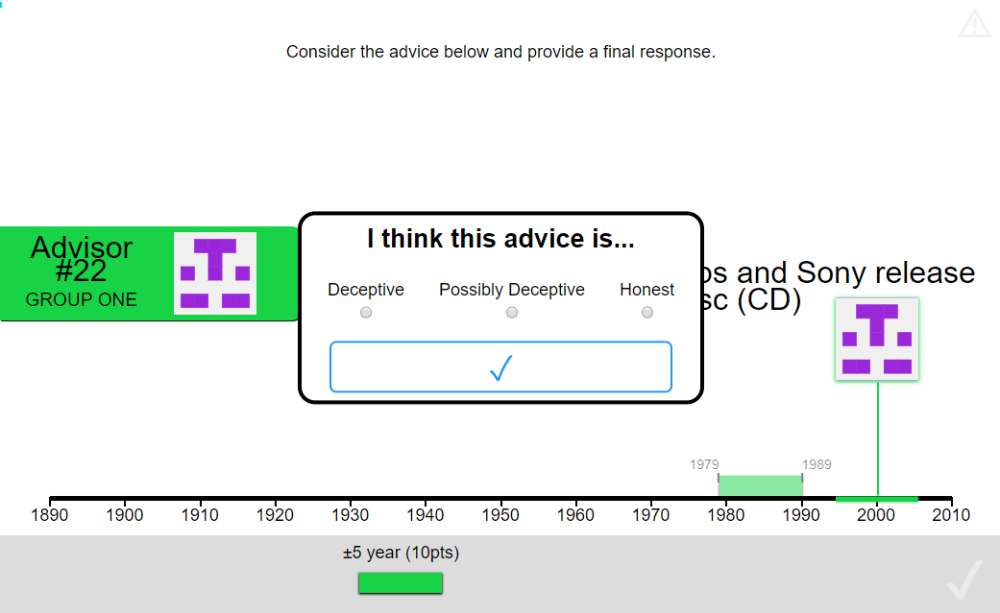

---
output:
  bookdown::pdf_document2:
    template: templates/brief_template.tex
  bookdown::word_document2: default
  bookdown::html_document2: default
documentclass: book
---

```{r setup 02-02, echo = F, include = F}
source('scripts_and_filters/general_setup.R')
```

# Behavioural responses to advice contexts {#chapter-context-benevolence}
\adjustmtc 

<!-- 
Present behavioural experiments in which we show sensitivity to both the advisor and the advice, and discuss the relatively high levels of advice-taking (hard task!), and how the results support the impressions gleaned from the evolutionary models: context matters in advice-taking, and discounting may be a feature of vigilant conservatism (hyperprior for deceit).
-->

## Benevolence of the advisor population

\mccorrect{!TODO[Make sure to report in brief/as post mortem the results for the in/out group studies and the early direct benevolence experiments, and point readers to the full details.]}

The evolutionary models discussed [in the last chapter](#chapter-advice-taking-context) demonstrated that optimal advice-taking strategies depend in part upon the advice one receives being a genuine effort to help.
Difference in benevolence, or the extent to which the interests of the advisor and the judge overlap, have been shown to affect levels of advice-taking.
\mccorrect{!TODO[CITE]} showed that, where advisors were paid contingent upon the quality of the final decision, advice-taking was higher than where advisors were paid a flat fee for providing advice.
\mccorrect{!TODO[lit review stuff - inc.
Behrens/Hunt?
social decision making]}

Advice-taking can be contingent on the properties of the advice, or on the properties of the advisor.
In order to maximise the value of advice while minimising the potential exposure to exploitation, advice-taking should be contingent on a combination of these factors.
Where advice is plausible it should be weighted relatively equally, whether it comes from an advisor who is sometimes misleading or not, but where advice is more implausible it should only be trusted when it comes from an advisor who is never misleading.
To explore whether people's behaviour matches this pattern, participants were recruited for a series of behavioural experiments in which they were given advice on a date estimation task from advisors who were described as either always helpful or occasionally misleading.
Results indicated that participants' advice-taking depended upon both the plausibility of the advice and the benevolence of the advisor, although the specific pattern differed from the one described above.

### Method

#### Procedure

The procedure for these experiments follows the dates estimation task, described [previously](\mccorrect{!TODO[link properly]}).
Additionally, in this version, participants had to provide an assessment of the honesty of each advisory estimate they received before they could integrate it into their final decision.

```{r be-performance, fig.align='center', fig.caption="Advice honesty rating.  Participants rated advice on a three-point scale according to whether they thought the advice was deceptive or honest.", out.width="80%", echo=F}

```

#### Manipulation

Participants performed two blocks of experimental trials.
In one block, participants received advice from an advisor who they were told would 'always try to help', while in the other they received advice from an advisor who 'may sometimes try to mislead'.
The order of advisors was counterbalanced between participants.

The advice offered by the advisors was drawn from equivalent distributions for both advisors, meaning that there were no systematic differences in the quality of the advice.
Both advisors offered advice sampled from a roughly normal distribution around the correct answer with a standard deviation of 11 years.

#### Experiments

There were a series of experiments in this topic during which the experimental design was tweaked in order to find an effective manipulation and operationalisation of the key concepts.
The experimental code for previous versions can be found on the commit history on GitHub for the [main experimental file](https://github.com/oxacclab/ExploringSocialMetacognition/commits/master/ACv2/db.html), as well as its [dependencies](https://github.com/oxacclab/ExploringSocialMetacognition/commits/master/src/modules).
To give a brief overview of the major changes:

* Version 2.0.0

    * introduced a much clearer manipulation
    
        * reminded participants of advisor description in a message they had to acknowledge
        
        * kept participant's group visible throughout
        
        * included a single trial where the misleading advisor did actually mislead the participant
        
* Version 2.1.0

    * removed actual differences in advice and adjusted advisor descriptions to match
    
* Version 3.0.0

    * added a question probing the perceived honesty of the advice between receiving advice and providing a final decision
* Version 3.0.1 

    * [pre-registered](https://osf.io/tu3ev) replication of version 3.0.0
    
    * Deviations from pre-registration:
    
        * Added a new exclusion rule for those people who use translation software.
* Added exclusions for participants with NA values in the in- vs out-group t-test (where e.g.
no outgroup advice was rated as 'honest').
        
        * Included frequentist stats in the trustworthiness questionnaire item t-test.
        
        * Fixed some labels on graphs
        
        * Exploratory analyses expanded to include analysis of trials with WoA > .05
  
Below, only the results from **version 3.0.1** are reported, but the results of this version are compatible with findings of previous versions.
Data for all versions are accessible \mccorrect{!TODO[archive data]}.

### Results

\mccorrect{!TODO[Restructure this code to use the esmData package.
Should be easy...]}  
\mccorrect{!TODO[consistent advisor naming, including in figures]}

```{r load remote data, eval = !(hasName(.Options, 'ESM.skip') && getOption('ESM.skip'))}
library(prettyMD)
library(tidyverse)

set.seed(20190723)
studyVersion <- "3-0-1"
studyName <- "directBenevolence"

overrideMarkerList <- c(11) ## Someone managed to get marker width 8 for one question, not sure how

exclude <- list(
  maxAttnCheckFails = 0, ## pass all attn checks
  maxTrialRT = 60000,    ## trials take < 1 minute
  minTrials = 11,        ## at least 11 trials completed
  minChangeRate = .1,    ## some advice taken on 10%+ of trials
  qqLableWhitelist = c(  ## Advice questionnaire responses must be one of:
    'Deceptive',
    'Possibly Deceptive',
    'Honest'
  ),
  multipleAttempts = T   ## exclude multiple attempts
  ) 

skipLoadData <- F
httpPath <- "http://raw.githubusercontent.com/oxacclab/ExploringSocialMetacognition/master/analysis/ACv2/"

source(paste0(httpPath, "src/02_Exclusions.R"))

## Re-order factor levels for advice ratings
## This helps the graphs present more neatly
AdvisedTrial <- AdvisedTrial %>%
  mutate(advisor0questionnaireHonestyLabel = 
           factor(advisor0questionnaireHonestyLabel, 
                  levels = 
                    levels(advisor0questionnaireHonestyLabel)[c(1, 3, 2)]))
```

#### Exclusions

Participants (total *n* = `r "nrow(exclusions)"`) could be excluded for a number of reasons: failing attention checks, having fewer than 11 trials which took less than 1 minute to complete (one participant), providing final decisions which were the same as the initial estimate on more than 90% of trials, or using non-English labels for the honesty questionnaire (one participant).
The latter exclusion was added after data were collected because it was not anticipated that participants would use translation software in the task.

The final participant list consists of `r "length(unique(AdvisedTrial$pid))"` participants who completed an average of `r "num2str(mean(aggregate(advisor0 ~ pid, AdvisedTrial, length)$advisor0))"` trials each.

#### Task performance

Participants performed as expected, decreasing the error between the midpoint of their answer and the true answer from the initial estimate to the final decision, which suggests that they incorporated the advice, which was indicative of the correct answer.
```{r be-task-performance, fig.align='center', fig.caption="Mean answer error for initial estimates and final decisions.  Faint lines show means for individual participants collapsed across trials, while boxplots, violins, and the heavy dashed line show aggregate participant means.", out.width="80%", echo=F, eval = !(hasName(.Options, 'ESM.skip') && getOption('ESM.skip'))}

tmp <- decisions %>%
  select(pid, decision, responseError) %>%
  group_by(pid, decision) %>%
  summarise(responseError = mean(responseError)) %>%
  pivot_wider(names_from = decision, values_from = responseError) %>%
  mutate(improved = last < first) %>%
  pivot_longer(cols = c(first, last), 
               names_to = "decision", 
               values_to = "responseError")

ggplot(tmp, aes(x = decision, y = responseError)) +
  geom_violin(fill = NA, size = 2) +
  stat_summary(geom = "line", fun.y = mean,
               aes(group = 1, linetype = "mean"), size = 1) +
  geom_line(alpha = .5, aes(group = pid, colour = improved)) + 
  scale_linetype_manual(name = "", values = c("solid")) +
  scale_color_discrete(name = "", labels = c("deteriorated", "improved")) +
  labs(x = "decision", 
       y = "|target - response marker centre| (years)")

```

The advice participants received was subject to variation, but there did not appear to be overall systematic differences between the advisors either in terms of error (distance between the centre of the advice estimate and the correct answer) or distance (distance between the centre of the advice estimate and the centre of the initial estimate).
\mccorrect{!TODO[error and distance graphs]}

#### Hypotheses

The hypotheses tested were that 
* weight on advice would be higher for advice rated as 'honest' versus advice rated as 'deceptive'
* weight on advice would be higher for advisors who were described as 'never misleading', even for advice rated as 'honest'

##### Effect of advice

```{r h2 woa by advice test, results='asis', eval = !(hasName(.Options, 'ESM.skip') && getOption('ESM.skip'))}

tmp <- AdvisedTrial %>%
  dplyr::filter(advisor0questionnaireHonestyLabel %in% 
                  c('Honest', 'Deceptive')) %>%
  group_by(
    pid,
    advisor0questionnaireHonestyLabel
  ) %>%
  summarise(woa = mean(advisor0woa, na.rm = T)) %>%
  ## strip missing cases
  spread(advisor0questionnaireHonestyLabel, woa) %>%
  dplyr::filter_all(all_vars(!is.na(.)))

r <- "\\mccorrect{!TODO[fix ttest]}"
# r <- md.ttest(tmp$Deceptive, tmp$Honest, 
#               c('*M*|deceptive', '*M*|honest'),
#               paired = T)

```

As expected, participants were substantially more influenced by advice they rated as 'honest' compared to advice they rated as 'deceptive' (`r "r"`).

##### Effect of advisor

```{r h1, results='asis', eval = !(hasName(.Options, 'ESM.skip') && getOption('ESM.skip'))}

tmp <- AdvisedTrial %>%
  dplyr::filter(advisor0questionnaireHonestyLabel == 'Honest') %>%
  group_by(pid, advisor0idDescription) %>%
  summarise(woa = mean(advisor0woa)) %>%
  spread(advisor0idDescription, woa) %>%
  dplyr::filter_all(all_vars(!is.na(.)))
  

r <- "\\mccorrect{!TODO[fix ttest]}"
# r <- md.ttest(tmp$inGroup, tmp$outGroup, 
#               c("*M*|inGroup", "*M*|outGroup"), paired = T)

```

Participants were also more influenced by 'honest' advice from the advisor who was described as 'never misleading' (`r "r"`).

\mccorrect{!TODO[plot of woa by advice rating and advisor]}

##### Results plot

The details of the data are best presented in a combined figure.

```{r be-results-plot, fig.align='center', fig.caption="Influence of advice by advisor according to participants\' perception of advice honesty. Faint lines show means for individual participants (missing segments indicate the participant rated no advice from that advisor with the designated category). Violins, box plots, and heavy dashed lines aggregate means for all participants.", out.width="80%", echo=F}

# AdvisedTrial %>%
#   group_by(pid, advisor0idDescription, advisor0questionnaireHonestyLabel) %>%
#   summarise(woa = mean(advisor0woa)) %>% 
#   ggplot(aes(x = advisor0questionnaireHonestyLabel, y = woa)) +
#   geom_violin(colour = NA, alpha = .25, 
#               aes(fill = advisor0questionnaireHonestyLabel)) +
#   geom_boxplot(outlier.colour = NA, fill = NA, 
#                aes(group = advisor0questionnaireHonestyLabel)) +
#   geom_line(alpha = .25, aes(group = pid)) + 
#   stat_summary(geom = "line", fun.y = mean,
#                aes(group = 1, linetype = "mean"), size = 1.5) +
#   scale_y_continuous(limits = c(0, 1)) +
#   scale_fill_discrete(name = "Advice rating") + 
#   scale_linetype_manual(name = "", values = c("dashed")) + 
#   facet_wrap(~advisor0idDescription) +
#   labs(x = 'Advice Honesty Rating',
#        y = 'Weight on Advice') +
#   theme(
#     legend.position = "top"
#   )

```

The figure shows that there is a different pattern in the responses to advice across advice ratings depending upon the advisor supplying the advice.
Advice perceived as not being honest is discounted relatively equally from the advisor described as 'always helpful', and is still fairly influential in the final decision.
The advice perceived as 'honest' from this advisor is the most influential of all advice.
Likewise, the 'honest' advice from the advisor described as 'sometimes-misleading' is more influential than the 'possibly deceptive' advice, which is in turn more influential than the 'deceptive' advice.
The 'deceptive' advice from the 'sometimes-misleading' advisor is almost completely ignored.
Within this broader pattern there is some variability between participants, including some participants whose responses violate the pattern quite dramatically - note the two participants with large decreases in influence for 'honest' advice from the 'sometimes-misleading' advisor as compared to the 'possibly deceptive' advice from the same.
This may be a consequence of participants' values in each cell in the design being comprised of a low number of trials.
#### Exploration

\mccorrect{!TODO[below]}
* were participants' criteria for judging advice as dishonest different between advisors?
* Type 1 SDT might be able to do this if a sensible definition of objectively-deceptive advice can be produced
    
        * E.g.
whether averaging with the advice would reduce error
        
        * There will be all sorts of problems with this, noteably it'll classify 'never deceptive' advisor as sometimes deceptive
        
    * May be able to investigate this with probabilities of classification for several distance bins - ROC type curve
    
        * what to do with 'possibly deceptive'?
  
### Discussion

* Both the source and the plausibility of advice matter, and they seem to interact in a complex way.
* Flexible adaptation to advice context, both in terms of categorisation and influence.

* Support for the premise of the evolutionary simulations.

    * Does not prove people actually do have these hyperpriors

#### Limitations

* N

* No gender breakdown

    * simplicity/privacy vs data gap
    
* Difficult task (high levels of advice-taking by default)

## Noise in the advice

The [second scenario](#models-scenario-2) explored in the evolutionary models added noise to the advice agents received and demonstrated that this provided an evolutionary pressure towards egocentric discounting.
This scenario is not explored in behavioural experiments because its conclusions are well supported by existing literature.
Specifically, the literature demonstrates that the normativity of discounting where the judge outperforms the advisor, that advice-taking is sensitive to advisor expertise, and that people are likely to consider themselves superior to the average advisor.

The addition of noise in a point-value estimation task lowers the relative performance, and thus this scenario was essentially a manipulation of advisor expertise.
Normative models support egocentric discounting where the judge is systematically more accurate than the advisor \mccorrect{!TODO[PAR model paper, early advice-taking theory papers]}.
The decrease in advice-taking for novice as opposed to expert advisors is a robust result in the literature: \mccorrect{!TODO[expertise manipulation experiment lit review]}.
The evidence above makes an empirical investigation on this point somewhat redundant, provided it can be shown that people have a naive assumption of superiority on a given task compared to the average other they are likely to encounter.
This point is also well supported in the literature on self-serving biases \mccorrect{!TODO[describe driving self-assessment, naive realism?, etc.]}.
It is expected that this is somewhat dependent upon the difficulty of the task presented; people faced with a difficult task will under- rather than overestimate their ability relative to others \mccorrect{!TODO[hard-easy effect of advice]}.
Taken together, the above arguments demonstrate that, on average, people are likely to consider themselves more able on a given task than an arbitrary advisor, and consequently that they are likely to downweight advice relative to their own initial estimate.
This behaviour is supported by normative mathematical models which show biasing towards the better estimator (in this case the judge) is the optimal strategy.
As discussed in the scenario, the belief that one is better at a task than the average advisor may not be misguided: advisors may not dedicate the same amount of time, concentration, or thought to producing advice as judges do for initial estimates.
Judges have to live with the consequences of their decisions, while advisors do not.
## Confidence mapping

The [third scenario](#models-scenario-3) explored in the evolutionary models assigned each agent a confidence mapping, and demonstrated that discounting emerged as an appropriate response where the advisor's confidence mapping was unknown.
The key difficulty in conducting behavioural experiments to test the effects of known vs unknown confidence mapping is finding a manipulation of confidence mapping knowledge which is not confounded by familiarity with an advisor or the amount of information provided by an advisor.
We train people in two contexts, in both of which they receive advice with confidence from one of two advisors and see feedback on their final answers.
In the first context, all the advice is well calibrated, and both advisors use either high or low confidence distributions.
In the second context, one advisor uses a high and the other a low confidence distribution.
Participants are then tested with a brief exposure to an advisor whose confidence distribution is drawn from the middle of the scale.
Where participants are unprepared for different confidence mappings (the first context), they will treat the new advisor like the old advisors - considering the advice as high- or low-confidence (and weighting it accordingly) depending on whether it is high or low for the advisors' distributions.
Where participants are prepared for different confidence mappings (the second context), they will treat the new advice as medium confidence, and weight it accordingly.
There will be a difference in the weight on advice in the probe trials between contexts: WoA will be highest where both training advisors have a low-confidence distribution, middling where they have different distributions, and lowest where they both have a high-confidence distribution.

### Individuality as a cue to confidence

#### Method

#### Results

### Identifiability of advice

#### Method

#### Results

## General discussion

The results of the direct benevolence experiments show that people are sensitive to the motivations of their advisors, and exercise appropriate caution where those motivations may mean the advice is misleading.
They also demonstrate that, even where advice is considered trustworthy, it is discounted when coming from a less trusted advisor.
Together with existing literature on the effects of advisor expertise, this supports the idea from the models that advice-taking can be fleixbly adjusted according to the context.
The results of the confidence mapping experiments were less conclusive.
We were unable to produce a manipulation which was sufficiently clear and strong to produce observable effects.
It is plausible that people are sensitive to their knowledge of an advisor's confidence mapping, but it is also plausible that this degree of flexibility is beyond most people, and that simple heuristics (e.g.
relying on cultural norms about the meanings of metacognitive terms \mccorrect{!TODO[cite Bang, Heyes, et al.
on cultural metacognition]}) are used instead of complex calculations.
The lack of flexibility on the timescale of a behavioural experiment does not, of course, negate the possibility of flexibility on the timescale of a human interpersonal relationship (perhaps there are a certain number of people whose confidence mappings we can track, a la Dunbar's number).
Nor does it negate the possibility of an evolutionary or cultural-evolutionary mechanism baking in advice discounting as a protection against unknown confidence mapping, although it is questionable whether advice has been occuring in human societies for long enough to allow the former to take place.
We have a plausbile explanation of egocentric which only relies on rational responses to environmental effects.
These effects are ubiquitous, and thus a ubiquitous egocentric bias prior to engaging with the specifics of a situation makes sense.
It is entirely plausible that experiments showing egocentric discounting behaviour fail to overcome the hyperpriors held by participants that taking advice is risky for various reasons.

We saw in the previous section that people are sensitive to the quality of advice and advisors, and will curate their information environments based on that sensitivity.
We have seen in this section how the properties of the information environment can change people's sensitivity to advice.
\mccorrect{!TODO[If we have time, it'd be neat to see if we can get people's selection rates for advisors to recover after the advisors have been lying to them, showing that that how we curate information environment (source selection) also depends on the existing information environment properties.]}

\mccorrect{!TODO[This theory really doesn't explain combining multiple estimates with one's own. How important is that failure? Do other theories explain that feature?]}
