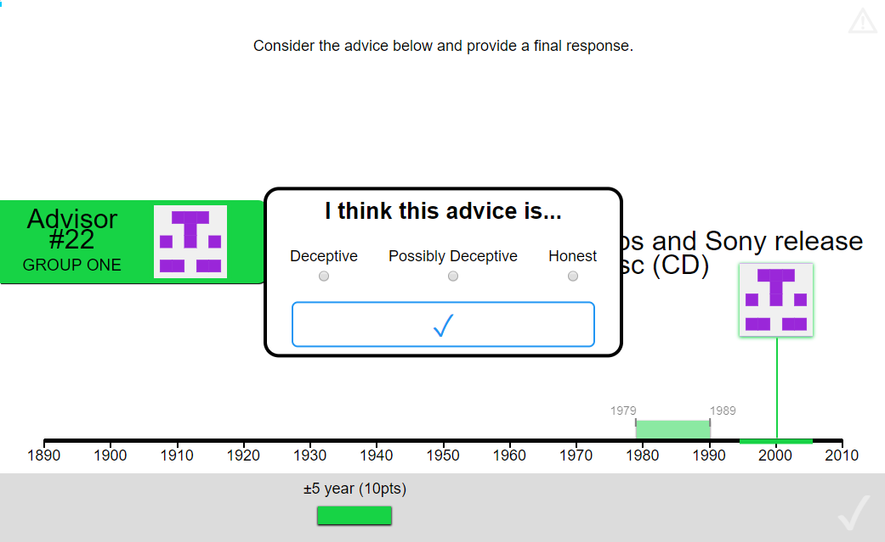
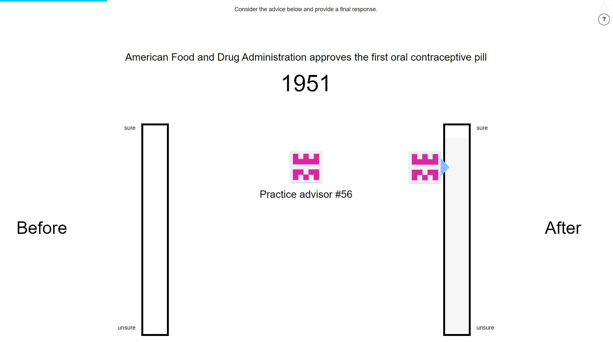

---
output:
  bookdown::pdf_document2:
    template: templates/brief_template.tex
  bookdown::word_document2: default
  bookdown::html_document2: default
documentclass: book
---

```{r setup 02-02, echo = F, include = F}
source('scripts_and_filters/general_setup.R')
library(BayesFactor)
library(ez)
library(magrittr) # for %$% exploding pipe operator
library(patchwork)
library(lmerTest)
```

# Behavioural responses to advice contexts {#chapter-context-benevolence}
\adjustmtc 

<!-- 
Present behavioural experiments in which we show sensitivity to both the advisor and the advice, and discuss the relatively high levels of advice-taking (hard task!), and how the results support the impressions gleaned from the evolutionary models: context matters in advice-taking, and discounting may be a feature of vigilant conservatism (hyperprior for deceit).
-->

## Experiment 5: Benevolence of the advisor population {#be-db}

```{r be-db-load, eval = !(hasName(.Options, 'ESM.skip') && getOption('ESM.skip')), include = F}

select_experiment(
  project = 'datequiz',
  function(x) filter(x, study == 'directBenevolence', version == 'v3-0-1')
)

# Version of which the analysed version is a replication
.prevStudy <- new.env()
select_experiment(
  'datequiz', 
  function(x) filter(x, study == 'directBenevolence', version == 'v3-0-0'), 
  envir = .prevStudy
)

for (E in c(.GlobalEnv, .prevStudy)) {
  E$AdvisedTrial <- annotate_responses(E$AdvisedTrial)
  E$Trial <- annotate_responses(E$Trial)
}

```

\mccorrect{!TODO[Make sure to report in brief/as post mortem the results for the in/out group studies and the early direct benevolence experiments, and point readers to the full details.]}

The evolutionary models discussed [in the last chapter](#chapter-advice-taking-context) demonstrated that optimal advice-taking strategies depend in part upon the advice one receives being a genuine effort to help.
Difference in benevolence, or the extent to which the interests of the advisor and the judge overlap, have been shown to affect levels of advice-taking.
\mccorrect{!TODO[CITE]} showed that, where advisors were paid contingent upon the quality of the final decision, advice-taking was higher than where advisors were paid a flat fee for providing advice.
\mccorrect{!TODO[lit review stuff - inc. Behrens/Hunt? social decision making]}

Advice-taking can be contingent on the properties of the advice, or on the properties of the advisor.
In order to maximise the value of advice while minimising the potential exposure to exploitation, advice-taking should be contingent on a combination of these factors.
Where advice is plausible it should be weighted relatively equally, whether it comes from an advisor who is sometimes misleading or not, but where advice is more implausible it should only be trusted when it comes from an advisor who is never misleading.
To explore whether people's behaviour matches this pattern, participants were recruited for a series of behavioural experiments in which they were given advice on a date estimation task from advisors who were described as either always helpful or occasionally misleading.

We expected that advisor influence would be higher for advice that participants rated as 'honest' versus advice rated as 'deceptive'.
Likewise, we expected that influence would be higher for advisors who were described as 'always honest', even for advice rated as 'honest'.
In other words, we expect that participants' advice-taking depends upon both the plausibility of the advice and the benevolence of the advisor.

#### Open scholarship practices

This experiment was preregistered at `r unique(datequiz$preregistration)`.
The experiment data are available in the `esmData::` package for R from \mccorrect{!TODO[Zenodo esmData]}, and also directly from \mccorrect{!TODO[OSFify Dates task data]}.
A snapshot of the state of the code for running the experiment at the time the experiment was run can be obtained from https://github.com/oxacclab/ExploringSocialMetacognition/blob/b4289fea196f71ccf0ba0b2ae8fde12139a16301/ACv2/db.html.

This is a replication of a study of identical design that produced the same results. 
The data for the original study can be obtained from the `esmData::` R package or from \mccorrect{!TODO[OSFify]}.

There were a number of deviations from the preregistered analysis in this Experiment.
Several participants used translation software to translate the experiment website. 
We could not guarantee that the questions were accurately translated and so these participants were excluded.
Some participants never rated the Sometimes deceptive advisor's advice as 'honest', and so they were excluded in the t-test comparing advisors.

### Method {#be-db-m}

```{r be-db-m-structure}

tmp <- bind_rows(
  mutate(practiceTrial, type = "practice", block = 0),
  mutate(practiceAdvisedTrial, type = "advice_practice", block = 1),
  mutate(Trial, type = "atn_check") %>% filter(!is.na(block)),
  mutate(AdvisedTrial, type = "core") %>% filter(!is.na(block))
) %>%
  group_by(pid, type, block) %>%
  summarise(n = n(), .groups = "drop") %>%
  group_by(type, block) %>%
  summarise(across(-pid, mean), .groups = "drop") %>%
  arrange(block)

```

#### Procedure

`r length(unique(AdvisedTrial$pid))` participants each completed `r round(sum(ceiling(tmp$n)))` trials over `r max(tmp$block)` blocks of the continuous version of the Dates task§\@ref(m-p-dates-c).
On each trial, participants were presented with an historical event that occurred on a specific year between 1900 and 2000.
They were asked to drag a marker onto a timeline to indicate the date range within which they thought the event occurred.
The markers covered `r AdvisedTrial %>% filter(!is.na(responseMarkerWidth)) %>% pull(responseMarkerWidth) %>% unique()` years, meaning that it would cover an entire decade inclusively, e.g. 1965-1975.
Participants then received advice indicating a region of the timeline in which the advisor suggested the event occurred, and rated the honesty of the advice on a three-point scale (Figure \@ref(fig:be-db-m-performance)).
Participants could then mark a final response in the same manner as their original response, and could choose a different marker width if they wished.

```{r be-db-m-performance, fig.align='center', fig.caption="Advice honesty rating.  Participants rated advice on a three-point scale according to whether they thought the advice was deceptive or honest.", out.width="80%", echo=F}

```

Participants started with `r sum(tmp$type == "practice")` block of `r tmp %>% filter(type == "practice") %>% pull(n) %>% ceiling()` trials that contained no advice to allow them to familiarise themselves with the task.
All trials in this section included feedback for all participants indicating whether or not the participant's response was correct.

Participants then did `r tmp %>% filter(type == "advice_practice") %>% pull(n) %>% round()` trials with a practice advisor to get used to receiving advice.
They also received feedback on these trials.
They were informed that they would "get advice on the answers you give" and that the feedback they received would "tell you about how well the advisor does, as well as how well you do".
Before starting the main experiment they were told that they would receive advice from multiple advisors and that "advisors might behave in different ways, and it's up to you to decide how useful you think each advisor is, and to use their advice accordingly".

Participants then performed `r sum(tmp$type == "core")` blocks of trials that constituted the main experiment.
In each of these blocks participants had a single advisor for `r tmp %>% filter(block == 2, type == "core") %>% pull(n) %>% round()` trials, plus `r tmp %>% filter(block == 2, type == "atn_check") %>% pull(n) %>% round()` attention check.
No feedback was given on answers in the main experiment blocks.

The two advisors were identical in how they generated advice, but they were labelled differently.
The advisors had different colours, and participants were told that the advisor who matched the participant's colour "will give you the **best advice that they can**", while the advisor who did not match the participant's colour "might sometimes try to direct you **away from the correct answer**".
Colours and the order in which the advisors were encountered were counterbalanced.

#### Advice profiles

Despite differences in labelling, the advisors were identical in terms of how they actually produced advice.
The advisors offered advice by placing an `r AdvisedTrial %>% filter(!is.na(advisor0confidence)) %>% pull(advisor0confidence) %>% unique()`-year wide marker on the timeline.
The marker was placed with its centre on a point sampled from a roughly normal distribution around the correct answer with a standard deviation of `r AdvisedTrial %>% filter(!is.na(advisor0confidenceVariation)) %>% pull(advisor0confidenceVariation) %>% unique()` years.

### Results

##### Exclusions

```{r be-db-exclusions}

nMaxOutliers <- 1
maxTrialRT <- 60000
qqLabelWhitelist = c(  ## Advice questionnaire responses must be one of:
  'Deceptive',
  'Possibly Deceptive',
  'Honest',
  NA
)
minChangeRate = .1     ## some advice taken on 10%+ of trials

for (E in c(.GlobalEnv, .prevStudy)) {
  E$exclusions <- E$AdvisedTrial %>% 
    nest(d = -pid) %>%
    mutate(
      atn_check = map_lgl(
        pid, 
        ~ !all(E$Trial$responseCorrect[E$Trial$pid == .]) |
          any(E$Trial$responseMarkerWidth[E$Trial$pid == .] != 11)
      ),
      `Attention check` = if_else(is.na(atn_check), T, atn_check),
      `Multiple attempts` = map_lgl(
        pid,
        ~ {
          h <- unique(E$AdvisedTrial$pidHash[E$AdvisedTrial$pid == .])
          p <- unique(E$AdvisedTrial$pid[E$AdvisedTrial$pidHash == h])
          length(p) > 1
        }
      ),
      `Missing advice rating` = map_lgl(
        d,
        ~ any(is.na(.$advisor0questionnaireHonestyLabel))
      ),
      `Odd advice rating labels` = map_lgl(
        d,
        ~ !all(.$advisor0questionnaireHonestyLabel %in% qqLabelWhitelist)
      ),
      `Not enough changes` = map_lgl(
        d,
        ~ {
          diff <- mutate(
            .,
            diff = responseEstimateLeft != responseEstimateLeftFinal,
            diff = if_else(is.na(diff), F, diff)
          ) %>%
            pull(diff) %>% 
            mean() 
          diff < minChangeRate
        }
      )
    ) %>% 
  select(-atn_check, -d)
  
  do_exclusions(E$exclusions, envir = E)
  
  E$nMaxTrials <- E$AdvisedTrial %>% 
    group_by(pid) %>% 
    summarise(n = n(), .groups = 'drop') %>% 
    pull(n) %>% 
    max()
  
  E$AdvisedTrial <- E$AdvisedTrial %>% filter(timeEnd < maxTrialRT)

  E$exclusions <- E$exclusions %>% 
    mutate(
      `Too many outlying trials` = 
        map_lgl(pid, ~ E$AdvisedTrial %>% 
                  filter(pid == .x) %>%
                  summarise(n = n(), .groups = 'drop') %>% 
                  pull(n) < (E$nMaxTrials - nMaxOutliers)),
      # if participants were already dropped don't mark them here
      `Too many outlying trials` = if_else(!(pid %in% E$AdvisedTrial$pid),
                                           F, `Too many outlying trials`)
    )

  do_exclusions(E$exclusions, envir = E, backup = F)
}

```

Participants (total *n* = `r nrow(exclusions)`) could be excluded for a number of reasons: failing attention checks, having fewer than `r nMaxTrials - nMaxOutliers` trials which took less than `r maxTrialRT / 1000`s to complete, providing final decisions which were the same as the initial estimate on more than `r round((1 - minChangeRate) * 100)`% of trials, or using non-English labels for the honesty questionnaire.
The latter exclusion was added after data were collected because it was not anticipated that participants would use translation software in the task.
The numbers of participants who failed the various checks are detailed in Table \@ref(tab:be-db-exclusions).

The final participant list consists of `r length(unique(AdvisedTrial$pid))` participants who completed an average of `r num2str(mean(aggregate(advisor0 ~ pid, AdvisedTrial, length)$advisor0))` trials each.

```{r be-db-r-exclusion-table}

exclusions$`Total excluded` <- exclusions %>% select(-pid) %>% apply(1, any)
n <- ncol(exclusions)
exclusions %>% 
  summarise(across(where(is.logical), sum)) %>%
  mutate(`Total remaining` = length(unique(AdvisedTrial$pid))) %>% 
  pivot_longer(everything(), names_to = "Reason", values_to = "Participants excluded") %>%
  kable(caption = "\\label{tab:be-db-exclusions}Participant exclusions for Experiment 5") %>%
  row_spec((n - 1):n, bold = T)

```

##### Task performance

```{r be-db-r-split}

for (E in c(.GlobalEnv, .prevStudy)) {
  
  fb <- E$AdvisedTrial %>% 
    group_by(pid) %>%
    summarise(Feedback = !all(is.na(timeFeedbackOn))) %>%
    mutate(Feedback = if_else(Feedback == 1, "Feedback", "No feedback"))
  
  tmp <- E$AdvisedTrial %>%
    left_join(fb, by = "pid") %>%
    filter(!is.na(advisor0idDescription)) %>%
    mutate(
      Advisor = advisor_description_name(advisor0idDescription),
      Advisor = factor(Advisor),
      responseCentre = responseEstimateLeft + (responseMarkerWidth / 2),
      Rating = factor(
        advisor0questionnaireHonestyLabel
      ),
      Rating = fct_relevel(
        Rating, 
        "Deceptive",
        "Possibly Deceptive", 
        "Honest"
      )
    ) %>%
    order_factors()
  
  E$Familiarization <- tmp
}

```

```{r be-db-r-performance, fig.caption="Task performance for Experiment 5.  A: Response error.  Faint lines show individual participant mean error (the absolute difference between the participant's response and the correct answer), for which the violin and box plots show the distributions. The dashed line indicates chance performance. Dotted violin outlines show the distribution of participant means on the original study which this is a replication. The dependent variable here is error, the distance between the correct answer and the participant's answer, and consequently lower values represent better performance. The theoretical limit for error is around 100."}

gg <- list()

# Task performance figure
dw <- .2

# Accuracy
for (E in c(.GlobalEnv, .prevStudy))
  E$tmp <- E$Familiarization %>% 
  group_by(Advisor, pid) %>%
  summarise(
    `Initial estimate` = mean(responseError),
    `Final decision` = mean(responseErrorFinal),
    .groups = 'drop'
  ) %>%
  pivot_longer(cols = c(`Initial estimate`, `Final decision`), 
               names_to = 'Response', values_to = 'Error') %>%
  mutate(advisor = Advisor,
         Advisor = factor(paste0(Advisor, '\n'))) %>%
  mutate(Response = factor(Response)) %>%
  order_factors()

bf <- tmp %>% 
  nest(d = -Advisor) %>%
  mutate(d = map(d, as.data.frame),
    bf = map(d, ~ ttestBF(x = .$Error[.$Response == 'Initial estimate'],
                          y = .$Error[.$Response == 'Final decision'], 
                          data = ., paired = T)),
         bf = map_chr(bf, ~ .@bayesFactor %>% .$bf %>% exp() %>% bf2str())) %>%
  select(-d)

gg$acc <- tmp %>%
  ggplot(aes(x = Response, y = Error, colour = advisor)) +
  scale_y_continuous(limits = c(0, 50), expand = c(0, 0)) +
  scale_x_discrete() +
  scale_colour_discrete(name = 'Advisor', aesthetics = c('fill', 'colour')) +
  coord_cartesian(clip = F) +
  geom_line(aes(group = pid), alpha = .25) +
  geom_split_violin(aes(x = nudge(Response, dw), 
                        group = Response, fill = advisor), 
                    width = .9, colour = NA) +
  geom_split_violin(aes(x = nudge(Response, dw), group = Response), 
                    fill = NA, width = .9, colour = 'black', linetype = 'dashed', 
                    data = .prevStudy$tmp) +
  geom_boxplot(aes(x = nudge(Response, dw), group = Response),
               outlier.shape = NA, size = 1, width = dw/2, colour = 'black') +
  geom_segment(x = 1 - dw, xend = 2 + dw, y = 50, yend = 50, 
               colour = 'black') +
  geom_label(aes(label = paste0('BF = ', bf)), 
             x = 1.5, y = 50, colour = 'black', data = bf) +
  facet_wrap(~Advisor) +
  labs(y = 'Mean error') +
  broken_axis_top

# Confidence
dw <- .4

for (E in c(.GlobalEnv, .prevStudy)) 
  E$tmp <- E$Familiarization %>% 
  mutate(
    `Initial error` = responseError,
    `Initial width` = responseMarkerWidth,
    `Final error` = responseErrorFinal,
    `Final width` = responseMarkerWidthFinal
  ) %>%
  pivot_longer(cols = c(starts_with('Initial'), starts_with('Final')), 
               names_to = c('Response', '.value'), 
               names_pattern = '(\\w+) (\\w+)') %>%
  group_by(pid, Response, width) %>%
  summarise(Error = mean(error), .groups = 'drop') %>%
  mutate(response = paste0(Response, '\n'),
         response = factor(response),
         Response = factor(Response),
         `Marker width` = factor(width)) %>%
  order_factors() 

# Patchwork plots together
gg$acc

```

```{r be-db-r-aov}

# Accuracy
tmp <- Familiarization %>%
  mutate(Initial = responseError, Final = responseErrorFinal) %>%
  pivot_longer(c(Initial, Final), names_to = "Decision", values_to = "Error") %>%
  select(pid, Error, Decision, Advisor) %>%
  mutate(across(-Error, factor)) %>%
  group_by(pid, Decision, Advisor) %>%
  summarise(Error = mean(Error), .groups = "drop")

aov_acc <- tmp %>%
  ezANOVA(
    dv = Error, 
    wid = pid,
    within = c(Decision, Advisor)
  )

mm_acc <- tmp %>% 
  mutate(Decision = fct_rev(Decision)) %>%
  marginalMeans(Error, pid, "Reduction")

message(glue("Interaction calculation: {mm_acc$.interactionExpression}"))

s_acc <- summariseANOVA(aov_acc$ANOVA, mm_acc)

```

Participants performed as expected, decreasing the error between the midpoint of their answer and the true answer from the initial estimate to the final decision (`r s_acc$s[1]`), which suggests that they incorporated the advice, which was indicative of the correct answer.
The participants had less error on decisions made with the Always honest advisor than the Sometimes deceptive advisor (`r s_acc$s[2]`), although surprisingly there was no evidence that this was due to greater reduction in error scores over time for that advisor (`r s_acc$s[3]`).

Participants only had one marker they could place, and separate confidence judgements were not asked for, so we cannot directly assess confidence in these data.

##### Advisor performance

```{r be-db-r-advisor-performance}

tmp <- Familiarization %>%
  group_by(pid, Advisor) %>%
  summarise(
    Error = mean(advisor0Error),
    Distance = mean(abs(advisor0adviceCentre - responseCentre)),
    .groups = "drop"
  )

tt <- tmp %>%
  pivot_longer(c(Error, Distance), names_to = "Dimension") %>%
  pivot_wider(names_from = Advisor) %>%
  nest(d = -Dimension) %>%
  mutate(
    s = map_chr(
      d, 
      ~ md.ttestBF(
        .$`Always honest`, 
        .$`Sometimes deceptive`,
        labels = c("M~AlwaysHonest~", "M~SometimesDeceptive~"),
        paired = T
      )
    )
  )

```

The advice given by the advisors was generated stochastically from the same distribution.
Any differences will be random.
This was demonstrably the case in the domain of advice error (absolute distance between the centre of the advice marker and the correct year; `r tt$s[1]`).
The Bayes' Factor for the domain of agreement -- the absolute distance between the centre of the advice marker and the centre of the participant's initial estimate marker -- was essentially on the threshold (`r tt$s[2]`).

##### Advice ratings

```{r be-db-r-advice-ratings, fig.caption="Advice rating in Experiment 5.  The polar plots show the number of times each participant gave the given rating to the advice of each advisor. The colour density illustrates the number of participants who gave at least that many ratings to the advice of an advisor."}

axes <- crossing(
  Advisor = c("Always honest", "Sometimes deceptive"),
  x = c(1.5, 2.5, 3.5),
  y = c(3, 6)
)

suppressWarnings(
  Familiarization %>%
    mutate(
      Rating = Rating,
      Rating = fct_rev(Rating)
    ) %>%
    ggplot(aes(x = Rating, fill = Advisor)) +
    # data
    geom_histogram(
      aes(group = pid, colour = Advisor), 
      stat = "count", 
      position = "identity", 
      alpha = .1
    ) +
    # axis
    geom_vline(aes(xintercept = x), data = axes) +
    geom_label(
      aes(x = x, y = y, label = y), 
      label.size = 0,
      label.r = unit(.5, "lines"),
      fill = "white",
      data = axes
    ) +
    coord_polar() +
    facet_wrap(~Advisor) +
    theme(
      axis.line = element_blank(),
      axis.ticks = element_blank(),
      axis.text.y.left = element_blank(),
      axis.title = element_blank()
    )
)

# Stats
tmp <- table(Familiarization$Advisor, Familiarization$Rating) 

chi <- chisq.test(tmp)
bf <- contingencyTableBF(
  tmp, 
  sampleType = "indepMulti", 
  fixedMargin = "rows"
)
r <- apply(tmp, 2, \(x) x[1]/x[2])

s_r <- sapply(1:length(r), \(i) paste(names(r)[i], num2str(r[i]))) %>%
  paste(collapse = ", ")
s <- glue("({chi$parameter})={num2str(chi$statistic)}, p={prop2str(chi$p.value)}, BF={bf2str(exp(bf@bayesFactor$bf))}; AlwaysHonest:SometimesDeceptive ratio: {s_r}")

```

The advisors' advice was rated differently by the participants, as shown in Figure \@ref(fig:be-db-r-advice-ratings) ($\chi^2$`r s`).
This indicates that participants understood the task and that the manipulation worked as intended, with more suspicion applied to the advice from the Sometimes deceptive advisor.

##### \OpenScience{prereg} Effect of advice

```{r be-db-r-advice, results='asis', eval = !(hasName(.Options, 'ESM.skip') && getOption('ESM.skip'))}

# Actual test
x <- Familiarization %>% 
  select(
    pid, 
    advisor0WOA,
    Rating = Rating
  ) %>%
  # filter(Rating %in% c("Deceptive", "Honest")) %>%
  group_by(pid, Rating) %>%
  summarise(advisor0WOA = mean(advisor0WOA), .groups = "drop") %>%
  pivot_wider(names_from = Rating, values_from = advisor0WOA) %>%
  drop_na(-pid) %>%
  pivot_longer(-pid, names_to = "Rating", values_to = "WOA") %>%
  mutate(across(-WOA, factor))

aov_advice <- ezANOVA(x, WOA, pid, Rating)

mm_advice <- marginalMeans(x, WOA, pid)

s_advice <- summariseANOVA(aov_advice, mm_advice)

```

Participants chose their own ratings for the advice, and it was common for participants not to use all ratings for all advisors (e.g. many participants never rated advice from the Always honest advisor as Deceptive).
This meant that the statistical tests preregistered for this hypothesis were broken down into separate contrasts of advice and advisor. 
Using a more complete test, such as 2x3 ANOVA, would have suffered greatly from missing values.

To explore the effect of advice, a 1x3 ANOVA was run on weight on advice across ratings. 
In all, `r length(unique(x$pid))`/`r length(unique(Familiarization$pid))` (`r num2str(length(unique(x$pid)) / length(unique(Familiarization$pid)) * 100)`%) participants had at least one trial rated with each of the three ratings.
The weight on advice differed according to the rating assigned the advice (`r `s_advice$s[1]`; Mauchly's test for Sphericity W=`r prop2str(aov_advice[["Mauchly's Test for Sphericity"]][2][[1]])`, p=`r prop2str(aov_advice[["Mauchly's Test for Sphericity"]][3][[1]])`).
As expected, participants were more influenced by advice they rated as Honest compared to advice they rated as Deceptive.

##### \OpenScience{prereg} Effect of advisor

```{r be-db-r-advisor, fig.caption="Weight on Advice in Experiment 5.  Shows the weight of the advice of the advisors. Only trials where the participant rated the advice as Honest are included. The shaded area and boxplots indicate the distribution of the individual participants' mean weight on advice. Individual means for each participant are shown with lines in the centre of the graph. The dashed outline shows the distribution of participant means in the original study of which this is a replication."}
for (E in c(.GlobalEnv, .prevStudy)) {
  E$tmp <- E$Familiarization %>% 
    filter(Rating == "Honest") %>%
    group_by(pid, Advisor) %>%
    summarise(WOA = mean(advisor0WOA), .groups = "drop") %>%
    pivot_wider(names_from = Advisor, values_from = WOA)
  
  # Stats
  E$.T <- E$tmp %>%
    drop_na(-pid) %$%
    md.ttest(
      `Always honest`, 
      `Sometimes deceptive`, 
      paired = T,
      labels = c("M~AlwaysHonest~", "M~SometimesDeceptive~")
    )
  
  # Graph stats
  E$bf <- E$tmp %>%
    drop_na(-pid) %$%
    ttestBF(
      `Always honest`, 
      `Sometimes deceptive`, 
      paired = T
    )
  
  E$lost <- nrow(E$tmp) - nrow(drop_na(E$tmp, -pid))
  
  E$tmp <- E$tmp %>% 
    pivot_longer(-pid, names_to = "Advisor", values_to = "WOA") %>%
    mutate(Feedback = "No feedback")
}

bf <- bf2str(exp(bf@bayesFactor$bf))

# Graph
dw <- .1

tmp %>% 
  drop_na(everything()) %>%
  ggplot(aes(x = Advisor, y = WOA, fill = Feedback, colour = Feedback)) +
  geom_line(aes(group = pid), alpha = .25) +
  geom_split_violin(aes(x = nudge(Advisor, dw),
                        group = Advisor), width = .9,
               colour = NA) +
  geom_split_violin(aes(x = nudge(Advisor, dw),
                        group = Advisor,
                        fill = Feedback), 
                    colour = 'black', alpha = 0, width = .9, 
                    linetype = 'dashed', size = 1,
                    data = .prevStudy$tmp) +
  geom_boxplot(outlier.shape = NA, size = 1, width = dw/2,
               aes(x = nudge(Advisor, dw), 
                   group = Advisor),
               colour = 'black') +
  geom_segment(x = 1, xend = 2, y = 1, yend = 1, colour = 'black') +
  geom_label(y = 1, x = 1.5, colour = 'black', fill = 'white',
             label = paste0('BF = ', bf)) +
  scale_y_continuous(limits = c(0, 1),
                     breaks = seq(0, 1, length.out = 6),
                     expand = expansion(add = c(0, 0.1))) +
  scale_fill_hue(direction = -1, aesthetics = c('fill', 'colour')) +
  facet_grid(~Feedback) +
  labs(x = 'Advisor advice profile', y = 'Weight of "Honest" advice') 

```

To distinguish the effects of the advisor from the effects of the advice, we compared weight on advice for only those trials where the participant rated the advice as Honest. 
This approach has the limitation that `r lost` (`r num2str(lost / length(unique(Familiarization$pid)) * 100)`%) participants had to be dropped due to never rating advice from the Sometimes deceptive advisor as Honest.

Comparing the two (Figure \@ref(fig:be-db-r-advisor)) showed that participants placed more weight on the Honest advice from the Always honest advisor (`r .T`).

#### Exploration

```{r be-db-r-overall, fig.caption="Advice response in Experiment 5.  Scatter plot of advice distance and advice influence. The dashed line shows x = y. Colours represent different advice ratings. Dots represent individual trials, and lines show the pattern within each rating."} 

tmp <- Familiarization %>%
  mutate(
    Distance = abs(responseCentre - advisor0adviceCentre),
    pid = factor(pid)
  )

tmp %>% 
  ggplot(aes(x = Distance, y = advisor0Influence, colour = Rating)) +
  geom_abline(slope = 1, intercept = 0, linetype = "dashed") +
  geom_smooth(method = "lm", formula = y ~ x, se = F) +
  geom_point(alpha = 1/3) +
  coord_fixed() +
  scale_x_continuous(limits = c(min(tmp$advisor0Influence), NA)) +
  scale_y_continuous(limits = c(min(tmp$advisor0Influence), NA)) +
  facet_wrap(~Advisor) +
  labs(y = "Influence of advice") +
  broken_axis_top +
  broken_axis_right

m <- tmp %>%
  mutate(Rating = fct_rev(Rating)) %$%
  lmer(advisor0Influence ~ Advisor * Distance * Rating + (1|pid), data = .)

x <- m %>% summary()
coefs <- cbind(
  x$coefficients,
  suppressMessages(confint(m))[-(1:2),]
) %>% 
  as_tibble(rownames = "Effect") %>%
  rowid_to_column("beta") %>%
  mutate(
    beta = beta - 1,
    across(c(Estimate:last_col(), -`Pr(>|t|)`), num2str),
    `Pr(>|t|)` = prop2str(`Pr(>|t|)`, minPrefix = "<"),
    s = glue(
      "{Estimate} [{`2.5 %`}, {`97.5 %`}], df={df}, p={`Pr(>|t|)`}"
    )
  )

BF <- tmp %>%
  mutate(
    rpd = Rating == "Possibly Deceptive",
    rd = Rating == "Deceptive",
    A = Advisor == "Sometimes deceptive",
    D = Distance,
    pid = factor(pid)
  ) %>%
  as.data.frame %$%
  generalTestBF(
    advisor0Influence ~ A + D + rpd + rd + A:D + A:rpd + A:rd + D:rpd + D:rd + A:D:rpd + A:D:rd + pid,
    data = .,
    whichRandom = "pid",
    whichModels = "top",
    progress = F
  )

ef <- BF@bayesFactor %>%
  as_tibble(rownames = "Effect") %>%
  mutate(
    Effect = map_chr(
      Effect,
      ~ {
        ef <- BF@denominator@shortName %>% str_split(" ?\\+ ") %>% .[[1]]
        E <- str_split(.x, " ?\\+ ")
        out <- ef[!(ef %in% E[[1]])]
        if (nchar(out)) out else ""
      }
    ),
    bf = 1/exp(bf)
  ) %>%
  mutate(
    Effect = str_replace(Effect, "A", "AdvisorSometimes deceptive"),
    Effect = str_replace(Effect, "D", "Distance"),
    Effect = str_replace(Effect, "rd", "RatingDeceptive"),
    Effect = str_replace(Effect, "rpd", "RatingPossibly Deceptive")
  )

coefs <- left_join(
  coefs, 
  select(ef, Effect, bf, error),
  by = "Effect"
) %>% 
  mutate(
    bf = if_else(is.na(bf), 1, bf),
    s = glue("{s}, BF={bf2str(bf)}")
  )

```

Figure \@ref(fig:be-db-r-overall) shows the overall pattern of advice-taking in the experiment. 
The difference in the number of dots of each colour reflects the difference in participants' ratings of advice between advisors. 

The lines illustrate the relationship between the distance of the advice from the participant's initial estimate and the amount the participant moved the marker towards the advisor's advice for their final decision.
The dashed line indicates complete acceptance of the advice, while the bottom triangle below the dashed line indicates incomplete acceptance.

A linear mixed model was used to better understand the significance of the relationships in the figure, predicting influence on a trial from the advisor, the distance of the advice, and rating (dummy-coded). 
Random intercepts were included for participant.
A similar Bayesian model was included to produce Bayes factors.

Overall, the distance between the initial estimate and the advice was hugely influential, with an increase in distance leading to an approximately equal increase in influence ($\beta = $`r coefs$s[3]`).
This indicates that the advice rated Honest from the Always honest advisor was generally followed, as is shown clearly in Figure \@ref(fig:be-db-r-overall).
This pattern indicates that the participants see the difference between their own estimates and the advisor's as indicating that they themselves are mistaken.

Advice rated as Deceptive from the Sometimes deceptive advisor was substantially less influential ($\beta = $`r coefs$s[8]`), and this was complemented by the relationship between distance and influence being substantially reduced in this case ($\beta = $`r coefs$[12]`).

There are other patterns in Figure \@ref(fig:be-db-r-overall) that do not come out in the statistics, possibly due to the very low trial and participant numbers, but are suggestive of a pattern we might expect.
The relationship of advice rated Honest is similar between the advisors: as the advice gets further away it retains its level of influence and the participants are willing to go further to match it.
This is not tested directly in the stats, but there is no significant effect of advisor alone ($\beta = $`r coefs$s[2]`), the presence of which would indicate that Honest-rated advice differed between advisors.
The Bayesian analogue of the test indicated that there was not enough evidence to decide whether Advisor alone was an important factor.

Similarly, there may be a difference in the way the Possibly Deceptive advice was received from the Sometimes deceptive advisor as compared to the Always honest advisor (`r coefs$s[7]`), or in how the influence of this advice related to the distance between the advice and initial estimate markers (`r coefs$s[11]`).
The statistics did not support this, and the Bayesian statistics suggested that there was sufficient evidence against either effect being present.

### Discussion

Both the source and the plausibility of the advice matter, and in this task they interacted such that discounting primarily occurred where advice was offered that differed substantially from the participant's initial estimate and came from the advisor the participants were told might mislead them.
Participants adapted to the context of the advice, both in terms of how readily they were to categorise the advice as dishonest and in terms of how much they were influenced by the advice.
As advice got more distant from the initial estimate, i.e. decreased on our measure of plausibility, participants had to decide whether the discrepancy was due to their own error or their advisor's.
Where they were in a context that suggested the advisor was trustworthy, they were more likely to ascribe the error to themselves, rating the advice as honest and adopting it for their final decision. 
Where they were in a context that suggested the advisor was not trustworthy, they were more likely to label the advice as misleading and to retain their initial estimate as their final decision.

These observations complement the evolutionary simulations and the benevolence component of the three-factor model of trust described by \mccorrect{Cite Mayer et al 1995}.
Nevertheless, we have demonstrated sensitivity to context, but not universal discounting due to hyperpriors.
It remains a matter of speculation that people exercise epistemic hygiene by ensuring that information comes from trusted sources before integrating it, and that no source is as trusted as one's own mind.
This result is in keeping with evidence from experiments where initial estimates are labelled as advice (and vice-versa), in which participants frequently show an unusual level of acceptance of the advice suggestive of their performing egocentric discounting of their own initial estimate because they have accepted the labels and adopted the advice as their own initial estimate. \mccorrect{Cite whoever did those neat label-swapping studies} 

#### Limitations

Even compared to the other experiments in this thesis, these experiments had a low participant count. 
As with other Dates task studies, data collection stopped when the Bayes Factor for the main experimental hypothesis reached one of the two thresholds (1/3 > BF > 3).
This, combined with the low trial count for each participant, meant that there were interesting follow-up questions that the data were unable to address.
In keeping with the open science approach, we suggest that future investigations exploring those questions take them as preregistered hypotheses.

The Dates task is one that participants find challenging, leading to generally high levels of advice taking in the absence of other effects [@ginoEffectsTaskDifficulty2007].
This means that the Honest advisor seemed to be entirely trusted.
As discussed in the introduction to this section§\@ref(chapter-context), however, even greatly trusted advisors' advice is usually subject to some egocentric discounting.

## Noise in the advice

The [second scenario](#models-scenario-2) explored in the evolutionary models added noise to the advice agents received and demonstrated that this provided an evolutionary pressure towards egocentric discounting.
This scenario is not explored in behavioural experiments because its conclusions are well supported by existing literature.
Specifically, the literature demonstrates that the normativity of discounting where the judge outperforms the advisor, that advice-taking is sensitive to advisor expertise, and that people are likely to consider themselves superior to the average advisor.

The addition of noise in a point-value estimation task lowers the relative performance, and thus this scenario was essentially a manipulation of advisor expertise.
Normative models support egocentric discounting where the judge is systematically more accurate than the advisor \mccorrect{!TODO[PAR model paper, early advice-taking theory papers]}.
The decrease in advice-taking for novice as opposed to expert advisors is a robust result in the literature: \mccorrect{!TODO[expertise manipulation experiment lit review]}.
The evidence above makes an empirical investigation on this point somewhat redundant, provided it can be shown that people have a naive assumption of superiority on a given task compared to the average other they are likely to encounter.
This point is also well supported in the literature on self-serving biases \mccorrect{!TODO[describe driving self-assessment, naive realism?, etc.]}.
It is expected that this is somewhat dependent upon the difficulty of the task presented; people faced with a difficult task will under- rather than overestimate their ability relative to others \mccorrect{!TODO[hard-easy effect of advice]}.
Taken together, the above arguments demonstrate that, on average, people are likely to consider themselves more able on a given task than an arbitrary advisor, and consequently that they are likely to downweight advice relative to their own initial estimate.
This behaviour is supported by normative mathematical models which show biasing towards the better estimator (in this case the judge) is the optimal strategy.
As discussed in the scenario, the belief that one is better at a task than the average advisor may not be misguided: advisors may not dedicate the same amount of time, concentration, or thought to producing advice as judges do for initial estimates.
Judges have to live with the consequences of their decisions, while advisors do not.

## Confidence mapping

The [third scenario](#models-scenario-3) explored in the evolutionary models assigned each agent a confidence mapping, and demonstrated that discounting emerged as an appropriate response where the advisor's confidence mapping was unknown.
The key difficulty in conducting behavioural experiments to test the effects of known vs unknown confidence mapping is finding a manipulation of confidence mapping knowledge which is not confounded by familiarity with an advisor or the amount of information provided by an advisor.

We attempted to investigate this in two ways. 
Firstly, we performed an experiment where participants received advice over blocks of trials from either the same advisor on each trial or a different advisor on each trial.
Secondly, we familiarised participants with two advisors who differed in their use of the confidence scale, and then tested whether participants responded differently based on whether they could identify which of those two advisors was providing advice.

Neither experiment provided evidence consistent with the hypothesis that familiarity with an advisor's confidence calibration leads to greater trust in that advisor's advice.
We suggest that this may be a failure in experimental design rather than reliable evidence of the absence of this feature of advice-taking behaviour.

### Experiment 6: Individuality as a cue to confidence

The expression of confidence is highly idiosyncratic [@aisIndividualConsistencyAccuracy2016; @navajasIdiosyncraticNatureConfidence2017].
Given this, we hypothesised that the same advice may be treated differently depending upon whether or not it was labelled as coming from repeated interactions with a single individual or from a series of one-off interactions with different individuals.
Where the advice comes from the same individual over and over again, participants should become more aware of that individual's confidence calibration (the relationship between their confidence and the probability they are correct), and should thus be able to better discriminate higher-quality (more confident) advice.

```{r be-ce-load, eval = !(hasName(.Options, 'ESM.skip') && getOption('ESM.skip')), include = F}

source('scripts_and_filters/general_setup.R')

select_experiment(
  project = 'datequiz',
  function(x) filter(x, study == 'confidenceExploration', version == 'v0-0-10')
)

AdvisedTrial <- annotate_responses(AdvisedTrial)
Trial <- annotate_responses(Trial)

# AdvisedTrial %>% 
#   mutate(cor = advisor0adviceSide == correctAnswerSide) %>%
#   select(advisor0idDescription, cor, advisor0adviceConfidence) %>%
#   filter(!is.na(cor)) %>%
#   mutate(bin = cut(advisor0adviceConfidence, 4)) %>% 
#   group_by(advisor0idDescription, bin) %>%
#   summarise(pCor = mean(cor), n = n()) %>%
#   ggplot(aes(x = bin, y = pCor, colour = advisor0idDescription)) + 
#   geom_point()

```

#### Open scholarship practices

This experiment was not preregistered because it was highly exploratory, and we were doubtful that the manipulation would work.
The experiment data are available in the `esmData::` package for R from \mccorrect{!TODO[Zenodo esmData]}, and also directly from \mccorrect{!TODO[OSFify Dates task data]}.
A snapshot of the state of the code for running the experiment at the time the experiment was run can be obtained from https://github.com/oxacclab/ExploringSocialMetacognition/blob/4d8aace6b864c4465cacd8579ec1abd870dd65d2/ACBin/ce.html.

#### Method

```{r be-ce-m-structure}

tmp <- bind_rows(
  mutate(practiceTrial, type = "practice", block = 0),
  mutate(practiceAdvisedTrial, type = "advice_practice", block = 1),
  mutate(Trial, type = "atn_check") %>% filter(!is.na(block)),
  mutate(AdvisedTrial, type = "core") %>% filter(!is.na(block))
) %>%
  group_by(pid, type, block) %>%
  summarise(n = n(), .groups = "drop") %>%
  group_by(type, block) %>%
  summarise(across(-pid, mean), .groups = "drop") %>%
  arrange(block)

```

##### Procedure

`r length(unique(AdvisedTrial$pid))` participants each completed `r round(sum(ceiling(tmp$n)))` trials over `r max(tmp$block)` blocks of the binary version of the Dates task§\@ref(m-p-dates-b).
On each trial, participants were presented with an historical event that occurred on a specific year between 1900 and 2000.
They were then given an anchor year within the 1900-2000 range. 
The task for the participant was to indicate whether the event occurred before or after the anchor year. 
To answer 'before' they selected a point on the lefthand column, and to answer 'after' they selected a point on the righthand column.
They indicated their confidence by the point they selected on the chosen column: the higher up the column they chose the greater confidence the signalled in their answer.

Participants then received advice from an advisor indicating which of the columns the advisor considered the correct answer.
The advisor also indicated a confidence in their response, indicated by the height of the advisor's avatar on the indicated bar (Figure \@ref(fig:be-ce-m-advice)).

```{r be-ce-m-advice, fig.align='center', fig.caption="Advice confidence.  Advisors' markers shifted position vertically to indicate the confidence with which the advice was give. As with the participants' own responses, higher placement on the column indicated higher confidence.", out.width="80%", echo=F}

```

Participants started with `r sum(tmp$type == "practice")` block of `r tmp %>% filter(type == "practice") %>% pull(n) %>% ceiling()` trials that contained no advice to allow them to familiarise themselves with the task.
All trials in this section included feedback for all participants indicating whether or not the participant's response was correct.

Participants then did `r tmp %>% filter(type == "advice_practice") %>% pull(n) %>% round()` trials with a practice advisor to get used to receiving advice.
They also received feedback on these trials.
They were informed that they would "get advice about the correct answer" and that the "advisors indicate their confidence in a similar way to you, by placing their marker higher on the scale if they are more sure".

Participants then performed `r sum(tmp$type == "core")` blocks of trials that constituted the main experiment.
These blocks came in pairs, with each pair containing one block of `r tmp %>% filter(block == 2) %>% pull(n) %>% sum()` trials that included feedback followed by one block of `r tmp %>% filter(block == 3) %>% pull(n) %>% sum()` trials that did not include feedback.
`r tmp %>% filter(block == 2, type == "atn_check") %>% pull(n)` trial in the first block in each pair was an attention check trial.
Each pair of blocks had a different advisor presentation.

In one of the pairs of blocks, the advice was always labelled as coming from the same advisor. 
In the other pair of blocks, the advice on each trial was labelled as coming from a different advisor.
The order that the participants encountered these presentations in was counterbalanced.

##### Advice profiles

Despite differences in labelling, the advisors were identical in terms of how they actually produced advice.
The advice was determined on each trial by selecting a point drawn from a normal distribution around the correct answer with standard deviation of `r AdvisedTrial %>% filter(!is.na(advisor0confidenceVariation)) %>% pull(advisor0confidenceVariation) %>% unique()` years.
This point served as the advisor's internal estimate of the correct answer. 
The advisor then gave the appropriate answer according to whether or not the internal estimate was before or after the anchor year, and scaled their confidence based on the distance between those two years.
The advisor was maximally confident where the difference between the internal estimate and the anchor year was at least `r AdvisedTrial %>% filter(!is.na(advisor0confidence)) %>% pull(advisor0confidence) %>% unique()` years.

#### Results

##### Exclusions

```{r be-ce-exclusions}

nMaxOutliers <- 0
maxTrialRT <- 60000
minChangeRate = .1     ## some advice taken on 10%+ of trials

exclusions <- AdvisedTrial %>% 
  nest(d = -pid) %>%
  mutate(
    `Multiple attempts` = map_lgl(
      pid,
      ~ {
        h <- unique(AdvisedTrial$pidHash[AdvisedTrial$pid == .])
        p <- unique(AdvisedTrial$pid[AdvisedTrial$pidHash == h])
        length(p) > 1
      }
    ),
    `Not enough changes` = map_lgl(
      d,
      ~ {
        diff <- mutate(
          .,
          diff = responseConfidence != responseConfidenceFinal,
          diff = if_else(is.na(diff), F, diff)
        ) %>%
          pull(diff) %>% 
          mean() 
        diff < minChangeRate
      }
    )
  ) %>% 
select(-d)

do_exclusions(exclusions)

nMaxTrials <- AdvisedTrial %>% 
  filter(block %in% c(3, 5)) %>%
  group_by(pid) %>% 
  summarise(n = n(), .groups = 'drop') %>% 
  pull(n) %>% 
  max()

AdvisedTrial <- AdvisedTrial %>% filter(timeEnd < maxTrialRT)

exclusions <- exclusions %>% 
  mutate(
    `Too many outlying trials` = 
      map_lgl(pid, ~ AdvisedTrial %>% 
                filter(pid == .x, block %in% c(3, 5)) %>%
                summarise(n = n(), .groups = 'drop') %>% 
                pull(n) < (nMaxTrials - nMaxOutliers)),
    # if participants were already dropped don't mark them here
    `Too many outlying trials` = if_else(!(pid %in% AdvisedTrial$pid),
                                         F, `Too many outlying trials`)
  )

do_exclusions(exclusions, backup = F)

```

Participants (total *n* = `r nrow(exclusions)`) were excluded for a number of reasons: having fewer than `r nMaxTrials - nMaxOutliers` no-feedback trials which took less than `r maxTrialRT / 1000`s to complete, or providing final decisions which were the same as the initial estimate on more than `r round((1 - minChangeRate) * 100)`% of trials.
Table \@ref(tab:be-ce-exclusions) shows the number of participants excluded and the reasons why.
Participants who failed attention checks would have been immediately dropped, but no participants did so.

The final participant list consists of `r length(unique(AdvisedTrial$pid))` participants who completed an average of `r num2str(mean(aggregate(advisor0 ~ pid, AdvisedTrial, length)$advisor0))` trials each.

```{r be-ce-r-exclusion-table}

exclusions$`Total excluded` <- exclusions %>% select(-pid) %>% apply(1, any)
n <- ncol(exclusions)
exclusions %>% 
  summarise(across(where(is.logical), sum)) %>%
  mutate(`Total remaining` = length(unique(AdvisedTrial$pid))) %>% 
  pivot_longer(everything(), names_to = "Reason", values_to = "Participants excluded") %>%
  kable(caption = "\\label{tab:be-ce-exclusions}Participant exclusions for Experiment 5") %>%
  row_spec((n - 1):n, bold = T)

```

##### Task performance

```{r be-ce-r-split}

tmp <- AdvisedTrial %>%
  filter(!is.na(advisor0idDescription)) %>%
  mutate(
    Advisor = advisor_description_name(advisor0idDescription),
    Advisor = factor(Advisor),
    Feedback = if_else(feedback, "Feedback", "No feedback")
  ) %>%
  order_factors()

Familiarization <- tmp %>% filter(feedback)
Test <- tmp %>% filter(!feedback)

```

```{r be-ce-r-performance, fig.caption="Task performance for Experiment 6.  A: Response accuracy. Faint lines show individual participant means, for which the violin and box plots show the distributions. The dashed line indicates chance performance. Dotted violin outlines show the distribution of actual advisor accuracy.  Because there were relatively few trials, the proportion of correct trials for a participant generally falls on one of a few specific values. This produces the lattice-like effect seen in the graph. Some participants had individual trials excluded for over-long response times, meaning that the denominator in the accuracy calculations is different, and thus producing accuracy values which are slightly offset from others'.  B: Confidence. Faint lines show individual participant means, for which the violin and box plots show the distributions.  C: Influence. Participants' weight on the advice for advisors in the Familiarization stage of the experiment. The shaded area and boxplots indicate the distribution of the individual participants' mean influence of advice. Individual means for each participant are shown with lines in the centre of the graph. The theoretical range for influence values is [-2, 2]."}

gg <- list()

# Task performance figure
dw <- .2

# Accuracy
acc <- Familiarization %>% 
  group_by(Advisor, pid) %>%
  summarise(
    `Initial estimate` = mean(responseAnswerSideCorrect),
    `Final decision` = mean(responseAnswerSideCorrectFinal),
    .groups = 'drop'
  ) %>%
  pivot_longer(cols = c(`Initial estimate`, `Final decision`), 
               names_to = 'Response', values_to = 'Accuracy') %>%
  mutate(Advisor = factor(paste0(Advisor, '\n')))

adv <- Familiarization %>%
  group_by(Advisor, pid) %>%
  summarise(
    Response = 'Advice',
    Accuracy = mean(advisor0adviceSideCorrect),
    .groups = 'drop'
  ) %>%
  mutate(Advisor = factor(paste0(Advisor, '\n')))

bf <- acc %>% 
  nest(d = -Advisor) %>%
  mutate(d = map(d, as.data.frame),
    bf = map(d, ~ ttestBF(x = .$Accuracy[.$Response == 'Initial estimate'],
                          y = .$Accuracy[.$Response == 'Final decision'], 
                          data = ., paired = T)),
         bf = map_chr(bf, ~ .@bayesFactor %>% .$bf %>% exp() %>% bf2str())) %>%
  select(-d)

gg$acc <- acc %>%
  mutate(Response = factor(Response)) %>%
  order_factors() %>%
  ggplot(aes(x = Response, y = Accuracy, colour = Advisor)) +
  scale_y_continuous(limits = c(NA, 1), expand = c(0, 0)) +
  scale_x_discrete() +
  coord_cartesian(clip = F) +
  geom_hline(yintercept = .5, linetype = 'dashed') +
  geom_line(aes(group = pid), alpha = .25) +
  geom_split_violin(aes(x = nudge(Response, dw), 
                        group = Response, fill = Advisor), 
                    width = .9, colour = NA) +
  geom_split_violin(aes(x = 2 + dw), 
                    group = 2, fill = NA, colour = 'black', linetype = 'dotted', 
                    data = adv) +
  geom_boxplot(aes(x = nudge(Response, dw), group = Response),
               outlier.shape = NA, size = 1, width = dw/2, colour = 'black') +
  geom_segment(x = 1 - dw, xend = 2 + dw, y = 1.01, yend = 1.01, 
               colour = 'black') +
  geom_label(aes(label = paste0('BF = ', bf)), 
             x = 1.5, y = 1.01, colour = 'black', data = bf) +
  facet_wrap(~Advisor) +
  broken_axis_bottom

# Confidence
conf <- Familiarization %>% 
  mutate(`Initial estimate accuracy` = 
           if_else(responseAnswerSideCorrect, 'Correct', 'Incorrect')) %>%
  group_by(`Initial estimate accuracy`, pid) %>%
  summarise(
    `Initial estimate` = mean(responseConfidenceScore),
    `Final decision` = mean(responseConfidenceScoreFinal),
    .groups = 'drop'
  ) %>%
  pivot_longer(cols = c(`Initial estimate`, `Final decision`), 
               names_to = 'Response', values_to = 'Confidence') %>%
  mutate(response = factor(paste0(Response, '\n')),
         Response = factor(Response))

bf <- conf %>% 
  nest(d = -response) %>%
  mutate(d = map(d, as.data.frame),
         bf = map(d, ~ ttestBF(
           x = .$Confidence[.$`Initial estimate accuracy` == 'Correct'],
           y = .$Confidence[.$`Initial estimate accuracy` == 'Incorrect'], 
           data = ., paired = T)
         ),
         bf = map_chr(bf, ~ .@bayesFactor %>% .$bf %>% exp() %>% bf2str())) %>%
  select(-d)

gg$conf <- conf %>%
  mutate(`Initial estimate accuracy` = factor(`Initial estimate accuracy`)) %>%
  order_factors() %>%
  ggplot(aes(x = `Initial estimate accuracy`, y = Confidence, colour = Response)) +
  scale_y_continuous(limits = c(0, 1), expand = c(0, 0)) +
  scale_x_discrete() +
  coord_cartesian(clip = F) +
  geom_line(aes(group = pid), alpha = .25) +
  geom_split_violin(aes(x = nudge(`Initial estimate accuracy`, dw), 
                        group = `Initial estimate accuracy`, 
                        fill = Response), 
                    width = .9, colour = NA) +
  geom_boxplot(aes(x = nudge(`Initial estimate accuracy`, dw), 
                   group = `Initial estimate accuracy`),
               outlier.shape = NA, size = 1, width = dw/2, colour = 'black') +
  geom_segment(x = 1 - dw, xend = 2 + dw, y = 1.01, yend = 1.01, 
               colour = 'black') +
  geom_label(aes(label = paste0('BF = ', bf)), 
             x = 1.5, y = 1.01, colour = 'black', data = bf) +
  facet_wrap(~response)

# Influence

adv_inf <- bind_rows(Familiarization, Test) %>%
  group_by(pid, Advisor, Feedback) %>%
  select(c(matches('(influence|WOA)'), group_vars(.))) %>%
  summarise_all(mean)

bf <- adv_inf %>% 
  nest(d = -Feedback) %>%
  mutate(
    bf = map(d, ~ select(., pid, Advisor, advisor0Influence) %>%
               pivot_wider(names_from = Advisor, 
                           values_from = advisor0Influence) %>%
               filter_if(is.numeric, ~ !is.na(.)) %>%
               as.data.frame() %$%
               ttestBF(x = `Consistent individual`, y = `Group member`, data = ., paired = T))
  ) 

bf$BF <- sapply(1:nrow(bf), function(i) bf2str(exp(bf$bf[[i]]@bayesFactor$bf)))

dw <- .1

gg$inf <- ggplot(adv_inf, aes(x = Advisor, y = advisor0Influence, 
                colour = Feedback, fill = Feedback)) +
  geom_hline(yintercept = 0, colour = 'lightgrey', size = 1) +
  geom_line(aes(group = pid), alpha = .25) +
  geom_split_violin(aes(x = nudge(Advisor, dw),
                        group = Advisor), width = 1,
               colour = NA) +
  geom_boxplot(outlier.shape = NA, size = 1, width = dw/2,
               aes(x = nudge(Advisor, dw), 
                   group = Advisor),
               colour = 'black') +
  geom_segment(x = 1, xend = 2, y = 1.55, yend = 1.55, colour = 'black') +
  geom_label(y = 1.55, x = 1.5, colour = 'black', fill = 'white', 
             aes(label = paste0('BF = ', BF)), data = bf) +
  scale_y_continuous(limits = c(-.5, 1.6), 
                     breaks = seq(-.5, 1.5, length.out = 6)) +
  scale_fill_hue(direction = -1, aesthetics = c('fill', 'colour')) +
  facet_grid(~Feedback) +
  labs(x = 'Advisor advice profile', y = 'Influence of advice') +
  broken_axis_y

# Patchwork plots together
(gg$acc / gg$conf / gg$inf) +
  plot_annotation(tag_levels = 'A')

```
```{r ac-agr-dates-r-performance-aov}

# Accuracy
aov_acc <- acc %>%
  mutate(across(-Accuracy, factor)) %>%
  ezANOVA(
    dv = Accuracy,
    wid = pid,
    within = c(Advisor, Response)
  )

mm_acc <- acc %>%
  select(pid, Accuracy, Response, Advisor) %>%
  mutate(Advisor = str_extract(Advisor, ".+")) %>%
  marginalMeans(Accuracy, pid, "Improvement")

message(glue("Interaction calculation: {mm_acc$.interactionExpression}"))

s_acc <- summariseANOVA(aov_acc$ANOVA, mm_acc)

# Confidence
aov_conf <- conf %>%
  rename(initialCor = `Initial estimate accuracy`) %>%
  mutate(across(-Confidence, factor)) %>%
  ezANOVA(
    dv = Confidence,
    wid = pid,
    within = c(initialCor, Response)
  )

mm_conf <- conf %>%
  select(pid, Confidence, Response, initialCor = `Initial estimate accuracy`) %>%
  marginalMeans(Confidence, pid, "Increase")

message(glue("Interaction calculation: {mm_conf$.interactionExpression}"))

s_conf <- summariseANOVA(aov_conf$ANOVA, mm_conf)

# Advice influence
inf_aov <- suppressWarnings(
  ezANOVA(
    data = adv_inf,
    dv = advisor0Influence,
    wid = pid,
    within = Advisor,
    between = Feedback
  )
) 

mm_inf <- adv_inf %>%
  transmute(
    pid, 
    advisor0Influence, 
    Advisor = fct_rev(Advisor),
    Feedback
  ) %>%
  marginalMeans(advisor0Influence, pid, "Group-Individual")

message(glue("Interaction calculation: {mm_inf$.interactionExpression}"))

s_inf <- summariseANOVA(inf_aov$ANOVA, mm_inf)

```


##### Effect of advisor presentation

#### Simulation

#### Discussion

* Participants may have learned about the calibration distributions just the same for individual and group advisors: statistically the experience is the same and we don't have great evidence that participants really attend to advisor identity a whole lot.

### Experiment 7: Identifiability of advice

The results of Experiment 6 were not promising.
Consequently, we entirely redesigned the manipulation in an attempt to place the calibration of the advice in the forefront of participants' experience.
To this end, we familiarised participants with two advisors whose accuracy, probability of agreement, and confidence calibration were identical, but whose use of the confidence scale differed. 
A Low confidence advisor used the bottom two-thirds of the confidence scale, while a High confidence advisor used the top two-thirds. 

On the test trials, participants frequently saw advice where the confidence lay in the middle third of the scale.
On some of these trials, the advice was labelled as coming from a specific advisor.
If the advice came from the Low confidence advisor it would represent high confidence advice, and imply a high probability that it was correct.
If the advice came from the High confidence advisor, it would represent low confidence advice, and imply a low probability that it was correct.
On the remainder of these trials, the advice was labelled as coming from an unknown one of those two advisors.
We expected that advice that was labelled in this way would be treated differently relative to advice that was identifiable because it was impossible for participants to appropriately interpret the confidence (and therefore probability of correctness) of the advice.

```{r be-ck-load, eval = !(hasName(.Options, 'ESM.skip') && getOption('ESM.skip')), include = F}

source('scripts_and_filters/general_setup.R')

select_experiment(
  project = 'datequiz',
  function(x) filter(x, study == 'calibrationKnowledge', version == 'v0-1-3')
)

AdvisedTrial <- annotate_responses(AdvisedTrial)
Trial <- annotate_responses(Trial)

AdvisedTrial %>% 
  mutate(cor = advisor0adviceSide == correctAnswerSide) %>%
  select(advisor0idDescription, cor, advisor0adviceConfidence) %>%
  filter(!is.na(cor)) %>%
  mutate(bin = cut(advisor0adviceConfidence, 5)) %>% 
  group_by(advisor0idDescription, bin) %>%
  summarise(pCor = mean(cor), n = n()) %>%
  ggplot(aes(x = as.numeric(bin), y = pCor, colour = advisor0idDescription)) +
  geom_point()

```

#### Method

#### Results

#### Discussion

* One of the things you lack if you just get confidence is a way to contextualise it - there's more to interactions with people than just confidence.  
  * Perhaps we could have added more information about the speaker (stuff like reasons that they give, etc. - do they generally know what they're talking about but they're just not sure in this case?)
  * Still falsifies the precise mechanistic model we're working with

## General discussion

The results of the direct benevolence experiments show that people are sensitive to the motivations of their advisors, and exercise appropriate caution where those motivations may mean the advice is misleading.
They also demonstrate that, even where advice is considered trustworthy, it is discounted when coming from a less trusted advisor.
Together with existing literature on the effects of advisor expertise, this supports the idea from the models that advice-taking can be flexibly adjusted according to the context.
The results of the confidence mapping experiments were less conclusive.
We were unable to produce a manipulation which was sufficiently clear and strong to produce observable effects.
It is plausible that people are sensitive to their knowledge of an advisor's confidence mapping, but it is also plausible that this degree of flexibility is beyond most people, and that simple heuristics (e.g. relying on cultural norms about the meanings of metacognitive terms \mccorrect{!TODO[cite Bang, Heyes, et al. on cultural metacognition]}) are used instead of complex calculations.
The lack of flexibility on the timescale of a behavioural experiment does not, of course, negate the possibility of flexibility on the timescale of a human interpersonal relationship (perhaps there are a certain number of people whose confidence mappings we can track, a la Dunbar's number).
Nor does it negate the possibility of an evolutionary or cultural-evolutionary mechanism baking in advice discounting as a protection against unknown confidence mapping, although it is questionable whether advice has been occurring in human societies for long enough to allow the former to take place.
We have a plausible explanation of egocentric which only relies on rational responses to environmental effects.
These effects are ubiquitous, and thus a ubiquitous egocentric bias prior to engaging with the specifics of a situation makes sense.
It is entirely plausible that experiments showing egocentric discounting behaviour fail to overcome the hyperpriors held by participants that taking advice is risky for various reasons.

We saw in the previous section that people are sensitive to the quality of advice and advisors, and will curate their information environments based on that sensitivity.
We have seen in this section how the properties of the information environment can change people's sensitivity to advice.
\mccorrect{!TODO[If we have time, it'd be neat to see if we can get people's selection rates for advisors to recover after the advisors have been lying to them, showing that that how we curate information environment (source selection) also depends on the existing information environment properties.]}

\mccorrect{!TODO[This theory really doesn't explain combining multiple estimates with one's own. How important is that failure? Do other theories explain that feature?]}
