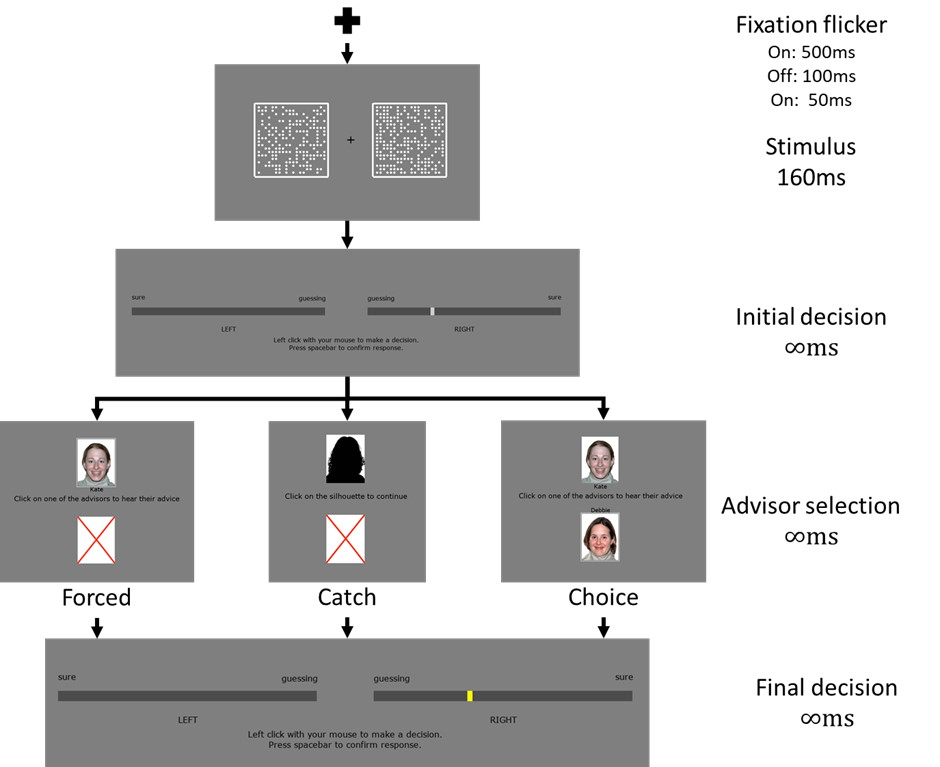
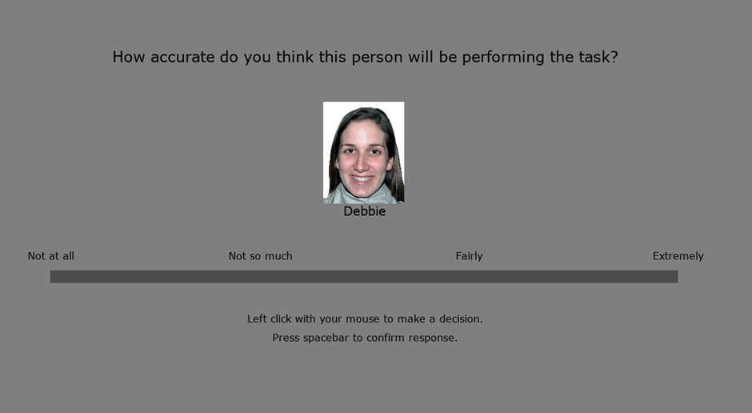

## Confidence-contingent advice {#ac-cca}

Pescetelli and Yeung's model of advisor evaluation (§\@ref(confidence-weighted-agreement)) of advisor evaluation weights the updating of trust in an agreeing advisor using the confidence of the judge's initial estimate.
This model can be directly tested by using advisors who have different agreement rates contingent upon the judge's initial estimate confidence.
Pescetelli provided evidence for this model in the domain of advisor influence (\mccorrect{!TODO[Reference Niccolo's actual paper]}), and here a very similar design is used to explore this effect in the domain of advisor choice.

### Dots Task {#ac-cca-dots}

```{r include = F}

rm(list = ls()); source('scripts_and_filters/general_setup.R')

select_experiment(
  project = 'dotstask',
  function(x) filter(x, study == 'MetaCog', version == '2c Fixed')
)

.dropEnv <- new.env()
tada('dotstask', package = 'esmData', envir = .dropEnv)
.dropEnv$dotstask <- .dropEnv$dotstask %>% 
  filter(study == 'MetaCog', version != '2c Fixed')

.dropEnv$DROP_V <- paste0(unique(.dropEnv$dotstask$version), collapse = ', ')
.dropEnv$DROP_P <- sum(.dropEnv$dotstask %>% 
                         filter(table == 'participants') %>% 
                         pull(N))

trials <- annotate_responses(trials)

```

#### Open scholarship practices

\OpenScience{prereg} `r unique(dotstask$preregistration)`

\OpenScience{data} \mccorrect{!TODO[OSFify data for these studies]}

\OpenScience{materials} https://github.com/oxacclab/ExploringSocialMetacognition/blob/90c04ff21d3a2876beaddd9ee35c577a821e5727/AdvisorChoice/index.html

##### Unanalysed data

Two versions of this experiment have unanalysed data (`r paste0(.dropEnv$DROP_V, collapse = ', ')`). 
The first of these had a bug which meant that the advisors were identical in the familiarisation phase.
Both versions had a bug in which advisors which were supposed to agree with the participant's initial estimate gave the correct answer rather than agreeing.
The `r .dropEnv$DROP_P` participants whose data was collected in these versions is not included in analysis.
These participants' data could be included in an analysis which used a participant's actual experience of advice to predict their advice-taking and source selection behaviour, provided appropriate care was taken to reconstruct the advice data from the raw values instead of relying on the reported summaries.

#### Method {#ac-cca-dots-m}

\mccorrect{!TODO[clarify any methodological differences from the main methods chapter]}

##### Advice profiles

The two advisor profiles used in the experiment were Bias sharing and Anti-bias.
The advisors are balanced for their overall accuracy and agreement rates, but the Bias sharing advisor agrees more frequently with participants when their initial estimate is correct and made with relatively high confidence.
The Anti-bias advisor agrees more frequently with participants when their initial estimate is correct and made with relatively low confidence (Table \@ref(tab:ac-cca-dots-profiles)).

```{r ac-cca-dots-profiles-r} 

agr.table <- tribble(
  ~` `, ~`  `, ~`Bias Sharing`, ~`Anti Bias`,
  "Participant correct", "High (top 30%)", 90, 50,
  "Participant correct", "Medium (middle 40%)", 70, 70,
  "Participant correct", "Low (bottom 30%)", 50, 90,
  "Participant incorrect", "Any", 30, 30,
  "Total agreement", "Participant correct", 70, 70,
  "Total agreement", "Participant incorrect", 30, 30
)

kable(agr.table, caption = "\\label{tab:ac-cca-dots-profiles}Confidence-contingent advisor advice profiles") %>%
  kable_styling() %>%
  column_spec(1, bold = T) %>%
  row_spec(0, bold = F) %>%
  collapse_rows(columns = 1, valign = "top") %>%
  add_header_above(c(" ", 
                     "Initial decision confidence", 
                     "Probability of agreement (%)" = 2))

```

#### Results {#ac-cca-dots-r}

##### Exclusions

```{r}
nMaxOutliers <- 2
zThresh <- 3
accuracyRange <- c(.6, .85)
minTrialsPerCategory <- 12
preRegParticipants <- 50

tmp <- trials %>% 
  nest(d = -pid) %>%
  mutate(d = map_dbl(d, ~ mean(.$initialAnswerCorrect)))

exclusions <- tibble(pid = unique(trials$pid)) %>%
  mutate(
    `Accuracy too low` = pid %in% filter(tmp, d < accuracyRange[1])$pid,
    `Accuracy too high` = pid %in% filter(tmp, d > accuracyRange[2])$pid
  )

tmp <- trials %>% 
  filter(!practice) %>%
  nest(d = c(-pid, -confidenceCategory)) %>%
  mutate(n = map_int(d, nrow)) %>%
  select(-d) %>%
  pivot_wider(names_from = confidenceCategory, 
              names_prefix = "cc", 
              values_from = n) %>%
  mutate(
    anyNA = is.na(cc0) | is.na(cc1) | is.na(cc2),
    lowest = pmin(cc0, cc1, cc2, na.rm = T)
  )

exclusions <- exclusions %>% 
  mutate(
    `Missing confidence categories` = pid %in% filter(tmp, anyNA)$pid,
    `Skewed confidence categories` = pid %in% filter(tmp, lowest < minTrialsPerCategory)$pid
  )
  
do_exclusions(exclusions)

tmp <- trials %>% nest(d = -pid) %>% rowid_to_column() %>% filter(rowid > preRegParticipants)

exclusions <- exclusions %>% mutate(`Too many participants` = pid %in% tmp$pid)

do_exclusions(exclusions, backup = F)

exclusions$`Total excluded` <- exclusions %>% select(-pid) %>% apply(1, any)
n <- ncol(exclusions)
exclusions %>% 
  summarise(across(where(is.logical), sum)) %>%
  mutate(`Total remaining` = length(unique(trials$pid))) %>% 
  pivot_longer(everything(), names_to = "Reason", values_to = "Participants excluded") %>%
  kable(caption = "\\label{tab:ac-cca-dots-exclusions}Participant exclusions for Dots task Confidence-contingent agreement experiment") %>%
  row_spec((n - 1):n, bold = T)

```

Participants' data could be excluded from analysis where they have an average accuracy below `r accuracyRange[1]` or above `r accuracyRange[2]`, do not have trials in all confidence categories, have fewer than `r minTrialsPerCategory` trials in each confidence category, or finish the experiment after `r preRegParticipants` participants have already submitted data which passed the other exclusion tests. 
Overall, `r sum(pull(exclusions, "Total excluded"))` participants were excluded, with the details shown in Table \@ref(tab:ac-cca-dots-exclusions).

##### Task performance

```{r}

familiarization <- trials %>%
  filter(typeName == "force", adviceType %in% c(3,4)) %>%
  mutate(Advisor = advisor_profile_name(adviceType)) %>%
  order_factors()

```

Before exploring the interaction between the participants' responses and the advisors' advice, and the participants' advisor selection behaviour, it is useful to verify that participants interacted with the task in a sensible way, and that the task manipulations worked as expected.
In this section, task performance is explored during the Familiarization phase of the experiment where participants received advice from a pre-specified advisor on each trial. 
There were an equal number of these trials for each participant for each advisor.

###### Response times

Participants made two decisions during each trial. 
Neither of these decisions had a maximum response time. 
Each participant's response times for both initial and final decisions can be seen in Figure \@ref(fig:ac-cca-dots-r-response-times).

```{r ac-cca-dots-r-response-times, fig.caption="Response times for the Dots task with bias sharing/anti-bias advisors.  Each point shows a response relative to the start of the trial. Each row indicates a single participant's trials. The ridges show the distribution of the underlying points, with initial estimates and final decisions shown in different colours. The grey numbers on the right show the number of trials whose response times were more than 3 standard deviations away from the mean of all final response times (rounded to the next 10s)."}

tmp <- familiarization %>% 
  transmute(
    pid = factor(pid),
    `Initial estimate` = timeInitialResponse - timeInitialStart,
    `Final decision` = timeFinalResponse - timeInitialStart
  ) %>%
  pivot_longer(c(`Initial estimate`, `Final decision`),
               names_to = "Event", 
               values_to = "Time") %>%
  filter(!is.na(Event) & !is.na(Time)) %>%
  rename(Participant = pid)

max_rt <- tmp %>% 
  filter(Event == 'Final decision') %>%
  mutate(zTime = scale(Time)) %>%
  filter(zTime > 3) %>%
  filter(zTime == min(zTime)) %>% 
  pull(Time) %>% 
  .[1]
# round to 10s
max_rt <- ceiling(max_rt / 10000) * 10000
  

# Replace out-of-scale values with a count of dropped values
dropped <- tmp %>%
  group_by(Participant) %>%
  filter(Time > max_rt) %>%
  transmute(n = n())

tmp <- tmp %>% 
  filter(Time <= max_rt) %>% 
  mutate(
    Participant = fct_reorder(Participant, Time, .desc = T),
    Event = factor(Event)
  ) %>%
  order_factors()

ggplot(tmp, aes(y = Participant, x = Time, fill = Event, colour = Event)) +
  geom_density_ridges(alpha = .25, colour = NA) +
  geom_point(alpha = .25, size = .25) +
  geom_text(aes(label = paste0('+', dropped$n), y = Participant),
            inherit.aes = F, x = max_rt, colour = 'grey', hjust = 1, 
            data = dropped) +
  scale_x_continuous(limits = c(0, max_rt), expand = c(0, 0)) +
  labs(x = 'Time since trial start') +
  theme(
    axis.text.y = element_blank(),
    axis.ticks.y = element_blank(),
    legend.position = 'top',
    plot.margin = 
  ) +
  coord_fixed(max_rt/length(unique(tmp$Participant)))

```

###### Accuracy

Accuracy of initial decisions was controlled by a staircasing procedure which aimed to pin accuracy to 71%.
The accuracy of final decisions was free to vary according to the ability of the participant to take advantage of the advice on offer.
As Figure \@ref(fig:ac-cca-dots-r-accuracy) shows, participants' accuracy scores for initial decisions were close to the target values (partly because participants whose accuracy scores diverged considerably were excluded).
Participants tended to improve the accuracy of their responses following advice from Anti-bias advisors, while their response accuracy was equivalent following advice from Bias sharing advisors.

```{r ac-cca-dots-r-accuracy, fig.caption="Response accuracy for the Dots task with bias sharing/anti-bias advisors.  Faint lines show individual participant means, for which the violin and box plots show the distributions. The half-width horizontal dashed lines show the level of accuracy which the staircasing procedure targeted, while the full width dashed line indicates chance performance. Dotted violin outlines show the distribution of actual advisor accuracy."}

dw <- .2

tmp <- familiarization %>% 
  group_by(Advisor, pid) %>%
  summarise(
    `Initial estimate` = mean(initialAnswerCorrect),
    `Final decision` = mean(finalAnswerCorrect),
    .groups = 'drop'
  ) %>%
  pivot_longer(cols = c(`Initial estimate`, `Final decision`), 
               names_to = 'Response', values_to = 'Accuracy')

adv <- familiarization %>%
  mutate(Advisor = advisor_profile_name(adviceType)) %>%
  group_by(Advisor, pid) %>%
  summarise(
    Response = 'Advice',
    Accuracy = mean(adviceCorrect),
    .groups = 'drop'
  )

stair <- tribble(
  ~Response, ~Accuracy,
  'Initial estimate', .71
) %>%
  crossing(tibble(Advisor = unique(tmp$Advisor))) %>%
  filter(!is.na(Advisor))

# Should this be a paired t-test?
bf <- tmp %>% 
  nest(d = -Advisor) %>%
  mutate(d = map(d, as.data.frame),
    bf = map(d, ~ ttestBF(x = .$Accuracy[.$Response == 'Initial estimate'],
                          y = .$Accuracy[.$Response == 'Final decision'], 
                          data = ., paired = T)),
         bf = map_chr(bf, ~ .@bayesFactor %>% .$bf %>% exp() %>% bf2str())) %>%
  select(-d)

tmp %>%
  mutate(Response = fct_rev(Response)) %>%
  ggplot(aes(x = Response, y = Accuracy, colour = Advisor)) +
  scale_y_continuous(limits = c(NA, 1), expand = c(0, 0)) +
  scale_x_discrete() +
  coord_cartesian(clip = F) +
  geom_hline(yintercept = .5, linetype = 'dashed') +
  geom_segment(aes(y = Accuracy, yend = Accuracy, x = 0, xend = 1.5), 
               linetype = 'dashed', colour = 'black', data = stair) +
  geom_line(aes(group = pid), alpha = .25) +
  geom_split_violin(aes(x = nudge(Response, dw), 
                        group = Response, fill = Advisor), 
                    width = .9, colour = NA) +
  geom_split_violin(aes(x = 2 + dw), 
                    group = 2, fill = NA, colour = 'black', linetype = 'dotted', 
                    data = adv) +
  geom_boxplot(aes(x = nudge(Response, dw), group = Response),
               outlier.shape = NA, size = 1, width = dw/2, colour = 'black') +
  geom_segment(x = 1 - dw, xend = 2 + dw, y = 1, yend = 1, colour = 'black') +
  geom_label(x = 1.5, y = 1, aes(label = paste0('BF = ', bf)), colour = 'black', 
             data = bf) +
  facet_wrap(~paste0(Advisor, '\n')) +
  broken_axis_bottom

```

###### Confidence

Generally, we expect participants to be more confident on trials on which they are correct compared to trials on which they are incorrect.
Participants were systematically more confident on correct as compared to incorrect trials for both initial estimates and final decisions.

```{r ac-cca-dots-r-confidence, fig.caption="Confidence for the Dots task with bias sharing/anti-bias advisors.  Faint lines show individual participant means, for which the violin and box plots show the distributions."}

dw <- .2

tmp <- familiarization %>% 
  mutate(`Initial answer accuracy` = 
           if_else(initialAnswerCorrect, 'Correct', 'Incorrect')) %>%
  group_by(`Initial answer accuracy`, pid) %>%
  summarise(
    `Initial estimate` = mean(initialConfidenceScore),
    `Final decision` = mean(finalConfidenceScore),
    .groups = 'drop'
  ) %>%
  pivot_longer(cols = c(`Initial estimate`, `Final decision`), 
               names_to = 'Response', values_to = 'Confidence') %>%
  mutate(response = factor(paste0(Response, '\n')),
         Response = factor(Response),
         `Initial answer accuracy` = factor(`Initial answer accuracy`))

bf <- tmp %>% 
  nest(d = -response) %>%
  mutate(d = map(d, as.data.frame),
         bf = map(d, ~ ttestBF(
           x = .$Confidence[.$`Initial answer accuracy` == 'Correct'],
           y = .$Confidence[.$`Initial answer accuracy` == 'Incorrect'], 
           data = ., paired = T)
         ),
         bf = map_chr(bf, ~ .@bayesFactor %>% .$bf %>% exp() %>% bf2str())) %>%
  select(-d)

tmp %>%
  order_factors() %>%
  ggplot(aes(x = `Initial answer accuracy`, y = Confidence, colour = Response)) +
  scale_y_continuous(limits = c(0, 1), expand = c(0, 0)) +
  scale_x_discrete() +
  coord_cartesian(clip = F) +
  geom_line(aes(group = pid), alpha = .25) +
  geom_split_violin(aes(x = nudge(`Initial answer accuracy`, dw), 
                        group = `Initial answer accuracy`, 
                        fill = Response), 
                    width = .9, colour = NA) +
  geom_boxplot(aes(x = nudge(`Initial answer accuracy`, dw), 
                   group = `Initial answer accuracy`),
               outlier.shape = NA, size = 1, width = dw/2, colour = 'black') +
  geom_segment(x = 1 - dw, xend = 2 + dw, y = 1, yend = 1, 
               colour = 'black') +
  geom_label(aes(label = paste0('BF = ', bf)), 
             x = 1.5, y = 1, colour = 'black', data = bf) +
  facet_wrap(~response)

```

###### Metacognitive ability

As shown by Figure \@ref(fig:ac-cca-dots-r-roc), most participants showed above-chance metacognitive sensitivity for initial estimates and final decisions.
Participants generally showed higher metacognitive sensitivity for final decisions, although this may be an artefact of a change in metacognitive bias.
As expected given the controlled performance level on the task, participants' metacognition scores were not significantly correlated with their performance on the underlying task.

```{r ac-cca-dots-r-roc, fig.caption="ROC curves for the Dots task with bias sharing/anti-bias advisors.  Faint lines show individual participant data, while points and solid lines show mean data for all participants. Each participant's data are split into initial estimates and final decisions. For correct and incorrect responses seperately, the probability of a confidence rating being above a response threshold is calculated, with the threshold set to every possible confidence value in turn. This produces a point for each participant in each response for each possible confidence value indicating the probability of confidence being at least that high given the answer was correct, and the equivalent probability given the answer was incorrect. These points are used to create the faint lines, and averaged to produce the solid lines. The dashed line shows chance performance where the increasing confidence threshold leads to no increase in discrimination between correct and incorrect answers."}

nQuantiles <- 50 # confidence range

tmp <- familiarization %>% 
  pivot_longer(cols = c(starts_with('initial'), starts_with('final')),
               names_to = c('Response', '.value'),
               names_pattern = '(initial|final)(.*)') %>%
  # calculate p(confidence > q) for in/correct answers at each quantile q
  nest(d = c(-pid, -Response, -AnswerCorrect)) %>%
  mutate(
    d = map(d, ~ p_conf(., seq(0, 1, length.out = nQuantiles)))
  ) %>%
  unnest(cols = d) %>% 
  unnest(cols = d)

tmp <- tmp %>% 
  mutate(
    Response = factor(if_else(Response == 'initial', 
                              'Initial estimate', 'Final decision')),
    Confidence = factor(Confidence),
    Confidence = fct_relabel(Confidence, ~prop2str(as.numeric(.)))
  ) %>%
  pivot_wider(names_from = AnswerCorrect, 
              names_prefix = 'Correct', 
              values_from = pConf) 

auroc <- tmp %>% 
  nest(d = c(-pid, -Response)) %>%
  mutate(
    d = map(d, ~arrange(., CorrectFALSE, rev(CorrectTRUE))),
    d = map(d, ~mutate(., area = CorrectTRUE * 
                         (CorrectFALSE - lag(CorrectFALSE)))),
    area = map_dbl(d, ~ sum(.$area, na.rm = T))
  ) %>%
  select(-d) 

auroc.gg <- auroc %>%
  nest(d = -Response) %>%
  mutate(
    d = map(d, ~ mutate(., mean = mean(area))),
    gg = map(
      d, 
      ~ ggplot(., aes(y = area)) +
        geom_hline(yintercept = .5, linetype = 'dashed') +
        geom_density(fill = 'black') +
        geom_hline(aes(yintercept = mean), data = unique(select(., mean))) +
        geom_label(aes(y = mean, x = nrow(.), 
                       label = paste0('Mean = ', prop2str(mean))), 
                   hjust = 1, data = unique(select(., mean))) +
        scale_y_continuous(limits = c(0, 1), expand = c(0, 0), 
                           breaks = c(0, .5, 1)) +
        scale_x_continuous(limits = c(0, nrow(.)), expand = c(0, 0),
                           position = 'top') +
        labs(x = "", y = "AUC") +
        theme(axis.ticks.x = element_blank(),
              axis.line.x = element_blank(),
              panel.grid.major.x = element_line(),
              plot.margin = unit(rep(0, 4), 'lines'))
    )
  )

tmp.avg <- tmp %>%
  group_by(Confidence, Response) %>%
  summarise(across(where(is.numeric), mean), .groups = 'drop')

tmp.avg %>%
  order_factors() %>%
  ggplot(aes(x = CorrectFALSE, y = CorrectTRUE)) +
  geom_abline(slope = 1, intercept = 0, linetype = 'dashed') +
  geom_line(aes(group = pid), alpha = .2, colour = 'grey', data = tmp) +
  geom_line() +
  geom_point() +
  geom_plot(aes(label = gg), x = 1, y = .025, vp.width = 2/3, data = auroc.gg) +
  scale_x_continuous(limits = c(0, 1), expand = c(0, .01)) +
  scale_y_continuous(limits = c(0, 1), expand = c(0, .01)) +
  coord_fixed() +
  facet_wrap(~Response) +
  theme(panel.spacing.x = unit(2, 'lines'),
        plot.margin = unit(c(0, 0, 4, 0), 'lines')) +
  labs(x = 'p( Confidence > threshold | Incorrect )', 
       y = 'p( Confidence > threshold | Correct )')

```

```{r ac-cca-dots-r-roc-cor, fig.caption="AUROC-accuracy correlation for the Dots task with bias sharing/anti-bias advisors.  Points show individual participant data for their area under the receiver operator characteristic (ROC) curve and their accuracy on initial estimates and final decisions. The blue lines and equation text show best-fit regression, and the shaded area gives its standard error. The equations give the regression equation plotted in blue, with bold coefficients being significant at p = .05."}

# Correlations between Type II AUROC and accuracy
acc <- left_join(
  auroc,
  familiarization %>% 
    group_by(pid) %>% 
    summarise(initialAccuracy = mean(initialAnswerCorrect),
              finalAccuracy = mean(finalAnswerCorrect),
              .groups = 'drop') %>%
    pivot_longer(-pid) %>%
    transmute(
      pid,
      Response = factor(
        if_else(name == 'initialAccuracy', 
                'Initial estimate', 'Final decision')
      ),
      accuracy = value
    ),
  by = c('pid', 'Response')
)

r = acc %>% 
  nest(d = -Response) %>%
  mutate(
    d = map(d, ~ lm(area ~ accuracy, data = .)),
    d = map(d, tidy),
    d = map(d, ~ pivot_wider(., names_from = term, values_from = -term)),
    d = map_chr(d, ~paste0('y = ', 
                           if_else(.$`p.value_(Intercept)` < .05, '**', ''), 
                           round(.$`estimate_(Intercept)`, 2),
                           if_else(.$`p.value_(Intercept)` < .05, '**', ''), 
                           ' + ',
                           if_else(.$p.value_accuracy < .05, '**', ''),
                           round(.$estimate_accuracy, 2),
                           if_else(.$p.value_accuracy < .05, '**', ''), 
                           'x'))
  )

acc %>%
  order_factors() %>%
  ggplot(aes(x = accuracy, y = area)) +
  geom_abline(slope = 1, intercept = 0, linetype = 'dashed') +
  geom_smooth(method = 'lm', formula = y ~ x) +
  geom_point(alpha = .2) +
  geom_richtext(x = .51, y = .99, hjust = 0, vjust = 1, fill = NA,
                aes(label = d), 
                data = r) +
  scale_x_continuous(limits = c(.45, 1), expand = c(0,0)) +
  scale_y_continuous(limits = c(.45, 1), expand = c(0,0)) +
  coord_fixed() +
  facet_wrap(~Response) +
  labs(x = 'Accuracy', y = 'Area under ROC curve') +
  broken_axis_bottom +
  theme(panel.spacing.x = unit(2, 'lines'),
        plot.margin = unit(c(0, 0, 4, 0), 'lines'))

```

##### Experience with advisors

The advice is generated probabilistically from the rules described previously in Table \@ref(tab:ac-cca-dots-m-profiles).
It is thus important to get a sense of the actual advice experienced by the participants.

###### Advisor accuracy

As shown in Figure \@ref(fig:ac-cca-dots-r-advice-acc), the advisors were designed to have the same accuracy, and the actual variation experienced by participants was relatively slight.

```{r ac-cca-dots-r-advice-acc, fig.caption="Advisor accuracy for Dots task with bias sharing/anti-bias advisors.  Coloured lines show the average accuracy of the advisors as experienced by an individual participant. The colour of the line indicates whether the more accurate advisor was more accurate as per the experiment design. Box plots and violins show the distribution of the participant means, while the dashed lines indicate the accuracy level for the advisors specified in their design."}

dw <- .2

tmp <- familiarization %>% 
  group_by(pid, Advisor) %>%
  summarise(Accuracy = mean(adviceCorrect), .groups = 'drop') %>%
  order_factors()

# Note: agr.table defined in the Advice profile section
tmp.adv <- tribble(
  ~Advisor, ~Accuracy,
  'Bias sharing', .7,
  'Anti-bias', .7
)

tmp %>%
  ggplot(aes(x = Advisor, y = Accuracy)) +
  scale_y_continuous(limits = c(0, 1), expand = c(0, 0)) +
  scale_x_discrete() +
  scale_colour_discrete(drop = F) +
  geom_line(aes(group = pid), alpha = .2) +
  geom_split_violin(aes(x = nudge(Advisor, dw), group = Advisor), 
                    width = .9, colour = NA, fill = 'grey') +
  geom_segment(aes(x = nudge(Advisor, .25 * dw), xend = nudge(Advisor, 1.75 * dw),
                   y = Accuracy, yend = Accuracy),
               linetype = 'dashed', colour = 'black', data = tmp.adv) +
  geom_boxplot(aes(x = nudge(Advisor, dw), group = Advisor),
               outlier.shape = NA, size = 1, width = dw/2, colour = 'black')

```

###### Advisor agreement

Figure \@ref(fig:ac-cca-dots-r-advice-agr) shows the agreement rates experienced by each participant. 
As with the advisors' accuracy, this was supposed to be balanced between advisors by design. 
For both accuracy and agreement, this balancing approach appears to have worked well.

\mccorrect{Should this break down agreement by initial in/correct as per the experiment design?}

```{r ac-cca-dots-r-advice-agr, fig.caption="Advisor agreement for Dots task with bias sharing/anti-bias advisors.  Faint lines show the average agreement rate of the advisors as experienced by an individual participant. Box plots and violins show the distribution of the participant means, while the dashed lines indicate the agreement level for the advisors specified in their design."}

dw <- .2

tmp <- familiarization %>% 
  group_by(pid, Advisor) %>%
  summarise(`Agreement rate` = mean(advisorAgrees), .groups = 'drop') %>%
  order_factors()

# Note: agr.table defined in the Advice profile section
tmp.adv <- tibble(
  Advisor = c('Bias sharing', 'Anti-bias'),
  `Agreement rate` = .7*.71 + .3*.29
)

tmp %>%
  order_factors() %>%
  ggplot(aes(x = Advisor, y = `Agreement rate`)) +
  scale_y_continuous(limits = c(0, 1), expand = c(0, 0)) +
  scale_x_discrete() +
  scale_colour_discrete(drop = F) +
  geom_line(aes(group = pid), alpha = .2) +
  geom_split_violin(aes(x = nudge(Advisor, dw), group = Advisor), 
                    width = .9, colour = NA, fill = 'grey') +
  geom_segment(aes(x = nudge(Advisor, .25 * dw), xend = nudge(Advisor, 1.75 * dw),
                   y = `Agreement rate`, yend = `Agreement rate`),
               linetype = 'dashed', colour = 'black', data = tmp.adv) +
  geom_boxplot(aes(x = nudge(Advisor, dw), group = Advisor),
               outlier.shape = NA, size = 1, width = dw/2, colour = 'black')

```

##### Advisor influence

The advisors were similarly influential (Figure \@ref(fig:ac-cca-dots-r-influence-graph)). 
Influence is only measured here during the Familiarization phase, when participants are forced to see the advice of one or another advisor, and participants are still learning about advisors' advice styles while this measure is being taken. 
This means that no strong conclusions should be drawn from this analysis.

```{r ac-cca-dots-r-influence-graph, fig.caption="Dot task advisor influence for bias sharing/anti-bias advisors.  Participants' weight on the advice for advisors in the Familiarization phase of the experiment. The shaded area and boxplots indicate the distribution of the individual participants' mean influence of advice. Individual means for each participant are shown with lines in the centre of the graph. The theoretical range for influence values is [-2, 2].", fig.width = 4, fig.height = 6}

tmp <- familiarization %>% 
  group_by(pid, Advisor) %>%
  select(c(matches('(adviceInfluence)'), group_vars(.))) %>%
  summarise_all(mean) %>%
  mutate(`Feedback condition` = 'No feedback') %>%
  mutate(across(-matches('Influence'), factor)) %>%
  order_factors()

bf <- tmp %>% 
  select(group_vars(.), Advisor, adviceInfluence) %>%
  pivot_wider(names_from = Advisor, values_from = adviceInfluence) %$%
  ttestBF(`Bias sharing`, `Anti-bias`, paired = T) %>%
  .@bayesFactor %>%
  .$bf %>%
  exp() %>%
  bf2str()

dw <- .1

ggplot(tmp, aes(x = Advisor, y = adviceInfluence, 
                colour = `Feedback condition`, fill = `Feedback condition`)) +
  geom_hline(yintercept = 0, colour = 'lightgrey', size = 1) +
  geom_line(aes(group = pid), alpha = .25) +
  geom_split_violin(aes(x = nudge(Advisor, dw),
                        group = Advisor), width = .9,
               colour = NA) +
  geom_boxplot(outlier.shape = NA, size = 1, width = dw/2,
               aes(x = nudge(Advisor, dw), 
                   group = Advisor),
               colour = 'black') +
  geom_segment(x = 1, xend = 2, y = 1.05, yend = 1.05, colour = 'black') +
  geom_label(y = 1.05, x = 1.5, colour = 'black', fill = 'white', 
             aes(label = paste0('BF = ', bf))) +
  scale_y_continuous(limits = c(-.50, 1.10), breaks = seq(-.50, 1.00, length.out = 6)) +
  facet_grid(~`Feedback condition`) +
  labs(x = 'Advisor advice profile', y = 'Influence of advice') +
  broken_axis

```

##### \OpenScience{prereg} Hypothesis test

```{r ac-cca-dots-r-graph, fig.caption="Dot task advisor choice for confidence-contingent advisors.  Participants' pick rate for the advisors in the Choice phase of the experiment. The violin area shows a density plot of the individual participants' pick rates, shown by dots. The chance pick rate is shown by a dashed line.", fig.height=6, fig.width=4}

tmp <- trials %>% 
  filter(hasChoice) %>%
  group_by(pid) %>%
  summarise(pChooseAcc = sum(adviceType == 3) / sum(adviceType %in% c(3,4)),
            .groups = 'drop') %>%
  mutate(`Feedback condition` = 'No feedback')

bf <- ttestBF(pull(tmp, pChooseAcc), mu = .5)

ggplot(tmp, aes(x = '', y = pChooseAcc)) +
  geom_hline(yintercept = .5, linetype = 'dashed') +
  geom_violindot(size_dots = .4) +
  geom_violinhalf(aes(fill = `Feedback condition`, colour = `Feedback condition`)) +
  annotate(geom = 'label', label = paste0('BF vs chance\n', bf2str(exp(bf@bayesFactor$bf))),
           x = 1, y = 1.1) +
  scale_y_continuous(limits = c(0, 1.1), breaks = seq(0, 1, length.out = 5)) +
  labs(y = 'p(Choose Bias sharing advisor)', x = '') +
  theme(axis.ticks.x = element_blank(), axis.line.x = element_blank())

.T <- tmp %>%
  pull(pChooseAcc) %>%
  md.ttest(y = .5)

```

There was a strong tendency for participants to express no, or slight preferences between advisors (`r .T`).
Intriguingly, almost all participants who expressed a stronger preference expressed it towards the Anti-bias advisor: in the direction counter to that hypothesised (Figure \@ref(fig:ac-cca-dots-r-graph)). 
The statistics are not conclusive here because the experiment was terminated prematurely. 
\mccorrect{The good thing about Bayes stats is we can quite happily go collect more data. Maybe we should do this because there's a chance we come out with a counter-to-expectations result here to do some talking and thinking about.}

#### Discussion

While source selection and advice-taking are different domains, the previous experiments have shown strong similarities in the tendencies of participants: participants tend to be more influenced by the same kinds of advisors that they are more willing to hear from. 
On this basis, following Pecesetilli and Yeung \mccorrect{CITE Niccolo and Nick}, we would expect to see a preference for picking the Bias sharing advisor. 
We do not see this preference, and, insofar as we see any preference at all, we see the opposite.

### Dates task

The Dates task was not used to study confidence-contingent advice because such advice requires both a precise control over the relative agreement and accuracy rates of the advisors and the ability to estimate confidence in responses. 
The advisors' agreement (and hence accuracy) profiles depend on the participant's performance, and this is unknown a priori in the Dates task whereas it is controlled in the Dots task using a staircase procedure.
Different approaches to estimating participants' confidence were trialled, including a pilot experiment in which the width of marker used by participants was used as a proxy for confidence, but none of the approaches produced any discernable effect of confidence on advisor agreement. 

\mccorrect{!TODO[If this study was worth reporting on, report on it (as a null manipulation). If not, why mention it? With the Marker use studies this probably works out as quite a lot of work and worth describing, at least. Probably worth detailing some of the attempts that were made to adapt Dates to Confidence-contingent advice.]}

### Lab study {#ac-cca-lab}

\OpenScience{prereg} https://aspredicted.org/ze3tn.pdf

\OpenScience{materials} https://github.com/mjaquiery/nofeedback_trust

\OpenScience{data} \mccorrect{!TODO[Use a sensible archive format for this study data, archive on OSF, and produce data dictionary]}

Pescetelli et al.
[-@pescetelliRoleDecisionConfidence2018] showed that, in the absence of objective feedback, advice was more influential coming from an advisor who agrees with a participant when that participant is confident (_Bias Sharing_) than coming from an advisor who agrees with a participant when that participant is unconfident (_Anti Bias_).
This provides evidence of a metacognitive sensitivity in the tracking of advice and the updating of advisor utility.
Here we investigate whether these effects show up in the domain of advisor selection.

The literature on information exposure and evaluation indicates that people evaluate more favourably information which agrees with their currently-held opinion \mccorrect{!TODO[REF]}, and preferentially seek out information sources which are likely to provide information which agrees with their currently-held opinion [@garrettEchoChambersOnline2009; @searsSelectiveExposureInformation1967].
If this holds true in the context of the judge-advisor system, advice from _Bias Sharing_ advisers ought to be evaluated more favourably (influence should increase) and should be sought more frequently.
Given the evidence in favour of the first of these propositions, we here investigate the latter: given a choice, will judges prefer to receive advice from a _Bias Sharing_ advisor over receiving advice from an advisor who does not share the judge’s bias?

Pescetelli et al.
[-@pescetelliRoleDecisionConfidence2018] used a judge-advisor system to demonstrate that judges are influenced to a greater extent by advisers who share their biases.
Participants played the role of judge in a judge-advisor system, while the advisers were virtual agents whose advice-giving was dependent upon the confidence and correctness of the judges' initial decisions.
The advisers were balanced for overall agreement with the judge and objective correctness of advice.
We place participants in a similar paradigm in which they are given a choice between advisers, and hypothesise that they will more frequently seek advice from the _Bias Sharing_ advisor than from the _Anti Bias_ advisor.

#### Method {#ac-cca-lab-m}

```{r load exp1 data, include = F}

rm(list = ls()); source('scripts_and_filters/general_setup.R')

# These scripts are kinda old and crappy, but they should do the correct analyses

# Load utility functions
source('scripts_and_filters/lab/utilityFunctions.R')
source("scripts_and_filters/lab/miscFunctions.R")
# Run script
source("scripts_and_filters/lab/AdvisorChoice.R")

```

##### Participants {#ex1-m-participants}

`r nrow(participants)` participants (M~age~ = `r round(mean(participants$age))` ±SD `r round(sd(participants$age), 1)`, `r sum(tolower(participants$gender) == 'm')` male, `r sum(tolower(participants$gender) == 'f')` female, `r sum(tolower(participants$gender) != 'm' & tolower(participants$gender) != 'f')` other) recruited from the University of Oxford participant recruitment platforms took part in the experiment.
An additional 2 participants attended experimental sessions but their data were not analysed.
Participants were compensated for their time with either course credit for a psychology degree, or 10GBP.

##### Procedure {#ex1-m-procedure}

The experiment consisted of a judge-advisor system with a perceptual decision task (Figure \@ref(fig:ex1-paradigm)).
Participants played the role of the judge, and the advisers were played by virtual agents whose answers depended upon the confidence with which the judge reported the initial decision.
In the majority of trials (92%), participants were offered advice from virtual advisers.
In one third of these trials (‘choice trials’), participants chose which advisor to receive advice from by clicking on their respective portraits appearing at the top and bottom of the screen.
On the remaining two thirds of trials (‘forced trials’), participants were forced to take advice from one of the two advisers (equiprobably).
On these trials, the forced advisor’s portrait appeared at the top or bottom of the screen, with a red cross appearing in the other location, which was not selectable.
On the remaining 8% of trials, participants received no advice and were given no opportunity to revise their initial decision.
These ‘catch trials’ were included to encourage participants to attend to the initial decisions.

```{r ex1-paradigm, fig.align='center', fig.caption="Experiment 1 procedure.  The task began with a blank screen containing only a fixation cross and progress bar. Momentarily prior to the onset of the stimuli the fixation cross flickered. The stimuli, two rectangles containing approximately 200 dots each, appeared for 0.16s, one on either side of the fixation cross. Once the stimuli disappeared, a response-collection screen appeared and prompted the participant to indicate their initial decision and its confidence by selecting a point within one of two regions. The left region indicated a decision that the target was on the left, and increasingly-leftwards points within that region indicated increasing confidence in that decision. The right region indicated a decision that the target was on the right, and increasingly-rightwards points within that region indicated increasing confidence in that decision.  Next, the participant was presented with a choice screen. The choice screen displayed two images, one at the top of the screen and one at the bottom. The images were one of the following: an advisor portrait, a silhouette, or a red cross. The red cross was not selectable, forcing participants to choose the other option. The silhouette offered no advice, and was only ever offered as a forced choice. Selecting an advisor image provided the participant with the opinion of that advisor on the trial.  Having heard the advice, the participant was again presented with the response-collection screen, with a yellow indicator marking their original response. A second (final) judgement was collected using this screen (except on catch trials), and the trial concluded.", out.width="100%"}

```

Each participant completed 363 trials (51 practice trials over 2 blocks + 12 x 26-trial experimental blocks) in which they had to identify the box with the most dots (Figure \@ref(fig:ex1-paradigm)).
The difficulty of the task was continually adjusted throughout the experiment using a 2-down, 1-up staircase procedure to keep the participant’s initial decision accuracy at 72%.
At the end of each block, participants were notified as to their (final decision) accuracy in the block and given the opportunity to rest for as long as they wished.
Throughout the experiment a progress bar provided a graphical indication of the number of trials remaining in the experiment.
After each block participants were told what percentage of the (final) answers they had provided were correct and allowed to take a short, self-paced break.
Prior to the first experimental block, after the final experimental block, and after the 4th and 8th experimental blocks, participants were presented with a questionnaire (Figure \@ref(fig:ex1-questionnaire)).
The questionnaire contained 4 questions for each advisor.
The questions asked for the judge’s assessment of the advisor’s likeability, trustworthiness, influence, and ability to do the task.
The questions presented before the first experimental block were worded prospectively (e.g.
‘How much are you going to like this person?’ as opposed to ‘How much do you like this person?’).
Answers were provided by moving a sliding scale below the advisor’s portrait towards the right for more favourable responses (marked ‘extremely’) or towards the left for less favourable responses (marked ‘not at all’).

```{r ex1-questionnaire, fig.align='center', fig.caption="Experiment 1 advisor questionnaire.  Participants rated advisors on a number of different dimensions.", out.width="100%"}

```

Each participant attended the experiment individually, was welcomed and briefed on the experimental procedure, and had their informed consent recorded, before the experiment began.
They were seated a comfortable distance in front of a 24’ (1440x900 resolution) computer screen in a small, quiet, and dimly-lit room.
The experiment took place wholly on the computer, and lasted around 45 minutes.

The experiment was programmed in MATLAB R2017b [@MATLAB2017] using the Psychtoolbox-3 package [@kleiner2007s].

##### Advisor advice profiles {#ex1-m-profiles}

The advisers are virtual agents whose probability of agreeing with the participant’s decision varies as a function of the participant’s confidence and correctness in the initial decision phase.
Table \@ref(tab:ex1-advisor-profiles) illustrates how this relationship functions, and shows that the overall correctness and agreement rates of the advisers is equivalent overall.
Importantly, on largest minority of trials, the middle 40%, the advisers are exactly equivalent, meaning these trials can be compared directly without confounds arising from agreement rate and initial confidence.

```{r ex1-advisor-profiles-r} 

tmp <- tribble(
  ~` `, ~`  `, ~`Bias Sharing`, ~`Anti Bias`,
  "Participant correct", "High (top 30%)", 80, 60,
  "Participant correct", "Medium (middle 40%)", 70, 70,
  "Participant correct", "Low (bottom 30%)", 60, 80,
  "Participant incorrect", "Any", 30, 30,
  "Total agreement", "Participant correct", 70, 70,
  "Total agreement", "Participant incorrect", 30, 30
)

kable(tmp, caption = "\\label{tab:ex1-advisor-profiles}Experiment 1 advisor advice profiles") %>%
  kable_styling() %>%
  column_spec(1, bold = T) %>%
  row_spec(0, bold = F) %>%
  collapse_rows(columns = 1, valign = "top") %>%
  add_header_above(c(" ", 
                     "Initial decision confidence", 
                     "Probability of agreement (%)" = 2))

```

##### Analysis {#ex1-m-analysis}

Data analysis was performed using R [@rcoreteamLanguageEnvironmentStatistical2018].
For a full list of packages and software environment information, see \mccorrect{!TODO[figure out where to include this stuff.
Appendix?
Also link to a containerized version of this.]}

Bayes Factors (BF) are presented alongside p values and test statistics.
A BF < 0.33 indicates decisive evidence in favour of the null hypothesis over the alternative hypothesis (with lower values being increasingly clear), BF > 3 indicates decisive evidence of the alternative over the null (with higher values being increasingly clear), and 0.33 <= BF <= 3 indicates there is insufficient evidence to reach a conclusion.

###### Capped influence {#ex1-m-analysis-influence}

Influence, the dependant variable in some analyses, is calculated as the extent to which the judge’s initial decision is revised in the direction of the advisor’s advice.
The initial ($C_1$) and final ($C_2$) decisions are made on a scale stretching from -55 to +55 with zero excluded, where values <0 indicate a ‘left’ decision and values >0 indicate a ‘right’ decision, and greater magnitudes indicate increased confidence.
Influence ($I$) is given for agreement trials by the shift towards the advice:

\begin{align}
I|\text{agree} = f(C_1) 
\begin{cases}
  C_2 - C_1 & C_1 > 0 \\
  -C_2 + C_1 & C_1 < 0
\end{cases}
(\#eq:ex1-influence-agree)
\end{align}

And by the inverse of this for disagreement trials:

\begin{align}
I|\text{disagree} = -I|\text{agree}
(\#eq:ex1-influence-disagree)
\end{align}

The confidence scale excludes 0, and thus the final decision can always be more extreme when moving against the direction of the initial answer than when moving further in the direction of the initial answer.
A capped measure of influence was used to minimise biases arising from the natural asymmetry of the scale.
This measure was calculated by truncating absolute influence values which were greater than the maximum influence which could have obtained had the final decision been a maximal response in the direction of the initial answer (Figure \@ref(fig:ex1-capping)).

```{r ex1-capping, fig.align='center', fig.caption="Capping influence to avoid scale bias.  In this example the judge’s initial response is 42, meaning that their final decision could be up to 13 points more confident or up to 97 points less confident. Any final decision which is more than 13 points less confident is therefore capped at 13 points less confident.", out.width="100%"}
knitr::include_graphics("figures/experiment_01_MATLAB/capping.jpg")
```

The capped influence measure $I_\text{capped}$ is obtained by:

\begin{align}
I_\text{capped} = f(C_1) 
\begin{cases}
  \text{min}(I, 2C_1 - 55) & C_1 > 0 \\
  \text{max}(I, 2C_1 + 55) & C_1 < 0
\end{cases}
(\#eq:ac-cca-lab-m-influence-capping)
\end{align}

The explicit measure of trust is obtained using questionnaires.
The questionnaires are delivered at 4 time points, and consist of 4 questions per advisor which are answered on a 1-100 scale.

#### Result {#ac-cca-lab-r}

##### Descriptive statistics {#ex1-r-descriptives}

`r nrow(participants) + 2` participants took part in the study.
One participant was unable to complete the experiment due to technical difficulties.
Preregistration of the study analysis stated that data would be collected from 24 participants, so the final (overbooked) subject tested was excluded from analysis.
Descriptive statistics for the `r nrow(participants)` participants included in the analysis are presented in Table \@ref(tab:ex1-descriptives).

```{r ex1-descriptives-r} 

tmp.conf <- bind_rows(
  # Mean confidence
  # Initial judgement
  trials %>% 
    group_by(cor1, participantId) %>%
    summarise(cj1 = mean(abs(cj1), na.rm = T)) %>%
    group_modify(~ mean_cl_normal(.$cj1)) %>%
    ungroup() %>%
    mutate(cor1 = if_else(cor1 == 1, "Correct", "Wrong")) %>%
    rename(condition = cor1) %>%
    # Combined correct and wrong
    bind_rows(
      cbind(
        tibble(condition = "Both"),
        trials %>%
          group_by(participantId) %>%
          summarise(cj1 = mean(abs(cj1), na.rm = T)) %>%
          group_modify(~ mean_cl_normal(.$cj1))
        )
      ) %>%
    mutate(stat = "Mean initial confidence",
           context = "Initial judgement",
           target = NA),
  
  # Final decision
  trials %>% 
    dplyr::filter(!is.nan(cj2)) %>%
    group_by(cor2, participantId) %>%
    summarise(cj2 = mean(abs(cj2), na.rm = T)) %>%
    group_modify(~ mean_cl_normal(.$cj2)) %>%
    ungroup() %>%
    mutate(cor2 = if_else(cor2 == 1, "Correct", "Wrong")) %>%
    rename(condition = cor2) %>%
    # Combined correct and wrong
    bind_rows(
      cbind(
        tibble(condition = "Both"),
        trials %>%
          group_by(participantId) %>%
          summarise(cj2 = mean(abs(cj2), na.rm = T)) %>%
          group_modify(~ mean_cl_normal(.$cj2))
        )
      ) %>%
    mutate(stat = "Mean final confidence",
           context = "Final decision",
           target = NA),
  
  # Agreement
  trials %>% 
    dplyr::filter(agree == T, !is.nan(cj2)) %>%
    group_by(advisorId, participantId) %>%
    summarise(cj2 = mean(abs(cj2), na.rm = T)) %>%
    group_modify(~ mean_cl_normal(.$cj2)) %>%
    ungroup() %>%
    mutate(advisorId = if_else(advisorId == 1, "Bias Sharing", "Anti Bias")) %>%
    rename(condition = advisorId) %>%
    # Combined correct and wrong
    bind_rows(
      cbind(
        tibble(condition = "Both"),
        trials %>%
          group_by(participantId) %>%
          summarise(cj2 = mean(abs(cj2), na.rm = T)) %>%
          group_modify(~ mean_cl_normal(.$cj2))
        )
      ) %>%
    mutate(stat = "Mean final confidence",
           context = "Advisor agrees",
           target = NA),
  
  # Disagreement
  trials %>% 
    dplyr::filter(agree == F, !is.nan(cj2)) %>%
    group_by(advisorId, participantId) %>%
    summarise(cj2 = mean(abs(cj2), na.rm = T)) %>%
    group_modify(~ mean_cl_normal(.$cj2)) %>%
    ungroup() %>%
    mutate(advisorId = if_else(advisorId == 1, "Bias Sharing", "Anti Bias")) %>%
    rename(condition = advisorId) %>%
    # Combined correct and wrong
    bind_rows(
      cbind(
        tibble(condition = "Both"),
        trials %>%
          group_by(participantId) %>%
          summarise(cj2 = mean(abs(cj2), na.rm = T)) %>%
          group_modify(~ mean_cl_normal(.$cj2))
        )
      ) %>%
    mutate(stat = "Mean final confidence",
           context = "Advisor disagrees",
           target = NA)
) %>%
  num2str.tibble(precision = 1)

tmp <- bind_rows(
  
  # Initial correct by advisor
  trials %>%
    group_by(advisorId, participantId) %>%
    summarise(cor1 = mean(cor1, na.rm = T)) %>%
    group_modify(~ mean_cl_normal(.$cor1)) %>%
    ungroup() %>%
    dplyr::filter(!is.nan(advisorId)) %>%
    mutate(advisorId = if_else(advisorId == 1, "Bias Sharing", "Anti Bias")) %>%
    # Combined average
    bind_rows(
      cbind(
        tibble(advisorId = "Both"),
        trials %>% 
          dplyr::filter(!is.nan(advisorId)) %>%
          group_by(participantId) %>%
          summarise(cor1 = mean(cor1, na.rm = T)) %>%
          group_modify(~ mean_cl_normal(.$cor1))
        )
  ) %>%
    rename(condition = advisorId) %>%
    mutate(stat = "Participant proportion correct",
           context = "Initial estimate",
           target = .71),
  
  # Final correct by advisor
  trials %>%
    group_by(advisorId, participantId) %>%
    summarise(cor2 = mean(cor2, na.rm = T)) %>%
    group_modify(~ mean_cl_normal(.$cor2)) %>%
    ungroup() %>%
    dplyr::filter(!is.nan(advisorId)) %>%
    mutate(advisorId = if_else(advisorId == 1, "Bias Sharing", "Anti Bias")) %>%
    # Combined average
    bind_rows(
      cbind(
        tibble(advisorId = "Both"),
        trials %>% 
          dplyr::filter(!is.nan(advisorId)) %>%
          group_by(participantId) %>%
          summarise(cor2 = mean(cor2, na.rm = T)) %>%
          group_modify(~ mean_cl_normal(.$cor2))
        )
  ) %>%
    rename(condition = advisorId) %>%
    mutate(stat = "Participant proportion correct",
           context = "Final decision",
           target = NA),
  
  # Judge-advisor agreement rate for Bias Sharing
  # By confidence
  trials %>%
    mutate(step = unlist(step)) %>%
    dplyr::filter(advisorId == 1, !is.nan(step)) %>%
    group_by(step, participantId) %>%
    summarise(agree = mean(agree, na.rm = T)) %>%
    group_modify(~ mean_cl_normal(.$agree)) %>%
    ungroup() %>%
    mutate(step = factor(step, labels = c("Low confidence",
                                          "Medium confidence",
                                          "High confidence")),
           step = as.character(step)) %>%
    rename(condition = step) %>%
    # By correctness 
    bind_rows(
      trials %>%
        dplyr::filter(advisorId == 1, !is.nan(cor1)) %>%
        group_by(cor1, participantId) %>%
        summarise(agree = mean(agree, na.rm = T)) %>%
        group_modify(~ mean_cl_normal(.$agree)) %>%
        ungroup() %>%
        mutate(cor1 = if_else(cor1 == 1, "Initial correct", "Initial wrong")) %>%
        rename(condition = cor1)
    ) %>%
    # Combined average
    bind_rows(
      cbind(
        tibble(condition = "All"),
        trials %>% 
          dplyr::filter(advisorId == 1) %>%
          group_by(participantId) %>%
          summarise(agree = mean(agree, na.rm = T)) %>%
          group_modify(~ mean_cl_normal(.$agree))
        )
  ) %>%
    mutate(stat = "Advisor-participant agreement rate",
           context = "Bias Sharing advisor",
           target = c(.8, .7, .6, .7, .3, NA)),
  
  # Judge-advisor agreement rate for Anti Bias
  # By confidence
  trials %>%
    mutate(step = unlist(step)) %>%
    dplyr::filter(advisorId == 2, !is.nan(step)) %>%
    group_by(step, participantId) %>%
    summarise(agree = mean(agree, na.rm = T)) %>%
    group_modify(~ mean_cl_normal(.$agree)) %>%
    ungroup() %>%
    mutate(step = factor(step, labels = c("Low confidence",
                                          "Medium confidence",
                                          "High confidence")),
           step = as.character(step)) %>%
    rename(condition = step) %>%
    # By correctness 
    bind_rows(
      trials %>%
        dplyr::filter(advisorId == 2, !is.nan(cor1)) %>%
        group_by(cor1, participantId) %>%
        summarise(agree = mean(agree, na.rm = T)) %>%
        group_modify(~ mean_cl_normal(.$agree)) %>%
        ungroup() %>%
        mutate(cor1 = if_else(cor1 == 2, "Initial correct", "Initial wrong")) %>%
        rename(condition = cor1)
    ) %>%
    # Combined average
    bind_rows(
      cbind(
        tibble(condition = "All"),
        trials %>% 
          dplyr::filter(advisorId == 2) %>%
          group_by(participantId) %>%
          summarise(agree = mean(agree, na.rm = T)) %>%
          group_modify(~ mean_cl_normal(.$agree))
        )
      ) %>%
    mutate(stat = "Advisor-participant agreement rate",
           context = "Anti Bias advisor",
           target = c(.6, .7, .8, .7, .3, NA))
) %>%
  num2str.tibble(isProportion = T) %>% 
  bind_rows(tmp.conf)

tmp %>%
  mutate_all(~ if_else(is.na(.) | .
== "NA", "-", .)) %>%
  mutate_at(vars(-(stat:context), -target), 
            ~ if_else(tmp$condition %in% c("Both", "All"), 
                      cell_spec(., bold = T), .)) %>%
  mutate(target = cell_spec(target, 
                            align = if_else(target == "-", 'c', 'r'),
                            bold = if_else(tmp$condition %in% c("Both", "All"),
                                           T, F))) %>%
  select(stat, context, condition, target, everything()) %>%
  rename(` ` = stat, `  ` = context, `   ` = condition,
         Target = target, Mean = y, Low = ymin, High = ymax) %>%
  kable(caption = "\\label{tab:ex1-descriptives}Descriptive statistics for Experiment 1",
        align = c('l', 'l', 'l', 'r', 'r', 'r', 'r'), 
        escape = F) %>%
  column_spec(1:2, bold = T, width = "3.25cm") %>%
  collapse_rows(columns = 1:2, valign = "top") %>%
  add_header_above(c(" " = 5, "95% CI" = 2)) %>%
  kable_styling()

```

The descriptive statistics demonstrate the contingent agreement of the advisers, with the Bias Sharing and Anti Bias advisers both agreeing at close to the target rate for most participants.
While the ranges overall patterns are as designed, the variation in individual experience means some participants may have experienced by chance an advisor profile which contradicted the generative pattern (e.g.
a Bias Sharing advisor who agreed on fewer high-confidence trials than mid-confidence trials).
This is especially likely to be true of contingencies with fewer trials per participant, such as the incorrect trials.
Overall, however, both the mean and 95% confidence intervals suggest the pattern was as desired for most participants most of the time.

Participants’ revisions to their confidence were mostly in the direction of the advice, symmetrical across left and right responses, and usually relatively small, especially in agreement trials (Figure \@ref(fig:ex1-confidence)).

```{r ex1-confidence, fig.align='center', fig.caption="Initial vs final confidence.  Influence of the advisors is evident in the deviation from the dashed y = x line. Points lying below the line indicate a more leftward response from initial to final judgement. Points above the line indicate a more rightward response in the final judgement. The further away from the y = x line, the greater the change from initial to final judgement. Separate plots show agreement vs disagreement trials (between the advisor and judge), and separate colours indicate whether the judge's final decision was correct or incorrect.  The shaded area indicates the boundary for the symmetrical influence measure. Points outside this area are truncated by moving them vertically until they meet the grey area.", out.width="100%"}

graph.confidence +
  labs(title = NULL, subtitle = NULL) +
  scale_y_continuous(limits = c(-60, 60), expand = c(0, 0)) +
  scale_x_continuous(limits = c(-60, 60), expand = c(0, 0))

```

##### \OpenScience{prereg} Advisor selection

We hypothesised that the participants would display different pick rates for the Bias Sharing advisor versus the Anti Bias advisor.
This hypothesis was evaluated by calculating the proportion of choice trials on which each participant picked the Bias Sharing advisor, and then testing these values as a one-sample t-test against the null hypothesis that the pick rates would be 0.5.
No support was found for this hypothesis (`r cat(md.ttest(participants$aicPickRate, mu = .5, labels = "M~P(BiasSharing)~"))`; Figure \@ref(fig:ex1-selection)), although the Bayesian test indicated that the data were not sufficient to conclude that no effect was present.
There was considerable variability across participants in the overall pick rate for the Bias Sharing advisor (range = [`r range(participants$aicPickRate) %>% num2str(isProportion = T) %>% paste(collapse = ", ")`]).

```{r ex1-selection, fig.align='center', fig.caption="Advisor selection.  Proportion of the time each participant picked the Bias Sharing advisor. Faint lines and dots indicate data from individual participants, while the large dot indicates the mean proportion across all participants. The dashed reference line indicates picking both advisors equally, as would be expected by chance. Error bars give 95\\% confidence intervals.", out.width="100%"}

melt(participants[,c("participantId","aicPickRate.lowConf","aicPickRate.medConf","aicPickRate.highConf")],
            id.vars = 'participantId') %>%
  mutate(variable = recode(variable, 
                           "aicPickRate.lowConf" = 'Low', 
                           "aicPickRate.medConf" = 'Medium', 
                           "aicPickRate.highConf" = 'High'),
         participantId = as.factor(participantId)) %>%
  ggplot(aes(x = variable, y = value)) +
  geom_hline(linetype = "dashed", color = "black", yintercept = .5, size = 1) +
  # Confidence categories
  geom_line(aes(group = factor(participantId)), alpha = 0.25) +
  stat_summary(geom = "errorbar", fun.data = "mean_cl_boot", width = 0) +
  stat_summary(geom = "point", fun.y = "mean", fill = "black", size = 4) +
  # Overall
  geom_violin(data = participants, fill = "lightgrey", color = NA, alpha = 0.25, 
              aes(x = "Overall", y = aicPickRate), width = 1.75) +
  geom_point(position = position_nudge(x = .03), alpha = .25,
             aes(x = "Overall", y = aicPickRate), data = participants) +
  stat_summary(geom = "errorbar", fun.data = mean_cl_normal, width = 0,
               aes(x = "Overall", y = aicPickRate), data = participants,
               position = position_nudge(x = -.03)) +
  stat_summary(geom = "point", fun.y = mean, fill = "black", 
               size = 4, data = participants,
               aes(x = "Overall", y = aicPickRate),
               position = position_nudge(x = -.03)) +
  scale_y_continuous(limits = c(0,1), expand = c(0,0)) +
  scale_x_discrete(expand = c(0,0.5), limits = c('Low', 'Medium',
                                               'High', 'Overall'),
                   labels = c("Low", "Medium", "High", "All")) +
  theme(panel.border = element_blank()) +
  labs(x = "Confidence category",
       y = "P(Bias Sharing selected)") 

```

###### \OpenScience{prereg} Advisor selection on medium-confidence trials

The advisers differed in their advice-giving as a function of the judge’s initial confidence.
In trials where the judge’s initial decision was made with medium confidence, however, the advisers were equal on judge confidence and agreement rate.
Comparing selection rates for these trials alone revealed a clear preference for the Bias Sharing advisor (`r cat(md.ttest(participants$aicPickRate.medConf, mu = .5, labels = "M~P(BiasSharing)~"))`; Figure \@ref(fig:ex1-selection) "Medium" confidence category), although the Bayesian analysis again indicated an insensitive result, albeit in the hypothesised direction.

##### \OpenScience{prereg} Advisor influence {#ex1-influence}

Previous work in our lab demonstrated that the agree-in-confidence advisor exerted greater influence on the judges’ final decisions than the agree-in-uncertainty advisor [@pescetelliUseMetacognitiveSignals2017].
Influence was examined with a 2x2x2 (Bias Sharing versus Anti Bias advisor; choice versus forced trials; agreement versus disagreement trials) ANOVA (Figure \@ref(fig:ex1-influence-r)).
No main effect was found for advisor \mccorrect{!TODO[stats]}, meaning that the previous finding was not replicated.
As shown in Table \@ref(tab:ex1-influence-t), the only statistically significant effect was the main effect of agreement, with disagreement producing higher influence than agreement \mccorrect{!TODO[marginal means]}.

```{r ex1-influence-r, fig.align='center', fig.caption="Advisor influence.  Influence of advice from each advisor by advisor, agreement, and trial type. Faint lines and indicate data from individual participants, while the dots indicate the mean proportion across all participants. Error bars give 95\\% confidence intervals.  Note: vertical axis is truncated to show group differences more clearly, the theoretical maximum influence given the scale is 110. The minimum is 0 as shown.", out.width="100%"}

trials %>% 
  select(participantId, advisorId, cor1, choice, agree, influence) %>%
  filter(!is.nan(cor1), !is.nan(influence), !is.nan(advisorId)) %>%
  mutate(advisor = if_else(advisorId == 1, "Bias Sharing", "Anti Bias"),
         choice = sapply(choice, sum) == 3,
         agree = if_else(agree == 0, "Disagree", "Agree"),
         influence = abs(influence),
         participantId = factor(participantId)) %>%
  group_by(participantId, advisor, choice, agree) %>%
  summarise_if(is.numeric, mean) %>%
  mutate(g = paste(participantId, advisor, sep = ":")) %>%
  ggplot(aes(x = agree, y = influence, colour = advisor, group = g)) +
  geom_line(alpha = 0.25) +
  stat_summary(aes(group = advisor), geom = "line", fun.y = mean,
               position = position_dodge(width = .25), size = 1) + 
  stat_summary(aes(group = advisor), geom = "errorbar", fun.data = mean_cl_normal, 
               width = 0, size = 1, position = position_dodge(width = .25)) +
  stat_summary(aes(group = advisor), geom = "point", fun.y = mean, 
               size = 4, position = position_dodge(width = .25)) +
  scale_y_continuous(limits = c(0, NA)) +
  facet_grid(~choice, labeller = label_both) +
  labs(x = "Agreement between advisor and participant",
       y = "Influence of the advice") 

```

```{r ex1-influence-anova} 
kableANOVA(anova.influence$ANOVA, 
           caption = "\\label{tab:ex1-influence-t}ANOVA of Advisor influence in Experiment 1")
```

###### \OpenScience{prereg} Advisor influence on medium confidence trials

The agree-in-confidence and agree-in-uncertainty advisers differed by design in the frequency with which they agree with the participant as a function of the participant’s confidence in their initial estimate.
To control for the effects of initial confidence on influence, the above analysis was repeated using only those trials on which the initial estimate was correct and given with medium confidence.
Two participants were missing data in this analysis: one participant had zero mid-confidence choice trials in which the agree-in-confidence advisor disagreed with them; and the other had zero mid-confidence choice trials in which the agree-in-uncertainty advisor disagreed with them.
These participants were removed from this analysis.
As before, the only effect which was statistically significant was agreement.
The low number of trials in some of the intersections meant the some participants had to be dropped.
The analysis was rerun with forced trials only, \mccorrect{!TODO[stats]} 

```{r ex1-influence-medconf-anova}
dropIds <- participants.influence.medConf %>%
  filter(is.nan(value)) %>% 
  pull(participantId)

tmp <- participants.influence.medConf %>% 
  filter(!(participantId %in% dropIds)) %>%
  mutate(participantId = factor(participantId))

tmp.aov <- ezANOVA(data = tmp,
                   dv = value, 
                   wid = participantId,
                   within = c('AiC', 'agree', 'hasChoice'),
                   return_aov = T)

tmp.aov$ANOVA %>%
  kableANOVA(caption = "\\label{tab:ex1-influence-medconf}ANOVA of Advisor influence on medium confidence trials in Experiment 1")
```

##### \OpenScience{prereg} Subjective assessment of advisers

Participants answered questionnaires about their trust in the advisers at four time points during the experiment.
We hypothesised that this subjective trust measure would change over the course of the experiment, with the agree-in-confidence advisor becoming more preferred over time.
As indicated by Table \@ref(tab:ex1-subjective-assessment), however, no such effects were found: subjective assessments of the advisers did not differ post-experiment.

```{r ex1-subjective-assessment}
library(broom)

tmp <- questionnaires %>% 
  mutate_if(is.list, unlist) %>%
  filter(timePoint %in% range(timePoint)) %>%
  group_by(questionTextShort, adviceType, timePoint, questionText) 
  
x <- tmp %>%
  do(
    y = mean_cl_normal(.$answer)
  ) %>%
  unnest(y)

tmp <- tmp %>%
  group_by(questionTextShort, timePoint) %>% 
  group_nest() %>%
  mutate(
    t = map(data, ~ t.test(answer ~ adviceType, data = .x, paired = T)),
    b = map(data, ~ ttestBF(formula = answer ~ adviceType, 
                            data = as.data.frame(.x))),
    test = map(t, ~ tidy(.x)),
    bf = map(b, ~ exp(.x@bayesFactor$bf))
  ) %>%
  unnest(test, bf) %>%
  select(-data, -t) %>%
  left_join(x, by = c('questionTextShort', 'timePoint'))
  
tmp <- tmp %>%
  filter(adviceType == min(adviceType)) %>%
  rename(y.bs = y, ymin.bs = ymin, ymax.bs = ymax) %>%
  select(-adviceType) %>%
  left_join(tmp %>% filter(adviceType != min(adviceType)),
            by = c("questionTextShort", "timePoint", "estimate", "bf",
                   "statistic", "p.value", "parameter", "conf.low", 
                   "conf.high", "method", "alternative", "questionText"))

# Print table 
tmp.print <- tmp %>%
  mutate(timePoint = factor(timePoint, labels = c("Pre-experiment",
                                                  "Post-experiment")),
         sig = p.value < .05,
         questionText = str_replace(questionText,
                                    '(accurate|like|influenced|trustworthy)',
                                    '\\\\textbf{\\1}')) %>%
  select(timePoint, questionText, y.bs, ymin.bs, ymax.bs, 
         y, ymin, ymax, bf, estimate, p.value, sig) %>%
  mutate(
    p.value = prop2str(p.value),
    bf = num2str(bf),
    sig = if_else(sig == T, "$*$", "")
  ) %>%
  mutate_if(is.numeric, num2str, precision = 1) %>%
  rename(
    ` ` = timePoint,
    Question = questionText,
    Mean = y.bs, Low = ymin.bs, High = ymax.bs,
    ` Mean ` = y, ` Low ` = ymin, ` High ` = ymax,
    BF = bf, `$t$` = estimate, `$p$` = p.value, `  ` = sig
  )

names(tmp.print)[str_detect(names(tmp.print), '\\$t\\$')] <- 
  paste0('$t$(', tmp$parameter[1], ')')
names(tmp.print)[str_detect(names(tmp.print), 'Question')] <-
  paste0('Question', footnote_marker_alphabet(1))


tmp.print %>%
  arrange(` `) %>%
  mutate(
    ` ` = cell_spec(` `, angle = 90)
  ) %>%
  kable(caption = "\\label{tab:ex1-subjective-assessment-t}Questionnaire responses pre- and post-experiment",
        align = c('l', 'l', 'r', 'r', 'r', 'r', 'r', 'r', 'r', 'r', 'r', 'c'),
        escape = F) %>%
  collapse_rows(columns = 1, valign = 'top') %>%
  column_spec(2, width = "7em") %>%
  add_header_above(c(" " = 3, "95% CI" = 2, " " = 1, "95% CI" = 2, " " = 4)) %>%
  add_header_above(c(" " = 2, "Bias sharing" = 3, "Anti bias" = 3, " " = 4)) %>%
  footnote(alphabet_title = "", alphabet = "Emphasis added.")
  
```

##### \OpenScience{prereg} Sensitivity to the manipulation

Finally, we planned to investigate the hypothesis that participants’ choice of advisor would be sensitive to the differential agreement strategies of the advisers, e.g.
participants might preferentially select the advisor with the greater likelihood of agreement given their initial confidence.
This was investigated by testing the participants’ mean bias sharing advisor pick rate in low- versus high-confidence trials.
Pick rates did not differ (`r cat(md.ttest(participants$aicPickRate.lowConf, participants$aicPickRate.highConf, paired = T, labels = c('M~low confidence~', 'M~high confidence~')))`); Figure \@ref(fig:ex1-selection)).

##### Exploratory analyses

Below are reported analyses which were not part of the preregistration, but which were pursued to gain a greater insight into the behaviour of participants in the experiment.

##### Effect of initial agreement

```{r ex1-initial-agreement-equation}

equation.ar <- lm(aicPickRate.notBlock3 ~ agreeRateDifference.block3, data = participants.byBlock)
equationText <- lmToStr(equation.ar, c('x'), roundTo = 2)
equationSummary <- summary(equation.ar)

kableLM(equation.ar, 
        caption = "\\label{tab:ex1-initial-agreement-t}Linear regression of pick rate in later blocks by initial agreement difference")

```

The hypothesised effect of the different advice-giving profiles of the advisers on their pick rates was not found, and we hypothesised that initial exposure to the advisers may have overshadowed information in subsequent blocks.
To investigate this possibility, we examined the effect that agreement in the first experimental block had upon choices throughout the rest of the experiment (Figure \@ref(fig:ex1-initial-agreement)).
A simple regression (Table \@ref(tab:ex1-initial-agreement-t)) indicated that the extent to which the Bias Sharing advisor agreed with the judge more frequently than the Anti Bias advisor in the first experimental block (Block 3) was a significant predictor of the preference for picking the Bias Sharing advisor in subsequent blocks.

```{r ex1-initial-agreement, fig.align='center', fig.caption="Initial agreement and subsequent preference.  figure shows the relationship between the agreement rate of the Bias Sharing advisor in the first experimental block (relative to the Anti Bias advisor) and the proportion of the time the participant picked the Bias Sharing advisor in later blocks. The dashed line shows the best-fit regression line, with shaded 99\\% confidence intervals.", out.width="100%"}

txt <- paste0(equationText, '; p ',
              lteq(prop2str(equationSummary$coefficients[2, 4])))

ggplot(participants.byBlock, aes(x = agreeRateDifference.block3, 
                                 y = aicPickRate.notBlock3)) +
  geom_point() +
  scale_y_continuous(limits = c(0,1), expand = c(0,0)) +
  scale_x_continuous(limits = c(-1,1), expand = c(0,0)) +
  geom_smooth(method = 'lm', formula = y ~ x, fullrange = T, level = .99, 
              color = "black", linetype = "dashed", fill = "grey", 
              alpha = 0.2) +
  annotate(geom = 'label', label = txt, colour = 'black', 
            size = 5, x = .15, y = .1) +
  labs(x = "Block 3 Bias Sharing agreement rate difference",
       y = "P(Bias Sharing chosen | Block > 3)") +
  coord_fixed()

```

The relationship between early experience of advisor agreement and overall advisor preference may be modified by an initial preference for one or the other advisor.
We investigated this by adding advisor pick rate into the regression giving:

\begin{equation}
\text{PickRate}_{block>3} = \beta_1 \cdot \text{AgreementDifference}_{block=3} + 
  \beta_2 \cdot \text{PickRate}_{block=3} + 
  \beta_3 \cdot \text{AgreementDifference}_{block=3} \cdot \text{PickRate}_{block=3}
(\#eq:ex1-initial-agreement-pick-rate)
\end{equation}

```{r ex1-initial-agreement-pick-rate}

equation.arpr <- lm(aicPickRate.notBlock3 ~ 
                      agreeRateDifference.block3 * aicPickRate.block3, 
                    data = participants.byBlock)
equationSummary <- summary(equation.arpr)

kableLM(equation.arpr, 
        caption = "\\label{tab:ex1-initial-agreement-pick-rate-t}Linear regression of pick rate in later blocks by initial agreement difference and preference")

comp <- anova(equation.ar, equation.arpr)

p <- lteq(prop2str(comp$`Pr(>F)`[2]))

```

This model (Table \@ref(tab:ex1-initial-agreement-pick-rate-t)) also fit the data well enough for interpretation, and represented an improvement on the previous model ($F$(`r comp$Res.Df[2]`, `r comp$Res.Df[1]`) = `r comp$F[2]`, $p$ `r p`).
Early agreement difference remained predictive, and relative pick rate in block 3 was also predictive.
Finally, the interaction between these predictors was also important to the model, although the negative sign of the interaction beta ($\beta_3$ = `r round(equationSummary$coefficients[4, 1], 2)`) was unexpected, and required further exploration.
Figure \@ref(fig:ex1-initial-agreement-pick-rate-mm) shows a marginal means plot for the interaction with the predictors collapsed to binary measurements using a mean split.

```{r ex1-initial-agreement-pick-rate-mm, fig.align='center', fig.caption="Initial agreement and preference predicting subsequent preference.  Figure shows the relationship between whether the agreement rate of the Bias Sharing advisor in the first experimental block (relative to the Anti Bias advisor) and the proportion of the time the participant picked the Bias Sharing advisor in later blocks, split by whether the participant picked the Bias Sharing or Anti Bias advisor more often in the first block. Splits are based on the sample means, and error bars give 95\\% confidence intervals.", out.width="100%"}

tmp <- participants.byBlock[,c('participantId', 
                               'aicPickRate.notBlock3', 
                               'aicPickRate.block3',
                               'agreeRateDifference.block3')]
tmp$aicPickRate.block3.binary <- as.factor(tmp$aicPickRate.block3 > mean(tmp$aicPickRate.block3))
levels(tmp$aicPickRate.block3.binary) <- c('Anti Bias', 'Bias Sharing')
tmp$agreeRateDifference.binary <- as.factor(tmp$agreeRateDifference.block3 > mean(tmp$agreeRateDifference.block3))
levels(tmp$agreeRateDifference.binary) <- c('Anti Bias advisor agrees more', 
                                            'Bias Sharing advisor agrees more')

dw <- .2

ggplot(tmp, aes(x = agreeRateDifference.binary,
                y = aicPickRate.notBlock3,
                color = aicPickRate.block3.binary)) +
  stat_summary(aes(group = aicPickRate.block3.binary), 
               fun.y = mean, geom = "line", position = position_dodge(dw)) + 
  stat_summary(geom = "errorbar", fun.data = mean_cl_normal, width = 0,
               position = position_dodge(dw)) +
  stat_summary(geom = "point", fun.y = mean, size = 5, 
               position = position_dodge(dw)) +
  # points with a nudge on the x axis (must be after axis is categorical)
  geom_point(aes(x = as.numeric(agreeRateDifference.binary) - (dw / 4)), 
             position = position_jitterdodge(dodge.width = dw, 
                                             jitter.width = dw / 4), 
             size = 1.5, alpha = .8) +
  scale_color_discrete(name = 'Most picked in block 3:') +
  scale_y_continuous(limits = c(0, 1)) + 
  labs(x = "Relative advisor agreement in block 3",
       y = "P(Bias Sharing chosen | Block > 3)")

```

```{r ex1-initial-agreement-metacog-r}

participants.byBlock$agreeRateDifference.highConf.block3 <- 
  participants.byBlock$aicAgreeRate.highConf.block3 - participants.byBlock$aiuAgreeRate.highConf.block3
participants.byBlock$agreeRateDifference.medConf.block3 <- 
  participants.byBlock$aicAgreeRate.medConf.block3 - participants.byBlock$aiuAgreeRate.medConf.block3
participants.byBlock$agreeRateDifference.lowConf.block3 <- 
  participants.byBlock$aicAgreeRate.lowConf.block3 - participants.byBlock$aiuAgreeRate.lowConf.block3

participants.ar <- participants.byBlock %>% 
  filter_at(vars(matches('aiuAgreeRate\\.(high|med|low)Conf\\.block3')), 
            all_vars(!is.nan(.)))

# Looking at the low/mid/high conf trials separately
equation <- lm(aicPickRate.notBlock3 ~ agreeRateDifference.highConf.block3 + 
                 agreeRateDifference.medConf.block3 + 
                 agreeRateDifference.lowConf.block3 + 
                 aicPickRate.block3, 
               data = participants.ar)
equationText <- lmToStr(equation, c('high', 'med', 'low'), roundTo = 2)
equationSummary <- summary(equation)

kableLM(equation, 
        caption = "\\label{tab:ex1-initial-agreement-metacog}Linear regression of pick rate in later blocks by initial agreement difference by confidence")

```

The theoretical mechanism by which judges evaluate advisor accuracy in the absence of feedback is through their own metacognitive awareness.
Thus, we would expect that, given preferences appear to be set by initial exposure to the advisors, those preferences would be more affected by high confidence agreement in block 3.
This was tested using a regression model in which block 3 agree-in-confidence advisor agreement was used as a predictor split according to the three different levels of confidence.
Several participants (`r nrow(participants.byBlock) - nrow(participants.ar)`) had no trials in block 3 for one or both advisors at one or more confidence levels; these participants were removed from the analysis.
Neither the overall model fit nor any of the predictors in this model (Table \@ref(tab:ex1-initial-agreement-metacog)) were significant, but the low-confidence beta was substantially larger than the high- and medium-confidence betas.

A prediction of the high weighting of initial exposure is that this weighting should drop off over time.
This does not appear to be the case.
Figure \@ref(fig:ex1-autoprediction-by-block) shows the regression coefficient for Bias Sharing advisor agreement in each block against the Bias Sharing overall pick proportion: no significant negative correlation was found between block number and the regression coefficient for relative agreement in that block predicting overall advisor preference.

```{r ex1-autoprediction-by-block, fig.align='center', fig.caption="Block 3 agreement predicting pick rate in each block.  Figure shows the relationship between the agreement rate of the Bias Sharing advisor in the first experimental block (relative to the Anti Bias advisor) and the proportion of the time the participant picked the Bias Sharing advisor in each later block. Error bars give +/-1 standard error. Shaded area gives 95\\% confidence for the overall regression line.", out.width="100%"}

agreementCoefs <- data.frame(block = integer(), coef = double(), coef.se = double())
for (b in unique(trials$block)) {
  eq <- as.formula(paste0('aicPickRate ~ agreeRateDifference.block',b))
  mdl <- summary(lm(eq, data = participants.byBlock))    # we can rip the necessary stats from the summary
  agreementCoefs <- rbind(agreementCoefs,
                          data.frame(block = b,
                                     coef = mdl$coef[2,1],
                                     se = mdl$coef[2,2]))
}
equation <- lm(coef ~ block, data = agreementCoefs)
equationText <- lmToStr(equation, c('x'), 3)

txt <- paste0(equationText, '; p ',
              lteq(prop2str(summary(equation)$coefficients[2, 4])))

agreementCoefs$block <- factor(agreementCoefs$block)

ggplot(agreementCoefs, aes(x = block, y = coef)) +
  geom_errorbar(aes(x = block, ymin = coef - se, ymax = coef + se), width = 0) +
  geom_point(size = 5) +
  geom_smooth(method = 'lm', aes(x = as.numeric(block)), alpha = 0.2, 
              colour = "black") +
  annotate(geom = 'label', x = agreementCoefs$block[1], 
           y = min(agreementCoefs$coef), label = txt,
           hjust = 'left') +
  labs(x = "Block",
       y = "Agreement:Pick rate difference beta") 

```

##### Capped influence measure

```{r ex1-influence-capping}

trials <- trials %>% mutate(capped = influence != cappedInfluence)

participants <- left_join(
  participants, 
  trials %>% 
    group_by(participantId) %>%
    summarise(cappedTrials = sum(capped, na.rm = T)),
  by = 'participantId'
  )

```

Preregistered analyses indicated that advisors are more influential when they disagree with the judge.
This result may simply be an artefact of the scale: although the scale extends equally far in both directions, there is necessarily potential for adjusting answers to follow agreeing advice by virtue of the fact that the decision is not placed in the middle of the scale.
To redress this balance, a capped measure of influence (§\@ref(ex1-m-analysis-influence)) was used.
Of the `r sum(!is.nan(trials$agree))` trials on which judges received advice, `r sum(trials$capped, na.rm = T)` trials (`r num2str(sum(trials$capped, na.rm = T) / sum(!is.nan(trials$agree)) * 100, precision = 1)`%) had their influence scores capped by this process.
These trials were predominantly disagreement trials^[Agreement trials can have capped values if the final decision goes in the opposite direction to the advice.] (`r sum(trials$capped & !trials$agree, na.rm = T)`, `r num2str(sum(trials$capped & !trials$agree, na.rm = T) / sum(trials$capped, na.rm = T) * 100, precision = 1)`%).
The mean number of trials adjusted for each participant was `r md.mean(participants$cappedTrials, label = "$M_{TrialsAdjusted}$")`, though the distribution was highly positively skewed and `r sum(participants$cappedTrials == 0)` participants had no trials adjusted this way (Figure \@ref(fig:ex1-influence-cap-rates)).
Analysis using the 2x2x2 (advice type/agreement/choice) ANOVA described above (§\@ref(ex1-influence)) no longer showed a significant effect of agreement.
As before, neither interactions nor other main effects were significant (Table \@ref(tab:ex1-influence-cap-rates-t)).

```{r ex1-influence-cap-rates, fig.align='center', fig.caption="Advisor influence capping frequency.  Histogram showing the number of trials in which influence was capped for each participant.", out.width="100%"}

ggplot(participants, aes(cappedTrials)) +
  geom_histogram(stat = 'count') +
  coord_flip() +
  labs(x = "Number of trials capped",
       y = "Number of participants")

```

```{r ex1-influence-cap-rates-r} 
kableANOVA(anova.influence.capped$ANOVA, 
           caption = "\\label{tab:ex1-influence-cap-rates-t}ANOVA of Advisor influence with capped values in Experiment 1")
```

##### Subjective assessment and choice of advisors

We did not observe the hypothesized preference for the agree-in-confidence advisor, either as measured by pick rate or by questionnaire response.
Nevertheless, it was possible to examine the relationship between the behavioural measure of pick rate and the self-reported questionnaire answers by examining the extent to which participants who picked the agree-in-confidence advisor more frequently rated that advisor more favourably.
Questionnaire answers did not evolve systematically over the duration of the experiment, so the analysis was conducted on the final (post-experiment) answers.
Correlations (Figure \@ref(fig:ex1-questionnaire-choice)) indicated that the hypothesized effect was present for the questionnaire dimensions of accuracy and trustworthiness, but not for influence or likeability.

```{r ex1-questionnaire-choice, fig.align='center', fig.caption="Behavioural and self-report consistency.  Relationship between questionnaire response scores on each item and overall pick rate for the Bias Sharing advisor. Lines show best-fit linear model and shaded areas give 95\\% confidence intervals for the parameters.", out.width="100%"}

coefs <- questionnaires %>% 
  group_by(questionTextShort) %>% 
  summarise(equation = "", sig = NA)

v <- NULL
sig <- NULL

for (q in coefs$questionTextShort) {
  m <- lm(answer ~ aicPickRate, 
          data = questionnaires[which(questionnaires$questionTextShort == q 
                                      & questionnaires$timePoint == 4
                                      & questionnaires$adviceType == adviceTypes$AiC),])
  s <- summary(m)
  p <- pf(s$fstatistic[1], s$fstatistic[2], s$fstatistic[3], lower.tail = F)
  v <- c(v, paste0(lmToStr(m, 'x', 2), '; p ', lteq(prop2str(p))))
  sig <- c(sig, p < .05)
}

coefs$equation <- v
coefs$sig <- sig

questionnaires <- questionnaires %>% 
  mutate(
    sig = map(questionTextShort, ~ coefs$sig[coefs$questionTextShort == .]),
    sig = unlist(sig)
  )

questionnaires %>%
  filter(timePoint == 4, adviceType == adviceTypes$AiC) %>%
  ggplot(aes(x = aicPickRate, y = answer)) +
  geom_smooth(method = 'lm', aes(colour = sig), fullrange = T) + 
  geom_point() + 
  geom_label(aes(label = equation, x = 0.1, y = 95), 
            data = coefs, hjust = 'left') +
  facet_wrap(~questionTextShort) +
  scale_y_continuous(limits = c(0, 100), expand = c(0,0)) +
  scale_x_continuous(limits = c(0, 1), expand = c(0, 0)) +
  scale_colour_manual(values = c('black', 'blue'), name = 'p < .05') +
  # coord_fixed(1/100) +
  labs(legend = NULL,
       x = 'p(Bias Sharing advisor selected)',
       y = "Questionnaire response") +
  theme(panel.spacing.x = unit(1.75, "lines")) 

```

We supported this raw score analysis by comparing the pick rate for the Bias Sharing advisor (which is by construction comparative with the Anti Bias advisor) to a comparative version of the questionnaire responses obtained by subtracting scores for the Bias Sharing advisor from the equivalent score for the Anti Bias advisor.
The results were highly similar (Figure \@ref(fig:ex1-questionnaire-choice-balanced)), with the explicit trust measures for the Bias Sharing advisor relative to the Anti Bias advisor correlating with the picking preference for the Bias Sharing advisor in the dimensions of accuracy and trustworthiness.
Again, neither influence nor likeability showed the effect.

```{r ex1-questionnaire-choice-balanced, fig.align='center', fig.caption="Behavioural and self-report consistency.  Relationship between questionnaire response scores on each item for the Bias Sharing advisor minus scores for the Anti Bias advisor and overall pick rate for the Bias Sharing advisor. Lines show best-fit linear model and shaded areas give 95\\% confidence intervals for the parameters.", out.width="100%"}

tmp <- questionnaires %>%
  filter(timePoint == 4) %>%
  select(participantId, aicPickRate, answer, questionTextShort, adviceType) %>%
  spread(adviceType, answer) %>%
  mutate(difference = `1` - `2`)

coefs <- questionnaires %>% 
  group_by(questionTextShort) %>% 
  summarise(equation = "", sig = NA)

v <- NULL
sig <- NULL

for (q in coefs$questionTextShort) {
  m <- lm(difference ~ aicPickRate, 
          data = tmp %>% filter(questionTextShort == q))
  s <- summary(m)
  p <- pf(s$fstatistic[1], s$fstatistic[2], s$fstatistic[3], lower.tail = F)
  v <- c(v, paste0(lmToStr(m, 'x', 2), '; p ', lteq(prop2str(p))))
  sig <- c(sig, p < .05)
}

coefs$equation <- v
coefs$sig <- sig

tmp <- tmp %>% 
  mutate(
    sig = map(questionTextShort, ~ coefs$sig[coefs$questionTextShort == .]),
    sig = unlist(sig)
  )

tmp %>%
  ggplot(aes(x = aicPickRate, y = difference)) +
  geom_smooth(method = 'lm', aes(colour = sig), fullrange = T) + 
  geom_point() + 
  geom_label(aes(label = equation, x = 0.1, y = 95), 
            data = coefs, hjust = 'left') +
  facet_wrap(~questionTextShort) +
  scale_y_continuous() +
  scale_x_continuous(limits = c(0, 1), expand = c(0, 0)) +
  scale_colour_manual(values = c('black', 'blue'), name = 'p < .05') +
  # coord_fixed(1/200) + 
  labs(legend = NULL,
       x = 'p(Bias Sharing advisor selected)',
       y = "Questionnaire response") +
  theme(panel.spacing.x = unit(1.75, "lines")) 

```

```{r}
tmp <- questionnaires %>% 
  as_tibble() %>%
  filter(timePoint == 4) %>%
  mutate(advisorId = unlist(advisorId)) %>%
  select(participantId, advisorId, questionTextShort, answer) %>%
  group_by(participantId, advisorId, questionTextShort) %>%
  summarise(answer = mean(answer)) %>%
  pivot_wider(names_from = questionTextShort, values_from = answer)
```

There was a strong correlation between trustworthiness and accuracy ($r$ = `r prop2str(cor(tmp$Trustworthy, tmp$Accurate), minPrefix = NA)`), and thus it was probable that the variance in the questionnaire responses explained by advisor preference was principally driven by this shared component.
This was borne out by nested multiple regression Table \@ref(tab:ex1-questionnaires-additive-variance-explained-t), which demonstrated that a model using accuracy to predict advisor preference was not significantly improved by including trustworthiness.

```{r ex1-questionnaires-additive-variance-explained-r}

kableModelComparison(list(equation.1, equation.2, equation.3, equation.4),
                     caption = "\\label{tab:ex1-questionnaires-additive-variance-explained-t}Iterative model comparison predicting advisor choice from questionnaire scores")

```

##### Subjective and objective measures of influence

```{r}

tmp <- participants[,c('participantId', 'aicInfluence', 'aiuInfluence')]
tmp <- melt(tmp, id.vars = c('participantId'), value.name = 'influence', variable.name = 'advisor')
levels(tmp$advisor) <- c(adviceTypes$AiC, adviceTypes$AiU)
for (p in 1:dim(tmp)[1]) {
  tmp$influence.Q[p] <- 
    questionnaires$answer[
      which(
        questionnaires$participantId == tmp$participantId[p]
        & questionnaires$questionNumber == questionnaireDimensions$influence
        & questionnaires$adviceType == tmp$advisor[p]
        & questionnaires$timePoint == 4
        )
      ]
}

equations <- NULL
for (i in 1:2) {
  equation <- lm(influence.Q ~ influence, data = tmp[which(tmp$advisor == i),])
  s <- summary(equation)
  equationText <- paste0(
    lmToStr(equation, c('x'), roundTo = 2),
    '; p ', lteq(prop2str(s$coefficients[2, 4], minPrefix = NA)),
    '; R^2adj ', lteq(prop2str(s$adj.r.squared, minPrefix = NA))
    )
  equations <- rbind(equations, data.frame(advisor = i, str = equationText))
}
equations$advisor <- factor(equations$advisor)

```

Measures of influence were obtained in two distinct ways: through a self-report questionnaire and through observation of behaviour.
To the extent that participants have an insight into their behaviour, these measures should correlate positively with one another.
This proved to be the case (using the post-experiment responses for simplicity) for both the agree-in-confidence advisor and the agree-in-uncertainty advisor, as shown in Figure \@ref(fig:ex1-subjective-objective-influence).

```{r ex1-subjective-objective-influence, fig.align='center', fig.caption="Behavioural and self-report measures of influence.  Scatterplot showing correlations between influence as measured by the change in confidence following advice vs self-report.", out.width="100%"}
ggplot(tmp, aes(x = influence, y = influence.Q, color = advisor)) +
  geom_point() +
  geom_smooth(method = 'lm', aes(fill = advisor), alpha = 0.1, fullrange = T) +
  scale_color_discrete(name = 'Advisor', labels = c('Bias Sharing', 'Anti Bias')) +
  scale_fill_discrete(name = 'Advisor', labels = c('Bias Sharing', 'Anti Bias')) +
  labs(x = 'Behavioural influence',
       y = '"How much are you influenced by\nthe opinions of this person?"') +
  geom_label(x = 10, aes(y = 30 + 20 * (advisor == 1), label = str), data = equations) 
```

### Discussion {#ac-cca-d}

The data are pretty equivocal here: there's no particularly solid reason for thinking that participants select Bias Sharing advisors more frequently than Anti Bias advisors.
