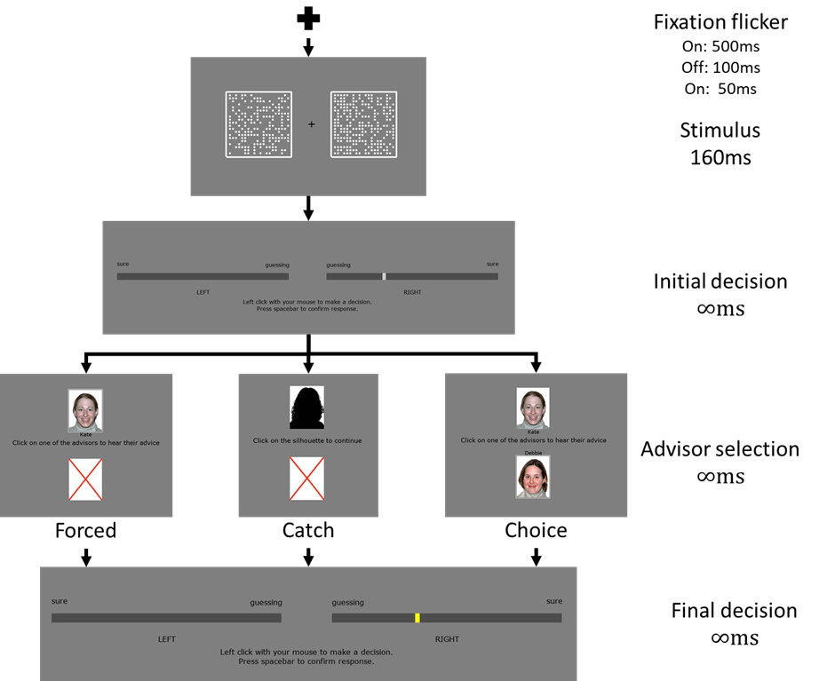
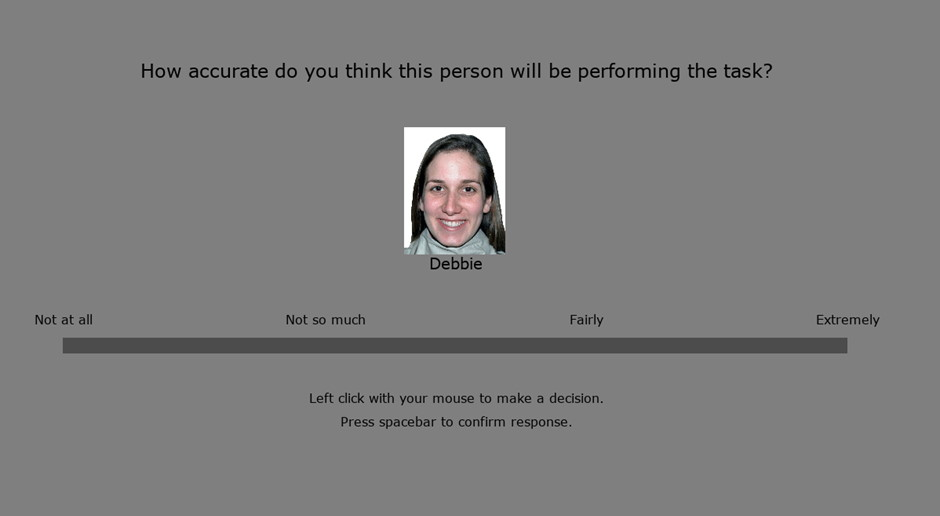

## Effects of confidence-contingent advice {#ac-cca}

The results of the experiments described previously (1A§\@ref(ac-acc-dots), 1B§\@ref(ac-acc-dates), 2A§\@ref(ac-agr-dots), 2B§\@ref(ac-agr-dates), 3A§\@ref(ac-ava-dots), 3B§\@ref(ac-ava-dates)) were mixed, but indicated overall [and in combination with @pescetelliRoleDecisionConfidence2021] that people prefer accurate over inaccuate advisors when they can assess the advisors based on feedback, but prefer agreeing over disagreeing advisors when feedback is absent. 
Here we test whether advice selection can depend on a more sophisticated mechanism when feedback is absent.

This mechanism, proposed by @pescetelliRoleDecisionConfidence2021, weights the updating of trust in an agreeing advisor using the confidence of the judge's initial estimate.
Where the initial estimate is made with high confidence, agreement is taken to indicate that the advisor has a high probability of being correct, while disagreement is taken to indicate that the advisor has a low probability of being correct.
Where the initial estimate is low confidence, however, neither agreement nor disagreement is a good indicator of correctness. 
This intuition accords neatly with a Bayesian approach: the greater the uncertainty around whether or not the advice is correct, the lower the strength of the updating of trust in the advisor.

This mechanism can be directly tested by using advisors who have different agreement rates contingent upon the judge's confidence in their initial estimate, and @pescetelliRoleDecisionConfidence2021 used just such an approach to provided evidence for the mechanism in the domain of advisor influence.
Here, a very similar design is used to explore this effect in the domain of advisor choice.

Unlike the previous experiments, in which the same approach was implemented in both the Dots and the Dates tasks, this experiment uses only the Dots task. 
To balance the advisors' accuracy and agreement rates (such that only their _confidence-contingent agreement_ is varied), precise control is required over the participants' initial estimate accuracy. 
Such control is achieved using a staircasing procedure in the Dots task, and cannot be done in the Dates task (because there are too few questions to choose from, the questions have too wide a range of difficulty, and a question's difficulty varies dramatically and unpredictably between participants).

Instead of a Dots and a Dates task, this experiment is repeated in two versions of the Dots task.
The first version, directly adapted from @pescetelliRoleDecisionConfidence2021, was performed in the lab with a correspondingly low sample size and high number of trials per participant. 
The second version was a replication run online and with a larger sample size and lower number of trials per participant.
For ease of reference, the lab study is referred to as 'Lab study', while the online study retains the numbering and lettering used previously, meaning it is designated Experiment 4A.
There is no Experiment 4B, because it was not possible to use the Dates task with this design of advisors.^[The lab version of this study was the first one performed in chronological order. The results were not as anticipated, so a replication was run online (Experiment 4A). These results were also odd, so other experiments were run to investigate the stability of the basic effects (Experiments 1A, 2A, and 3A).] 

### Lab study of confidence-contingent advice {#ac-cca-lab}

@pescetelliRoleDecisionConfidence2021 used a judge-advisor system to demonstrate that judges are influenced to a greater extent by advisers who share their biases.
Participants played the role of judge in a judge-advisor system, while the advisers were virtual agents whose advice-giving was dependent upon the confidence and correctness of the judges' initial decisions.
The advisers were balanced for both overall agreement with the judge and objective correctness of advice.
This was achieved by varying the agreement rates for the advisors contingent on the confidence of the judge's initial estimate. 
The Bias-sharing advisor would agree more frequently when the participant expressed high confidence in their initial estimate and less frequently when the participant expressed low confidence in their initial decision.
The Anti-bias advisor did the opposite.
Crucially, advisors performed identically on the largest minority of trials (when judges were moderately confident in their initial estimates), allowing the advisors to be compared directly on these trials [@pescetelliRoleDecisionConfidence2021].
We place participants in a similar paradigm in which they are given a choice between advisers, and hypothesise that they will more frequently seek advice from the _Bias Sharing_ advisor than from the _Anti Bias_ advisor.
We predict that, given a choice, judges will prefer to receive advice from a _Bias Sharing_ advisor over receiving advice from an advisor who does not share the judge’s bias.

#### Open scholarship practices

This experiment was preregistered at https://aspredicted.org/ze3tn.pdf.
One analysis in the preregistration is not reported here because the results are non-significant and they represented a branch of analysis that we sidelined in other experiments. 
This analysis explored participants' subjective assessments of advisors.
The experiment data are available in the `esmData::` package for R from \mccorrect{!TODO[Zenodo esmData]}, and also directly from https://osf.io/vgcnb/.
The code for running the experiment can be obtained from https://github.com/mjaquiery/nofeedback_trust.

#### Method {#ac-cca-lab-m}

```{r ac-ex1-load, include = F}

rm(list = ls()); source('scripts_and_filters/general_setup.R')

data("dotstask_lab")

dotstask_lab <- lapply(dotstask_lab, \(x) rename(x, pid = participantId))

# unpack
participants <- dotstask_lab$participants
advisors <- dotstask_lab$advisors
trials <- dotstask_lab$trials
questionnaires <- dotstask_lab$questionnaires

advisors <- advisors %>%
  filter(advice.type != "", pid %in% participants$pid) %>%
  mutate(Advisor = case_when(
    advice.type == 0 ~ 'Neutral',
    advice.type == 1 ~ 'Bias-sharing',
    advice.type == 2 ~ 'Anti-bias'
  ))

trials <- trials %>% 
  filter(pid %in% participants$pid) %>%
  left_join(
    select(advisors, pid, id, Advisor), 
    by = c('pid', advisorId = 'id')
  ) %>%
  mutate( 
    # Rename and correct to zero-indexing
    choice1 = map_dbl(choice, ~ .[1]), choice2 = map_dbl(choice, ~ .[2]),
    initialConfidence = abs(cj1), finalConfidence = abs(cj2),
    initialAnswer = int1 - 1, finalAnswer = int2 - 1,
    switch = int1 != int2,
    correctAnswer = wherelarger - 1,
    confidenceCategory = case_when(
      step == -1 ~ "Low",
      step == 0 ~ "Medium",
      step == 1 ~ "High"
    ),
    adviceSide = case_when(
      obsacc == 1 ~ correctAnswer,
      obsacc == 0 ~ 1 - correctAnswer
    )
  ) %>%
  select(
    pid, id, block, practice, feedback, correctAnswer, matches('^initial'), 
    confidenceCategory, advisorId, Advisor, adviceSide, obsacc, agree,
    matches('^final'), switch, matches('choice[12]'), step, contains('time')
  ) %>% 
  annotate_responses(max_conf = 55)

```

```{r ac-ex1-exclusions}

# Exclusions
accuracyRange <- c(.6, .9)
preRegParticipants <- 24

tmp <- trials %>% 
  nest(d = -pid) %>%
  mutate(d = map_dbl(d, ~ mean(.$initialAnswerCorrect)))

exclusions <- tibble(pid = unique(trials$pid)) %>%
  mutate(
    `Accuracy too low` = pid %in% filter(tmp, d < accuracyRange[1])$pid,
    `Accuracy too high` = pid %in% filter(tmp, d > accuracyRange[2])$pid
  )

do_exclusions(exclusions)

tmp <- trials %>% 
  nest(d = -pid) %>% 
  rowid_to_column() %>% 
  filter(rowid > preRegParticipants)

exclusions <- exclusions %>% mutate(`Too many participants` = pid %in% tmp$pid)

do_exclusions(exclusions, backup = F)


# Filter out practice trials and excluded participants
trials <- trials %>% 
  filter(
    !practice,
    block > 2,
    pid %in% participants$pid
  )

```

The method for the lab study was different in many small ways from the general method used for the Dots task online.
The basic trial experience was the same: participants saw two boxes of dots flashed breifly on the screen, and were asked to indicate which box had more dots, along with how confident they were in this initial estimate. 
Participants then received advice and provided a final decision.
On some trials participants were able to choose which of their advisors would provide the advice (Figure \@ref(fig:ac-ex1-paradigm)).

```{r ac-ex1-paradigm, fig.align='center', fig.caption="Experiment 1 procedure.  The task began with a blank screen containing only a fixation cross and progress bar. Momentarily prior to the onset of the stimuli the fixation cross flickered. The stimuli, two rectangles containing approximately 200 dots each, appeared for 0.16s, one on either side of the fixation cross. Once the stimuli disappeared, a response-collection screen appeared and prompted the participant to indicate their initial decision and its confidence by selecting a point within one of two regions. The left region indicated a decision that the target was on the left, and increasingly-leftwards points within that region indicated increasing confidence in that decision. The right region indicated a decision that the target was on the right, and increasingly-rightwards points within that region indicated increasing confidence in that decision.  Next, the participant was presented with a choice screen. The choice screen displayed two images, one at the top of the screen and one at the bottom. The images were one of the following: an advisor portrait, a silhouette, or a red cross. The red cross was not selectable, forcing participants to choose the other option. The silhouette offered no advice, and was only ever offered as a forced choice. Selecting an advisor image provided the participant with the opinion of that advisor on the trial.  Having heard the advice, the participant was again presented with the response-collection screen, with a yellow indicator marking their original response. A second (final) judgement was collected using this screen (except on catch trials), and the trial concluded.", out.width="100%"}

```

Overall, `r nrow(exclusions) + 1` participants were recruited from the University of Oxford participant recruitment platforms took part in the experiment and attended experimental sessions.
`r nrow(exclusions) - nrow(participants)` participant was excluded because the preregistered sample size had already been met when their data were collected, and one participant's data was lost due to technical issues.
The remaining participants had an average age of `r num2str(mean(participants$age))` (±SD `r num2str(sd(participants$age), 1)`).
Their self-identified genders were give as `r sum(tolower(participants$gender) == 'm')` male, `r sum(tolower(participants$gender) == 'f')` female, `r sum(tolower(participants$gender) != 'm' & tolower(participants$gender) != 'f')` other.
Participants were compensated for their time with either course credit for a psychology degree, or 10GBP.

Each participant completed 363 trials (51 practice trials over 2 blocks + 12 x 26-trial experimental blocks).
Prior to the first experimental block, after the final experimental block, and after the 4th and 8th experimental blocks, participants were presented with a questionnaire (Figure \@ref(fig:ac-ex1-questionnaire)).
The questionnaire contained 4 questions for each advisor.
The questions asked for the judge’s assessment of the advisor’s likeability, trustworthiness, influence, and ability to do the task.
The questions presented before the first experimental block were worded prospectively (e.g.
‘How much are you going to like this person?’ as opposed to ‘How much do you like this person?’).
Answers were provided by moving a sliding scale below the advisor’s portrait towards the right for more favourable responses (marked ‘extremely’) or towards the left for less favourable responses (marked ‘not at all’).

```{r ac-ex1-questionnaire, fig.align='center', fig.caption="Experiment 1 advisor questionnaire.  Participants rated advisors on a number of different dimensions.", out.width="100%"}

```

Each participant attended the experiment individually, was welcomed and briefed on the experimental procedure, and had their informed consent recorded, before the experiment began.
They were seated a comfortable distance in front of a 24’ (1440x900 resolution) computer screen in a small, quiet, and dimly-lit room.
The experiment took place wholly on the computer, and lasted around 45 minutes.

The experiment was programmed in MATLAB R2017b [@MATLAB2017] using the Psychtoolbox-3 package [@kleiner2007s].

##### Key differences from online version

There were several differences from the online version of the task that are worth mentioning.
First, there were more trials and the experiment took longer to complete.
Second, when the participant was forced to have advice from one or other advisor, they were presented with the advisor choice screen and one of the options was a blank advisor that they were unable to select.
This meant that advisor influence on the forced trials could be analysed as compared to choice trials.
Third, 8% of trials were catch trials on which no advice was offered.
Fourth, the questionnaires were more detailed and more numerous, and contained no free text fields.
Fifth, participants had the opportunity to discuss the experiment with the experimenter after the experiment was complete, although none made use of this opportunity.

##### Advice profiles {#ex1-m-profiles}

The two advisor profiles used in the experiment were Bias sharing and Anti-bias.
The advisors are balanced for their overall accuracy and agreement rates, but the Bias sharing advisor agrees more frequently with participants when their initial estimate is correct and made with relatively high confidence.
The Anti-bias advisor agrees more frequently with participants when their initial estimate is correct and made with relatively low confidence (Table \@ref(tab:ac-ex1-advisor-profiles)).
Note that the overall correctness and agreement rates of the advisers are equivalent.
Importantly, on a large minority of trials, the middle 40%, the advisers are exactly equivalent, meaning these trials can be compared directly without confounds arising from agreement rates and initial confidence.

```{r ac-ex1-advisor-profiles-r} 

ex1.table <- tribble(
  ~ Advisor, ~ Low, ~ Medium, ~ High, ~ `Correct`, ~ `Incorrect`, ~ Overall, ~ Accuracy,
  "Bias-sharing", 60, 70, 80, 70, 30, 70 * .71 + 30 * .29, 70 * .71 + 70 * .29,
  "Anti-bias", 80, 70, 60, 70, 30, 70 * .71 + 30 * .29, 70 * .71 + 70 * .29
) %>%
  rename_with(~ paste(., footnote_marker_alphabet(2)), .cols = c(Low, High)) %>% 
  rename_with(~ paste(., footnote_marker_alphabet(3)), .cols = Medium) %>%
  rename_with(~ paste(., footnote_marker_alphabet(4)), .cols = Correct) %>% 
  rename_with(~ paste(., footnote_marker_alphabet(5)), .cols = Overall) %>% 
  rename_with(~ paste(., footnote_marker_alphabet(6)), .cols = Accuracy)

kable(ex1.table, caption = "\\label{tab:ac-ex1-advisor-profiles}Advisor advice profiles for Lab experiment") %>%
  kable_styling() %>%
  column_spec(7, bold = T) %>%
  add_header_above(tribble(
    ~ entry, ~ colspan,
    "", 1,
    paste0("Initial estimate confidence ", footnote_marker_alphabet(1)), 3, 
    "Subtotals by initial estimate correctness", 2,
    "", 2
  )) %>%
  add_header_above(c("", "Agreement" = 6, "")) %>%
  add_footnote(
    c(
      "Only correct trials received confidence-contingent advice",
      "30\\% of trials",
      "40\\% of trials",
      "Average correct agreement is the weigthed average of the previous three columns",
      "Overall agreement is p(correct) * p(agree|correct) + p(¬correct) * p(agree|¬correct)",
      "Overall accuracy is p(correct) * p(agree|correct) + p(¬correct) * p(¬agree|¬correct)"
    )
  )

```

#### Results {#ac-ex1-r}

##### Exclusions

Participants could be excluded for having initial estimate accuracy below 60% or above 90%, or for performing the experiment after the stated sample size had been reached. 
No participants were excluded for having accuracy out of range. 
`r nrow(exclusions) - nrow(participants)` participant was excluded for being extraneous.

##### Advisor performance

```{r ac-ex1-r-advice} 

left_join(
  left_join(
    # By confidence
    trials %>% 
      filter(as.logical(initialAnswerCorrect)) %>%
      group_by(Advisor, confidenceCategory, initialAnswerCorrect, pid) %>%
      summarise(agr = mean(agree, na.rm = T), .groups = 'drop') %>%
      group_by(Advisor, confidenceCategory, initialAnswerCorrect) %>%
      summarise(agr = mean(agr, na.rm = T), .groups = 'drop') %>%
      filter(!is.na(confidenceCategory)) %>%
      select(-initialAnswerCorrect) %>% 
      pivot_wider(names_from = confidenceCategory, values_from = agr) %>%
      select(Advisor, Low, Medium, High),
    # By correctness
    trials %>% 
      filter(!is.na(Advisor)) %>%
      mutate(
        initialAnswerCorrect = if_else(
          as.logical(initialAnswerCorrect), 
          "Correct", 
          "Incorrect"
        )
      ) %>%
      group_by(Advisor, initialAnswerCorrect, pid) %>%
      summarise(agr = mean(agree, na.rm = T), .groups = 'drop') %>%
      group_by(Advisor, initialAnswerCorrect) %>%
      summarise(agr = mean(agr, na.rm = T), .groups = 'drop') %>%
      pivot_wider(names_from = initialAnswerCorrect, values_from = agr),
    by = "Advisor"
  ),
  # Overall
  trials %>% 
    filter(!is.na(Advisor)) %>%
    group_by(Advisor, pid) %>%
    summarise(
      agr = mean(agree, na.rm = T), 
      acc = mean(obsacc, na.rm = T),
      .groups = 'drop'
    ) %>%
    group_by(Advisor) %>%
    summarise(
      agr = mean(agr, na.rm = T), 
      acc = mean(acc, na.rm = T),
      .groups = 'drop'
    ) %>%
    rename(Overall = agr, Accuracy = acc),
  by = "Advisor"
)  %>% 
  mutate(
    across(-Advisor, ~ num2str(. * 100, 1)),
    Advisor = glue("{Advisor}")
  ) %>%
  bind_rows(
    ex1.table %>%
      mutate(
        across(-Advisor, as.character),
        Advisor = glue("{Advisor} (Target)")
      ) %>%
      rename_with(~ str_extract(., '\\w+'))
  ) %>%
  arrange(Advisor) %>%
  kable(caption = "\\label{tab:ac-ex1-r-advice-t}Advisor agreement for Lab experiment",
        align = c('l', 'r', 'r', 'r', 'r', 'r', 'r'), 
        escape = F) %>%
  kable_styling() %>%
  row_spec(c(2, 4), italic = T) %>%
  add_header_above(tribble(
    ~ entry, ~ colspan,
    "", 1,
    "Initial estimate confidence", 3, 
    "Subtotals by initial estimate correctness", 2,
    "", 2
  )) %>%
  add_header_above(c("", "Agreement" = 6, ""))

```

The advisors agreed with the participants' initial estimates at close to target rates in all confidence categories, and were as accurate on average as expected (Table \@ref(tab:ac-ex1-r-advice-t)).

##### \OpenScience{prereg} Advisor selection

```{r ac-ex1-r-h}

test <- trials %>% 
  filter(
    !is.na(Advisor), 
    !is.na(confidenceCategory),
    choice1 %in% 1:2, 
    choice2 %in% 1:2
  )

bs_pick <- test %>%
  group_by(pid) %>%
  summarise(pPickBS = mean(Advisor == "Bias-sharing"))

```

We hypothesised that the participants would display different pick rates for the Bias Sharing advisor versus the Anti Bias advisor.
This hypothesis was evaluated by calculating the proportion of choice trials on which each participant picked the Bias Sharing advisor, and then testing these values as a one-sample t-test against the null hypothesis that the pick rates would be 0.5.
No support was found for this hypothesis (`r cat(md.ttest(bs_pick$pPickBS, mu = .5, labels = "M~P(BiasSharing)~"))`; Figure \@ref(fig:ac-ex1-r-selection)), although the Bayesian test indicated that the data were not sufficient to conclude that no effect was present.
There was considerable variability across participants in the overall pick rate for the Bias Sharing advisor (range = [`r range(bs_pick$pPickBS) %>% num2str(isProportion = T) %>% paste(collapse = ", ")`]).

```{r ac-ex1-r-selection, fig.align='center', fig.caption="Advisor selection.  Proportion of the time each participant picked the Bias Sharing advisor. Faint lines and dots indicate data from individual participants, while the large dot indicates the mean proportion across all participants. The dashed reference line indicates picking both advisors equally, as would be expected by chance. Error bars give 95\\% confidence intervals.", out.width="100%"}

pick <- test %>%
  group_by(pid, confidenceCategory) %>%
  summarise(pPickBS = mean(Advisor == "Bias-sharing"), .groups = 'drop') %>%
  bind_rows(bs_pick %>% mutate(confidenceCategory = "All")) %>%
  mutate(
    `Feedback condition` = "No feedback",
    confidenceCategory = factor(
      confidenceCategory, 
      levels = c("Low", "Medium", "High", "All"),
      ordered = T
    )
  )

bf <- ttestBF(bs_pick$pPickBS, mu = .5)

pick %>%
  ggplot(aes(x = confidenceCategory, y = pPickBS)) +
  geom_hline(linetype = 'dashed', yintercept = .5) +
  geom_line(
    aes(group = factor(pid)), 
    alpha = .25,
    data = filter(pick, confidenceCategory != "All")
  ) +
  stat_summary(
    geom = "errorbar",
    fun.data = mean_cl_boot,
    width = 0,
    data = filter(pick, confidenceCategory != "All")
  ) +
  stat_summary(
    geom = "point",
    fun = mean,
    size = 4,
    data = filter(pick, confidenceCategory != "All")
  ) +
  geom_violindot(
    size_dots = .4, 
    data = filter(pick, confidenceCategory == "All")
  ) +
  geom_violinhalf(
    aes(fill = `Feedback condition`, colour = `Feedback condition`), 
    data = filter(pick, confidenceCategory == "All")
  ) +
  annotate(
    geom = 'label', 
    label = paste0('BF vs chance\n', bf2str(exp(bf@bayesFactor$bf))),
    x = 4, 
    y = 1.1
  ) +
  scale_y_continuous(limits = c(0, 1.15), breaks = seq(0, 1, length.out = 5)) +
  scale_x_discrete(limits = levels(pick$confidenceCategory)) +
  labs(y = 'p(Choose Bias-sharing advisor)', x = "Confidence category") +
  theme(axis.ticks.x = element_blank(), axis.line.x = element_blank())

```

###### \OpenScience{prereg} Advisor selection on medium-confidence trials

The advisers differed in their advice-giving as a function of the judge’s initial confidence.
In trials where the judge’s initial decision was made with medium confidence, however, the advisers were equal on judge confidence and agreement rate.
Comparing selection rates for these trials alone revealed a clear preference for the Bias Sharing advisor (`r cat(md.ttest(pick %>% filter(confidenceCategory == "Medium") %>% pull(pPickBS), mu = .5, labels = "M~P(BiasSharing)~"))`; Figure \@ref(fig:ac-ex1-selection) "Medium" confidence category), although the Bayesian analysis again indicated an insensitive result, albeit in the hypothesised direction.

##### \OpenScience{prereg} Advisor influence {#ex1-influence}

```{r ac-ex1-r-influence-aov}

tmp <- trials %>%
  filter(
    !is.na(Advisor), 
    !practice
  ) %>%
  mutate(
    pid = factor(pid),
    Advisor = factor(Advisor),
    agree = factor(agree),
    trialType = factor(
      case_when(
        choice1 %in% 1:2 & choice2 %in% 1:2 ~ "Choice",
        T ~ "Force"
      )
    ),
    inf = adviceInfluence,
    cappedInf = adviceInfluenceCapped
  ) %>%
  group_by(pid, Advisor, trialType, agree) %>%
  summarise(across(contains('inf'), mean), .groups = 'drop')

aov_inf <- tmp %>%
  ezANOVA(
    dv = inf,
    wid = pid,
    within = c(Advisor, trialType, agree)
  )

aov_inf <- aov_inf$ANOVA %>% 
  mutate(
    Effect = str_replace_all(Effect, "trialType", "Trial type"),
    Effect = str_replace_all(Effect, "agree", "Advisor agreement"),
    s = glue("F({DFn},{DFd})={num2str(F)}, p={prop2str(p)}")
  ) 

aov_inf_cap <- tmp %>% 
  ezANOVA(
    dv = cappedInf,
    wid = pid, 
    within = c(Advisor, trialType, agree)
  ) %>%
  .$ANOVA %>% 
  mutate(
    Effect = str_replace_all(Effect, "trialType", "Trial type"),
    Effect = str_replace_all(Effect, "agree", "Advisor agreement"),
    s = glue("F({DFn},{DFd})={num2str(F)}, p={prop2str(p)}")
  )

kableANOVA(
  aov_inf, 
  caption = "\\label{tab:ac-ex1-influence-t}ANOVA of Advisor influence in Lab experiment"
)

# Relevant marginal means
mmAdvisor <- trials %>%
  filter(!is.na(Advisor), !practice) %>%
  group_by(pid, Advisor) %>% 
  summarise(
    inf = mean(adviceInfluence),
    infCapped = mean(adviceInfluenceCapped),
    .groups = 'drop'
  ) %>%
  nest(d = -Advisor) %>%
  mutate(
    inf = map(d, ~ mean_cl_normal(.$inf)),
    infCapped = map(d, ~ mean_cl_normal(.$infCapped))
  ) %>% 
  select(-d) %>%
  unnest(cols = c(inf, infCapped), names_sep = "_") %>%
  mutate(
    across(-Advisor, num2str),
    s = glue("M~{Advisor}~={inf_y} [95%CI {inf_ymin}, {inf_ymax}]"),
    sCapped = glue("M~{Advisor}~={infCapped_y} [95%CI {infCapped_ymin}, {infCapped_ymax}]")
  )

mmAgree <- trials %>%
  filter(!is.na(Advisor), !practice) %>%
  group_by(pid, agree) %>% 
  summarise(
    inf = mean(adviceInfluence),
    infCapped = mean(adviceInfluenceCapped),
    .groups = 'drop'
  ) %>%
  nest(d = -agree) %>%
  mutate(
    inf = map(d, ~ mean_cl_normal(.$inf)),
    infCapped = map(d, ~ mean_cl_normal(.$infCapped))
  ) %>% 
  select(-d) %>%
  unnest(cols = c(inf, infCapped), names_sep = "_") %>%
  mutate(
    agree = case_when(agree == 0 ~ "Disagree", agree == 1 ~ "Agree"),
    across(-agree, num2str),
    s = glue("M~{agree}~={inf_y} [95%CI {inf_ymin}, {inf_ymax}]"),
    sCapped = glue("M~{agree}~={infCapped_y} [95%CI {infCapped_ymin}, {infCapped_ymax}]")
  )

mmTrialType <- trials %>%
  filter(!is.na(Advisor), !practice) %>%
  mutate(
    trialType = case_when(
        choice1 %in% 1:2 & choice2 %in% 1:2 ~ "Choice",
        T ~ "Force"
      )
  ) %>%
  group_by(pid, trialType) %>% 
  summarise(
    inf = mean(adviceInfluence),
    infCapped = mean(adviceInfluenceCapped),
    .groups = 'drop'
  ) %>%
  nest(d = -trialType) %>%
  mutate(
    inf = map(d, ~ mean_cl_normal(.$inf)),
    infCapped = map(d, ~ mean_cl_normal(.$infCapped))
  ) %>% 
  select(-d) %>%
  unnest(cols = c(inf, infCapped), names_sep = "_") %>%
  mutate(
    across(-trialType, num2str),
    s = glue("M~{trialType}~={inf_y} [95%CI {inf_ymin}, {inf_ymax}]"),
    sCapped = glue("M~{trialType}~={infCapped_y} [95%CI {infCapped_ymin}, {infCapped_ymax}]")
  )

```

Previous work in our lab demonstrated that the agree-in-confidence advisor exerted greater influence on the judges’ final decisions than the agree-in-uncertainty advisor [@pescetelliRoleDecisionConfidence2021].
Influence was examined with a 2x2x2 (Bias-sharing versus Anti-bias advisor; choice versus forced trials; agreement versus disagreement trials) ANOVA (Figure \@ref(fig:ac-ex1-influence-r)).
This was chronologically the first experiment we ran, and the analysis was preregistered prior to the development of the capped influence measure designed to allow agreement and disagreement to be compared more fairly.
No main effect was found for advisor (`r aov_inf$s[1]`, `r mmAdvisor %>% filter(Advisor == "Bias-sharing") %>% pull(s)`, `r mmAdvisor %>% filter(Advisor == "Anti-bias") %>% pull(s)`), meaning that the previous finding was not replicated.
As shown in Table \@ref(tab:ac-ex1-influence-t), the only statistically significant effect was the main effect of agreement, with disagreement producing higher influence than agreement (`r aov_inf$s[4]`, `r mmAgree %>% filter(agree == "Agree") %>% pull(s)`, `r mmAgree %>% filter(agree == "Disagree") %>% pull(s)`).

When this analysis was repeated with the capped influence values (General Method - Capped influence§\@ref(m-analysis-dv-influence)) the effect of agreement was still significant, but less so (`r aov_inf_cap$s[1]`, `r mmAdvisor %>% filter(Advisor == "Bias-sharing") %>% pull(sCapped)`, `r mmAdvisor %>% filter(Advisor == "Anti-bias") %>% pull(sCapped)`), and a main effect of trial type also emerged (raw influence: `r aov_inf$s[2]`, `r mmTrialType %>% filter(trialType == "Choice") %>% pull(s)`, `r mmTrialType %>% filter(trialType == "Force") %>% pull(s)`; capped influence: `r aov_inf_cap$s[2]`, `r mmTrialType %>% filter(trialType == "Choice") %>% pull(sCapped)`, `r mmTrialType %>% filter(trialType == "Force") %>% pull(sCapped)`).

```{r ac-ex1-influence-r, fig.align='center', fig.caption="Advisor influence.  Influence of advice from each advisor by advisor, agreement, and trial type. Faint lines and indicate data from individual participants, while the dots indicate the mean proportion across all participants. Error bars give 95\\% confidence intervals.  Note: vertical axis is truncated to show group differences more clearly, the theoretical maximum influence given the scale is 110. The minimum is 0 as shown.", out.width="100%"}

tmp %>%
  mutate(
    trialType = glue("{trialType} trials"),
    agree = case_when(agree == 1 ~ "Agreement", agree == 0 ~ "Disagreement")
  ) %>%
  ggplot(aes(x = agree, y = inf, colour = Advisor)) +
  geom_hline(yintercept = 0, linetype = 'dashed') +
  geom_line(alpha = .25, aes(group = paste0(Advisor, pid))) +
  stat_summary(aes(group = Advisor), geom = "line", fun = mean,
               position = position_dodge(width = .25), size = 1) +
  stat_summary(aes(group = Advisor), geom = "errorbar", fun.data = mean_cl_normal,
               width = 0, size = 1, position = position_dodge(width = .25)) +
  stat_summary(aes(group = Advisor), geom = "point", fun = mean,
               size = 4, position = position_dodge(width = .25)) +
  facet_grid(~trialType) +
  labs(x = "Agreement between advisor and participant",
       y = "Influence of the advice (raw)") 

```

###### \OpenScience{prereg} Advisor influence on medium confidence trials

```{r ac-ex1-r-influence-med}
tmp <- trials %>%
  filter(
    !is.na(Advisor), 
    !practice,
    confidenceCategory == "Medium"
  ) %>%
  mutate(
    pid = factor(pid),
    Advisor = factor(Advisor),
    agree = factor(agree),
    trialType = factor(
      case_when(
        choice1 %in% 1:2 & choice2 %in% 1:2 ~ "Choice",
        T ~ "Force"
      )
    ),
    inf = adviceInfluence,
    cappedInf = adviceInfluenceCapped
  ) %>%
  filter(trialType == "Force") %>%
  group_by(pid, Advisor, trialType, agree) %>%
  summarise(across(contains('inf'), mean), .groups = 'drop')

aov_inf_m <- tmp %>%
  ezANOVA(
    dv = inf,
    wid = pid,
    within = c(Advisor, agree)
  )

aov_inf_m <- aov_inf_m$ANOVA %>% 
  mutate(
    Effect = str_replace_all(Effect, "agree", "Advisor agreement"),
    s = glue("F({DFn},{DFd})={num2str(F)}, p={prop2str(p)}")
  ) 

aov_inf_cap_m <- tmp %>% 
  ezANOVA(
    dv = cappedInf,
    wid = pid, 
    within = c(Advisor, agree)
  ) %>%
  .$ANOVA %>% 
  mutate(
    Effect = str_replace_all(Effect, "agree", "Advisor agreement"),
    s = glue("F({DFn},{DFd})={num2str(F)}, p={prop2str(p)}")
  )

# Relevant marginal means
mmmAdvisor <- trials %>%
  filter(!is.na(Advisor), !practice) %>%
  group_by(pid, Advisor) %>% 
  summarise(
    inf = mean(adviceInfluence),
    infCapped = mean(adviceInfluenceCapped),
    .groups = 'drop'
  ) %>%
  nest(d = -Advisor) %>%
  mutate(
    inf = map(d, ~ mean_cl_normal(.$inf)),
    infCapped = map(d, ~ mean_cl_normal(.$infCapped))
  ) %>% 
  select(-d) %>%
  unnest(cols = c(inf, infCapped), names_sep = "_") %>%
  mutate(
    across(-Advisor, num2str),
    s = glue("M~{Advisor}~={inf_y} [95%CI {inf_ymin}, {inf_ymax}]"),
    sCapped = glue("M~{Advisor}~={infCapped_y} [95%CI {infCapped_ymin}, {infCapped_ymax}]")
  )

mmmAgree <- trials %>%
  filter(!is.na(Advisor), !practice) %>%
  group_by(pid, agree) %>% 
  summarise(
    inf = mean(adviceInfluence),
    infCapped = mean(adviceInfluenceCapped),
    .groups = 'drop'
  ) %>%
  nest(d = -agree) %>%
  mutate(
    inf = map(d, ~ mean_cl_normal(.$inf)),
    infCapped = map(d, ~ mean_cl_normal(.$infCapped))
  ) %>% 
  select(-d) %>%
  unnest(cols = c(inf, infCapped), names_sep = "_") %>%
  mutate(
    agree = case_when(agree == 0 ~ "Disagree", agree == 1 ~ "Agree"),
    across(-agree, num2str),
    s = glue("M~{agree}~={inf_y} [95%CI {inf_ymin}, {inf_ymax}]"),
    sCapped = glue("M~{agree}~={infCapped_y} [95%CI {infCapped_ymin}, {infCapped_ymax}]")
  )

```

The agree-in-confidence and agree-in-uncertainty advisers differed by design in the frequency with which they agree with the participant as a function of the participant’s confidence in their initial estimate.
To control for the effects of initial confidence on influence, the above analysis was repeated using only those trials on which the initial estimate was correct and given with medium confidence.
In a deviation from preregistration, this analysis was constrained to only forced trials because some participants had missing data for some advisor-trial type-agreement contingencies in the Medium confidence trials.

The results were qualitatively identical to those for the trials at all confidence levels: a main effect of agreement (raw influence: `r aov_inf_m$s[2]`, `r mmmAgree %>% filter(agree == "Agree") %>% pull(s)`, `r mmmAgree %>% filter(agree == "Disagree") %>% pull(s)`; capped influence: `r aov_inf_cap_m$s[2]`, `r mmmAgree %>% filter(agree == "Agree") %>% pull(sCapped)`, `r mmmAgree %>% filter(agree == "Disagree") %>% pull(sCapped)`); and no signifcant effect of advisor (raw influence: `r aov_inf_m$s[1]`, `r mmmAdvisor %>% filter(Advisor == "Bias-sharing") %>% pull(s)`, `r mmmAdvisor %>% filter(Advisor == "Anti-bias") %>% pull(s)`; capped influence: `r aov_inf_cap_m$s[1]`, `r mmmAdvisor %>% filter(Advisor == "Bias-sharing") %>% pull(sCapped)`, `r mmmAdvisor %>% filter(Advisor == "Anti-bias") %>% pull(sCapped)`) or interaction (raw influence: `r aov_inf_m$s[3]`; capped influence: `r aov_inf_cap_m$s[3]`)

##### \OpenScience{prereg} Sensitivity to the manipulation

```{r ac-ex1-r-sensitivity}

tmp <- test %>%
  group_by(pid, confidenceCategory) %>%
  summarise(pPickBS = mean(Advisor == "Bias-sharing"), .groups = 'drop') %>%
  pivot_wider(names_from = confidenceCategory, values_from = pPickBS)

```

Finally, we planned to investigate the hypothesis that participants’ choice of advisor would be sensitive to the differential agreement strategies of the advisers, e.g. participants might preferentially select the advisor with the greater likelihood of agreement given their initial confidence.
This was investigated by testing the participants’ mean Bias-sharing advisor pick rate in high- versus low-confidence trials.
Pick rates did not differ (`r cat(md.ttest(tmp$High, tmp$Low, paired = T, labels = c('M~High confidence~', 'M~Low confidence~')))`); Figure \@ref(fig:ex1-selection)).

##### Follow-up tests

##### Effect of initial agreement

This experiment was run in the lab, and was longer than the online experiments to help justify participants' travelling time.
This meant that the experiment contained multiple blocks, and consequently that we could explore the effects of early experience of advice on subsequent advisor preferences.
We hypothesised that one reason we found no weak evidence for different pick rates for different advisors was that initial exposure to the advisers may have overshadowed information in subsequent blocks.
To investigate this possibility, we examined the effect that agreement in the first experimental block had upon choices throughout the rest of the experiment (Figure \@ref(fig:ex1-initial-agreement)).
A simple regression (Table \@ref(tab:ex1-initial-agreement-t)) indicated that the extent to which the Bias-sharing advisor agreed with the participant more frequently than the Anti-bias advisor in the first experimental block (Block 3) was a significant predictor of the preference for picking the Bias-sharing advisor in subsequent blocks.

```{r ex1-initial-agr}

tmp <- trials %>%
  filter(
    !is.na(Advisor),
    block > 2
  ) %>%
  mutate(firstBlock = if_else(block == 3, "firstBlock", "later")) %>%
  nest(d = -c(pid, firstBlock)) %>%
  mutate(
    pPickBS = map_dbl(d, ~ mean(.$Advisor == "Bias-sharing")),
    agreeDiff = map_dbl(d, function(.) {
      mean(.$agree[.$Advisor == "Bias-sharing"]) -
        mean(.$agree[.$Advisor == "Anti-bias"])
    })
  ) %>%
  select(-d) %>%
  pivot_wider(names_from = firstBlock, values_from = c(pPickBS, agreeDiff))

eq <- lm(
  pPickBS_later ~ firstBlockAgreeDifference, 
  data = rename(tmp, firstBlockAgreeDifference = agreeDiff_firstBlock)
)

kableLM(
  eq, 
  caption = "\\label{tab:ex1-initial-agreement-t}Linear regression of pick rate in later blocks by initial agreement difference"
)

```


```{r ex1-initial-agreement, fig.align='center', fig.caption="Initial agreement and subsequent preference.  figure shows the relationship between the agreement rate of the Bias Sharing advisor in the first experimental block (relative to the Anti Bias advisor) and the proportion of the time the participant picked the Bias Sharing advisor in later blocks. The dashed line shows the best-fit regression line, with shaded 99\\% confidence intervals."}

eq <- tidy(eq)
eqTxt <- glue(
    "y = {a}{num2str(x)}{a}x + {b}{num2str(i)}{b}",
    i = eq$estimate[1],
    x = eq$estimate[2], 
    b = ifelse(eq$p.value[1] < .05, "**", ""),
    a = ifelse(eq$p.value[2] < .05, "**", "")
)

ggplot(tmp, aes(x = agreeDiff_firstBlock, y = pPickBS_later)) +
  geom_smooth(method = 'lm', formula = y ~ x, fullrange = T) +
  geom_point(alpha = .25) +
  scale_y_continuous(limits = c(0,1), expand = c(0,0)) +
  scale_x_continuous(limits = c(-1,1), expand = c(0,0)) +
  annotate(geom = 'richtext', label = eqTxt, colour = 'black',
           x = 0, y = .99, vjust = 1) +
  labs(x = "Block 3 Bias-sharing agreement rate difference",
       y = "P(Bias-sharing chosen | Block > 3)") +
  coord_fixed()

```

##### Subjective assessment and choice of advisors

Participants were asked to complete short questionnaires at several points in the experiment.
These questionnaires collected ratings on a 100 point scale for each advisor across four dimensions: three loosely inspired by @mayerIntegrativeModelOrganizational1995 accuracy, likeability, and influence; along with a general trustworthiness dimension. 
We did not observe significant differences in subjective ratings of the advisors at any time point.
While overall differences might not show up, it is plausible that participants who had stronger preferences for one or other advisor would pick that advisor more frequently.
We tested this using linear regression to predict the extent to which participants picked the Bias-sharing advisor from the differences in subjective advisor ratings.
The questionnaire answers did not evolve systematically over the duration of the experiment, so the analysis was conducted on the final (post-experiment) answers.

This analysis (Figure \@ref(fig:ex1-questionnaire-choice)) indicated that the association between subjective ratings and behavioural performance was present for the questionnaire dimensions of accuracy and trustworthiness, but not for influence or likeability.

```{r ex1-questionnaire-choice, fig.caption="Behavioural and self-report consistency.  Relationship between questionnaire response scores on each item for the Bias-sharing advisor minus scores for the Anti-bias advisor and overall pick rate for the Bias-sharing advisor. Lines show best-fit linear model and shaded areas give 95\\% confidence intervals for the parameters. The theoretical limits on the horizontal axis are [-100, 100]."}

Q_diffs <- questionnaires %>%
  filter(timePoint == 4) %>%
  left_join(
    select(advisors, pid, id, Advisor),
    by = c("pid", advisorId = "id")
  ) %>%
  select(pid, Advisor, questionNumber, answer) %>%
  pivot_wider(names_from = Advisor, values_from = answer) %>%
  mutate(BSminusAB = `Bias-sharing` - `Anti-bias`) %>%
  select(-`Bias-sharing`, -`Anti-bias`) %>%
  pivot_wider(
    names_from = questionNumber, 
    values_from = BSminusAB, 
    names_prefix = "Q"
  ) %>%
  left_join(
    test %>% 
      group_by(pid) %>%
      summarise(pPickBS = mean(Advisor == "Bias-sharing")),
    by = "pid"
  ) %>%
  rename_with(
    ~ case_when(
      . == "Q1" ~ "Accurate",
      . == "Q2" ~ "Likeable",
      . == "Q3" ~ "Trustworthy",
      . == "Q4" ~ "Influential",
      T ~ .
    )
  )
  
eqs <- Q_diffs %>%
  pivot_longer(
    -c(pid, pPickBS),
    names_to = "Dimension", 
    values_to = "Difference"
  ) %>%
  nest(d = -Dimension) %>%
  mutate(
    lm = map(d, ~ lm(pPickBS ~ Difference, data = .)),
    s = map_chr(
      lm, 
      ~ {
        . <- tidy(.)
        glue(
          "y = {a}{num2str(x, 3)}{a}x + {b}{num2str(i, 3)}{b}",
          i = .$estimate[1],
          x = .$estimate[2], 
          b = ifelse(.$p.value[1] < .05, "**", ""),
          a = ifelse(.$p.value[2] < .05, "**", "")
        )
      }
    )
  ) %>%
  select(-d)
  
Q_diffs %>%
  pivot_longer(
    cols = -c(pid, pPickBS),
    names_to = "Dimension",
    values_to = "Difference"
  ) %>%
  ggplot(aes(x = Difference, y = pPickBS)) +
  geom_smooth(method = 'lm', formula = y ~ x, fullrange = T) + 
  geom_point(alpha = .25) + 
  geom_richtext(
    aes(label = s), 
    x = 0, 
    y = .99,
    fill = NA,
    data = eqs, 
    vjust = 1
  ) +
  facet_wrap(~Dimension) +
  scale_y_continuous(limits = c(0, 1), expand = c(0, 0)) +
  labs(
    y = 'p(Bias Sharing advisor selected)',
    x = "Questionnaire response difference"
  ) +
  theme(panel.spacing.x = unit(1.75, "lines")) 

```

```{r}

r <- cor.test(Q_diffs$Accurate, Q_diffs$Trustworthy, paired = T) %>% tidy()

```

There was a strong correlation between trustworthiness and accuracy ($r$=`r prop2str(r$estimate)`, p=`r prop2str(r$p.value)`), and thus it was probable that the variance in the questionnaire responses explained by advisor preference was principally driven by this shared component.
This was borne out by nested multiple regression Table \@ref(tab:ex1-questionnaires-additive-variance-explained-t), which demonstrated that a model using accuracy to predict advisor preference was not significantly improved by including trustworthiness.

```{r ex1-questionnaires-additive-variance-explained-r}

kableModelComparison(
  eqs$lm,
  caption = "\\label{tab:ex1-questionnaires-additive-variance-explained-t}Iterative model comparison predicting advisor choice from questionnaire scores"
)

```

#### Discussion

The lab experiment, chronologically the first of all the experiments,^[Later experiments were conducted to investigate why the hypothesised effects were not found in this experiment.] produced equivocal results. 
While many of the expected relationships were found between participants' subjective perceptions of the advisors and their behaviour towards them, these did not reliably translate into differential picking rates for the Bias-sharing and Anti-bias advisors.
There was a significant difference in pick rates in medium confidence trials (where the advisors were equivalent to one another), but the Bayesian test indicated that the evidence in favour of differential pick rates was weak.
Furthermore, there was no convincing reason we could determine why the preference (if it were a real effect) would not show up at other confidence levels.
The early experience of advisors did appear to predict their relative pick rates, with the advisor who agreed more with the participant in the initial experimental block being more likely to be picked more frequently on subsequent blocks.

Overall, these results were underwhelming and difficult to interpret.
We conducted an online replication of this study so that we could collect data from more participants and hopefully determine more accurately whether or not participants were sensitive to the differences in the advisors.

### Experiment 4A: Confidence-contingent advice effects in the Dots Task {#ac-cca-dots}

The results of the previous studies indicated that people update their preferences for advisors using agreement in place of feedback where objective feedback is unavailable. 
Previous results from our lab [@pescetelliRoleDecisionConfidence2021] suggested that this capacity is heuristic is modified by confidence.
The results of the previous experiment, however, failed to demonstrate these effects with advisor selection as the outcome.

The previous experiment was tightly controlled but the sample size was small.
Using insights from its data, we refined the design and recruited a larger number of participants for the replication.
Refinements included shortening the experiment, making the advisor profiles more extreme, reducing the questionnaires, and changing advisor representations from real faces and names to colours and numbers.

```{r ac-cca-dots-load, include = F}

rm(list = ls()); source('scripts_and_filters/general_setup.R')

select_experiment(
  project = 'dotstask',
  function(x) filter(x, study == 'MetaCog', version == '2c Fixed')
)

.dropEnv <- new.env()
tada('dotstask', package = 'esmData', envir = .dropEnv)
.dropEnv$dotstask <- .dropEnv$dotstask %>% 
  filter(study == 'MetaCog', version != '2c Fixed')

.dropEnv$DROP_V <- paste0(unique(.dropEnv$dotstask$version), collapse = ', ')
.dropEnv$DROP_P <- sum(.dropEnv$dotstask %>% 
                         filter(table == 'participants') %>% 
                         pull(N))

trials <- annotate_responses(trials) %>%
  mutate(
    Advisor = factor(advisor_profile_name(adviceType)),
    Confidence = factor(
      case_when(
        confidenceCategory == 0 ~ "Low",
        confidenceCategory == 1 ~ "Medium",
        confidenceCategory == 2 ~ "High"
      )
    )
  )

```

#### Open scholarship practices


This experiment was preregistered at `r unique(dotstask$preregistration)`.
The experiment data are available in the `esmData::` package for R from \mccorrect{!TODO[Zenodo esmData]}, and also directly from https://osf.io/xb4kh/.
A snapshot of the state of the code for running the experiment at the time the experiment was run can be obtained from https://github.com/oxacclab/ExploringSocialMetacognition/blob/90c04ff21d3a2876beaddd9ee35c577a821e5727/AdvisorChoice/index.html.

#### Method {#ac-cca-dots-m}

```{r ac-cca-dots-m-structure}
tmp <- trials %>% 
  group_by(block, pid) %>% 
  summarise(
    n = n(), 
    typeName = paste(unique(typeName)), 
    practice = sum(practice),
    .groups = 'drop'
  ) %>% 
  select(-pid) %>% 
  unique()
```

`r length(unique(trials$pid))` participants each completed `r sum(tmp$n)` trials over `r nrow(tmp)` blocks of a perceptual decision-making task.
Each trial consisted of three phases: participants gave an initial estimate (with confidence) of which of two briefly presented boxes contained more dots; received advice on their decision from an advisor; and made a final decision (again, with confidence).

Participants started with `r sum(tmp$typeName == "catch")` blocks of `r tmp %>% filter(typeName == "catch") %>% mutate(n = n - (n %% 4)) %>% .$n %>% unique()` trials that contained no advice to allow them to familiarise themselves with the task; to allow the staircasing process to titrate the difficulty to their ability in order to maintain approximately 71% initial estimate accuracy; and to allow estimating of participants' idiosyncratic confidence reporting style.
The first three trials were introductory trials that explained the task.
All trials in this section included feedback indicating whether or not the participant's response was correct.

Participants then did `r tmp %>% filter(typeName == "force" & practice) %>% .$n %>% sum()` trials with a practice advisor to get used to receiving advice.
They were informed that they would "get **advice** from an advisor to help you make your decision", and that "advice is not always correct, but it is there to help you: if you use the advice you will perform better on the task."

```{r ac-cca-dots-m-structure-main}
tmp <- tmp %>% filter(!practice)
```

Participants then performed `r sum(tmp$typeName == "choice")` sets of `r nrow(tmp) / sum(tmp$typeName == "choice")` blocks each.
These sets consisted of `r sum(tmp$typeName == "force") / sum(tmp$typeName == "choice")` familiarisation block of `r tmp %>% filter(typeName == "force") %>% .$n %>% unique()` trials in which participants were assigned one of two advisors.
The familiarisation block was followed with a test block of `r tmp %>% filter(typeName == "choice") %>% .$n %>% unique()` trials in which participants could choose between the advisors they encountered in the familiarisation block.
The participants saw different pairs of advisors in each set, with each pair consisting of one advisor with each of the advice profiles.

##### Advice profiles

The two advisor profiles used in the experiment were Bias sharing and Anti-bias.
The advisors are balanced for their overall accuracy and agreement rates, but the Bias sharing advisor agrees more frequently with participants when their initial estimate is correct and made with relatively high confidence.
The Anti-bias advisor agrees more frequently with participants when their initial estimate is correct and made with relatively low confidence (Table \@ref(tab:ac-cca-dots-profiles)).

```{r ac-cca-dots-profiles-r} 

cca.table <- tribble(
  ~ Advisor, ~ Low, ~ Medium, ~ High, ~ `Correct`, ~ `Incorrect`, ~ Overall, ~ Accuracy,
  "Bias-sharing", 50, 70, 90, 70, 30, 70 * .71 + 30 * .29, 70 * .71 + 70 * .29,
  "Anti-bias", 90, 70, 50, 70, 30, 70 * .71 + 30 * .29, 70 * .71 + 70 * .29
) %>%
  rename_with(~ paste(., footnote_marker_alphabet(2)), .cols = c(Low, High)) %>% 
  rename_with(~ paste(., footnote_marker_alphabet(3)), .cols = Medium) %>%
  rename_with(~ paste(., footnote_marker_alphabet(4)), .cols = Correct) %>% 
  rename_with(~ paste(., footnote_marker_alphabet(5)), .cols = Overall) %>% 
  rename_with(~ paste(., footnote_marker_alphabet(6)), .cols = Accuracy)

kable(cca.table, caption = "\\label{tab:ac-cca-dots-profiles}Confidence-contingent advisor advice profiles") %>%
  kable_styling() %>%
  column_spec(7, bold = T) %>%
  add_header_above(tribble(
    ~ entry, ~ colspan,
    "", 1,
    paste0("Initial estimate confidence ", footnote_marker_alphabet(1)), 3, 
    "Subtotals by initial estimate correctness", 2,
    "", 2
  )) %>%
  add_header_above(c("", "Agreement" = 6, "")) %>%
  add_footnote(
    c(
      "Only correct trials received confidence-contingent advice",
      "30\\% of trials",
      "40\\% of trials",
      "Average correct agreement is the weigthed average of the previous three columns",
      "Overall agreement is p(correct) * p(agree|correct) + p(¬correct) * p(agree|¬correct)",
      "Overall accuracy is p(correct) * p(agree|correct) + p(¬correct) * p(¬agree|¬correct)"
    )
  )

```

#### Results {#ac-cca-dots-r}

##### Exclusions

```{r ac-cca-dots-r-clean}
nMaxOutliers <- 2
zThresh <- 3
accuracyRange <- c(.6, .85)
minTrialsPerCategory <- 12
preRegParticipants <- 50

tmp <- trials %>% 
  nest(d = -pid) %>%
  mutate(d = map_dbl(d, ~ mean(.$initialAnswerCorrect)))

exclusions <- tibble(pid = unique(trials$pid)) %>%
  mutate(
    `Accuracy too low` = pid %in% filter(tmp, d < accuracyRange[1])$pid,
    `Accuracy too high` = pid %in% filter(tmp, d > accuracyRange[2])$pid
  )

tmp <- trials %>% 
  filter(!practice) %>%
  nest(d = c(-pid, -confidenceCategory)) %>%
  mutate(n = map_int(d, nrow)) %>%
  select(-d) %>%
  pivot_wider(names_from = confidenceCategory, 
              names_prefix = "cc", 
              values_from = n) %>%
  mutate(
    anyNA = is.na(cc0) | is.na(cc1) | is.na(cc2),
    lowest = pmin(cc0, cc1, cc2, na.rm = T)
  )

exclusions <- exclusions %>% 
  mutate(
    `Missing confidence categories` = pid %in% filter(tmp, anyNA)$pid,
    `Skewed confidence categories` = pid %in% filter(tmp, lowest < minTrialsPerCategory)$pid
  )
  
do_exclusions(exclusions)

tmp <- trials %>% nest(d = -pid) %>% rowid_to_column() %>% filter(rowid > preRegParticipants)

exclusions <- exclusions %>% mutate(`Too many participants` = pid %in% tmp$pid)

do_exclusions(exclusions, backup = F)

exclusions$`Total excluded` <- exclusions %>% select(-pid) %>% apply(1, any)
n <- ncol(exclusions)
exclusions %>% 
  summarise(across(where(is.logical), sum)) %>%
  mutate(`Total remaining` = length(unique(trials$pid))) %>% 
  pivot_longer(everything(), names_to = "Reason", values_to = "Participants excluded") %>%
  kable(caption = "\\label{tab:ac-cca-dots-exclusions}Participant exclusions for Dots task Confidence-contingent agreement experiment") %>%
  row_spec((n - 1):n, bold = T)

familiarization <- trials %>%
  filter(typeName == "force", adviceType %in% c(3,4)) %>%
  mutate(Advisor = factor(advisor_profile_name(adviceType))) %>%
  order_factors()

```

In line with the pre-registration, participants' data were excluded from analysis where they had an average accuracy below `r accuracyRange[1]` or above `r accuracyRange[2]`, do not have choice trials in all confidence categories (bottom 30%, middle 40%, and top 30% of prior confidence responses), have fewer than `r minTrialsPerCategory` trials in each confidence category, or finish the experiment after `r preRegParticipants` participants have already submitted data which passed the other exclusion tests. 
Overall, `r sum(pull(exclusions, "Total excluded"))` participants were excluded, with the details shown in Table \@ref(tab:ac-cca-dots-exclusions).

##### Task performance

```{r ac-cca-dots-r-performance, fig.caption="Task performance for the Dots task with confidence-contingent advisors.  A: Response accuracy. Faint lines show individual participant means, for which the violin and box plots show the distributions. The half-width horizontal dashed lines show the level of accuracy which the staircasing procedure targeted, while the full width dashed line indicates chance performance. Dotted violin outlines show the distribution of actual advisor accuracy.  B: Confidence. Faint lines show individual participant means, for which the violin and box plots show the distributions.  C: Influence. Participants' weight on the advice for advisors in the Familiarization stage of the experiment. The shaded area and boxplots indicate the distribution of the individual participants' mean influence of advice. Individual means for each participant are shown with lines in the centre of the graph. The theoretical range for influence values is [-2, 1]."}

gg <- list()

# Task performance figure
dw <- .2

tmp <- familiarization %>%
  group_by(Advisor, pid) %>%
  summarise(
    `Initial estimate` = mean(initialAnswerCorrect),
    `Final decision` = mean(finalAnswerCorrect),
    .groups = 'drop'
  ) %>%
  pivot_longer(cols = c(`Initial estimate`, `Final decision`),
               names_to = 'Response', values_to = 'Accuracy') %>%
  mutate(Advisor = factor(paste0(Advisor, '\n')),
         Response = factor(str_replace(Response, " ", "\n")))

adv <- familiarization %>%
  group_by(Advisor, pid) %>%
  summarise(
    Response = 'Advice',
    Accuracy = mean(adviceCorrect),
    .groups = 'drop'
  ) %>%
  mutate(Advisor = factor(paste0(Advisor, '\n'))) %>%
  order_factors()

stair <- tribble(
  ~Response, ~Accuracy,
  'Initial estimate', .71
) %>%
  crossing(tibble(Advisor = unique(tmp$Advisor))) %>%
  filter(!is.na(Advisor))

# Should this be a paired t-test?
bf <- tmp %>%
  nest(d = -Advisor) %>%
  mutate(d = map(d, as.data.frame),
    bf = map(d, ~ ttestBF(x = .$Accuracy[.$Response == 'Initial\nestimate'],
                          y = .$Accuracy[.$Response == 'Final\ndecision'],
                          data = ., paired = T)),
         bf = map_chr(bf, ~ .@bayesFactor %>% .$bf %>% exp() %>% bf2str())) %>%
  select(-d)

gg$acc <- tmp %>%
  mutate(
    advisor = str_replace(Advisor, '\\n', ''),
    advisor = factor(advisor),
    Response = factor(str_replace(Response, " ", "\n"))
  ) %>%
  order_factors() %>%
  ggplot(aes(x = Response, y = Accuracy, colour = advisor)) +
  scale_y_continuous(limits = c(NA, 1), expand = c(0, 0)) +
  scale_x_discrete() +
  scale_colour_discrete(name = 'Advisor', aesthetics = c('fill', 'colour')) +
  coord_cartesian(clip = F) +
  geom_hline(yintercept = .5, linetype = 'dashed') +
  geom_segment(aes(y = Accuracy, yend = Accuracy, x = 0, xend = 1.5),
               linetype = 'dashed', colour = 'black', data = stair) +
  geom_line(aes(group = pid), alpha = .25) +
  geom_split_violin(aes(x = nudge(Response, dw),
                        group = Response, fill = advisor),
                    width = .9, colour = NA) +
  geom_split_violin(aes(x = 2 + dw),
                    group = 2, fill = NA, colour = 'black', linetype = 'dotted',
                    data = adv) +
  geom_boxplot(aes(x = nudge(Response, dw), group = Response),
               outlier.shape = NA, size = 1, width = dw/2, colour = 'black') +
  geom_segment(x = 1 - dw, xend = 2 + dw, y = 1, yend = 1, colour = 'black') +
  geom_label(x = 1.5, y = 1, aes(label = paste0('BF = ', bf)), colour = 'black',
             data = bf) +
  facet_wrap(~Advisor) +
  theme(legend.position = 'none') +
  labs(x = "") +
  broken_axis_bottom

tmp <- familiarization %>%
  mutate(`Initial estimate accuracy` =
           if_else(initialAnswerCorrect, 'Initial\ncorrect', 'Initial\nincorrect')) %>%
  group_by(`Initial estimate accuracy`, pid) %>%
  summarise(
    `Initial estimate` = mean(initialConfidenceScore),
    `Final decision` = mean(finalConfidenceScore),
    .groups = 'drop'
  ) %>%
  pivot_longer(cols = c(`Initial estimate`, `Final decision`),
               names_to = 'Response', values_to = 'Confidence') %>%
  mutate(response = factor(paste0(Response, '\n')),
         Response = factor(Response),
         `Initial estimate accuracy` = factor(`Initial estimate accuracy`))

bf <- tmp %>%
  nest(d = -response) %>%
  mutate(d = map(d, as.data.frame),
         bf = map(d, ~ ttestBF(
           x = .$Confidence[.$`Initial estimate accuracy` == 'Initial\ncorrect'],
           y = .$Confidence[.$`Initial estimate accuracy` == 'Initial\nincorrect'],
           data = ., paired = T)
         ),
         bf = map_chr(bf, ~ .@bayesFactor %>% .$bf %>% exp() %>% bf2str())) %>%
  select(-d)

gg$conf <- tmp %>%
  order_factors() %>%
  ggplot(aes(x = `Initial estimate accuracy`, y = Confidence, colour = Response)) +
  scale_y_continuous(limits = c(0, 1), expand = c(0, 0)) +
  scale_x_discrete() +
  coord_cartesian(clip = F) +
  geom_line(aes(group = pid), alpha = .25) +
  geom_split_violin(aes(x = nudge(`Initial estimate accuracy`, dw),
                        group = `Initial estimate accuracy`,
                        fill = Response),
                    width = .9, colour = NA) +
  geom_boxplot(aes(x = nudge(`Initial estimate accuracy`, dw),
                   group = `Initial estimate accuracy`),
               outlier.shape = NA, size = 1, width = dw/2, colour = 'black') +
  geom_segment(x = 1 - dw, xend = 2 + dw, y = 1, yend = 1,
               colour = 'black') +
  geom_label(aes(label = paste0('BF = ', bf)),
             x = 1.5, y = 1, colour = 'black', data = bf) +
  labs(x = "") +
  theme(legend.position = 'none') +
  facet_wrap(~response)

tmp <- familiarization %>%
  group_by(pid, adviceType) %>%
  select(c(matches('(adviceInfluence)'), group_vars(.))) %>%
  summarise_all(mean) %>%
  mutate(adviceTypeName = case_when(adviceType == 3 ~ 'Bias-sharing',
                                    adviceType == 4 ~ 'Anti-bias',
                                    T ~ NA_character_),
         `Feedback condition` = 'No feedback') %>%
  mutate(across(-matches('Influence'), factor)) %>%
  order_factors()

bf <- tmp %>%
  select(group_vars(.), adviceTypeName, adviceInfluence) %>%
  pivot_wider(names_from = adviceTypeName, values_from = adviceInfluence) %$%
  ttestBF(`Bias-sharing`, `Anti-bias`, paired = T) %>%
  .@bayesFactor %>%
  .$bf %>%
  exp() %>%
  bf2str()

dw <- .1

gg$inf <- ggplot(tmp, aes(x = adviceTypeName, y = adviceInfluence,
                colour = `Feedback condition`, fill = `Feedback condition`)) +
  geom_hline(yintercept = 0, colour = 'lightgrey', size = 1) +
  geom_line(aes(group = pid), alpha = .25) +
  geom_split_violin(aes(x = nudge(adviceTypeName, dw),
                        group = adviceTypeName), width = .9,
               colour = NA) +
  geom_boxplot(outlier.shape = NA, size = 1, width = dw/2,
               aes(x = nudge(adviceTypeName, dw),
                   group = adviceTypeName),
               colour = 'black') +
  geom_segment(x = 1, xend = 2, y = 1, yend = 1, colour = 'black') +
  geom_label(y = 1, x = 1.5, colour = 'black', fill = 'white',
             aes(label = paste0('BF = ', bf))) +
  scale_y_continuous(limits = c(-.5, 1),
                     breaks = seq(-.5, 1, length.out = 6),
                     expand = c(0, 0)) +
  coord_cartesian(clip = F) +
  facet_grid(~paste0(`Feedback condition`, '\n')) +
  labs(x = "", y = 'Advice influence') +
  theme(legend.position = 'none') +
  broken_axis

(gg$acc / gg$conf / gg$inf) + plot_annotation(tag_levels = 'A')

```

```{r ac-cca-dots-r-performance-aov}
out <- list()

# Accuracy
tmp <- familiarization %>% 
  transmute(
    pid = factor(pid),
    initialAnswerCorrect,
    finalAnswerCorrect,
    Advisor
  ) %>%
  group_by(pid, Advisor) %>%
  summarise(
    initial = mean(initialAnswerCorrect), 
    final = mean(finalAnswerCorrect), 
    .groups = 'drop'
  ) %>%
  pivot_longer(
    c(initial, final), 
    names_to = 'Decision', 
    values_to = 'accuracy'
  ) %>%
  mutate(Decision = factor(Decision))
  

aov_acc <- ez::ezANOVA(
  tmp, 
  dv = accuracy,
  wid = pid,
  within = c(Advisor, Decision)
)

out$acc_aov <- aov_acc$ANOVA %>%
  nest(d = -Effect) %>%
  mutate(s = map_chr(d, ~ glue(
    "F({.$DFn},{.$DFd})={num2str(.$F, 2)}, p={prop2str(.$p, minPrefix = '<')}"
  )))

# Accuracy marginal means

tmp <- familiarization %>% 
  group_by(pid) %>%
  summarise(
    i = mean(initialAnswerCorrect),
    f = mean(finalAnswerCorrect)
  )

bf <- ttestBF(tmp$i, tmp$f, paired = T)
tt <- t.test(tmp$i, tmp$f, paired = T) %>% 
  tidy() %>%
  mutate(
    p.value = prop2str(p.value),
    across(where(is.numeric), num2str)
  )

out$acc_t <- glue(
  "T({tt$parameter})={tt$statistic}, p={tt$p.value}"
)

out$acc_ta <- familiarization %>%
  group_by(pid, Advisor) %>%
  summarise(
    diff = mean(finalAnswerCorrect) - mean(initialAnswerCorrect),
    .groups = 'drop'
  ) %>%
  nest(d = -Advisor) %>%
  mutate(
    m = map(d, ~ mean_cl_normal(.$diff))
  ) %>%
  unnest(cols = m) %>%
  select(-d) %>%
  mutate(
    across(-Advisor, prop2str),
    s = glue("M~Difference|{Advisor}~={y} [95%CI {ymin}, {ymax}]")
  )

# Confidence
df <- familiarization %>% 
  transmute(
    pid = factor(pid),
    initialConfidence,
    finalConfidence,
    Advisor,
    initialAnswerCorrect,
    finalAnswerCorrect
  ) %>%
  pivot_longer(
    cols = c(initialConfidence, finalConfidence),
    names_to = "Decision", 
    names_pattern = "(.+)Confidence",
    values_to = "Confidence"
  ) %>%
  mutate(
    Correct = if_else(
      Decision == "initialConfidence", 
      initialAnswerCorrect,
      finalAnswerCorrect
    ),
    Correct = factor(Correct),
    Decision = factor(str_to_sentence(Decision))
  ) %>%
  select(-ends_with('AnswerCorrect')) %>%
  group_by(pid, Advisor, Decision, Correct) %>%
  summarise(
    Confidence = mean(Confidence), 
    .groups = 'drop'
  )

aov_conf <- ez::ezANOVA(
  df, 
  dv = Confidence,
  wid = pid,
  within = c(Advisor, Decision, Correct)
)

out$conf_aov <- aov_conf$ANOVA %>%
  nest(d = -Effect) %>%
  mutate(s = map_chr(d, ~ glue(
    "F({.$DFn},{.$DFd})={num2str(.$F, 2)}, p={prop2str(.$p, minPrefix = '<')}"
  )))

# Confidence marginal means

out$conf_tc <- familiarization %>%
  nest(d = -pid) %>%
  mutate(
    initial_cor = map_dbl(
      d, 
      ~ filter(., initialAnswerCorrect) %>% pull(initialConfidence) %>% mean()
    ),
    initial_incor = map_dbl(
      d, 
      ~ filter(., !initialAnswerCorrect) %>% pull(initialConfidence) %>% mean()
    ),
    final_cor = map_dbl(
      d, 
      ~ filter(., initialAnswerCorrect) %>% pull(finalConfidence) %>% mean()
    ),
    final_incor = map_dbl(
      d, 
      ~ filter(., !initialAnswerCorrect) %>% pull(finalConfidence) %>% mean()
    )
  ) %>%
  mutate(
    Initial = initial_cor - initial_incor,
    Final = final_cor - final_incor
  ) %>%
  pivot_longer(
    cols = c(Initial, Final), 
    names_to = "Decision", 
    values_to = "Difference"
  ) %>%
  select(pid, Decision, Difference) %>%
  nest(d = -Decision) %>%
  mutate(d = map(d, ~ mean_cl_normal(.$Difference))) %>%
  unnest(cols = d) %>%
  mutate(
    across(-Decision, num2str),
    s = glue("M~Difference|{Decision}~={y} [95%CI {ymin}, {ymax}]")
  )

r <- familiarization %>% 
  group_by(pid) %>% 
  summarise(
    initialAccuracy = mean(initialAnswerCorrect),
    finalAccuracy = mean(finalAnswerCorrect),
    initialConfidence = mean(initialConfidence),
    finalConfidence = mean(finalConfidence)
  )

out$conf_r_i <- correlationBF(r$initialAccuracy, r$initialConfidence, paired = T)
out$conf_r_f <- correlationBF(r$finalAccuracy, r$finalConfidence, paired = T)

```

Basic behavioural performance was similar to that observed with the same Dots task in Experiments 1A§\@ref(ac-acc-dots-r-performance) and 2A§\@ref(ac-agr-dots-r-performance). 
Initial decision accuracy converged on the target 71%, and, as shown in Figure \@ref(fig:ac-cca-dots-r-performance)A, participants benefited from advice in terms of their final decisions being more accurate than their initial decisions (ANOVA main effect of Time: `r out$acc_aov$s[2]`), predominantly driven by following advice from the Anti-bias advisor (interaction of Time and Advisor: `r out$acc_aov$s[3]`; `r out$acc_ta %>% filter(Advisor == "Bias-sharing") %>% pull(s)`, `r out$acc_ta %>% filter(Advisor == "Anti-bias") %>% pull(s)`).

Figure \@ref(fig:ac-cca-dots-r-performance)B and ANOVA indicated that participants were more confident in their answers when their initial estimate was correct compared to incorrect (`r out$conf_aov$s[3]`), and that this difference was larger for final decisions than for initial estimates (`r out$conf_aov$s[6]`; `r out$conf_tc %>% filter(Decision == "Initial") %>% pull(s)`, `r out$conf_tc %>% filter(Decision == "Final") %>% pull(s)`).
There was no main effect of time or advisor, and no other interactions.
In accordance with the absence of a significant effect of advisor, Figure \@ref(fig:ac-cca-dots-r-performance)C shows that there was evidence of equivalence in the influence of the two advisors.

There was no evidence of a correlation between initial estimate accuracy and confidence (`r bf2str(exp(out$conf_r_i@bayesFactor$bf))`), and no evidence for a correlation between final decision accuracy and confidence (`r bf2str(exp(out$conf_r_f@bayesFactor$bf))`).

##### Advisor performance

The advice is generated probabilistically from the rules described previously in Table \@ref(tab:ac-cca-dots-m-profiles).
It is thus important to get a sense of the actual advice experienced by the participants.

```{r ac-cca-r-advice} 

left_join(
  left_join(
    # By confidence
    trials %>% 
      filter(
        as.logical(initialAnswerCorrect),
        !is.na(Confidence),
        !is.na(Advisor)
      ) %>%
      group_by(Advisor, Confidence, initialAnswerCorrect, pid) %>%
      summarise(agr = mean(advisorAgrees, na.rm = T), .groups = 'drop') %>%
      group_by(Advisor, Confidence, initialAnswerCorrect) %>%
      summarise(agr = mean(agr, na.rm = T), .groups = 'drop') %>%
      filter(!is.na(Confidence)) %>%
      select(-initialAnswerCorrect) %>% 
      pivot_wider(names_from = Confidence, values_from = agr) %>%
      select(Advisor, Low, Medium, High),
    # By correctness
    trials %>% 
      filter(!is.na(Advisor)) %>%
      mutate(
        initialAnswerCorrect = if_else(
          as.logical(initialAnswerCorrect), 
          "Correct", 
          "Incorrect"
        )
      ) %>%
      group_by(Advisor, initialAnswerCorrect, pid) %>%
      summarise(agr = mean(advisorAgrees, na.rm = T), .groups = 'drop') %>%
      group_by(Advisor, initialAnswerCorrect) %>%
      summarise(agr = mean(agr, na.rm = T), .groups = 'drop') %>%
      pivot_wider(names_from = initialAnswerCorrect, values_from = agr),
    by = "Advisor"
  ),
  # Overall
  trials %>% 
    filter(!is.na(Advisor)) %>%
    group_by(Advisor, pid) %>%
    summarise(
      agr = mean(advisorAgrees, na.rm = T), 
      acc = mean(adviceCorrect, na.rm = T),
      .groups = 'drop'
    ) %>%
    group_by(Advisor) %>%
    summarise(
      agr = mean(agr, na.rm = T), 
      acc = mean(acc, na.rm = T),
      .groups = 'drop'
    ) %>%
    rename(Overall = agr, Accuracy = acc),
  by = "Advisor"
)  %>% 
  mutate(
    across(-Advisor, ~ num2str(. * 100, 1)),
    Advisor = glue("{Advisor}")
  ) %>%
  bind_rows(
    cca.table %>%
      mutate(
        across(-Advisor, as.character),
        Advisor = glue("{Advisor} (Target)")
      ) %>%
      rename_with(~ str_extract(., '\\w+'))
  ) %>%
  arrange(Advisor) %>%
  kable(
    caption = "\\label{tab:ac-cca-r-advice-t}Advisor performance in Dots task with confidence-contingent advisors",
    align = c('l', 'r', 'r', 'r', 'r', 'r', 'r'), 
    escape = F
  ) %>%
  kable_styling() %>%
  row_spec(c(2, 4), italic = T) %>%
  add_header_above(tribble(
    ~ entry, ~ colspan,
    "", 1,
    "Initial estimate confidence", 3, 
    "Subtotals by initial estimate correctness", 2,
    "", 2
  )) %>%
  add_header_above(c("", "Agreement" = 6, ""))

agr <- trials %>% 
  filter(!is.na(Advisor)) %>%
  group_by(pid, initialCorrect, Advisor) %>%
  summarise(agr = mean(advisorAgrees), .groups = "drop") %>%
  pivot_wider(names_from = Advisor, values_from = agr)
acc <- trials %>% 
  filter(!is.na(Advisor)) %>%
  group_by(pid, initialCorrect, Advisor) %>%
  summarise(acc = mean(advisorAgrees), .groups = "drop") %>%
  pivot_wider(names_from = Advisor, values_from = acc)

```

Table \@ref(tab:ac-cca-r-advice-t) shows that advisors agreed with the participants' initial estimates at close to target rates in all confidence categories. 
There was a larger than expected difference in agreement on correct answers overall, but this was not a significant difference (`r cat(md.ttest(pull(agr, 3), pull(agr, 4), paired = T, labels = glue("M~{names(agr)[3:4]}~")))`).
The advisors were also further apart in terms of overall accuracy than desired, because of the different agreement rates for correct answers, although once again this difference was not significant (`r cat(md.ttest(pull(acc, 3), pull(acc, 4), paired = T, labels = glue("M~{names(acc)[3:4]}~")))`).

##### \OpenScience{prereg} Hypothesis test

```{r ac-cca-dots-r-graph, fig.caption="Dot task advisor choice for confidence-contingent advisors.  Participants' pick rate for the advisors in the Choice phase of the experiment. The violin area shows a density plot of the individual participants' pick rates, shown by dots. The chance pick rate is shown by a dashed line.", fig.height=6, fig.width=4}

test <- trials %>% 
  filter(hasChoice)

tmp <- test %>%
  group_by(pid) %>%
  summarise(pPickBS = mean(Advisor == "Bias-sharing"), .groups = 'drop') %>%
  mutate(`Feedback condition` = 'No feedback')

bf <- ttestBF(pull(tmp, pPickBS), mu = .5)

ggplot(tmp, aes(x = '', y = pPickBS)) +
  geom_hline(yintercept = .5, linetype = 'dashed') +
  geom_violindot(size_dots = .4) +
  geom_violinhalf(aes(fill = `Feedback condition`, colour = `Feedback condition`)) +
  annotate(geom = 'label', label = paste0('BF vs chance\n', bf2str(exp(bf@bayesFactor$bf))),
           x = 1, y = 1.1) +
  scale_y_continuous(limits = c(0, 1.1), breaks = seq(0, 1, length.out = 5)) +
  labs(y = 'p(Choose Bias sharing advisor)', x = '') +
  theme(axis.ticks.x = element_blank(), axis.line.x = element_blank())

.T <- tmp %>%
  pull(pPickBS) %>%
  md.ttest(y = .5)

.T_med <- test %>%
  filter(Confidence == "Medium") %>%
  group_by(pid) %>%
  summarise(pPickBS = mean(Advisor == "Bias-sharing"), .groups = "drop") %>%
  pull(pPickBS) %>%
  md.ttest(y = .5)
  

```

There was a strong tendency for participants to express no, or slight preferences between advisors (`r .T`).
Intriguingly, almost all participants who expressed a stronger preference expressed it towards the Anti-bias advisor: in the direction counter to that hypothesised (Figure \@ref(fig:ac-cca-dots-r-graph)).  
\mccorrect{QUESTION: The good thing about Bayes stats is we can quite happily go collect more data. Maybe we should do this because there's a chance we come out with a counter-to-expectations result here to do some talking and thinking about?}

In the Medium confidence trials, where the Lab experiment showed a glimmer of a difference, there was evidence against the existence of a difference (`r cat(.T_med)`).

#### Discussion

While source selection and advice-taking are different domains, the previous experiments have shown strong similarities in the tendencies of participants: participants tend to be more influenced by the same kinds of advisors that they are more willing to hear from. 
On this basis, following @pescetelliRoleDecisionConfidence2021, we would expect to see a preference for picking the Bias sharing advisor. 
We do not see this preference, and, insofar as we see any preference at all, we see the opposite.

### Confidence-contingent advice effects in the Dates task

The Dates task was not used to study confidence-contingent advice because such advice requires both a precise control over the relative agreement and accuracy rates of the advisors and the ability to estimate confidence in responses. 
The advisors' agreement (and hence accuracy) profiles depend on the participant's performance, and this is unknown a priori in the Dates task whereas it is controlled in the Dots task using a staircase procedure.
Different approaches to estimating participants' confidence were trialled, including a pilot experiment in which the width of marker used by participants was used as a proxy for confidence, but none of the approaches produced any discernible effect of confidence on advisor agreement. 

We did attempt to design a version of the Dates task that would allow confidence-contingent advice, but pilot studies were largely unsuccessful and the time, cost, and effort required to refine the study were not deemed worthwhile in light of the null results from the Dots task studies.

### Discussion {#ac-cca-d}

Across two tasks investigating whether people preferentially selected advisors who shared their biases we found scant evidence in favour of the effect.
The two advisors, balanced for overall agreement and accuracy to eliminate the effects seen in previous experiments, differed in their likelihood of agreement based on the participants' initial estimate accuracy [following @pescetelliRoleDecisionConfidence2021]. 
The Bias-sharing advisor agreed more frequently with a participant when the initial estimate was made with high confidence, and less frequently when the initial estimate was made with low confidence, and the Anti-bias did the opposite. 
Overall, there was no evidence that participants picked these advisors at different rates.
Looking just at the medium confidence trials, where the advisors were exactly equivalent, there was very weak evidence that the Bias-sharing advisor was picked more frequently in the Lab experiment and reasonable evidence against any difference at all in the online replication.

The data from these studies is not conclusive against the existence of this effect, especially when integrated with the findings of @pescetelliRoleDecisionConfidence2021. 
It is plausible, for instance, that metacognitive moderation does happen in advice evaluation, but that these effects are more subtle than the broader effects of accuracy and agreement, and that the studies here were too underpowered to detect these effects.
It seems unlikely that metacognitive moderation effects would exist in the advisor evaluation domain (as showing in @pescetelliRoleDecisionConfidence2021) but not in the advisor choice domain, given the rough parity demonstrated between these domains across the dimensions of accuracy and agreement in previous experiments.

